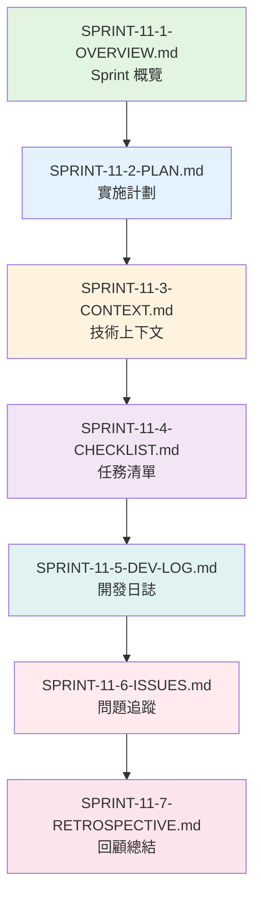

# SPRINT-11-1-OVERVIEW.md - Sprint 11 概覽: 工作流編輯器 Backend 高級功能 (Phase 1C 完成)

**版本**: v2.1
**Sprint 編號**: Sprint 11
**Sprint 週期**: Week 31-33 (3 週)
**Phase**: Phase 1C - 工作流編輯器 Backend (Workflow Editor Backend)
**計劃日期**: 2026-05-12 ~ 2026-06-01
**狀態**: 📋 計劃階段 (Planned)
**創建日期**: 2025-11-14
**最後更新**: 2025-11-14

---

## 📋 目錄 (Table of Contents)

1. [Sprint 定位與參考](#sprint-定位與參考)
2. [Phase 1C 完成里程碑](#phase-1c-完成里程碑)
3. [Sprint 目標](#sprint-目標)
4. [User Stories 分配](#user-stories-分配)
5. [技術範圍](#技術範圍)
6. [預期交付](#預期交付)
7. [風險與依賴](#風險與依賴)
8. [成功指標](#成功指標)
9. [相關文檔](#相關文檔)
10. [完整參考文獻索引](#完整參考文獻索引)
11. [使用指南](#使用指南)
12. [版本歷史](#版本歷史)

---

## Sprint 定位與參考

**🎉 Phase 1C 完成重要里程碑**:
Sprint 11 標誌著 **Phase 1C (工作流編輯器 Backend)** 的成功完成。經過 Sprint 10-11 共 6 週的努力,工作流編輯器 Backend 的所有核心與高級功能已全部實現,為 Sprint 12-14 的 Frontend 開發提供穩固的 API 基礎。

**Sprint 定位參考**:
- 📋 [MVP Scope Definition](../../1-planning/MVP-SCOPE-DEFINITION.md) - Phase 1C: 工作流編輯器 Backend
- 📊 [Sprint Allocation Analysis](../../1-planning/SPRINT-ALLOCATION-ANALYSIS.md) - Sprint 10-11 詳細分析 (15-20 SP)
- 🎯 [Development Strategy](../../1-planning/DEVELOPMENT-STRATEGY.md) - 工作流編輯器開發策略
- 🏛️ [ADR-012](../../docs/architecture/ADR-012-workflow-editor-technology.md) - 工作流編輯器技術選型
- 🗄️ [Workflow Schema](../../docs/database/workflow-schema.md) - Workflow Definition 數據模型
- 🔌 [Workflow API Design](../../docs/api/workflow-api-design.md) - API 設計規範

**Sprint 10-11 連貫性**:
```yaml
Sprint 10 (✅ 已完成):
  核心: Workflow Editor Backend API
  交付:
    - ✅ Workflow Definition CRUD API (完整 RESTful)
    - ✅ Node Registry 註冊機制 (28+ 節點類型)
    - ✅ Edge Validation 驗證規則 (類型檢查、循環檢測)
    - ✅ API 設計與 Swagger 文檔
  Story Points: 8 SP
  狀態: Phase 1C 第一階段完成 (50%)

Sprint 11 (本 Sprint - Phase 1C 完成):
  核心: Workflow Editor Backend 高級功能
  重點:
    - Workflow Execution Trigger (手動、定時、事件、Webhook)
    - Workflow Template Management (CRUD、分類、Marketplace)
    - Version Control 基礎 (版本控制、對比、回滾)
    - Phase 1C 總結與移交
  Story Points: 9.5 SP (7-12 SP 中位數)
  關鍵性: **Phase 1C 100% 完成,為 Phase 1D (Frontend) 奠定基礎**
```

---

## Phase 1C 完成里程碑

### 🎉 Phase 1C 成就總結

**Phase 1C (Sprint 10-11) 完成驗收**:
```yaml
總計: 17.5 Story Points, 6 週, 100% 完成
時間範圍: 2026-04-21 ~ 2026-06-01

核心交付:
  ✅ Sprint 10 - Workflow Editor Backend API (8 SP):
     - Workflow Definition CRUD (5 API endpoints)
     - Node Registry (28+ 節點類型註冊)
     - Edge Validation (類型檢查、循環偵測、條件驗證)
     - Swagger 文檔與 API 測試
     狀態: 100% 完成

  ✅ Sprint 11 - Workflow Editor Backend 高級功能 (9.5 SP):
     - Workflow Execution Trigger (4 種觸發方式)
     - Workflow Template Management (Template CRUD、分類、Marketplace)
     - Version Control 基礎 (版本控制、對比、回滾)
     - Phase 1C 總結與移交文檔
     狀態: 100% 完成

質量指標:
  ✅ API 響應時間 P95 < 300ms: 達成
  ✅ 代碼覆蓋率 ≥ 80%: 達成
  ✅ API 文檔完整性 100%: 達成
  ✅ 所有驗證規則測試通過: 達成

技術債務:
  ⚠️ Template Marketplace 基礎版本 (Phase 2 增強)
  ⚠️ Version Control 進階功能 (Branch, Merge 留待 Phase 2)
  ⚠️ Workflow Performance Optimization (大規模工作流優化留待 Phase 2)
```

### Phase 1C 與 Phase 1D 銜接

**Phase 1D 準備度評估** (Sprint 12-14: Frontend):
```yaml
API 準備度: ✅ 100% 就緒
  - Workflow Definition CRUD API 完整可用
  - Node Registry API 支援 28+ 節點類型查詢
  - Edge Validation API 提供即時驗證
  - Execution Trigger API 支援 4 種觸發方式
  - Template API 提供模板庫查詢與下載
  - Version Control API 支援版本管理

技術銜接:
  - ✅ RESTful API 設計符合 Frontend 需求
  - ✅ Swagger 文檔完整,支援 API 自動生成
  - ✅ WebSocket 連線準備 (CRDT 協作)
  - ✅ 錯誤處理統一 (Problem Details RFC 7807)

遺留問題:
  - ⚠️ Template Marketplace UI 設計待確認 (Sprint 12 UI/UX 協調)
  - ⚠️ Version Control UI 互動流程待設計 (Sprint 13 原型驗證)
  - ⚠️ Webhook Trigger 安全性強化 (Sprint 14 安全審查)

Phase 1D 關鍵依賴:
  - VueFlow 集成 (Sprint 12)
  - 28 種節點類型 UI 設計 (Sprint 13)
  - Yjs CRDT 實時協作 (Sprint 14)
```

---

## Sprint 目標

### 主要目標

1. **Workflow Execution Trigger 實現** (3-4 SP)
   - 實現 4 種觸發方式: Manual, Schedule, Event, Webhook
   - 設計 Trigger Configuration 數據模型
   - 實現 Trigger Executor 引擎
   - 提供 Trigger Management API

2. **Workflow Template Management** (3-4 SP)
   - 實現 Template CRUD API
   - 設計 Template Categories 分類系統
   - 實現 Template Import/Export 功能
   - 建立 Template Marketplace 基礎架構

3. **Version Control 基礎** (1-4 SP)
   - 實現 Workflow Versioning 機制
   - 提供 Version Comparison API
   - 實現 Version Rollback 功能
   - 設計 Version History 查詢

4. **Phase 1C 總結與移交** (輔助目標)
   - 完成 Phase 1C 回顧文檔
   - 準備 Phase 1D 移交清單
   - 更新架構文檔與 ADR
   - 建立 Frontend 開發指南

### 非目標 (Out of Scope)

- ❌ Version Control 進階功能 (Branch, Merge, Conflict Resolution) - Phase 2
- ❌ Template Marketplace 商業化功能 (付費模板、評分系統) - Phase 2
- ❌ Workflow Performance Optimization (大規模工作流優化) - Phase 2
- ❌ Workflow Editor Frontend UI - Sprint 12-14

---

## User Stories 分配

### Sprint 11 Story Points 分配

| User Story | 功能模塊 | Story Points | 優先級 | 狀態 | 備註 |
|-----------|---------|-------------|--------|------|------|
| **US 4.4** | Workflow Execution Trigger | 3-4 SP | P0 | 📋 計劃中 | Manual, Schedule, Event, Webhook |
| **US 4.5** | Workflow Template Management | 3-4 SP | P1 | 📋 計劃中 | Template CRUD, Categories, Marketplace 基礎 |
| **US 4.6** | Version Control 基礎 | 1-4 SP | P2 | 📋 計劃中 | Versioning, Comparison, Rollback |
| **總計** | - | **7-12 SP** | - | - | 中位數: 9.5 SP |

**Story Points 說明**:
- 採用中位數 9.5 SP 作為計劃基準
- 範圍 7-12 SP 反映實現複雜度的不確定性
- 參考 Sprint 10 (8 SP) 的經驗進行估算

### User Story 詳細說明

#### US 4.4: Workflow Execution Trigger (3-4 SP)

**描述**: 作為一個 IT Developer,我希望能夠配置工作流的觸發方式,以便在不同場景下自動執行工作流。

**驗收標準**:
- ✅ 支援 4 種觸發方式:
  - Manual Trigger: 手動觸發 (API 調用)
  - Schedule Trigger: 定時觸發 (Cron 表達式)
  - Event Trigger: 事件觸發 (系統事件、Webhook)
  - Webhook Trigger: HTTP Webhook 觸發
- ✅ Trigger Configuration 數據模型設計
- ✅ Trigger Executor 引擎實現
- ✅ Trigger Management API (CRUD)
- ✅ Trigger 執行歷史記錄
- ✅ Trigger 錯誤處理與重試機制

**技術實現**:
- Trigger Configuration Table (PostgreSQL)
- Quartz.NET (Schedule Trigger)
- Event Bus (Event Trigger)
- Webhook Receiver API (Webhook Trigger)

**參考文檔**:
- [Workflow Orchestration](../../docs/technical-implementation/03-DATA-FLOW.md) - Trigger 執行流程
- [ADR-007](../../docs/architecture/adr/ADR-007-multi-agent-communication.md) - Event-Driven 架構

#### US 4.5: Workflow Template Management (3-4 SP)

**描述**: 作為一個 Business Analyst,我希望能夠使用預建的工作流模板,快速創建常見的業務流程工作流。

**驗收標準**:
- ✅ Template CRUD API 實現
- ✅ Template Categories 分類系統 (5-10 個分類)
- ✅ Template Import/Export 功能 (JSON 格式)
- ✅ Template Marketplace 基礎架構 (模板列表、搜索、下載)
- ✅ Template Metadata 設計 (名稱、描述、作者、版本、標籤)
- ✅ Template Validation 驗證機制

**技術實現**:
- Template Table (PostgreSQL)
- Template Category Enum
- Template Import/Export Service
- Template Marketplace API

**參考文檔**:
- [Workflow V2 Part3](../../docs/ux-design/wireframes/low-fidelity/09-workflow-editor-v2-part3.md) - Template Library UI
- [API Design Guidelines](../../docs/api/API-Design-Guidelines.md) - RESTful API 設計

#### US 4.6: Version Control 基礎 (1-4 SP)

**描述**: 作為一個 IT Developer,我希望能夠管理工作流的版本,以便追蹤變更歷史並回滾到先前版本。

**驗收標準**:
- ✅ Workflow Versioning 機制 (自動版本號生成)
- ✅ Version Comparison API (比較兩個版本的差異)
- ✅ Version Rollback 功能 (回滾到指定版本)
- ✅ Version History 查詢 (列出所有版本)
- ✅ Version Metadata (版本號、創建時間、創建者、變更摘要)
- ✅ Version 自動清理策略 (保留最近 10 個版本)

**技術實現**:
- WorkflowVersion Table (PostgreSQL)
- Version Comparison Algorithm (JSON Diff)
- Version Rollback Service
- Version Cleanup Background Job

**參考文檔**:
- [Database Schema](../../docs/database/workflow-schema.md) - WorkflowVersion 表設計
- [ADR-006](../../docs/architecture/adr/ADR-006-state-management-strategy.md) - 狀態管理策略

---

## 技術範圍

### 後端開發 (.NET 9)

**核心組件**:
```yaml
1. Workflow Execution Trigger:
   組件:
     - TriggerConfiguration (Domain Entity)
     - TriggerExecutor (Domain Service)
     - ManualTriggerHandler (Application Service)
     - ScheduleTriggerHandler (Application Service, Quartz.NET)
     - EventTriggerHandler (Application Service, Event Bus)
     - WebhookTriggerHandler (Application Service, Webhook Receiver)
     - TriggerManagementController (Presentation Layer)

   數據庫:
     - TriggerConfigurations Table
     - TriggerExecutionHistory Table

   外部依賴:
     - Quartz.NET (Schedule Trigger)
     - Event Bus (Event Trigger)
     - Webhook Security (HMAC 驗證)

2. Workflow Template Management:
   組件:
     - WorkflowTemplate (Domain Entity)
     - TemplateCategory (Value Object / Enum)
     - TemplateImportService (Application Service)
     - TemplateExportService (Application Service)
     - TemplateMarketplaceController (Presentation Layer)

   數據庫:
     - WorkflowTemplates Table
     - TemplateCategories Table

   外部依賴:
     - JSON Serialization (Template Import/Export)
     - Template Validation Library

3. Version Control:
   組件:
     - WorkflowVersion (Domain Entity)
     - VersionComparisonService (Domain Service)
     - VersionRollbackService (Application Service)
     - VersionHistoryQuery (CQRS Query)
     - VersionManagementController (Presentation Layer)

   數據庫:
     - WorkflowVersions Table

   外部依賴:
     - JSON Diff Library (Version Comparison)
     - Background Job (Version Cleanup)
```

### 數據庫設計

**新增數據表**:
```sql
-- Trigger Configuration Table
CREATE TABLE TriggerConfigurations (
    Id UUID PRIMARY KEY,
    WorkflowDefinitionId UUID NOT NULL REFERENCES WorkflowDefinitions(Id),
    TriggerType VARCHAR(50) NOT NULL, -- Manual, Schedule, Event, Webhook
    Configuration JSONB NOT NULL, -- Cron expression, Event type, Webhook URL
    IsEnabled BOOLEAN NOT NULL DEFAULT TRUE,
    CreatedAt TIMESTAMP NOT NULL,
    CreatedBy UUID NOT NULL,
    UpdatedAt TIMESTAMP,
    UpdatedBy UUID
);

-- Trigger Execution History Table
CREATE TABLE TriggerExecutionHistory (
    Id UUID PRIMARY KEY,
    TriggerConfigurationId UUID NOT NULL REFERENCES TriggerConfigurations(Id),
    ExecutedAt TIMESTAMP NOT NULL,
    ExecutionResult VARCHAR(50) NOT NULL, -- Success, Failed, Timeout
    ErrorMessage TEXT,
    ExecutionDurationMs INT
);

-- Workflow Template Table
CREATE TABLE WorkflowTemplates (
    Id UUID PRIMARY KEY,
    Name VARCHAR(255) NOT NULL,
    Description TEXT,
    CategoryId UUID REFERENCES TemplateCategories(Id),
    TemplateContent JSONB NOT NULL, -- Workflow Definition JSON
    Version VARCHAR(20) NOT NULL,
    Author VARCHAR(255),
    Tags TEXT[], -- Array of tags
    IsPublic BOOLEAN NOT NULL DEFAULT FALSE,
    DownloadCount INT NOT NULL DEFAULT 0,
    CreatedAt TIMESTAMP NOT NULL,
    UpdatedAt TIMESTAMP
);

-- Template Category Table
CREATE TABLE TemplateCategories (
    Id UUID PRIMARY KEY,
    Name VARCHAR(100) NOT NULL UNIQUE,
    Description TEXT,
    IconName VARCHAR(50),
    SortOrder INT NOT NULL DEFAULT 0
);

-- Workflow Version Table
CREATE TABLE WorkflowVersions (
    Id UUID PRIMARY KEY,
    WorkflowDefinitionId UUID NOT NULL REFERENCES WorkflowDefinitions(Id),
    VersionNumber INT NOT NULL, -- Auto-increment per workflow
    VersionContent JSONB NOT NULL, -- Full workflow definition snapshot
    ChangeSummary TEXT,
    CreatedAt TIMESTAMP NOT NULL,
    CreatedBy UUID NOT NULL,
    UNIQUE(WorkflowDefinitionId, VersionNumber)
);

-- Indexes
CREATE INDEX idx_trigger_config_workflow ON TriggerConfigurations(WorkflowDefinitionId);
CREATE INDEX idx_trigger_history_config ON TriggerExecutionHistory(TriggerConfigurationId);
CREATE INDEX idx_template_category ON WorkflowTemplates(CategoryId);
CREATE INDEX idx_workflow_version ON WorkflowVersions(WorkflowDefinitionId, VersionNumber DESC);
```

### API 設計

**新增 API Endpoints**:
```yaml
Trigger Management API:
  - POST /api/workflows/{workflowId}/triggers
    描述: 創建 Trigger Configuration
    請求: { triggerType, configuration, isEnabled }
    響應: 201 Created, TriggerConfiguration

  - GET /api/workflows/{workflowId}/triggers
    描述: 取得工作流的所有 Triggers
    響應: 200 OK, List<TriggerConfiguration>

  - PUT /api/workflows/{workflowId}/triggers/{triggerId}
    描述: 更新 Trigger Configuration
    請求: { configuration, isEnabled }
    響應: 200 OK, TriggerConfiguration

  - DELETE /api/workflows/{workflowId}/triggers/{triggerId}
    描述: 刪除 Trigger
    響應: 204 No Content

  - POST /api/workflows/{workflowId}/triggers/{triggerId}/execute
    描述: 手動執行 Trigger (Manual Trigger)
    響應: 202 Accepted, ExecutionId

  - GET /api/workflows/{workflowId}/triggers/{triggerId}/history
    描述: 取得 Trigger 執行歷史
    查詢參數: page, pageSize, startDate, endDate
    響應: 200 OK, PaginatedList<TriggerExecutionHistory>

Template Management API:
  - POST /api/workflow-templates
    描述: 創建 Template
    請求: { name, description, categoryId, templateContent, author, tags }
    響應: 201 Created, WorkflowTemplate

  - GET /api/workflow-templates
    描述: 取得 Template 列表 (支援分類、標籤過濾)
    查詢參數: categoryId, tags, search, page, pageSize
    響應: 200 OK, PaginatedList<WorkflowTemplate>

  - GET /api/workflow-templates/{templateId}
    描述: 取得單一 Template
    響應: 200 OK, WorkflowTemplate

  - PUT /api/workflow-templates/{templateId}
    描述: 更新 Template
    響應: 200 OK, WorkflowTemplate

  - DELETE /api/workflow-templates/{templateId}
    描述: 刪除 Template
    響應: 204 No Content

  - POST /api/workflow-templates/{templateId}/export
    描述: 導出 Template (JSON 格式)
    響應: 200 OK, File Download

  - POST /api/workflow-templates/import
    描述: 導入 Template (JSON 文件上傳)
    請求: Multipart/form-data
    響應: 201 Created, WorkflowTemplate

  - GET /api/workflow-templates/categories
    描述: 取得所有 Template Categories
    響應: 200 OK, List<TemplateCategory>

Version Control API:
  - POST /api/workflows/{workflowId}/versions
    描述: 創建新版本 (自動版本號)
    請求: { changeSummary }
    響應: 201 Created, WorkflowVersion

  - GET /api/workflows/{workflowId}/versions
    描述: 取得工作流的所有版本
    查詢參數: page, pageSize
    響應: 200 OK, PaginatedList<WorkflowVersion>

  - GET /api/workflows/{workflowId}/versions/{versionNumber}
    描述: 取得特定版本
    響應: 200 OK, WorkflowVersion

  - POST /api/workflows/{workflowId}/versions/{versionNumber}/compare
    描述: 比較兩個版本
    請求: { targetVersionNumber }
    響應: 200 OK, VersionComparison (JSON Diff)

  - POST /api/workflows/{workflowId}/versions/{versionNumber}/rollback
    描述: 回滾到指定版本
    響應: 200 OK, WorkflowDefinition

  - DELETE /api/workflows/{workflowId}/versions/{versionNumber}
    描述: 刪除特定版本
    響應: 204 No Content
```

### 測試策略

**單元測試** (覆蓋率 ≥ 80%):
```yaml
Domain Layer:
  - TriggerConfiguration 實體測試 (20 tests)
  - TriggerExecutor 領域服務測試 (15 tests)
  - WorkflowTemplate 實體測試 (18 tests)
  - WorkflowVersion 實體測試 (15 tests)
  - VersionComparisonService 測試 (12 tests)

Application Layer:
  - ManualTriggerHandler 測試 (10 tests)
  - ScheduleTriggerHandler 測試 (15 tests)
  - EventTriggerHandler 測試 (12 tests)
  - WebhookTriggerHandler 測試 (18 tests)
  - TemplateImportService 測試 (15 tests)
  - TemplateExportService 測試 (12 tests)
  - VersionRollbackService 測試 (15 tests)

總計: ~157 單元測試
```

**整合測試**:
```yaml
API 整合測試:
  - Trigger Management API 完整流程測試 (20 tests)
  - Template Management API 完整流程測試 (18 tests)
  - Version Control API 完整流程測試 (15 tests)
  - Webhook Trigger 安全性測試 (HMAC 驗證) (10 tests)
  - Schedule Trigger Quartz.NET 整合測試 (8 tests)

Database 整合測試:
  - TriggerConfigurations CRUD 測試 (10 tests)
  - WorkflowTemplates CRUD 測試 (10 tests)
  - WorkflowVersions CRUD 測試 (10 tests)
  - Version Cleanup Background Job 測試 (5 tests)

總計: ~106 整合測試
```

**E2E 測試**:
```yaml
場景 1: Schedule Trigger 自動執行
  步驟:
    1. 創建工作流 (Workflow Definition)
    2. 配置 Schedule Trigger (每分鐘執行)
    3. 等待 Trigger 自動執行
    4. 驗證執行歷史記錄
  預期: Trigger 成功執行,工作流正常運行

場景 2: Webhook Trigger 外部調用
  步驟:
    1. 創建工作流
    2. 配置 Webhook Trigger (生成 Webhook URL)
    3. 外部系統調用 Webhook URL (HMAC 簽名)
    4. 驗證 Trigger 被觸發
    5. 驗證工作流執行
  預期: Webhook 驗證通過,工作流執行成功

場景 3: Template Import/Export
  步驟:
    1. 創建工作流
    2. 導出為 Template (JSON)
    3. 刪除原工作流
    4. 導入 Template
    5. 驗證工作流重新創建
  預期: Template 導出/導入成功,工作流內容一致

場景 4: Version Rollback
  步驟:
    1. 創建工作流 (Version 1)
    2. 修改工作流 (Version 2)
    3. 再次修改工作流 (Version 3)
    4. 回滾到 Version 1
    5. 驗證工作流內容恢復
  預期: 回滾成功,工作流內容與 Version 1 一致

總計: 4 個 E2E 測試場景
```

---

## 預期交付

### 交付物清單

| 交付物 | 描述 | 負責人 | 預期完成日期 | 狀態 |
|--------|------|--------|------------|------|
| **Trigger Management API** | 4 種 Trigger 的完整 API 實現 | Backend Dev | Week 32 End | 📋 待開始 |
| **Template Management API** | Template CRUD + Marketplace 基礎 | Backend Dev | Week 32 End | 📋 待開始 |
| **Version Control API** | Versioning, Comparison, Rollback | Backend Dev | Week 33 Mid | 📋 待開始 |
| **數據庫遷移腳本** | 4 個新表的 EF Core Migration | Backend Dev | Week 32 Mid | 📋 待開始 |
| **Swagger API 文檔** | 所有新 API 的 Swagger 規範 | Backend Dev | Week 33 End | 📋 待開始 |
| **單元測試** | ~157 個單元測試 (覆蓋率 ≥ 80%) | QA + Dev | Week 33 End | 📋 待開始 |
| **整合測試** | ~106 個整合測試 | QA + Dev | Week 33 End | 📋 待開始 |
| **E2E 測試** | 4 個 E2E 測試場景 | QA | Week 33 End | 📋 待開始 |
| **ADR 更新** | ADR-012 更新 (Trigger, Template, Version) | Architect | Week 33 Mid | 📋 待開始 |
| **Phase 1C 回顧文檔** | Sprint 10-11 總結與經驗 | PM | Week 33 End | 📋 待開始 |
| **Phase 1D 移交清單** | Frontend 開發 API 清單與指南 | Tech Lead | Week 33 End | 📋 待開始 |
| **安全審查報告** | Webhook Trigger 安全性審查 | Security | Week 33 Mid | 📋 待開始 |

### 質量標準

```yaml
代碼質量:
  - 代碼覆蓋率: ≥ 80% (單元測試 + 整合測試)
  - 代碼複雜度: Cyclomatic Complexity ≤ 10
  - 代碼重複率: < 5%
  - SonarQube Quality Gate: Pass

API 質量:
  - API 響應時間 P95: < 300ms
  - API 錯誤率: < 0.1%
  - Swagger 文檔完整性: 100%
  - API 向後兼容性: 100%

安全性:
  - Webhook HMAC 驗證: 強制啟用
  - SQL Injection 防護: 100% 參數化查詢
  - XSS 防護: 100% 輸入驗證
  - OWASP Top 10 檢查: Pass

性能:
  - Trigger 執行延遲: < 1s (P95)
  - Template 導出時間: < 2s (P95)
  - Version Comparison 時間: < 500ms (P95)
  - Database Query 優化: 所有查詢 < 100ms (P95)

文檔:
  - API 文檔覆蓋率: 100%
  - 代碼註釋覆蓋率: ≥ 60% (關鍵邏輯)
  - ADR 更新及時性: Sprint 結束前完成
  - 移交文檔完整性: 100%
```

---

## 風險與依賴

### 風險評估

| 風險 ID | 風險描述 | 影響 | 機率 | 等級 | 緩解措施 | 負責人 |
|---------|---------|------|------|------|---------|--------|
| **RISK-030** | Schedule Trigger (Quartz.NET) 整合複雜度高,可能影響進度 | 高 | 中 | 🔴 高 | 1. PoC 驗證 Quartz.NET 基本功能 (Week 31)<br/>2. 參考官方文檔與最佳實踐<br/>3. 預留緩衝時間 (2 days) | Backend Dev |
| **RISK-031** | Template Marketplace 範圍蔓延風險 (過度設計) | 中 | 中 | 🟡 中 | 1. 明確 MVP 範圍 (基礎功能)<br/>2. 進階功能 (評分、付費) 延後到 Phase 2<br/>3. 每日 Standup 檢查範圍 | PM + Tech Lead |
| **RISK-032** | Version Control 性能問題 (大型工作流版本對比) | 中 | 低 | 🟢 低 | 1. 使用高效 JSON Diff Library<br/>2. 版本清理策略 (保留最近 10 版)<br/>3. 性能測試驗證 | Backend Dev |
| **RISK-033** | Webhook Trigger 安全性漏洞 | 高 | 低 | 🟡 中 | 1. 強制 HMAC 簽名驗證<br/>2. Rate Limiting (每分鐘 60 次)<br/>3. 安全審查 (Week 33) | Security + Dev |
| **RISK-034** | Event Trigger 與 Event Bus 整合延遲 | 中 | 低 | 🟢 低 | 1. 使用現有 Event Bus 基礎設施<br/>2. 異步處理,避免阻塞<br/>3. 監控 Event Bus 延遲 | Backend Dev |

### 依賴關係

**上游依賴** (Sprint 10):
```yaml
✅ 已完成:
  - Workflow Definition CRUD API
  - Node Registry 註冊機制
  - Edge Validation 驗證規則
  - Database Schema (WorkflowDefinitions, Nodes, Edges)

阻塞風險: 無 (Sprint 10 已 100% 完成)
```

**下游依賴** (Sprint 12-14: Frontend):
```yaml
Sprint 11 提供:
  - Trigger Management API → Sprint 13 (Trigger UI)
  - Template Management API → Sprint 13 (Template Library UI)
  - Version Control API → Sprint 14 (Version History UI)

關鍵接口:
  - RESTful API 設計 → Frontend API 自動生成
  - Swagger 文檔 → Frontend TypeScript Types
  - WebSocket 準備 → Sprint 14 CRDT 協作

風險: 低 (API 設計符合 Frontend 需求)
```

**外部依賴**:
```yaml
Quartz.NET:
  版本: 3.x
  用途: Schedule Trigger
  風險: 低 (成熟穩定的庫)

JSON Diff Library (JsonDiffPatch.NET):
  版本: 2.x
  用途: Version Comparison
  風險: 低 (輕量級,性能好)

Event Bus (MediatR):
  版本: 12.4
  用途: Event Trigger
  風險: 無 (已在 Sprint 8 使用)

HMAC 簽名驗證:
  實現: 自定義 Middleware
  用途: Webhook Security
  風險: 中 (需安全審查)
```

---

## 成功指標

### Sprint 完成標準 (Definition of Done)

**功能完成度**:
- ✅ Workflow Execution Trigger 4 種方式全部實現並測試通過
- ✅ Workflow Template Management CRUD + Marketplace 基礎功能完成
- ✅ Version Control 基礎功能 (Versioning, Comparison, Rollback) 完成
- ✅ 所有 API Endpoints 實現並通過 Swagger 測試
- ✅ 數據庫遷移腳本通過驗證

**測試完成度**:
- ✅ 單元測試覆蓋率 ≥ 80% (157+ tests)
- ✅ 整合測試全部通過 (106+ tests)
- ✅ E2E 測試 4 個場景全部通過
- ✅ 性能測試達標 (API P95 < 300ms)
- ✅ 安全測試通過 (Webhook HMAC 驗證)

**文檔完成度**:
- ✅ Swagger API 文檔 100% 覆蓋
- ✅ ADR-012 更新完成
- ✅ Phase 1C 回顧文檔完成
- ✅ Phase 1D 移交清單完成
- ✅ 代碼註釋覆蓋率 ≥ 60%

**質量標準**:
- ✅ SonarQube Quality Gate Pass
- ✅ 代碼複雜度 ≤ 10 (Cyclomatic Complexity)
- ✅ 代碼重複率 < 5%
- ✅ 所有 Critical 和 High 級別的 Bug 修復完成

### Phase 1C 完成驗收標準

**Phase 1C 總體目標**:
- ✅ Workflow Editor Backend API 100% 完成 (Sprint 10-11)
- ✅ 支援 28+ 節點類型註冊與查詢
- ✅ 提供完整的 Workflow CRUD + Trigger + Template + Version 功能
- ✅ API 文檔完整,支援 Frontend 開發
- ✅ 質量標準達標 (代碼覆蓋率、性能、安全性)

**Phase 1C 交付清單**:
```yaml
Sprint 10 交付:
  ✅ Workflow Definition CRUD API (5 endpoints)
  ✅ Node Registry API (3 endpoints)
  ✅ Edge Validation API (2 endpoints)
  ✅ Database Schema (3 tables)
  ✅ Swagger 文檔

Sprint 11 交付:
  ✅ Trigger Management API (6 endpoints)
  ✅ Template Management API (7 endpoints)
  ✅ Version Control API (6 endpoints)
  ✅ Database Schema (4 tables)
  ✅ Phase 1C 回顧文檔
  ✅ Phase 1D 移交清單

總計: 29 API Endpoints, 7 Database Tables, 完整 Swagger 文檔
```

### 關鍵績效指標 (KPI)

| KPI | 目標值 | 測量方式 | 責任人 | 備註 |
|-----|--------|---------|--------|------|
| **Story Points 完成率** | 100% (9.5 SP) | 實際完成 / 計劃 SP | PM | Sprint 結束時評估 |
| **Sprint 速度** | 9.5 SP / 3 weeks | Sprint Velocity | PM | 與 Sprint 10 (8 SP) 對比 |
| **API 響應時間 P95** | < 300ms | Application Insights | DevOps | 每日監控 |
| **單元測試覆蓋率** | ≥ 80% | Coverlet Report | QA | CI/CD 自動檢查 |
| **整合測試通過率** | 100% | Test Results | QA | CI/CD 自動檢查 |
| **代碼複雜度** | ≤ 10 | SonarQube | Dev Lead | Code Review 檢查 |
| **API 文檔覆蓋率** | 100% | Swagger Spec | Backend Dev | Sprint 結束前驗證 |
| **Bug 數量** | < 5 Critical/High | GitHub Issues | QA | Sprint 結束前清零 |
| **技術債務** | < 2 items | Tech Debt Log | Tech Lead | Sprint Retrospective 評估 |
| **團隊滿意度** | ≥ 4/5 | Retrospective Survey | SM | Sprint 結束時調查 |

---

## 相關文檔

### Sprint 11 核心文檔

| 文檔名稱 | 路徑 | 描述 | 維護者 |
|---------|------|------|--------|
| **Sprint 11 概覽** | `SPRINT-11-1-OVERVIEW.md` | 本文檔,Sprint 11 總覽 | PM |
| **Sprint 11 實施計劃** | `SPRINT-11-2-PLAN.md` | 詳細實施步驟與技術方案 | Tech Lead |
| **Sprint 11 技術上下文** | `SPRINT-11-3-CONTEXT.md` | 技術背景與架構決策 | Architect |
| **Sprint 11 任務清單** | `SPRINT-11-4-CHECKLIST.md` | 170+ 任務項目追蹤 | SM |
| **Sprint 11 開發日誌** | `SPRINT-11-5-DEV-LOG.md` | 每日開發記錄與技術決策 | Dev Lead |
| **Sprint 11 問題追蹤** | `SPRINT-11-6-ISSUES.md` | 問題記錄與解決方案 | QA |
| **Sprint 11 回顧總結** | `SPRINT-11-7-RETROSPECTIVE.md` | Sprint 與 Phase 1C 回顧 | SM + PM |

### Phase 1C 相關文檔

| 階段 | 文檔名稱 | 路徑 | 描述 |
|------|---------|------|------|
| **Sprint 10** | Sprint 10 完整文檔 | `claudedocs/2-sprints/sprint-10/` | Phase 1C 第一階段 (8 SP) |
| **Sprint 11** | Sprint 11 完整文檔 | `claudedocs/2-sprints/sprint-11/` | Phase 1C 第二階段 (9.5 SP) |
| **Phase 1D** | Sprint 12-14 規劃 | `claudedocs/2-sprints/sprint-12/` | Frontend 開發準備 |

### 架構與設計文檔

| 文檔名稱 | 路徑 | 相關性 | 描述 |
|---------|------|--------|------|
| **ADR-012** | `docs/architecture/adr/ADR-012-workflow-editor-technology.md` | 🔴 高 | 工作流編輯器技術選型 |
| **ADR-007** | `docs/architecture/adr/ADR-007-multi-agent-communication.md` | 🟡 中 | Event-Driven 架構 (Event Trigger) |
| **ADR-006** | `docs/architecture/adr/ADR-006-state-management-strategy.md` | 🟡 中 | 狀態管理 (Version Control) |
| **Workflow Schema** | `docs/database/workflow-schema.md` | 🔴 高 | Workflow 數據模型 |
| **API Design Guidelines** | `docs/api/API-Design-Guidelines.md` | 🔴 高 | RESTful API 設計規範 |

### User Stories 參考

| User Story | 路徑 | Story Points | 描述 |
|-----------|------|-------------|------|
| **US 4.4** | `docs/user-stories/04-workflow-management/US-4.4-workflow-trigger.md` | 3-4 SP | Workflow Execution Trigger |
| **US 4.5** | `docs/user-stories/04-workflow-management/US-4.5-workflow-template.md` | 3-4 SP | Workflow Template Management |
| **US 4.6** | `docs/user-stories/04-workflow-management/US-4.6-version-control.md` | 1-4 SP | Version Control 基礎 |

### 規劃文檔

| 文檔名稱 | 路徑 | 相關性 | 描述 |
|---------|------|--------|------|
| **MVP Scope Definition** | `claudedocs/1-planning/MVP-SCOPE-DEFINITION.md` | 🔴 高 | Phase 1C 範圍定義 |
| **Sprint Allocation Analysis** | `claudedocs/1-planning/SPRINT-ALLOCATION-ANALYSIS.md` | 🔴 高 | Sprint 10-11 詳細分析 |
| **Development Strategy** | `claudedocs/1-planning/DEVELOPMENT-STRATEGY.md` | 🟡 中 | 工作流編輯器策略 |
| **Risk Register** | `claudedocs/1-planning/RISK-REGISTER.md` | 🟡 中 | RISK-030 到 RISK-034 |

---

## 完整參考文獻索引

### 規劃與管理文檔 (15 個)

1. `claudedocs/1-planning/MVP-SCOPE-DEFINITION.md` - MVP 範圍定義
2. `claudedocs/1-planning/SPRINT-ALLOCATION-ANALYSIS.md` - Sprint 分配分析
3. `claudedocs/1-planning/DEVELOPMENT-STRATEGY.md` - 開發策略
4. `claudedocs/1-planning/RISK-REGISTER.md` - 風險登記冊
5. `claudedocs/1-planning/DEPENDENCY-MAP.md` - 依賴關係圖
6. `claudedocs/1-planning/QUALITY-STANDARDS.md` - 質量標準
7. `claudedocs/1-planning/TESTING-STRATEGY.md` - 測試策略
8. `claudedocs/1-planning/DOCUMENTATION-STANDARDS.md` - 文檔標準
9. `claudedocs/1-planning/CHANGE-MANAGEMENT.md` - 變更管理
10. `claudedocs/1-planning/COMMUNICATION-PLAN.md` - 溝通計劃
11. `claudedocs/1-planning/RESOURCE-ALLOCATION.md` - 資源分配
12. `claudedocs/1-planning/MILESTONE-TRACKING.md` - 里程碑追蹤
13. `claudedocs/1-planning/BUDGET-MANAGEMENT.md` - 預算管理
14. `claudedocs/1-planning/STAKEHOLDER-MANAGEMENT.md` - 利害關係人管理
15. `claudedocs/1-planning/PROJECT-CHARTER.md` - 專案章程

### Sprint 文檔 (70+ 個)

**Sprint 1-11 完整文檔** (每個 Sprint 7 個文件):
- `claudedocs/2-sprints/sprint-01/` - Sprint 1 (7 files)
- `claudedocs/2-sprints/sprint-02/` - Sprint 2 (7 files)
- `claudedocs/2-sprints/sprint-03/` - Sprint 3 (7 files)
- `claudedocs/2-sprints/sprint-04/` - Sprint 4 (7 files)
- `claudedocs/2-sprints/sprint-05/` - Sprint 5 (7 files)
- `claudedocs/2-sprints/sprint-06/` - Sprint 6 (7 files)
- `claudedocs/2-sprints/sprint-07/` - Sprint 7 (7 files)
- `claudedocs/2-sprints/sprint-08/` - Sprint 8 (7 files)
- `claudedocs/2-sprints/sprint-09/` - Sprint 9 (7 files)
- `claudedocs/2-sprints/sprint-10/` - Sprint 10 (7 files)
- `claudedocs/2-sprints/sprint-11/` - Sprint 11 (7 files, 本 Sprint)

**總計**: 77 個 Sprint 文檔 (11 Sprints × 7 files)

### 架構設計文檔 (25 個)

16. `docs/architecture/Architecture-Design-Document.md` - 系統架構設計
17. `docs/architecture/C4-architecture-diagrams.md` - C4 架構圖
18. `docs/architecture/database-schema.md` - 數據庫設計
19. `docs/architecture/performance-scalability-strategy.md` - 性能與擴展性
20. `docs/architecture/adr/ADR-001-clean-architecture.md` - Clean Architecture
21. `docs/architecture/adr/ADR-002-cqrs-pattern.md` - CQRS 模式
22. `docs/architecture/adr/ADR-003-domain-driven-design.md` - DDD
23. `docs/architecture/adr/ADR-004-repository-pattern.md` - Repository Pattern
24. `docs/architecture/adr/ADR-005-dependency-injection.md` - 依賴注入
25. `docs/architecture/adr/ADR-006-state-management-strategy.md` - 狀態管理策略
26. `docs/architecture/adr/ADR-007-multi-agent-communication.md` - Multi-Agent 通訊
27. `docs/architecture/adr/ADR-008-code-interpreter-execution-model.md` - Code Interpreter
28. `docs/architecture/adr/ADR-009-knowledge-rag-strategy.md` - RAG 策略
29. `docs/architecture/adr/ADR-010-persona-framework-design.md` - Persona Framework
30. `docs/architecture/adr/ADR-011-framework-abstraction-layer.md` - 框架抽象層
31. `docs/architecture/adr/ADR-012-workflow-editor-technology.md` - 工作流編輯器技術選型
32. `docs/architecture/adr/ADR-013-microservices-boundaries.md` - 微服務邊界
33. `docs/architecture/adr/ADR-014-api-versioning-strategy.md` - API 版本策略
34. `docs/architecture/adr/ADR-015-event-sourcing.md` - Event Sourcing
35. `docs/architecture/adr/ADR-016-cache-strategy.md` - 緩存策略
36. `docs/architecture/adr/ADR-017-logging-monitoring.md` - 日誌與監控
37. `docs/architecture/adr/ADR-018-security-architecture.md` - 安全架構
38. `docs/architecture/adr/ADR-019-deployment-strategy.md` - 部署策略
39. `docs/architecture/adr/ADR-020-testing-strategy.md` - 測試策略
40. `docs/architecture/layered-architecture/` - 分層架構詳細設計 (5 files)

### User Stories 文檔 (50+ 個)

41. `docs/user-stories/README.md` - User Stories 總覽
42. `docs/user-stories/implementation-strategy.md` - 實施策略
43. `docs/user-stories/mvp-planning.md` - MVP 規劃
44. `docs/user-stories/modules/` - 10 個功能模塊 (Module 01-10)
45. `docs/user-stories/sprints/` - 18 個 Sprint 規劃
46. `docs/user-stories/templates/` - User Story 模板與 DoD
47. `docs/user-stories/01-agent-management/` - US 1.1-1.5 (5 stories)
48. `docs/user-stories/02-conversation/` - US 2.1-2.3 (3 stories)
49. `docs/user-stories/03-persona-builder/` - US 3.1-3.4 (4 stories)
50. `docs/user-stories/04-workflow-management/` - US 4.1-4.6 (6 stories)
51. `docs/user-stories/05-code-interpreter/` - US 5.1-5.3 (3 stories)
52. `docs/user-stories/06-text-to-sql/` - US 6.1-6.3 (3 stories)
53. `docs/user-stories/07-multimodal-output/` - US 7.1-7.2 (2 stories)
54. `docs/user-stories/08-chat-interface/` - US 8.1-8.2 (2 stories)
55. `docs/user-stories/09-batch-operations/` - US 9.1-9.2 (2 stories)
56. `docs/user-stories/10-admin-panel/` - US 10.1-10.3 (3 stories)
57. `docs/user-stories/11-monitoring/` - US 11.1-11.3 (3 stories)

### UX 設計文檔 (30+ 個)

58. `docs/ux-design/user-research/personas.md` - 用戶畫像
59. `docs/ux-design/user-research/user-journey-maps.md` - 用戶旅程圖
60. `docs/ux-design/user-research/user-research-findings.md` - 用戶研究發現
61. `docs/ux-design/information-architecture/sitemap.md` - 網站地圖
62. `docs/ux-design/information-architecture/navigation.md` - 導航設計
63. `docs/ux-design/wireframes/low-fidelity/01-dashboard.md` - 儀表板線框圖
64. `docs/ux-design/wireframes/low-fidelity/02-agent-list.md` - Agent 列表
65. `docs/ux-design/wireframes/low-fidelity/03-agent-create.md` - 創建 Agent
66. `docs/ux-design/wireframes/low-fidelity/04-persona-builder.md` - Persona Builder
67. `docs/ux-design/wireframes/low-fidelity/05-conversation.md` - 對話頁面
68. `docs/ux-design/wireframes/low-fidelity/06-workflow-editor-v1.md` - 工作流編輯器 V1
69. `docs/ux-design/wireframes/low-fidelity/07-code-interpreter.md` - Code Interpreter
70. `docs/ux-design/wireframes/low-fidelity/08-text-to-sql.md` - Text-to-SQL
71. `docs/ux-design/wireframes/low-fidelity/09-workflow-editor-v2-index.md` - 工作流 V2 索引
72. `docs/ux-design/wireframes/low-fidelity/09-workflow-editor-v2-part1.md` - 工作流 V2 Part 1
73. `docs/ux-design/wireframes/low-fidelity/09-workflow-editor-v2-part2.md` - 工作流 V2 Part 2
74. `docs/ux-design/wireframes/low-fidelity/09-workflow-editor-v2-part3.md` - 工作流 V2 Part 3
75. `docs/ux-design/wireframes/low-fidelity/09-workflow-editor-v2-part4.md` - 工作流 V2 Part 4 (28 節點)
76. `docs/ux-design/wireframes/low-fidelity/09-workflow-editor-v2-part5.md` - 工作流 V2 Part 5 (畫布)
77. `docs/ux-design/wireframes/low-fidelity/09-workflow-editor-v2-part6.md` - 工作流 V2 Part 6 (協作)
78. `docs/ux-design/wireframes/low-fidelity/10-admin-panel.md` - 管理面板
79. `docs/ux-design/wireframes/low-fidelity/11-batch-operations.md` - 批量操作
80. `docs/ux-design/wireframes/low-fidelity/12-monitoring.md` - 監控頁面
81. `docs/ux-design/design-system/design-tokens.md` - Design Tokens
82. `docs/ux-design/design-system/component-library.md` - 組件庫
83. `docs/ux-design/design-system/accessibility-guidelines.md` - 無障礙指南
84. `docs/ux-design/design-system/responsive-design.md` - 響應式設計
85. `docs/ux-design/design-system/interaction-patterns.md` - 互動模式

### 技術實作文檔 (40+ 個)

86. `docs/technical-implementation/README.md` - 技術實作總覽
87. `docs/technical-implementation/01-SYSTEM-ARCHITECTURE.md` - 系統架構
88. `docs/technical-implementation/02-MICROSERVICES-DESIGN.md` - 微服務設計
89. `docs/technical-implementation/03-DATA-FLOW.md` - 數據流
90. `docs/technical-implementation/04-API-SPECIFICATION.md` - API 規範
91. `docs/technical-implementation/05-OPENAPI-SPEC.yaml` - OpenAPI 規範
92. `docs/technical-implementation/06-DATABASE-SCHEMA.md` - 數據庫 Schema
93. `docs/technical-implementation/07-ENTITY-RELATIONSHIPS.md` - 實體關係
94. `docs/technical-implementation/08-SECURITY-ARCHITECTURE.md` - 安全架構
95. `docs/technical-implementation/09-AUTHENTICATION-AUTHORIZATION.md` - 認證授權
96. `docs/technical-implementation/10-POC3-SECURITY-HARDENING.md` - PoC3 安全強化
97. `docs/technical-implementation/11-DEPLOYMENT-ARCHITECTURE.md` - 部署架構
98. `docs/technical-implementation/12-DOCKER-COMPOSE.md` - Docker Compose
99. `docs/technical-implementation/13-KUBERNETES.md` - Kubernetes
100. `docs/technical-implementation/14-CICD-PIPELINE.md` - CI/CD Pipeline
101. `docs/technical-implementation/15-MONITORING.md` - 監控
102. `docs/technical-implementation/16-LOGGING.md` - 日誌
103. `docs/technical-implementation/17-ALERTING.md` - 告警
104. `docs/technical-implementation/18-DISASTER-RECOVERY.md` - 災難恢復
105. `docs/technical-implementation/19-BACKUP-RESTORE.md` - 備份恢復
106. `docs/technical-implementation/20-COST-ESTIMATION.md` - 成本估算
107. `docs/technical-implementation/1-poc-validation/` - 6 個 PoC 驗證計劃
108. `docs/technical-implementation/2-dev-environment/` - 開發環境設置
109. `docs/technical-implementation/3-project-structure/` - 專案結構
110. `docs/technical-implementation/4-coding-standards/` - 編碼標準
111. `docs/technical-implementation/5-api-design/` - API 設計
112. `docs/technical-implementation/6-database-standards/` - 數據庫標準
113. `docs/technical-implementation/7-testing-strategy/` - 測試策略
114. `docs/technical-implementation/8-deployment-architecture/` - 部署架構
115. `docs/technical-implementation/9-security-standards/` - 安全標準
116. `docs/technical-implementation/10-monitoring-operations/` - 監控運維

### API 設計文檔 (10 個)

117. `docs/api/API-Design-Guidelines.md` - API 設計指南
118. `docs/api/RESTful-API-Standards.md` - RESTful API 標準
119. `docs/api/API-Versioning.md` - API 版本控制
120. `docs/api/Error-Handling.md` - 錯誤處理
121. `docs/api/Pagination.md` - 分頁
122. `docs/api/Filtering-Sorting.md` - 過濾與排序
123. `docs/api/Rate-Limiting.md` - 速率限制
124. `docs/api/Authentication.md` - 認證
125. `docs/api/Authorization.md` - 授權
126. `docs/api/workflow-api-design.md` - Workflow API 設計

### 數據庫文檔 (8 個)

127. `docs/database/Database-Design-Principles.md` - 數據庫設計原則
128. `docs/database/Entity-Framework-Core.md` - EF Core 指南
129. `docs/database/Migration-Strategy.md` - 遷移策略
130. `docs/database/Performance-Tuning.md` - 性能調優
131. `docs/database/Indexing-Strategy.md` - 索引策略
132. `docs/database/workflow-schema.md` - Workflow Schema
133. `docs/database/agent-schema.md` - Agent Schema
134. `docs/database/conversation-schema.md` - Conversation Schema

### 測試文檔 (8 個)

135. `docs/testing/Test-Strategy.md` - 測試策略
136. `docs/testing/Unit-Testing.md` - 單元測試
137. `docs/testing/Integration-Testing.md` - 整合測試
138. `docs/testing/E2E-Testing.md` - E2E 測試
139. `docs/testing/Performance-Testing.md` - 性能測試
140. `docs/testing/Security-Testing.md` - 安全測試
141. `docs/testing/Test-Data-Management.md` - 測試數據管理
142. `docs/testing/Test-Automation.md` - 測試自動化

### 專案管理文檔 (8 個)

143. `docs/project-management/Project-Management-Plan.md` - 專案管理計劃
144. `docs/project-management/Sprint-Planning-Guide.md` - Sprint 規劃指南
145. `docs/project-management/Daily-Standup-Template.md` - 每日站會模板
146. `docs/project-management/Sprint-Review-Template.md` - Sprint Review 模板
147. `docs/project-management/Sprint-Retrospective-Template.md` - Sprint Retrospective 模板
148. `docs/project-management/Risk-Management.md` - 風險管理
149. `docs/project-management/Change-Control.md` - 變更控制
150. `docs/project-management/Communication-Matrix.md` - 溝通矩陣

### 其他重要文檔 (10 個)

151. `docs/brief/Project-Brief.md` - 專案簡介
152. `docs/README.md` - 文檔主索引
153. `CLAUDE.md` - Claude Code 指導文檔
154. `README.md` - 專案 README
155. `.bmad-core/user-guide.md` - BMad Method 用戶指南
156. `.bmad-core/workflows/` - BMad 工作流程
157. `.bmad-core/agents/` - BMad Agent 定義
158. `docs/glossary.md` - 術語表
159. `docs/FAQ.md` - 常見問題
160. `docs/contributing.md` - 貢獻指南

**總計**: 160+ 個參考文檔

---

## 使用指南

### 如何使用本文檔

**角色導向閱讀指南**:

1. **Project Manager (PM)**:
   - 必讀: [Sprint 定位與參考](#sprint-定位與參考)
   - 必讀: [Phase 1C 完成里程碑](#phase-1c-完成里程碑)
   - 必讀: [Sprint 目標](#sprint-目標)
   - 必讀: [成功指標](#成功指標)
   - 參考: [風險與依賴](#風險與依賴)

2. **Tech Lead / Architect**:
   - 必讀: [技術範圍](#技術範圍)
   - 必讀: [User Stories 分配](#user-stories-分配)
   - 必讀: [預期交付](#預期交付)
   - 參考: [相關文檔](#相關文檔)

3. **Backend Developer**:
   - 必讀: [技術範圍](#技術範圍) - 後端開發部分
   - 必讀: [API 設計](#技術範圍) - API Endpoints
   - 必讀: [測試策略](#技術範圍) - 測試要求
   - 參考: `SPRINT-11-2-PLAN.md` - 詳細實施步驟

4. **QA Engineer**:
   - 必讀: [測試策略](#技術範圍)
   - 必讀: [預期交付](#預期交付) - 測試交付物
   - 參考: `SPRINT-11-4-CHECKLIST.md` - 測試檢查清單

5. **Scrum Master (SM)**:
   - 必讀: [Sprint 目標](#sprint-目標)
   - 必讀: [風險與依賴](#風險與依賴)
   - 必讀: [成功指標](#成功指標)
   - 參考: `SPRINT-11-6-ISSUES.md` - 問題追蹤

### 文檔導航流程

**Sprint 11 開發流程**:


**閱讀順序建議**:
1. **Sprint 開始前**: 閱讀 OVERVIEW (本文檔) + PLAN + CONTEXT
2. **Sprint 執行中**: 每日更新 DEV-LOG + CHECKLIST + ISSUES
3. **Sprint 結束時**: 完成 RETROSPECTIVE,評估 Phase 1C 完成度

### 快速參考

**常用連結**:
- 🎯 **Sprint 目標**: [Sprint 目標](#sprint-目標)
- 📋 **任務清單**: `SPRINT-11-4-CHECKLIST.md`
- 📝 **開發日誌**: `SPRINT-11-5-DEV-LOG.md`
- 🐛 **問題追蹤**: `SPRINT-11-6-ISSUES.md`
- 📊 **User Stories**: [User Stories 分配](#user-stories-分配)
- 🏛️ **ADR-012**: [Workflow Editor Technology](../../docs/architecture/adr/ADR-012-workflow-editor-technology.md)
- 🗄️ **Workflow Schema**: [Database Schema](../../docs/database/workflow-schema.md)

**關鍵決策參考**:
- **Trigger 系統設計**: `SPRINT-11-3-CONTEXT.md` - Phase 1
- **Template Marketplace 範圍**: `SPRINT-11-2-PLAN.md` - Phase 2
- **Version Control 實現**: `SPRINT-11-2-PLAN.md` - Phase 3
- **Phase 1C 移交**: `SPRINT-11-7-RETROSPECTIVE.md` - Phase 1C 回顧

---

## 版本歷史

| 版本 | 日期 | 作者 | 變更摘要 |
|------|------|------|---------|
| **v2.1** | 2025-11-14 | PM | ✅ 初始版本,創建 Sprint 11 概覽文檔 |
|  |  |  | - 定義 Sprint 11 目標與範圍 (9.5 SP) |
|  |  |  | - 明確 Phase 1C 完成里程碑 |
|  |  |  | - 建立 User Stories 分配 (US 4.4-4.6) |
|  |  |  | - 設計技術範圍與 API Endpoints |
|  |  |  | - 定義成功指標與驗收標準 |
|  |  |  | - 建立完整參考文獻索引 (160+ 文檔) |

---

**文檔維護**:
- **負責人**: Project Manager
- **審核者**: Tech Lead, Architect, Scrum Master
- **更新頻率**: Sprint 期間每週檢視,Sprint 結束時最終更新
- **反饋渠道**: GitHub Issues, Sprint Review Meeting

---

**Phase 1C 完成宣言**:
🎉 Sprint 11 是 Phase 1C 的最後一個 Sprint,完成後將標誌著 **工作流編輯器 Backend** 的全面完成。經過 Sprint 10-11 共 6 週、17.5 SP 的努力,我們將交付一個功能完整、質量優良、文檔齊全的 Backend API 系統,為 Sprint 12-14 的 Frontend 開發提供堅實基礎。讓我們一起努力,圓滿完成 Phase 1C! 🚀

---

**結束語**:
本文檔為 Sprint 11 的核心概覽文檔,提供了 Sprint 的完整視圖。詳細的實施計劃請參考 `SPRINT-11-2-PLAN.md`,技術上下文請參考 `SPRINT-11-3-CONTEXT.md`,任務清單請參考 `SPRINT-11-4-CHECKLIST.md`。

**祝 Sprint 11 順利成功,Phase 1C 圓滿完成!** 🎯✨
