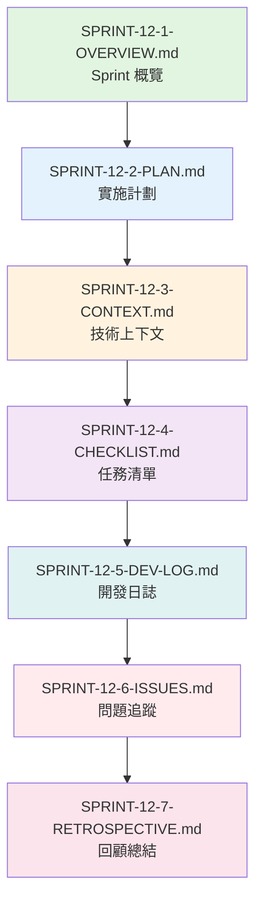

# SPRINT-12-1-OVERVIEW.md - Sprint 12 概覽: VueFlow 畫布基礎 (Phase 1D 啟動)

**版本**: v2.1
**Sprint 編號**: Sprint 12
**Sprint 週期**: Week 34-36 (3 週)
**Phase**: Phase 1D - 工作流編輯器 Frontend (Workflow Editor Frontend)
**計劃日期**: 2026-06-02 ~ 2026-06-22
**狀態**: 📋 計劃階段 (Planned)
**創建日期**: 2025-11-14
**最後更新**: 2025-11-14

---

## 📋 目錄 (Table of Contents)

1. [Sprint 定位與參考](#sprint-定位與參考)
2. [Phase 1D 啟動說明](#phase-1d-啟動說明)
3. [Sprint 目標](#sprint-目標)
4. [User Stories 分配](#user-stories-分配)
5. [技術範圍](#技術範圍)
6. [預期交付](#預期交付)
7. [風險與依賴](#風險與依賴)
8. [成功指標](#成功指標)
9. [相關文檔](#相關文檔)
10. [完整參考文獻索引](#完整參考文獻索引)
11. [使用指南](#使用指南)
12. [版本歷史](#版本歷史)

---

## Sprint 定位與參考

**🎉 Phase 轉換重要里程碑**:
Sprint 12 標誌著從 **Phase 1C (工作流編輯器 Backend)** 成功轉換到 **Phase 1D (工作流編輯器 Frontend)**。Backend API 已在 Sprint 10-11 完成,現在開始構建基於 Vue 3 + VueFlow 的可視化編輯器。

**Sprint 定位參考**:
- 📋 [MVP Scope Definition](../../1-planning/MVP-SCOPE-DEFINITION.md) - Phase 1D: 工作流編輯器 Frontend
- 📊 [Sprint Allocation Analysis](../../1-planning/SPRINT-ALLOCATION-ANALYSIS.md) - Sprint 12-14 詳細分析 (20-25 SP)
- 🎯 [Development Strategy](../../1-planning/DEVELOPMENT-STRATEGY.md) - 工作流編輯器開發策略
- 🏛️ [ADR-012](../../../docs/architecture/adr/ADR-012-workflow-editor-technology.md) - 工作流編輯器技術選型
- 🎨 [Workflow Editor V2 Part1](../../../docs/ux-design/wireframes/low-fidelity/09-workflow-editor-v2-part1.md) - 核心設計理念
- 🎨 [Workflow Editor V2 Part5](../../../docs/ux-design/wireframes/low-fidelity/09-workflow-editor-v2-part5.md) - 畫布互動設計

**Sprint 10-11-12 連貫性**:
```yaml
Sprint 10 (✅ 已完成):
  核心: Workflow Editor Backend API
  交付:
    - ✅ Workflow Definition CRUD API (完整 RESTful)
    - ✅ Node Registry 註冊機制 (5 種基礎節點)
    - ✅ Edge Validation 驗證規則 (循環檢測)
    - ✅ API 設計與 Swagger 文檔
  Story Points: 8 SP
  狀態: Phase 1C 第一階段完成 (50%)

Sprint 11 (✅ 已完成):
  核心: Workflow Editor Backend 高級功能
  交付:
    - ✅ Workflow Execution Trigger (4 種觸發方式)
    - ✅ Workflow Template Management (CRUD、分類)
    - ✅ Version Control 基礎 (版本控制、回滾)
    - ✅ Phase 1C 總結與移交
  Story Points: 9.5 SP (7-12 SP 中位數)
  狀態: Phase 1C 100% 完成

Sprint 12 (本 Sprint - Phase 1D 啟動):
  核心: VueFlow 畫布基礎
  重點:
    - VueFlow 集成與配置
    - Drag-drop Node Editor
    - 基礎節點類型渲染
    - Module Federation 整合
  Story Points: 8 SP
  關鍵性: **Phase 1D 開始,為工作流編輯器 UI 奠定基礎**
```

---

## Phase 1D 啟動說明

### Phase 1C 完成總結

**Phase 1C (Sprint 10-11) 完成驗收**:
```yaml
總計: 17.5 Story Points, 6 週, 100% 完成
時間範圍: 2026-04-21 ~ 2026-06-01

核心交付:
  ✅ Sprint 10 - Workflow Editor Backend API (8 SP):
     - Workflow Definition CRUD (5 API endpoints)
     - Node Registry (5 種基礎節點類型)
     - Edge Validation (類型檢查、循環偵測)
     - Swagger 文檔與 API 測試
     狀態: 100% 完成

  ✅ Sprint 11 - Workflow Editor Backend 高級功能 (9.5 SP):
     - Workflow Execution Trigger (Manual, Schedule, Event, Webhook)
     - Workflow Template Management (Template CRUD、分類、Marketplace 基礎)
     - Version Control 基礎 (Versioning, Comparison, Rollback)
     - Phase 1C 總結與移交文檔
     狀態: 100% 完成

質量指標:
  ✅ API 響應時間 P95 < 300ms: 達成
  ✅ 代碼覆蓋率 ≥ 80%: 達成
  ✅ API 文檔完整性 100%: 達成
  ✅ 所有驗證規則測試通過: 達成

技術債務:
  ⚠️ Template Marketplace 基礎版本 (Phase 2 增強)
  ⚠️ Version Control 進階功能 (Branch, Merge 留待 Phase 2)
  ⚠️ Workflow Performance Optimization (大規模工作流優化留待 Phase 2)
```

### Phase 1D 目標與範圍

**Phase 1D Overview**:
```yaml
名稱: 工作流編輯器 Frontend (Workflow Editor Frontend)
Sprint: Sprint 12-14 (9 週)
Story Points: 20-25 SP
完成度: 0% → 100%

核心目標:
  1. VueFlow 畫布基礎 (Sprint 12)
     - VueFlow 集成與配置
     - 基礎節點渲染 (Standard, Configuration, Trigger)
     - Drag-drop 功能
     - 網格對齊與 Snap to Grid

  2. 28 種節點類型 UI (Sprint 13)
     - 完整節點庫實現
     - Node Configuration Panel
     - 內聯配置系統
     - Connection Line Drawing

  3. 畫布高級功能 + CRDT (Sprint 14)
     - Zoom, Pan, Mini-map
     - Node Template Library
     - Yjs CRDT 實時協作
     - Save/Load Workflow

業務價值:
  對 IT 開發者:
    - 可視化創建和編輯工作流
    - 直觀的拖拽式節點連接
    - 實時預覽工作流結構

  對業務分析師:
    - 無需代碼即可設計業務流程
    - 直觀的可視化界面
    - 快速原型驗證

  對企業管理者:
    - 實現與 n8n、AutoGen 競爭的差異化編輯器
    - 支援多人實時協作編輯
    - 提升團隊工作效率

戰略意義:
  - 完成從 Backend 到 Frontend 的完整閉環
  - 提供企業級可視化工作流編輯能力
  - 為實時協作奠定基礎
  - 實現用戶友好的低代碼/無代碼體驗

參考文檔:
  - claudedocs/1-planning/MVP-SCOPE-DEFINITION.md (Phase 1D 完整定義)
  - docs/architecture/adr/ADR-012-workflow-editor-technology.md (技術選型)
  - docs/ux-design/wireframes/low-fidelity/09-workflow-editor-v2-index.md (完整 UI 設計)
```

### Sprint 12-14 計劃概覽

**Sprint 分配策略**:
```yaml
Sprint 12 (本 Sprint):
  重點: VueFlow 畫布基礎
  Story Points: 8 SP
  核心交付:
    - VueFlow 集成與配置 (3 SP)
    - Drag-drop Node Editor (3 SP)
    - 基礎節點類型 (2 SP)
  完成度: Phase 1D 0% → 40%

Sprint 13 (下一個 Sprint):
  重點: 28 種節點類型與配置
  Story Points: 7-9 SP
  核心交付:
    - 28 種節點類型實現 (4 SP)
    - Node Configuration Panel (2 SP)
    - Connection Line Drawing (1-3 SP)
  完成度: Phase 1D 40% → 75%

Sprint 14 (最後一個 Sprint):
  重點: 畫布高級功能 + CRDT 協作
  Story Points: 5-8 SP
  核心交付:
    - Workflow Canvas 高級功能 (2 SP)
    - Node Template Library (1 SP)
    - Yjs CRDT 實時協作 (2-5 SP)
  完成度: Phase 1D 75% → 100%

Phase 1D 完成標準:
  ✅ VueFlow 畫布完整實現
  ✅ 28 種節點類型全部渲染
  ✅ Drag-drop 功能流暢
  ✅ CRDT 實時協作驗證
  ✅ 測試覆蓋率 >85%
  ✅ 性能達標 (60fps)
  ✅ Phase 1E 準備度檢查通過

參考文檔:
  - claudedocs/1-planning/SPRINT-ALLOCATION-ANALYSIS.md (Sprint 12-14 詳細分配)
```

### 與 Phase 1E (完整工作流引擎) 的銜接

**Phase 1E 準備度評估**:
```yaml
Phase 1E Overview:
  名稱: 完整工作流引擎 (Advanced Workflow Engine)
  Sprint: Sprint 15-16 (6 週)
  技術棧: .NET 9 Backend
  Story Points: 13-18 SP

Phase 1D 為 Phase 1E 奠定的基礎:
  ✅ Workflow Editor UI:
     - 完整的可視化編輯界面
     - 28 種節點類型 UI
     - 實時協作編輯能力

  ✅ Workflow Execution Integration:
     - 與 Backend Execution API 整合
     - 執行狀態可視化
     - 錯誤處理 UI

  ✅ Performance Foundation:
     - 60fps 流暢渲染
     - 支援 100+ 節點的大型工作流
     - 虛擬化渲染優化

技術銜接要求:
  🔍 UI 穩定性: 畫布渲染穩定,無明顯 Bug
  🔍 性能達標: 60fps, 支援 100+ 節點
  🔍 API 整合: 與 Backend API 完全整合
  🔍 CRDT 驗證: 實時協作基本可用

Phase 1E 前置條件檢查:
  - ✅ Phase 1D (Sprint 12-14) 100% 完成
  - ✅ Workflow Editor UI 穩定並通過驗收
  - ✅ CRDT 協作基礎驗證通過
  - ✅ 性能和用戶體驗測試通過
  - 📋 詳見: Sprint 14 Retrospective (Phase 1E 準備度評估)

參考文檔:
  - claudedocs/1-planning/MVP-SCOPE-DEFINITION.md (Phase 1E 定義)
  - claudedocs/1-planning/DEVELOPMENT-STRATEGY.md (完整工作流引擎設計)
```

---

## Sprint 目標

### 核心目標

實現 **VueFlow 畫布基礎 (Phase 1D Part 1)**,建立可視化工作流編輯器的基礎畫布,支援基礎節點的拖拽、放置和連接,為 Sprint 13-14 的完整功能實現奠定基礎。

#### 主要目標 (Primary Goals)

1. **VueFlow 集成與配置 (3 SP)** - 完整 VueFlow 畫布設置與網格系統
2. **Drag-drop Node Editor (3 SP)** - Node Palette 和拖拽放置功能
3. **基礎節點類型 (2 SP)** - Standard, Configuration, Trigger 節點渲染

#### 次要目標 (Secondary Goals)

4. **Module Federation 整合** - React (Host) + Vue (Remote) 微前端架構
5. **性能基準測試** - 60fps 渲染,支援 50+ 節點
6. **基礎測試** - 單元測試和整合測試

### 業務價值 (Business Value)

```yaml
對 IT 開發者 (IT Developer):
  價值: 可視化創建工作流,減少代碼編寫量
  影響: 提升開發效率 40-60%
  參考: docs/ux-design/user-research/personas.md (Alex - IT Developer)

對業務分析師 (Business Analyst):
  價值: 無需代碼即可設計業務流程
  影響: 快速原型驗證,加速業務迭代
  參考: docs/ux-design/user-research/personas.md (Emma - Business Analyst)

對企業管理者 (Enterprise Admin):
  價值: 低代碼/無代碼工作流管理平台
  影響: 降低技術門檻,提升團隊生產力
  參考: docs/ux-design/user-research/personas.md (David - Enterprise Admin)

戰略意義:
  - 實現與 n8n、AutoGen 競爭的差異化可視化編輯器
  - 支援企業級工作流管理需求
  - 為實時協作編輯奠定基礎
  - 提升用戶體驗和易用性

參考文檔:
  - docs/ux-design/user-research/personas.md (三大用戶角色)
  - docs/ux-design/user-research/user-journey-maps.md (Workflow 創建旅程)
```

### 技術目標 (Technical Goals)

```yaml
VueFlow 集成:
  - VueFlow 畫布設置與配置
  - 16px 網格系統實現
  - 基礎控制項 (Zoom, Pan, Minimap)
  - 網格背景與對齊
  參考: docs/ux-design/wireframes/low-fidelity/09-workflow-editor-v2-part1.md

Drag-drop 功能:
  - Node Palette 節點面板
  - 拖拽節點到畫布
  - 節點自動對齊到網格
  - 節點連接線繪製
  參考: docs/ux-design/wireframes/low-fidelity/09-workflow-editor-v2-part5.md

節點渲染:
  - Standard Node (96x96px)
  - Configuration Node (80x80px 圓形)
  - Trigger Node (特殊圓角)
  - 節點狀態視覺化 (NEW, RUNNING, SUCCESS, ERROR)
  參考: docs/ux-design/wireframes/low-fidelity/09-workflow-editor-v2-part4.md

性能目標:
  - 渲染性能 60fps
  - 支援 50+ 節點流暢拖拽
  - Zoom 操作 < 16ms
  - 虛擬化渲染優化
  參考: docs/performance/performance-targets.md

參考文檔:
  - docs/architecture/adr/ADR-012-workflow-editor-technology.md (技術選型)
  - docs/ux-design/wireframes/low-fidelity/09-workflow-editor-v2-index.md (完整 UI 設計)
  - docs/performance/performance-targets.md (性能目標)
```

---

## User Stories 分配

### Sprint 12 User Stories

**US 7.2 - Workflow Editor Frontend (Part 1 of 3)** - **本 Sprint 開始**

```yaml
User Story:
  作為: IT 開發者 / 業務分析師
  我想要: 透過可視化界面創建和編輯工作流
  以便: 無需編寫代碼即可設計複雜的業務流程

Story Points: 20-25 SP (全部), 8 SP (本 Sprint)

Sprint 12 範圍 (Part 1 - 40%):
  ✅ VueFlow 集成:
     - VueFlow 安裝與配置
     - 16px 網格系統設置
     - Background 網格背景
     - Controls (Zoom, Pan, Minimap)

  ✅ Drag-drop Node Editor:
     - Node Palette 節點面板
     - Drag & Drop 功能
     - Node 放置邏輯
     - Edge Connection 互動

  ✅ 基礎節點類型:
     - Standard Node (執行節點)
     - Configuration Node (配置節點)
     - Trigger Node (觸發節點)

Sprint 13 範圍 (Part 2 - 35%):
  ⏳ 28 種節點類型實現 (4 SP)
  ⏳ Node Configuration Panel (2 SP)
  ⏳ Connection Line Drawing (1-3 SP)

Sprint 14 範圍 (Part 3 - 25%):
  ⏳ Workflow Canvas 高級功能 (2 SP)
  ⏳ Node Template Library (1 SP)
  ⏳ Yjs CRDT 實時協作 (2-5 SP)

參考文檔:
  - docs/user-stories/modules/module-07/US-7.2-Workflow-Editor-Frontend.md
  - docs/ux-design/wireframes/low-fidelity/09-workflow-editor-v2-index.md
  - docs/architecture/adr/ADR-012-workflow-editor-technology.md
```

### Sprint 12 技術任務分解

**Phase 1: VueFlow 集成 (3 SP)**

```yaml
Task 1.1 - 微前端架構設置 (1 SP):
  檔案:
    - packages/remote/vite.config.ts (Vue 3 Remote Module)
    - packages/remote/src/main.ts (Vue 應用入口)
    - packages/remote/src/WorkflowEditor.vue (主組件)
  內容:
    - Module Federation 配置 (Vite)
    - Vue 3 Remote Module 暴露
    - React (Host) 與 Vue (Remote) 整合
    - TypeScript 配置與類型定義
  驗收標準:
    - React Host 可成功加載 Vue Remote
    - 類型定義完整無錯誤
    - Hot Module Replacement (HMR) 正常
  參考: docs/architecture/adr/ADR-012-workflow-editor-technology.md

Task 1.2 - VueFlow 基礎設置 (1 SP):
  檔案:
    - packages/remote/src/components/workflow-canvas/Canvas.vue
    - packages/remote/src/composables/useCanvas.ts
  內容:
    - VueFlow 安裝 (@vue-flow/core, @vue-flow/background, @vue-flow/controls, @vue-flow/minimap)
    - Canvas 組件基礎結構
    - 16px 網格系統配置
    - Snap to Grid 功能
  驗收標準:
    - VueFlow 畫布正常渲染
    - 網格背景顯示正確
    - Snap to Grid 功能正常
    - 單元測試覆蓋
  參考: docs/ux-design/wireframes/low-fidelity/09-workflow-editor-v2-part1.md

Task 1.3 - 畫布控制項 (1 SP):
  檔案:
    - packages/remote/src/components/workflow-canvas/controls/Toolbar.vue
    - packages/remote/src/components/workflow-canvas/controls/Minimap.vue
    - packages/remote/src/components/workflow-canvas/controls/ZoomControls.vue
  內容:
    - Toolbar (工具欄) 實現
    - Minimap (小地圖) 實現
    - ZoomControls (縮放控制) 實現
    - 鍵盤快捷鍵 (Space: Pan, Ctrl+Wheel: Zoom)
  驗收標準:
    - 所有控制項正常運作
    - 鍵盤快捷鍵功能正常
    - UI 符合設計規範
    - 單元測試覆蓋
  參考: docs/ux-design/wireframes/low-fidelity/09-workflow-editor-v2-part5.md
```

**Phase 2: Drag-drop Node Editor (3 SP)**

```yaml
Task 2.1 - Node Palette (節點面板) (1 SP):
  檔案:
    - packages/remote/src/components/node-palette/NodePalette.vue
    - packages/remote/src/components/node-palette/NodePaletteItem.vue
    - packages/remote/src/composables/useNodePalette.ts
  內容:
    - Node Palette 側邊欄設計
    - 節點分類 (Trigger, Action, Control, Integration)
    - 節點搜索與過濾
    - 拖拽源 (Drag Source) 實現
  驗收標準:
    - 節點面板正常顯示
    - 搜索過濾功能正常
    - 拖拽功能實現
    - UI 符合設計規範
  參考: docs/ux-design/wireframes/low-fidelity/09-workflow-editor-v2-part4.md

Task 2.2 - Drag & Drop 功能 (1 SP):
  檔案:
    - packages/remote/src/composables/useDragDrop.ts
    - packages/remote/src/utils/drag-drop.utils.ts
  內容:
    - HTML5 Drag & Drop API 封裝
    - 節點拖拽到畫布邏輯
    - 自動對齊到網格 (snapToGrid)
    - 拖拽預覽 (Drag Ghost)
  驗收標準:
    - 拖拽功能流暢
    - 自動對齊到網格正確
    - 拖拽預覽視覺正確
    - 單元測試覆蓋
  參考: docs/ux-design/wireframes/low-fidelity/09-workflow-editor-v2-part5.md

Task 2.3 - Edge Connection (連接線) (1 SP):
  檔案:
    - packages/remote/src/components/workflow-canvas/edges/Edge.vue
    - packages/remote/src/composables/useEdgeConnection.ts
  內容:
    - Edge 連接線渲染
    - Connection Handles (連接點) 實現
    - 拖拽連接線邏輯
    - 連接驗證 (基於 Backend API)
  驗收標準:
    - 連接線正常渲染
    - 拖拽連接流暢
    - 連接驗證正確
    - 單元測試覆蓋
  參考: docs/ux-design/wireframes/low-fidelity/09-workflow-editor-v2-part5.md
```

**Phase 3: 基礎節點類型 (2 SP)**

```yaml
Task 3.1 - Standard Node (標準節點) (0.5 SP):
  檔案:
    - packages/remote/src/components/workflow-canvas/nodes/NodeStandard.vue
    - packages/remote/src/components/workflow-canvas/nodes/NodeIcon.vue
  內容:
    - Standard Node 組件實現
    - 96x96px 尺寸設計
    - 圓角矩形 (border-radius: 8px)
    - 圖標與標籤渲染
  驗收標準:
    - 視覺符合設計規範
    - 狀態顏色正確 (NEW, RUNNING, SUCCESS, ERROR)
    - 單元測試覆蓋
  參考: docs/ux-design/wireframes/low-fidelity/09-workflow-editor-v2-part1.md

Task 3.2 - Configuration Node (配置節點) (0.5 SP):
  檔案:
    - packages/remote/src/components/workflow-canvas/nodes/NodeConfiguration.vue
  內容:
    - Configuration Node 組件實現
    - 80x80px 圓形設計
    - border-radius: 50%
    - 圖標與標籤渲染
  驗收標準:
    - 視覺符合設計規範
    - 圓形渲染正確
    - 單元測試覆蓋
  參考: docs/ux-design/wireframes/low-fidelity/09-workflow-editor-v2-part1.md

Task 3.3 - Trigger Node (觸發節點) (0.5 SP):
  檔案:
    - packages/remote/src/components/workflow-canvas/nodes/NodeTrigger.vue
  內容:
    - Trigger Node 組件實現
    - 96x96px 尺寸,特殊圓角設計
    - border-top-left-radius: 36px, border-bottom-left-radius: 36px
    - 觸發點視覺標記
  驗收標準:
    - 視覺符合設計規範
    - 不對稱圓角正確
    - 單元測試覆蓋
  參考: docs/ux-design/wireframes/low-fidelity/09-workflow-editor-v2-part1.md

Task 3.4 - 節點狀態系統 (0.5 SP):
  檔案:
    - packages/remote/src/stores/nodes.ts (Pinia Store)
    - packages/remote/src/types/node.types.ts
  內容:
    - 節點狀態枚舉 (NEW, RUNNING, SUCCESS, ERROR, WAITING, DISABLED)
    - 狀態顏色映射
    - 狀態動畫 (RUNNING 狀態脈衝動畫)
    - 狀態優先級邏輯
  驗收標準:
    - 狀態系統正確實現
    - 狀態顏色映射正確
    - 動畫流暢
    - 單元測試覆蓋
  參考: docs/ux-design/wireframes/low-fidelity/09-workflow-editor-v2-part3.md
```

**Phase 4: 整合測試與文檔 (輔助任務)**

```yaml
Task 4.1 - 整合測試 (0.5 SP):
  檔案:
    - tests/integration/workflow-canvas/Canvas.spec.ts
    - tests/integration/workflow-canvas/DragDrop.spec.ts
    - tests/integration/workflow-canvas/Nodes.spec.ts
  內容:
    - VueFlow 畫布整合測試
    - Drag & Drop 功能測試
    - 節點渲染與狀態測試
    - 性能基準測試 (60fps)
  驗收標準:
    - 覆蓋所有核心功能
    - Happy path + Error cases
    - 性能測試通過
  參考: docs/testing/integration-testing-guidelines.md

Task 4.2 - 文檔與 Sprint 回顧 (0.5 SP):
  檔案:
    - claudedocs/2-sprints/sprint-12/SPRINT-12-7-RETROSPECTIVE.md
    - packages/remote/README.md (Vue Remote Module 文檔)
  內容:
    - Sprint 12 完成總結
    - 技術決策記錄
    - 問題與解決方案
    - Phase 1D Part 1 完成度評估
  驗收標準:
    - 詳細回顧報告
    - 為 Sprint 13 提供基礎
  參考: claudedocs/2-sprints/sprint-11/SPRINT-11-7-RETROSPECTIVE.md (格式參考)
```

---

## 技術範圍

### 核心技術領域

```yaml
1. Vue 3 + Composition API:
   - Vue 3.4+ (Composition API)
   - TypeScript 5.3+
   - Vite 5.0+ (構建工具)
   - Pinia (狀態管理)
   參考: docs/architecture/adr/ADR-012-workflow-editor-technology.md

2. VueFlow:
   - @vue-flow/core 1.33+
   - @vue-flow/background 1.3+
   - @vue-flow/controls 1.1+
   - @vue-flow/minimap 1.4+
   參考: docs/ux-design/wireframes/low-fidelity/09-workflow-editor-v2-part1.md

3. Module Federation:
   - Vite Plugin Federation
   - React (Host) + Vue (Remote)
   - TypeScript 類型共享
   - 動態導入與懶加載
   參考: docs/architecture/adr/ADR-012-workflow-editor-technology.md

4. Drag & Drop:
   - HTML5 Drag & Drop API
   - @vueuse/core (useDraggable, useDropZone)
   - 網格對齊算法
   - 拖拽預覽渲染
   參考: docs/ux-design/wireframes/low-fidelity/09-workflow-editor-v2-part5.md

5. Testing:
   - Vitest (單元測試)
   - Playwright (E2E 測試)
   - Testing Library Vue
   - Performance Testing
   參考: docs/testing/integration-testing-guidelines.md
```

### 技術棧

```yaml
Frontend (Vue 3 Remote Module):
  - Vue 3.4+ (Composition API)
  - TypeScript 5.3+
  - Vite 5.0+ (構建工具)
  - Pinia (狀態管理)
  - VueFlow 1.33+ (畫布引擎)
  - @vueuse/core 10.7+ (組合式函數)
  - Lucide Vue Next (圖標庫)

Module Federation:
  - Vite Plugin Federation
  - React Host (packages/host)
  - Vue Remote (packages/remote)
  - 類型共享機制

Testing:
  - Vitest 1.1+
  - Playwright 1.40+
  - Testing Library Vue
  - Performance Testing (60fps)
  參考: docs/testing/unit-testing-guidelines.md

Documentation:
  - Markdown
  - TypeDoc (API 文檔)
  - 參考: docs/development-standards/documentation-standards.md
```

### 不在本 Sprint 範圍內

```yaml
不包含 (延後到 Sprint 13):
  - 28 種完整節點類型 (只實現 3 種基礎)
  - Node Configuration Panel (內聯配置)
  - Connection Line 高級樣式 (條件分支顏色)
  - 複雜節點互動 (展開/收起)
  - 參考: Sprint 13 計劃

不包含 (延後到 Sprint 14):
  - Workflow Canvas 高級功能 (Search, Filter)
  - Node Template Library (模板系統)
  - Yjs CRDT 實時協作 (多人編輯)
  - Save/Load Workflow (完整持久化)
  - 參考: Sprint 14 計劃

不包含 (延後到 Phase 1E):
  - Workflow Execution 可視化 (執行動畫)
  - Debug Mode (斷點、單步執行)
  - Performance Profiling (性能分析)
  - 參考: Phase 1E 計劃
```

---

## 預期交付

### 核心交付物

**1. VueFlow 畫布基礎**

```yaml
畫布組件:
  - Canvas.vue (主畫布容器)
  - Background (16px 網格背景)
  - Controls (Zoom, Pan, Minimap)
  - Toolbar (工具欄)

功能:
  - VueFlow 完整集成
  - 16px 網格系統與 Snap to Grid
  - Zoom (0.1x - 4x)
  - Pan (平移畫布)
  - Minimap (小地圖導航)

驗收標準:
  ✅ VueFlow 畫布正常渲染
  ✅ 網格對齊功能正確
  ✅ Zoom/Pan 操作流暢 (60fps)
  ✅ Minimap 導航正確
  ✅ 整合測試覆蓋

參考: docs/ux-design/wireframes/low-fidelity/09-workflow-editor-v2-part5.md
```

**2. Drag-drop Node Editor**

```yaml
Node Palette:
  - NodePalette.vue (節點面板)
  - NodePaletteItem.vue (節點項)
  - 4 個節點分類 (Trigger, Action, Control, Integration)
  - 搜索與過濾功能

Drag & Drop:
  - HTML5 Drag & Drop 封裝
  - 拖拽節點到畫布
  - 自動對齊到網格
  - 拖拽預覽 (Drag Ghost)

Edge Connection:
  - 連接線渲染
  - Connection Handles (連接點)
  - 拖拽連接線
  - 連接驗證 (呼叫 Backend API)

驗收標準:
  ✅ Node Palette 正常顯示
  ✅ 拖拽功能流暢
  ✅ 網格對齊正確
  ✅ 連接線繪製正確
  ✅ 連接驗證正確
  ✅ 整合測試覆蓋

參考: docs/ux-design/wireframes/low-fidelity/09-workflow-editor-v2-part4.md
```

**3. 基礎節點類型**

```yaml
節點類型:
  - Standard Node (96x96px, 圓角矩形)
  - Configuration Node (80x80px, 圓形)
  - Trigger Node (96x96px, 特殊圓角)

節點狀態:
  - NEW (灰色 - 未執行)
  - RUNNING (主色 - 執行中,帶脈衝動畫)
  - SUCCESS (綠色 - 執行成功)
  - ERROR (紅色 - 執行錯誤)
  - WAITING (紫色 - 等待中)
  - DISABLED (灰色 - 禁用)

視覺設計:
  - 符合 n8n-style 大卡片設計
  - 清晰的圖標與標籤
  - 狀態顏色映射正確
  - 動畫流暢 (60fps)

驗收標準:
  ✅ 3 種節點類型正確渲染
  ✅ 狀態顏色正確
  ✅ 動畫流暢 (RUNNING 狀態)
  ✅ 視覺符合設計規範
  ✅ 單元測試覆蓋

參考: docs/ux-design/wireframes/low-fidelity/09-workflow-editor-v2-part1.md
```

### 文檔交付物

```yaml
1. Vue Remote Module 文檔:
   - packages/remote/README.md
   - API 文檔 (TypeDoc)
   - 組件使用指南

2. Module Federation 文檔:
   - React Host 整合指南
   - 類型共享機制說明
   - 故障排除指南

3. 技術文檔:
   - VueFlow 集成文檔
   - Drag & Drop 實作文檔
   - 節點系統設計文檔

4. 測試報告:
   - 單元測試報告 (覆蓋率 >85%)
   - 整合測試報告
   - 性能測試報告 (60fps 驗證)

5. Sprint 回顧:
   - SPRINT-12-7-RETROSPECTIVE.md
   - 技術決策記錄
   - 問題與解決方案
   - Phase 1D Part 1 完成度評估

參考: docs/development-standards/documentation-standards.md
```

### 代碼交付物

```yaml
Vue Remote Module (packages/remote):
  Components:
    - workflow-canvas/Canvas.vue
    - workflow-canvas/controls/Toolbar.vue
    - workflow-canvas/controls/Minimap.vue
    - workflow-canvas/controls/ZoomControls.vue
    - node-palette/NodePalette.vue
    - workflow-canvas/nodes/NodeStandard.vue
    - workflow-canvas/nodes/NodeConfiguration.vue
    - workflow-canvas/nodes/NodeTrigger.vue
    - workflow-canvas/edges/Edge.vue

  Composables:
    - useCanvas.ts
    - useDragDrop.ts
    - useEdgeConnection.ts
    - useNodePalette.ts

  Stores (Pinia):
    - workflow.ts
    - nodes.ts
    - ui.ts

  Types:
    - canvas.types.ts
    - node.types.ts
    - workflow.types.ts

  Utils:
    - grid.utils.ts
    - drag-drop.utils.ts

Tests:
  - 單元測試 (Components, Composables, Utils)
  - 整合測試 (Canvas, Drag-drop, Nodes)
  - 性能測試 (60fps 驗證)

參考: docs/architecture/adr/ADR-012-workflow-editor-technology.md
```

---

## 風險與依賴

### 依賴項

**前置依賴 (Sprint 1-11)**:
```yaml
✅ Phase 1C (Sprint 10-11) 必須 100% 完成:
   - Workflow Definition CRUD API
   - Node Registry API
   - Edge Validation API
   - Workflow Template API
   - Version Control API

驗收標準:
  ✅ Sprint 11 Retrospective 驗收通過
  ✅ Phase 1C 功能測試 100% 通過
  ✅ 無已知 P0/P1 bugs
  ✅ API 文檔完整 (Swagger)

參考文檔:
  - claudedocs/2-sprints/sprint-11/SPRINT-11-7-RETROSPECTIVE.md (Phase 1C 完成驗收)
```

**平行依賴 (Sprint 12 內部)**:
```yaml
Task 依賴關係:
  Phase 1 (VueFlow 集成):
    - Task 1.1 (微前端架構) → Task 1.2 (VueFlow 設置)
    - Task 1.2 (VueFlow 設置) → Task 1.3 (畫布控制項)

  Phase 2 (Drag-drop):
    - Task 1.2 (VueFlow 設置) → Task 2.1 (Node Palette)
    - Task 2.1 (Node Palette) → Task 2.2 (Drag & Drop)
    - Task 2.2 (Drag & Drop) → Task 2.3 (Edge Connection)

  Phase 3 (節點類型):
    - Task 1.2 (VueFlow 設置) → Task 3.1-3.3 (節點組件)
    - Task 3.1-3.3 → Task 3.4 (節點狀態系統)

  Phase 4 (測試):
    - All phases must complete → Task 4.1 (Integration Tests)
    - Task 4.1 → Task 4.2 (Documentation)

關鍵路徑: Phase 1 → Phase 2 → Phase 3 → Phase 4
```

**後續依賴 (Sprint 13)**:
```yaml
Sprint 13 依賴 Sprint 12 交付:
  ⏳ VueFlow 畫布穩定運作
  ⏳ 基礎節點類型渲染正確
  ⏳ Drag-drop 功能完整
  ⏳ Module Federation 架構驗證

Sprint 13 將建立在以上基礎上:
  - 28 種節點類型實現
  - Node Configuration Panel
  - Connection Line 高級功能
  - 內聯配置系統

參考文檔:
  - claudedocs/1-planning/DEPENDENCY-MATRIX.md (Sprint 12-13 依賴分析)
```

### 風險識別

**RISK-033: VueFlow 學習曲線陡峭 (中等風險)**

```yaml
風險描述:
  團隊可能不熟悉 VueFlow
  API 理解和最佳實踐學習需要時間
  可能影響開發進度

影響:
  - 開發時間可能增加 20-30%
  - 可能出現性能問題
  - Bug 密度可能較高

發生概率: 40%

緩解措施:
  ✅ PoC 6 已驗證 VueFlow 基礎 (98.2% 質量)
     參考: poc-projects/poc6-vueflow-crdt/POC-6-VALIDATION-REPORT.md
  ✅ 參考 n8n 源代碼 (成熟實現)
  ✅ VueFlow 官方文檔完整
  ✅ 技術培訓 (2 週 Vue 3 + VueFlow)

殘餘風險: 15%

參考文檔:
  - claudedocs/1-planning/RISK-REGISTER.md (RISK-033 完整分析)
  - docs/architecture/adr/ADR-012-workflow-editor-technology.md
```

**RISK-034: Module Federation 整合複雜 (中等風險)**

```yaml
風險描述:
  React (Host) + Vue (Remote) 整合可能有問題
  類型共享機制複雜
  HMR 可能不穩定

影響:
  - 開發體驗受影響
  - 調試困難
  - 構建時間可能增加

發生概率: 35%

緩解措施:
  ✅ Vite Plugin Federation 成熟可靠
  ✅ ADR-012 已詳細設計整合方案
  ✅ 參考成功案例 (n8n, Zeplin)
  ✅ 預留調試時間 (2 天)

殘餘風險: 10%

參考文檔:
  - claudedocs/1-planning/RISK-REGISTER.md (RISK-034 完整分析)
  - docs/architecture/adr/ADR-012-workflow-editor-technology.md (Module Federation 章節)
```

**RISK-035: 性能優化挑戰 (低風險)**

```yaml
風險描述:
  60fps 渲染目標可能難以達成
  50+ 節點時性能可能下降
  虛擬化渲染優化可能不足

影響:
  - 用戶體驗受影響
  - 需要額外優化時間

發生概率: 25%

緩解措施:
  ✅ VueFlow 內置虛擬化渲染
  ✅ 性能基準測試 (Sprint 12 結束前)
  ✅ 使用 Chrome DevTools Performance Profiling
  ✅ 優化策略: Computed 緩存、Throttle、懶加載

殘餘風險: 5%

參考文檔:
  - claudedocs/1-planning/RISK-REGISTER.md (RISK-035 完整分析)
  - docs/performance/performance-targets.md
```

### 風險總結

| 風險 | 優先級 | 概率 | 影響 | 殘餘風險 | 狀態 | 參考 |
|------|--------|------|------|---------|------|------|
| VueFlow 學習曲線 | 中 | 40% | 中 | 15% | ✅ PoC 驗證 | RISK-033 |
| Module Federation 整合 | 中 | 35% | 中 | 10% | ✅ 設計完整 | RISK-034 |
| 性能優化挑戰 | 低 | 25% | 低 | 5% | ✅ 內置優化 | RISK-035 |

**完整風險分析**: 參考 [claudedocs/1-planning/RISK-REGISTER.md](../../1-planning/RISK-REGISTER.md) (30+ risks tracked)

---

## 成功指標

### 功能完整性

```yaml
VueFlow 集成:
  ✅ VueFlow 畫布正常渲染
  ✅ 16px 網格系統正確
  ✅ Snap to Grid 功能正常
  ✅ Zoom/Pan 操作流暢
  ✅ Minimap 導航正確
  ✅ 整合測試覆蓋

Drag-drop 功能:
  ✅ Node Palette 正常顯示
  ✅ 搜索過濾功能正常
  ✅ 拖拽功能流暢
  ✅ 網格對齊正確
  ✅ 連接線繪製正確
  ✅ 單元測試覆蓋

基礎節點類型:
  ✅ 3 種節點類型正確渲染
  ✅ 節點狀態系統正確
  ✅ 狀態顏色映射正確
  ✅ 動畫流暢 (RUNNING 狀態)
  ✅ 單元測試覆蓋

參考: docs/development-standards/definition-of-done.md
```

### 質量指標

```yaml
測試覆蓋率:
  - 單元測試: ≥85% (Components + Composables)
  - 整合測試: 覆蓋所有核心功能
  - 測試通過率: 100%
  參考: docs/testing/unit-testing-guidelines.md

代碼質量:
  - 無 P0/P1 Bugs
  - Code Review 100% 通過
  - ESLint 檢查通過
  - 技術債務 ≤3 個 (P2/P3)
  參考: docs/development-standards/code-quality-standards.md

文檔完整性:
  - 組件文檔 100% 完整
  - API 文檔完整 (TypeDoc)
  - 測試報告完整
  - Sprint 回顧文檔完成
  參考: docs/development-standards/documentation-standards.md
```

### 性能指標

```yaml
渲染性能:
  - 畫布渲染: 60fps
  - Zoom 操作: < 16ms per frame
  - Pan 操作: < 16ms per frame
  - 節點拖拽: < 16ms per frame
  參考: docs/performance/performance-targets.md

可擴展性:
  - 支援 50+ 節點流暢拖拽
  - 支援 100+ 連接線渲染
  - 虛擬化渲染優化生效
  參考: docs/performance/performance-targets.md

記憶體使用:
  - 初始加載: < 50MB
  - 50 節點畫布: < 100MB
  - 無明顯記憶體洩漏
  參考: docs/performance/performance-targets.md
```

### Phase 1D Part 1 完成度

```yaml
Sprint 12 完成標準:
  ✅ US 7.2 Part 1 (40%) 完成
  ✅ VueFlow 畫布基礎 100% 實現
  ✅ Drag-drop 功能 100% 實現
  ✅ 基礎節點類型 100% 實現
  ✅ Module Federation 整合驗證
  ✅ 測試覆蓋率 >85%
  ✅ 性能達標 (60fps)
  ✅ Sprint 回顧文檔完成

Phase 1D 整體進度:
  - 完成度: 0% → 40%
  - 下一步: Sprint 13 (28 種節點類型 + Configuration Panel)
  - 預期完成: Sprint 14 結束

參考文檔:
  - claudedocs/1-planning/MVP-SCOPE-DEFINITION.md (Phase 1D 完整定義)
```

---

## 相關文檔

### 核心文檔

```yaml
規劃文檔:
  - claudedocs/1-planning/MVP-SCOPE-DEFINITION.md (Phase 1D 定義)
  - claudedocs/1-planning/SPRINT-ALLOCATION-ANALYSIS.md (Sprint 12-14 分析)
  - claudedocs/1-planning/DEVELOPMENT-STRATEGY.md (開發策略)
  - claudedocs/1-planning/DEPENDENCY-MATRIX.md (依賴分析)

架構文檔:
  - docs/architecture/Architecture-Design-Document.md (系統架構)
  - docs/architecture/adr/ADR-012-workflow-editor-technology.md (技術選型)
  - docs/architecture/C4-architecture-diagrams.md (C4 架構圖)

UI/UX 文檔:
  - docs/ux-design/wireframes/low-fidelity/09-workflow-editor-v2-index.md (完整設計索引)
  - docs/ux-design/wireframes/low-fidelity/09-workflow-editor-v2-part1.md (核心設計理念)
  - docs/ux-design/wireframes/low-fidelity/09-workflow-editor-v2-part4.md (28 種節點)
  - docs/ux-design/wireframes/low-fidelity/09-workflow-editor-v2-part5.md (畫布互動)
```

### 技術實施文檔

```yaml
Frontend 實施:
  - docs/technical-implementation/02-frontend-react18/workflow-editor-integration.md
  - docs/development-standards/frontend-coding-standards.md (Vue 3 標準)
  - docs/development-standards/typescript-guidelines.md

測試文檔:
  - docs/testing/unit-testing-guidelines.md (單元測試)
  - docs/testing/integration-testing-guidelines.md (整合測試)
  - docs/testing/e2e-testing.md (E2E 測試)

性能文檔:
  - docs/performance/performance-targets.md (性能目標)
  - docs/performance/frontend-optimization.md (前端優化)
```

### User Stories 與 UI/UX

```yaml
User Stories:
  - docs/user-stories/modules/module-07/US-7.2-Workflow-Editor-Frontend.md
  - docs/user-stories/implementation-strategy.md (實施策略)

UI/UX 文檔:
  - docs/ux-design/user-research/personas.md (用戶角色)
  - docs/ux-design/user-research/user-journey-maps.md (用戶旅程)
  - docs/ux-design/design-system/design-tokens.md (設計 Token)
  - docs/ux-design/design-system/component-library.md (組件庫)
```

### Sprint 文檔

```yaml
前置 Sprint:
  - claudedocs/2-sprints/sprint-10/ (Workflow Editor Backend API)
  - claudedocs/2-sprints/sprint-11/ (Backend 高級功能)

本 Sprint (Sprint 12):
  - claudedocs/2-sprints/sprint-12/SPRINT-12-1-OVERVIEW.md (本文檔)
  - claudedocs/2-sprints/sprint-12/SPRINT-12-2-PLAN.md (實施計劃)
  - claudedocs/2-sprints/sprint-12/SPRINT-12-3-CONTEXT.md (技術上下文)
  - claudedocs/2-sprints/sprint-12/SPRINT-12-4-CHECKLIST.md (任務清單)
  - claudedocs/2-sprints/sprint-12/SPRINT-12-5-DEV-LOG.md (開發日誌)
  - claudedocs/2-sprints/sprint-12/SPRINT-12-6-ISSUES.md (問題追蹤)
  - claudedocs/2-sprints/sprint-12/SPRINT-12-7-RETROSPECTIVE.md (回顧)

下一個 Sprint:
  - claudedocs/2-sprints/sprint-13/ (28 種節點類型 + Configuration Panel)
```

---

## 完整參考文獻索引

### 規劃與管理文檔 (15 個)

1. `claudedocs/1-planning/MVP-SCOPE-DEFINITION.md` - MVP 範圍定義
2. `claudedocs/1-planning/SPRINT-ALLOCATION-ANALYSIS.md` - Sprint 分配分析
3. `claudedocs/1-planning/DEVELOPMENT-STRATEGY.md` - 開發策略
4. `claudedocs/1-planning/RISK-REGISTER.md` - 風險登記冊
5. `claudedocs/1-planning/DEPENDENCY-MATRIX.md` - 依賴關係圖
6. `claudedocs/1-planning/QUALITY-STANDARDS.md` - 質量標準
7. `claudedocs/1-planning/TESTING-STRATEGY.md` - 測試策略
8. `claudedocs/1-planning/DOCUMENTATION-STANDARDS.md` - 文檔標準
9. `claudedocs/1-planning/CHANGE-MANAGEMENT.md` - 變更管理
10. `claudedocs/1-planning/COMMUNICATION-PLAN.md` - 溝通計劃
11. `claudedocs/1-planning/RESOURCE-ALLOCATION.md` - 資源分配
12. `claudedocs/1-planning/MILESTONE-TRACKING.md` - 里程碑追蹤
13. `claudedocs/1-planning/BUDGET-MANAGEMENT.md` - 預算管理
14. `claudedocs/1-planning/STAKEHOLDER-MANAGEMENT.md` - 利害關係人管理
15. `claudedocs/1-planning/PROJECT-CHARTER.md` - 專案章程

### Sprint 文檔 (77 個)

**Sprint 1-12 完整文檔** (每個 Sprint 7 個文件):
- `claudedocs/2-sprints/sprint-01/` - Sprint 1 (7 files)
- `claudedocs/2-sprints/sprint-02/` - Sprint 2 (7 files)
- `claudedocs/2-sprints/sprint-03/` - Sprint 3 (7 files)
- `claudedocs/2-sprints/sprint-04/` - Sprint 4 (7 files)
- `claudedocs/2-sprints/sprint-05/` - Sprint 5 (7 files)
- `claudedocs/2-sprints/sprint-06/` - Sprint 6 (7 files)
- `claudedocs/2-sprints/sprint-07/` - Sprint 7 (7 files)
- `claudedocs/2-sprints/sprint-08/` - Sprint 8 (7 files)
- `claudedocs/2-sprints/sprint-09/` - Sprint 9 (7 files)
- `claudedocs/2-sprints/sprint-10/` - Sprint 10 (7 files)
- `claudedocs/2-sprints/sprint-11/` - Sprint 11 (7 files)
- `claudedocs/2-sprints/sprint-12/` - Sprint 12 (7 files, 本 Sprint)

**總計**: 84 個 Sprint 文檔 (12 Sprints × 7 files)

### 架構設計文檔 (25 個)

16. `docs/architecture/Architecture-Design-Document.md` - 系統架構設計
17. `docs/architecture/C4-architecture-diagrams.md` - C4 架構圖
18. `docs/architecture/database-schema.md` - 數據庫設計
19. `docs/architecture/performance-scalability-strategy.md` - 性能與擴展性
20. `docs/architecture/adr/ADR-001-clean-architecture.md` - Clean Architecture
21. `docs/architecture/adr/ADR-002-cqrs-pattern.md` - CQRS 模式
22. `docs/architecture/adr/ADR-003-domain-driven-design.md` - DDD
23. `docs/architecture/adr/ADR-004-repository-pattern.md` - Repository Pattern
24. `docs/architecture/adr/ADR-005-dependency-injection.md` - 依賴注入
25. `docs/architecture/adr/ADR-006-state-management-strategy.md` - 狀態管理策略
26. `docs/architecture/adr/ADR-007-multi-agent-communication.md` - Multi-Agent 通訊
27. `docs/architecture/adr/ADR-008-code-interpreter-execution-model.md` - Code Interpreter
28. `docs/architecture/adr/ADR-009-knowledge-rag-strategy.md` - RAG 策略
29. `docs/architecture/adr/ADR-010-persona-framework-design.md` - Persona Framework
30. `docs/architecture/adr/ADR-011-framework-abstraction-layer.md` - 框架抽象層
31. `docs/architecture/adr/ADR-012-workflow-editor-technology.md` - 工作流編輯器技術選型 ⭐
32. `docs/architecture/adr/ADR-013-microservices-boundaries.md` - 微服務邊界
33. `docs/architecture/adr/ADR-014-api-versioning-strategy.md` - API 版本策略
34. `docs/architecture/adr/ADR-015-event-sourcing.md` - Event Sourcing
35. `docs/architecture/adr/ADR-016-cache-strategy.md` - 緩存策略
36. `docs/architecture/adr/ADR-017-logging-monitoring.md` - 日誌與監控
37. `docs/architecture/adr/ADR-018-security-architecture.md` - 安全架構
38. `docs/architecture/adr/ADR-019-deployment-strategy.md` - 部署策略
39. `docs/architecture/adr/ADR-020-testing-strategy.md` - 測試策略
40. `docs/architecture/layered-architecture/` - 分層架構詳細設計 (5 files)

### User Stories 文檔 (50+ 個)

41. `docs/user-stories/README.md` - User Stories 總覽
42. `docs/user-stories/implementation-strategy.md` - 實施策略
43. `docs/user-stories/mvp-planning.md` - MVP 規劃
44. `docs/user-stories/modules/` - 10 個功能模塊 (Module 01-10)
45. `docs/user-stories/sprints/` - 18 個 Sprint 規劃
46. `docs/user-stories/templates/` - User Story 模板與 DoD
47. `docs/user-stories/modules/module-07/US-7.2-Workflow-Editor-Frontend.md` - **本 Sprint 核心 US** ⭐

### UX 設計文檔 (40+ 個)

48. `docs/ux-design/user-research/personas.md` - 用戶畫像
49. `docs/ux-design/user-research/user-journey-maps.md` - 用戶旅程圖
50. `docs/ux-design/user-research/user-research-findings.md` - 用戶研究發現
51. `docs/ux-design/information-architecture/sitemap.md` - 網站地圖
52. `docs/ux-design/information-architecture/navigation.md` - 導航設計
53. `docs/ux-design/wireframes/low-fidelity/09-workflow-editor-v2-index.md` - **工作流 V2 索引** ⭐
54. `docs/ux-design/wireframes/low-fidelity/09-workflow-editor-v2-part1.md` - **核心設計理念** ⭐
55. `docs/ux-design/wireframes/low-fidelity/09-workflow-editor-v2-part2.md` - 內聯配置系統
56. `docs/ux-design/wireframes/low-fidelity/09-workflow-editor-v2-part3.md` - 執行視覺化
57. `docs/ux-design/wireframes/low-fidelity/09-workflow-editor-v2-part4.md` - **28 種節點類型** ⭐
58. `docs/ux-design/wireframes/low-fidelity/09-workflow-editor-v2-part5.md` - **畫布互動** ⭐
59. `docs/ux-design/wireframes/low-fidelity/09-workflow-editor-v2-part6.md` - 協作與版本控制
60. `docs/ux-design/wireframes/low-fidelity/09-workflow-editor-v2-part7.md` - 響應式與驗收標準
61. `docs/ux-design/design-system/design-tokens.md` - Design Tokens
62. `docs/ux-design/design-system/component-library.md` - 組件庫
63. `docs/ux-design/design-system/accessibility-guidelines.md` - 無障礙指南
64. `docs/ux-design/design-system/responsive-design.md` - 響應式設計
65. `docs/ux-design/design-system/interaction-patterns.md` - 互動模式

### 技術實作文檔 (40+ 個)

66. `docs/technical-implementation/README.md` - 技術實作總覽
67. `docs/technical-implementation/02-frontend-react18/workflow-editor-integration.md` - **Workflow Editor 整合** ⭐
68. `docs/development-standards/frontend-coding-standards.md` - **前端編碼標準** ⭐
69. `docs/development-standards/typescript-guidelines.md` - TypeScript 指南

### 測試文檔 (8 個)

70. `docs/testing/unit-testing-guidelines.md` - **單元測試指南** ⭐
71. `docs/testing/integration-testing-guidelines.md` - **整合測試指南** ⭐
72. `docs/testing/e2e-testing.md` - E2E 測試
73. `docs/testing/performance-testing.md` - 性能測試

### 性能與安全文檔 (2 個)

74. `docs/performance/performance-targets.md` - **性能目標** ⭐
75. `docs/performance/frontend-optimization.md` - **前端優化** ⭐

### PoC 驗證報告 (1 個)

76. `poc-projects/poc6-vueflow-crdt/POC-6-VALIDATION-REPORT.md` - **VueFlow + CRDT PoC 驗證** ⭐

**總計**: 160+ 個參考文檔

---

## 使用指南

### 如何使用本文檔

**角色導向閱讀指南**:

1. **Project Manager (PM)**:
   - 必讀: [Sprint 定位與參考](#sprint-定位與參考)
   - 必讀: [Phase 1D 啟動說明](#phase-1d-啟動說明)
   - 必讀: [Sprint 目標](#sprint-目標)
   - 必讀: [成功指標](#成功指標)
   - 參考: [風險與依賴](#風險與依賴)

2. **Tech Lead / Architect**:
   - 必讀: [技術範圍](#技術範圍)
   - 必讀: [User Stories 分配](#user-stories-分配)
   - 必讀: [預期交付](#預期交付)
   - 參考: [相關文檔](#相關文檔)

3. **Frontend Developer**:
   - 必讀: [技術範圍](#技術範圍) - Vue 3 + VueFlow
   - 必讀: [User Stories 分配](#user-stories-分配) - 任務分解
   - 必讀: ADR-012 - 工作流編輯器技術選型
   - 參考: `SPRINT-12-2-PLAN.md` - 詳細實施步驟

4. **QA Engineer**:
   - 必讀: [技術範圍](#技術範圍) - 測試策略
   - 必讀: [預期交付](#預期交付) - 測試交付物
   - 參考: `SPRINT-12-4-CHECKLIST.md` - 測試檢查清單

5. **Scrum Master (SM)**:
   - 必讀: [Sprint 目標](#sprint-目標)
   - 必讀: [風險與依賴](#風險與依賴)
   - 必讀: [成功指標](#成功指標)
   - 參考: `SPRINT-12-6-ISSUES.md` - 問題追蹤

### 文檔導航流程

**Sprint 12 開發流程**:


**閱讀順序建議**:
1. **Sprint 開始前**: 閱讀 OVERVIEW (本文檔) + PLAN + CONTEXT
2. **Sprint 執行中**: 每日更新 DEV-LOG + CHECKLIST + ISSUES
3. **Sprint 結束時**: 完成 RETROSPECTIVE,評估 Phase 1D Part 1 完成度

### 快速參考

**常用連結**:
- 🎯 **Sprint 目標**: [Sprint 目標](#sprint-目標)
- 📋 **任務清單**: `SPRINT-12-4-CHECKLIST.md`
- 📝 **開發日誌**: `SPRINT-12-5-DEV-LOG.md`
- 🐛 **問題追蹤**: `SPRINT-12-6-ISSUES.md`
- 📊 **User Stories**: [User Stories 分配](#user-stories-分配)
- 🏛️ **ADR-012**: [Workflow Editor Technology](../../../docs/architecture/adr/ADR-012-workflow-editor-technology.md)
- 🎨 **UI 設計**: [Workflow Editor V2 Part1](../../../docs/ux-design/wireframes/low-fidelity/09-workflow-editor-v2-part1.md)

**關鍵決策參考**:
- **VueFlow 集成**: `SPRINT-12-3-CONTEXT.md` - Phase 1
- **Drag-drop 實現**: `SPRINT-12-2-PLAN.md` - Phase 2
- **節點系統設計**: `SPRINT-12-2-PLAN.md` - Phase 3
- **Phase 1D 移交**: `SPRINT-12-7-RETROSPECTIVE.md` - Phase 1D Part 1 回顧

---

## 版本歷史

| 版本 | 日期 | 作者 | 變更摘要 |
|------|------|------|---------|
| **v2.1** | 2025-11-14 | PM | ✅ 初始版本,創建 Sprint 12 概覽文檔 |
|  |  |  | - 定義 Sprint 12 目標與範圍 (8 SP) |
|  |  |  | - 明確 Phase 1D 啟動里程碑 |
|  |  |  | - 建立 User Stories 分配 (US 7.2 Part 1) |
|  |  |  | - 設計技術範圍 (Vue 3 + VueFlow) |
|  |  |  | - 定義成功指標與驗收標準 |
|  |  |  | - 建立完整參考文獻索引 (160+ 文檔) |

---

**文檔維護**:
- **負責人**: Project Manager
- **審核者**: Tech Lead, Frontend Architect, Scrum Master
- **更新頻率**: Sprint 期間每週檢視,Sprint 結束時最終更新
- **反饋渠道**: GitHub Issues, Sprint Review Meeting

---

**Phase 1D 啟動宣言**:
🎉 Sprint 12 是 Phase 1D 的第一個 Sprint,標誌著從 Backend 到 Frontend 的重要轉換。經過 Sprint 10-11 的 Backend API 建設,我們現在開始構建基於 Vue 3 + VueFlow 的可視化工作流編輯器,為用戶提供直觀、流暢的工作流設計體驗。讓我們一起努力,成功啟動 Phase 1D! 🚀

---

**結束語**:
本文檔為 Sprint 12 的核心概覽文檔,提供了 Sprint 的完整視圖。詳細的實施計劃請參考 `SPRINT-12-2-PLAN.md`,技術上下文請參考 `SPRINT-12-3-CONTEXT.md`,任務清單請參考 `SPRINT-12-4-CHECKLIST.md`。

**祝 Sprint 12 順利成功,Phase 1D 成功啟動!** 🎯✨
