# C4 Model 系統架構圖

本文檔基於 [C4 Model](https://c4model.com/) 架構可視化方法，從不同抽象層次展示 Semantic Kernel Agentic Framework 的系統架構。

## Level 1: System Context（系統上下文圖）

展示系統與外部用戶、外部系統的交互關係。

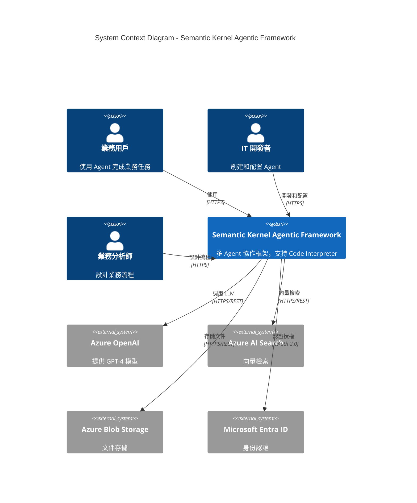

### 說明

**用戶角色**：
- **業務用戶**：使用 Agent 執行任務（如數據分析、報告生成）
- **IT 開發者**：創建自定義 Plugin、配置 Agent
- **業務分析師**：設計 Multi-Agent 協作流程

**外部系統**：
- **Azure OpenAI**：核心 LLM 服務（GPT-4、GPT-4o）
- **Azure AI Search**：向量數據庫（RAG 檢索）
- **Azure Blob Storage**：文件和知識庫存儲
- **Microsoft Entra ID**：統一身份認證

---

## Level 2: Container（容器圖）

展示系統內部的主要容器（應用程序、數據庫、服務）及其交互。

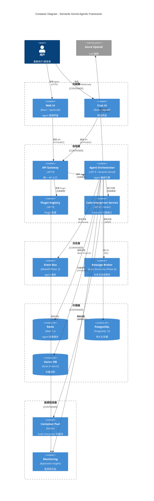

### 容器說明

**前端層**：
- **Web UI**：Agent 管理、配置、監控界面（React + TypeScript）
- **Chat UI**：對話界面，支持 Streaming（React + SignalR）

**後端層**：
- **API Gateway**：統一 API 入口，處理認證、授權、路由
- **Agent Orchestrator**：核心編排引擎，基於 Semantic Kernel
- **Plugin Registry**：Plugin 註冊、發現、版本管理
- **Code Interpreter Service**：Python/R 代碼執行服務

**消息層**：
- **Event Bus (MediatR)**：Phase 1 內存事件總線
- **Message Broker (Azure Service Bus)**：Phase 2 分布式消息隊列

**存儲層**：
- **Redis**：Agent 狀態緩存（短期狀態）
- **PostgreSQL**：持久化存儲（Agent 配置、執行歷史）
- **Vector DB (Azure AI Search)**：向量檢索（RAG）

**基礎設施層**：
- **Container Pool**：Docker 容器池（Code Interpreter）
- **Monitoring (Application Insights)**：監控、日誌、追蹤

---

## Level 3: Component（組件圖）

展示 **Agent Orchestrator** 內部的主要組件及其職責。

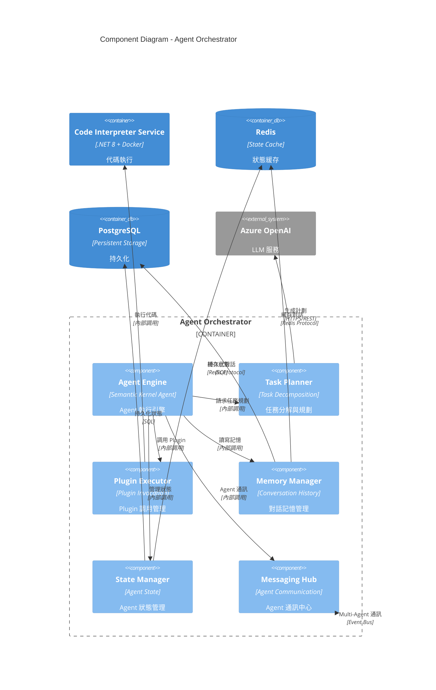

### 組件說明

**Agent Engine（核心引擎）**：
- 基於 Semantic Kernel Agent API
- 執行 Agent 生命週期管理（創建、運行、暫停、終止）
- 協調其他組件完成 Agent 任務

**Task Planner（任務規劃器）**：
- 將複雜任務分解為子任務
- 使用 LLM 生成執行計劃（Stepwise Planner）
- 決定 Plugin 調用順序

**Plugin Executor（Plugin 執行器）**：
- Plugin 調用管理（本地 Plugin、Code Interpreter）
- 參數驗證與類型轉換
- 錯誤處理與重試邏輯

**Memory Manager（記憶管理器）**：
- 對話歷史管理（短期記憶）
- 向量檢索（長期記憶 - RAG）
- 記憶壓縮與摘要

**State Manager（狀態管理器）**：
- 實現 ADR-006 的 Hybrid 狀態管理
- Redis 緩存 + PostgreSQL 持久化
- 狀態序列化與反序列化

**Messaging Hub（通訊中心）**：
- 實現 ADR-007 的 Multi-Agent 通訊
- Phase 1: MediatR（內存事件）
- Phase 2: Azure Service Bus（分布式消息）

---

## 部署架構圖

### Phase 1 (MVP): Docker Compose 部署

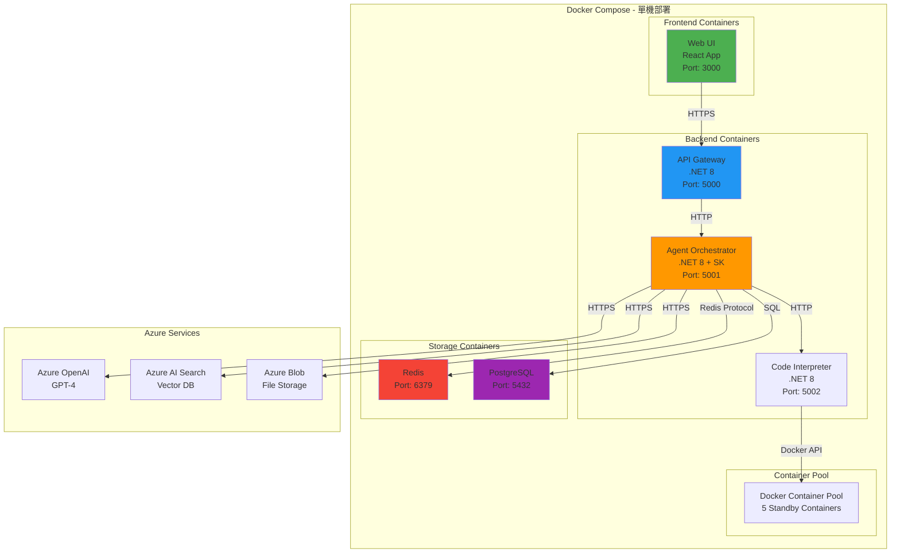

### Phase 2: Kubernetes 部署

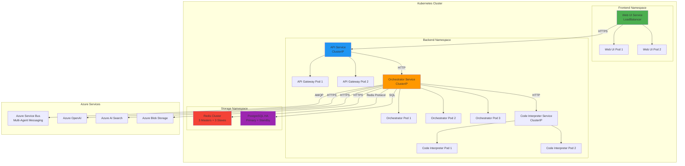

---

## 數據流圖

### Agent 執行流程（單 Agent）

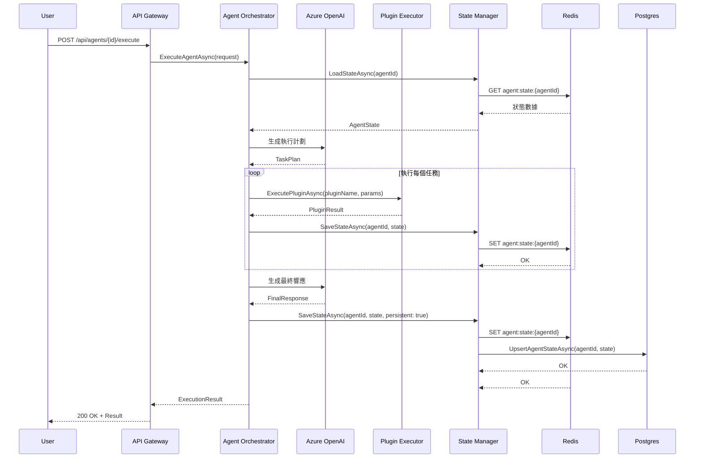

### Multi-Agent 協作流程

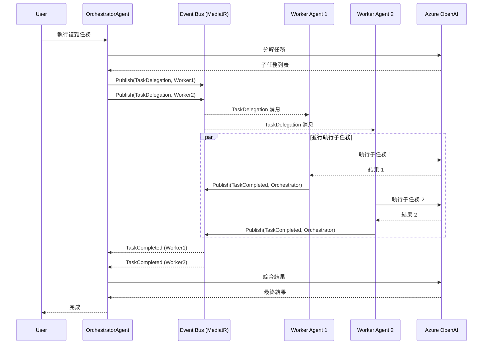

### Code Interpreter 執行流程

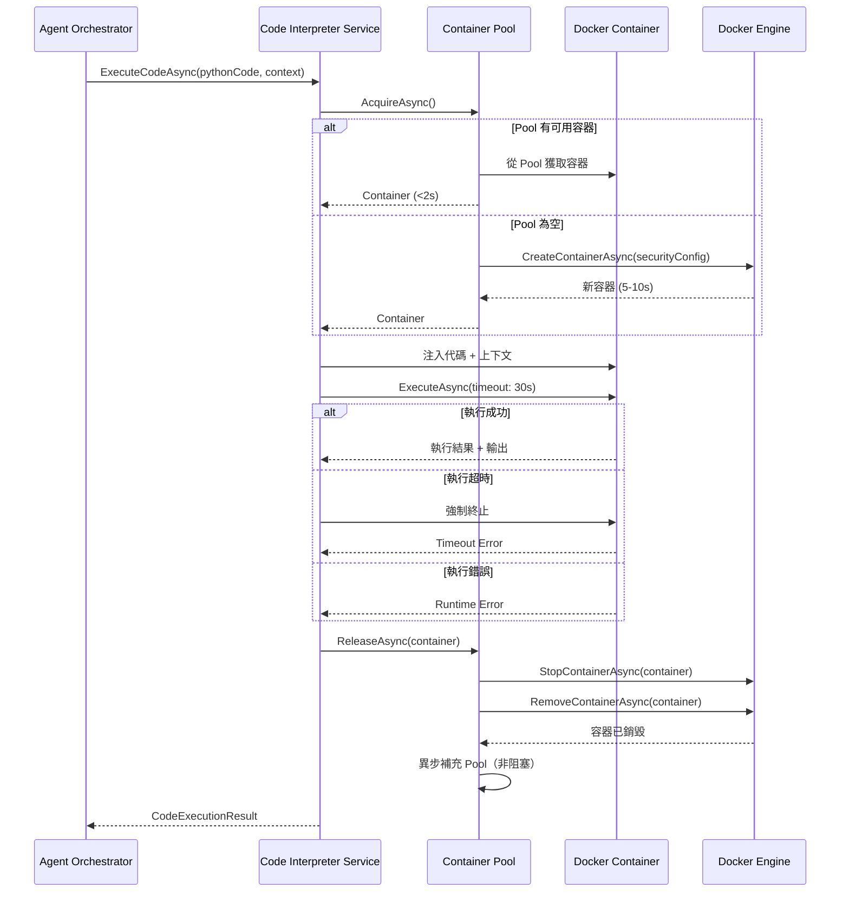

---

## 安全架構圖

### 4 層安全防護

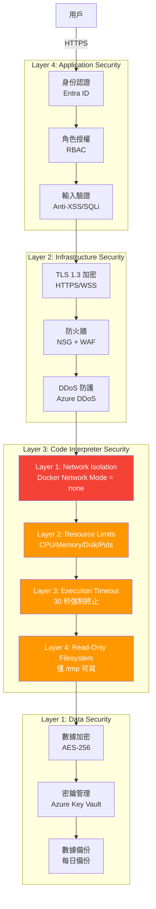

---

## 監控與可觀察性架構

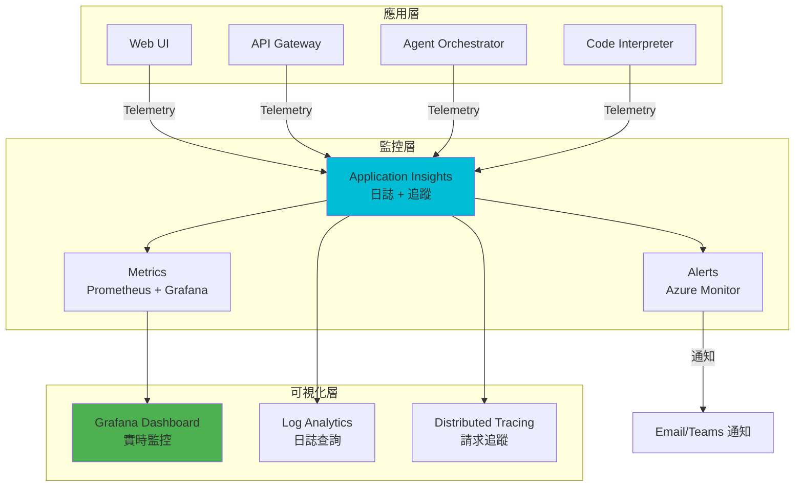

### 關鍵監控指標

```yaml
性能指標:
  - Agent 執行延遲 (P50, P95, P99)
  - Plugin 調用成功率
  - Code Interpreter 執行時間
  - Container Pool 使用率

可用性指標:
  - API 可用性 (目標: 99.9%)
  - Agent 執行成功率
  - 錯誤率 (目標: <1%)

資源指標:
  - CPU 使用率
  - Memory 使用率
  - Redis 連接數
  - PostgreSQL 連接數
  - Container Pool 大小

業務指標:
  - 每日活躍用戶 (DAU)
  - Agent 執行次數
  - Code Interpreter 使用率
  - Plugin 調用次數
```

---

## 災難恢復架構

### 備份策略

```yaml
PostgreSQL 備份:
  頻率: 每日全量備份
  保留期: 30 天
  恢復點目標 (RPO): 24 小時
  恢復時間目標 (RTO): 4 小時

Redis 備份:
  頻率: 每 6 小時 RDB 快照
  保留期: 7 天
  RPO: 6 小時
  RTO: 1 小時

Azure Blob 備份:
  頻率: 連續複製 (Geo-Redundant)
  保留期: 無限期
  RPO: 近乎 0
  RTO: <1 小時
```

### 故障恢復流程

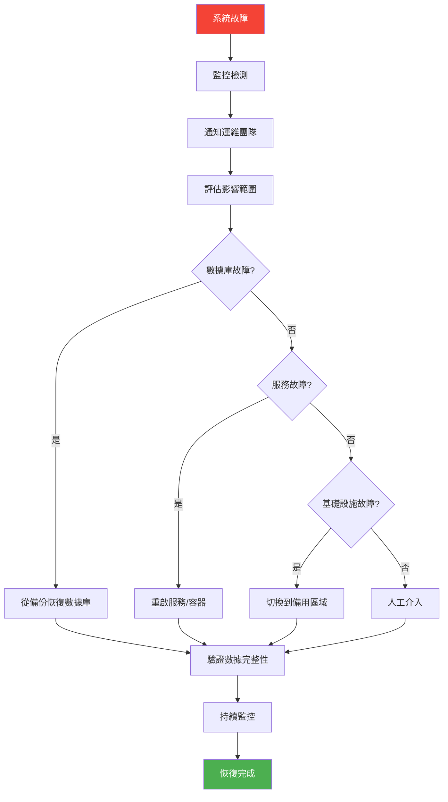

---

## 總結

本文檔基於 C4 Model 提供了 Semantic Kernel Agentic Framework 的完整架構可視化：

1. **System Context**：展示系統與用戶、外部系統的交互
2. **Container**：展示系統內部容器及其通訊
3. **Component**：展示 Agent Orchestrator 內部組件
4. **部署架構**：Phase 1 (Docker Compose) 和 Phase 2 (Kubernetes)
5. **數據流圖**：單 Agent、Multi-Agent、Code Interpreter 執行流程
6. **安全架構**：4 層安全防護
7. **監控架構**：可觀察性和關鍵指標
8. **災難恢復**：備份策略和故障恢復流程

這些圖表將作為 **Architecture Design Document (ADD)** 的核心部分，指導後續的開發和部署工作。
