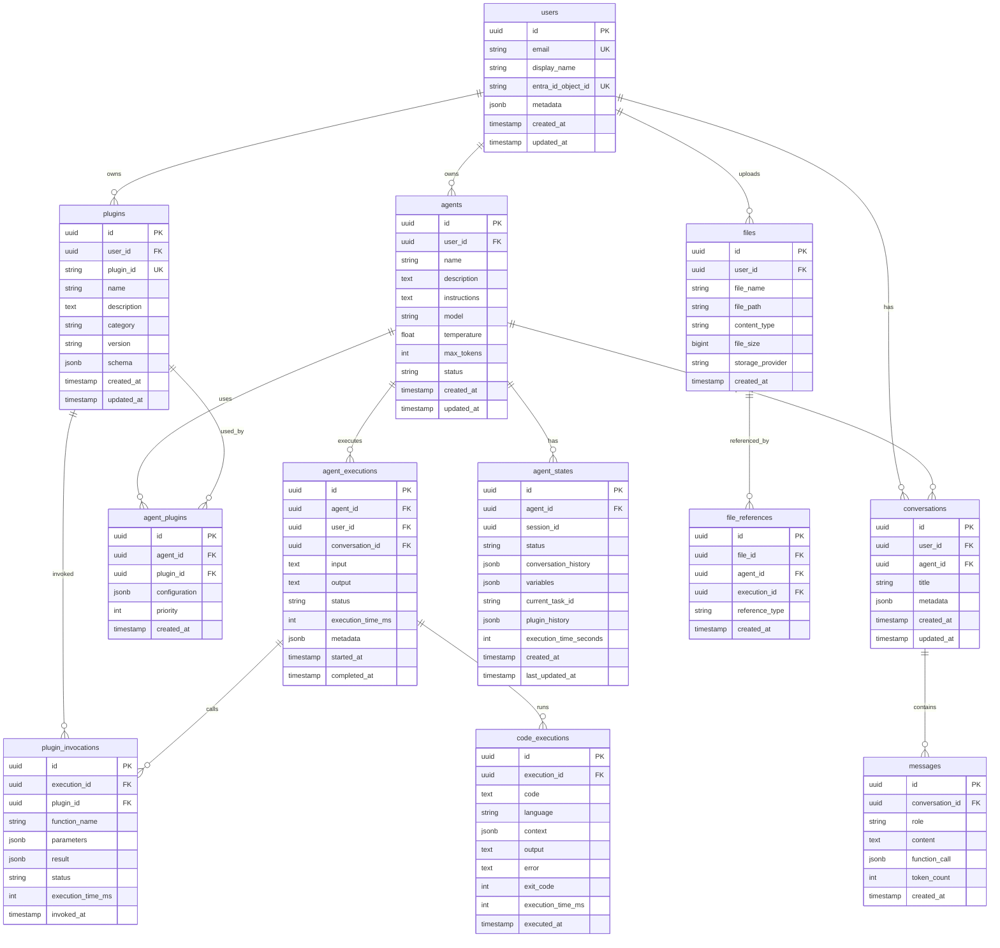

# PostgreSQL 數據庫 Schema 設計

本文檔定義 Semantic Kernel Agentic Framework 的 PostgreSQL 數據庫架構。

## Entity-Relationship Diagram（ER 圖）



---

## 表結構詳細定義

### 1. users（用戶表）

用戶基本信息和認證數據。

```sql
CREATE TABLE users (
    id UUID PRIMARY KEY DEFAULT gen_random_uuid(),
    email VARCHAR(255) NOT NULL UNIQUE,
    display_name VARCHAR(100) NOT NULL,
    entra_id_object_id VARCHAR(100) UNIQUE, -- Microsoft Entra ID Object ID
    metadata JSONB DEFAULT '{}', -- 額外的用戶元數據
    created_at TIMESTAMP WITH TIME ZONE DEFAULT CURRENT_TIMESTAMP,
    updated_at TIMESTAMP WITH TIME ZONE DEFAULT CURRENT_TIMESTAMP
);

-- 索引
CREATE INDEX idx_users_email ON users(email);
CREATE INDEX idx_users_entra_id ON users(entra_id_object_id);

-- 更新時間觸發器
CREATE OR REPLACE FUNCTION update_updated_at_column()
RETURNS TRIGGER AS $$
BEGIN
    NEW.updated_at = CURRENT_TIMESTAMP;
    RETURN NEW;
END;
$$ LANGUAGE plpgsql;

CREATE TRIGGER update_users_updated_at
    BEFORE UPDATE ON users
    FOR EACH ROW
    EXECUTE FUNCTION update_updated_at_column();
```

---

### 2. agents（Agent 表）

Agent 配置和元數據。

```sql
CREATE TABLE agents (
    id UUID PRIMARY KEY DEFAULT gen_random_uuid(),
    user_id UUID NOT NULL REFERENCES users(id) ON DELETE CASCADE,
    name VARCHAR(100) NOT NULL,
    description TEXT,
    instructions TEXT NOT NULL, -- Agent 的系統指令
    model VARCHAR(50) DEFAULT 'gpt-4o',
    temperature NUMERIC(3,2) DEFAULT 0.7 CHECK (temperature >= 0 AND temperature <= 2),
    max_tokens INTEGER DEFAULT 4096 CHECK (max_tokens > 0),
    status VARCHAR(20) DEFAULT 'active' CHECK (status IN ('active', 'paused', 'archived')),
    created_at TIMESTAMP WITH TIME ZONE DEFAULT CURRENT_TIMESTAMP,
    updated_at TIMESTAMP WITH TIME ZONE DEFAULT CURRENT_TIMESTAMP
);

-- 索引
CREATE INDEX idx_agents_user_id ON agents(user_id);
CREATE INDEX idx_agents_status ON agents(status);
CREATE INDEX idx_agents_created_at ON agents(created_at DESC);

-- 更新時間觸發器
CREATE TRIGGER update_agents_updated_at
    BEFORE UPDATE ON agents
    FOR EACH ROW
    EXECUTE FUNCTION update_updated_at_column();
```

---

### 3. plugins（Plugin 表）

Plugin 註冊和配置。

```sql
CREATE TABLE plugins (
    id UUID PRIMARY KEY DEFAULT gen_random_uuid(),
    user_id UUID REFERENCES users(id) ON DELETE CASCADE, -- NULL 表示系統 Plugin
    plugin_id VARCHAR(100) NOT NULL UNIQUE, -- 例如 "code_interpreter"
    name VARCHAR(100) NOT NULL,
    description TEXT,
    category VARCHAR(50) CHECK (category IN ('data_analysis', 'file_processing', 'web_search', 'custom')),
    version VARCHAR(20) DEFAULT '1.0.0',
    schema JSONB NOT NULL, -- Plugin 的完整 JSON Schema
    created_at TIMESTAMP WITH TIME ZONE DEFAULT CURRENT_TIMESTAMP,
    updated_at TIMESTAMP WITH TIME ZONE DEFAULT CURRENT_TIMESTAMP
);

-- 索引
CREATE INDEX idx_plugins_plugin_id ON plugins(plugin_id);
CREATE INDEX idx_plugins_category ON plugins(category);
CREATE INDEX idx_plugins_user_id ON plugins(user_id);

-- 更新時間觸發器
CREATE TRIGGER update_plugins_updated_at
    BEFORE UPDATE ON plugins
    FOR EACH ROW
    EXECUTE FUNCTION update_updated_at_column();
```

---

### 4. agent_plugins（Agent-Plugin 關聯表）

定義 Agent 使用哪些 Plugin。

```sql
CREATE TABLE agent_plugins (
    id UUID PRIMARY KEY DEFAULT gen_random_uuid(),
    agent_id UUID NOT NULL REFERENCES agents(id) ON DELETE CASCADE,
    plugin_id UUID NOT NULL REFERENCES plugins(id) ON DELETE CASCADE,
    configuration JSONB DEFAULT '{}', -- Plugin 的特定配置
    priority INTEGER DEFAULT 0, -- Plugin 調用優先級
    created_at TIMESTAMP WITH TIME ZONE DEFAULT CURRENT_TIMESTAMP,
    UNIQUE(agent_id, plugin_id) -- 防止重複添加同一個 Plugin
);

-- 索引
CREATE INDEX idx_agent_plugins_agent_id ON agent_plugins(agent_id);
CREATE INDEX idx_agent_plugins_plugin_id ON agent_plugins(plugin_id);
CREATE INDEX idx_agent_plugins_priority ON agent_plugins(agent_id, priority DESC);
```

---

### 5. agent_executions（Agent 執行歷史表）

記錄每次 Agent 執行的詳細信息。

```sql
CREATE TABLE agent_executions (
    id UUID PRIMARY KEY DEFAULT gen_random_uuid(),
    agent_id UUID NOT NULL REFERENCES agents(id) ON DELETE CASCADE,
    user_id UUID NOT NULL REFERENCES users(id) ON DELETE CASCADE,
    conversation_id UUID REFERENCES conversations(id) ON DELETE SET NULL,
    input TEXT NOT NULL, -- 用戶輸入
    output TEXT, -- Agent 輸出
    status VARCHAR(20) DEFAULT 'running' CHECK (status IN ('pending', 'running', 'completed', 'failed', 'timeout')),
    execution_time_ms INTEGER, -- 執行時間（毫秒）
    metadata JSONB DEFAULT '{}', -- 額外的執行元數據（如 token 使用量）
    started_at TIMESTAMP WITH TIME ZONE DEFAULT CURRENT_TIMESTAMP,
    completed_at TIMESTAMP WITH TIME ZONE
);

-- 索引
CREATE INDEX idx_agent_executions_agent_id ON agent_executions(agent_id);
CREATE INDEX idx_agent_executions_user_id ON agent_executions(user_id);
CREATE INDEX idx_agent_executions_status ON agent_executions(status);
CREATE INDEX idx_agent_executions_started_at ON agent_executions(started_at DESC);

-- 自動設置完成時間觸發器
CREATE OR REPLACE FUNCTION set_completed_at()
RETURNS TRIGGER AS $$
BEGIN
    IF NEW.status IN ('completed', 'failed', 'timeout') AND OLD.status NOT IN ('completed', 'failed', 'timeout') THEN
        NEW.completed_at = CURRENT_TIMESTAMP;
    END IF;
    RETURN NEW;
END;
$$ LANGUAGE plpgsql;

CREATE TRIGGER set_agent_executions_completed_at
    BEFORE UPDATE ON agent_executions
    FOR EACH ROW
    EXECUTE FUNCTION set_completed_at();
```

---

### 6. agent_states（Agent 狀態表）

實現 ADR-006 的持久化狀態存儲。

```sql
CREATE TABLE agent_states (
    id UUID PRIMARY KEY DEFAULT gen_random_uuid(),
    agent_id UUID NOT NULL REFERENCES agents(id) ON DELETE CASCADE,
    session_id UUID NOT NULL, -- 會話 ID
    status VARCHAR(20) DEFAULT 'running' CHECK (status IN ('running', 'paused', 'completed', 'failed')),
    conversation_history JSONB DEFAULT '[]', -- 對話歷史
    variables JSONB DEFAULT '{}', -- Agent 變量
    current_task_id VARCHAR(100), -- 當前任務 ID
    plugin_history JSONB DEFAULT '[]', -- Plugin 調用歷史
    execution_time_seconds INTEGER DEFAULT 0, -- 執行時間（秒）
    created_at TIMESTAMP WITH TIME ZONE DEFAULT CURRENT_TIMESTAMP,
    last_updated_at TIMESTAMP WITH TIME ZONE DEFAULT CURRENT_TIMESTAMP,
    UNIQUE(agent_id, session_id) -- 每個會話只有一個狀態
);

-- 索引
CREATE INDEX idx_agent_states_agent_id ON agent_states(agent_id);
CREATE INDEX idx_agent_states_session_id ON agent_states(session_id);
CREATE INDEX idx_agent_states_status ON agent_states(status);
CREATE INDEX idx_agent_states_last_updated_at ON agent_states(last_updated_at DESC);

-- 更新時間觸發器
CREATE TRIGGER update_agent_states_last_updated_at
    BEFORE UPDATE ON agent_states
    FOR EACH ROW
    EXECUTE FUNCTION update_updated_at_column();
```

---

### 7. plugin_invocations（Plugin 調用記錄表）

記錄每次 Plugin 調用的詳細信息。

```sql
CREATE TABLE plugin_invocations (
    id UUID PRIMARY KEY DEFAULT gen_random_uuid(),
    execution_id UUID NOT NULL REFERENCES agent_executions(id) ON DELETE CASCADE,
    plugin_id UUID NOT NULL REFERENCES plugins(id) ON DELETE CASCADE,
    function_name VARCHAR(100) NOT NULL, -- 調用的函數名稱
    parameters JSONB DEFAULT '{}', -- 函數參數
    result JSONB, -- 函數返回結果
    status VARCHAR(20) DEFAULT 'pending' CHECK (status IN ('pending', 'running', 'completed', 'failed')),
    execution_time_ms INTEGER, -- 執行時間（毫秒）
    invoked_at TIMESTAMP WITH TIME ZONE DEFAULT CURRENT_TIMESTAMP
);

-- 索引
CREATE INDEX idx_plugin_invocations_execution_id ON plugin_invocations(execution_id);
CREATE INDEX idx_plugin_invocations_plugin_id ON plugin_invocations(plugin_id);
CREATE INDEX idx_plugin_invocations_status ON plugin_invocations(status);
CREATE INDEX idx_plugin_invocations_invoked_at ON plugin_invocations(invoked_at DESC);
```

---

### 8. code_executions（Code Interpreter 執行記錄表）

記錄代碼執行的詳細信息和結果。

```sql
CREATE TABLE code_executions (
    id UUID PRIMARY KEY DEFAULT gen_random_uuid(),
    execution_id UUID NOT NULL REFERENCES agent_executions(id) ON DELETE CASCADE,
    code TEXT NOT NULL, -- 執行的代碼
    language VARCHAR(20) NOT NULL CHECK (language IN ('python', 'r')),
    context JSONB DEFAULT '{}', -- 注入的上下文數據
    output TEXT, -- 標準輸出
    error TEXT, -- 錯誤信息
    exit_code INTEGER, -- 退出碼
    execution_time_ms INTEGER, -- 執行時間（毫秒）
    executed_at TIMESTAMP WITH TIME ZONE DEFAULT CURRENT_TIMESTAMP
);

-- 索引
CREATE INDEX idx_code_executions_execution_id ON code_executions(execution_id);
CREATE INDEX idx_code_executions_language ON code_executions(language);
CREATE INDEX idx_code_executions_exit_code ON code_executions(exit_code);
CREATE INDEX idx_code_executions_executed_at ON code_executions(executed_at DESC);
```

---

### 9. conversations（對話表）

記錄用戶與 Agent 的對話會話。

```sql
CREATE TABLE conversations (
    id UUID PRIMARY KEY DEFAULT gen_random_uuid(),
    user_id UUID NOT NULL REFERENCES users(id) ON DELETE CASCADE,
    agent_id UUID NOT NULL REFERENCES agents(id) ON DELETE CASCADE,
    title VARCHAR(255), -- 對話標題（可自動生成）
    metadata JSONB DEFAULT '{}', -- 額外的對話元數據
    created_at TIMESTAMP WITH TIME ZONE DEFAULT CURRENT_TIMESTAMP,
    updated_at TIMESTAMP WITH TIME ZONE DEFAULT CURRENT_TIMESTAMP
);

-- 索引
CREATE INDEX idx_conversations_user_id ON conversations(user_id);
CREATE INDEX idx_conversations_agent_id ON conversations(agent_id);
CREATE INDEX idx_conversations_created_at ON conversations(created_at DESC);

-- 更新時間觸發器
CREATE TRIGGER update_conversations_updated_at
    BEFORE UPDATE ON conversations
    FOR EACH ROW
    EXECUTE FUNCTION update_updated_at_column();
```

---

### 10. messages（消息表）

記錄對話中的每條消息。

```sql
CREATE TABLE messages (
    id UUID PRIMARY KEY DEFAULT gen_random_uuid(),
    conversation_id UUID NOT NULL REFERENCES conversations(id) ON DELETE CASCADE,
    role VARCHAR(20) NOT NULL CHECK (role IN ('system', 'user', 'assistant', 'function')),
    content TEXT NOT NULL, -- 消息內容
    function_call JSONB, -- Function call 信息（如果適用）
    token_count INTEGER, -- Token 使用量
    created_at TIMESTAMP WITH TIME ZONE DEFAULT CURRENT_TIMESTAMP
);

-- 索引
CREATE INDEX idx_messages_conversation_id ON messages(conversation_id);
CREATE INDEX idx_messages_role ON messages(role);
CREATE INDEX idx_messages_created_at ON messages(created_at DESC);
```

---

### 11. files（文件表）

記錄用戶上傳的文件。

```sql
CREATE TABLE files (
    id UUID PRIMARY KEY DEFAULT gen_random_uuid(),
    user_id UUID NOT NULL REFERENCES users(id) ON DELETE CASCADE,
    file_name VARCHAR(255) NOT NULL,
    file_path TEXT NOT NULL, -- Azure Blob Storage 路徑
    content_type VARCHAR(100), -- MIME type
    file_size BIGINT CHECK (file_size > 0), -- 文件大小（bytes）
    storage_provider VARCHAR(50) DEFAULT 'azure_blob', -- 存儲提供商
    created_at TIMESTAMP WITH TIME ZONE DEFAULT CURRENT_TIMESTAMP
);

-- 索引
CREATE INDEX idx_files_user_id ON files(user_id);
CREATE INDEX idx_files_created_at ON files(created_at DESC);
```

---

### 12. file_references（文件引用表）

記錄文件被 Agent 或執行使用的情況。

```sql
CREATE TABLE file_references (
    id UUID PRIMARY KEY DEFAULT gen_random_uuid(),
    file_id UUID NOT NULL REFERENCES files(id) ON DELETE CASCADE,
    agent_id UUID REFERENCES agents(id) ON DELETE CASCADE,
    execution_id UUID REFERENCES agent_executions(id) ON DELETE CASCADE,
    reference_type VARCHAR(50) CHECK (reference_type IN ('agent_config', 'execution_input', 'execution_output')),
    created_at TIMESTAMP WITH TIME ZONE DEFAULT CURRENT_TIMESTAMP,
    CHECK (agent_id IS NOT NULL OR execution_id IS NOT NULL) -- 至少有一個引用
);

-- 索引
CREATE INDEX idx_file_references_file_id ON file_references(file_id);
CREATE INDEX idx_file_references_agent_id ON file_references(agent_id);
CREATE INDEX idx_file_references_execution_id ON file_references(execution_id);
```

---

## 數據完整性約束

### 外鍵約束（Foreign Keys）

所有外鍵關係已在上述表定義中使用 `REFERENCES` 定義，並設置了適當的 `ON DELETE` 行為：

- **CASCADE**：刪除父記錄時，自動刪除所有子記錄
  - 例如：刪除 User 時，自動刪除其所有 Agents
- **SET NULL**：刪除父記錄時，將子記錄的外鍵設為 NULL
  - 例如：刪除 Conversation 時，Agent Execution 的 `conversation_id` 設為 NULL

### 檢查約束（Check Constraints）

在關鍵字段上設置了 `CHECK` 約束，確保數據合法性：

- `agents.temperature`：必須在 0-2 之間
- `agents.status`：只能是 `active`, `paused`, `archived`
- `plugins.category`：只能是預定義的分類
- `messages.role`：只能是 `system`, `user`, `assistant`, `function`

### 唯一約束（Unique Constraints）

防止重複數據：

- `users.email`：每個 Email 只能註冊一個帳戶
- `plugins.plugin_id`：每個 Plugin ID 唯一
- `agent_plugins(agent_id, plugin_id)`：Agent 不能重複添加同一個 Plugin

---

## 索引策略

### 主鍵索引（Primary Key）

所有表使用 `UUID` 作為主鍵，並自動創建唯一索引。

### 查詢優化索引

基於常見查詢模式創建索引：

1. **按用戶查詢**：所有帶 `user_id` 的表都有索引
2. **按時間查詢**：所有帶 `created_at` 的表都有降序索引（最新記錄優先）
3. **按狀態查詢**：`agents.status`, `agent_executions.status`
4. **多條件查詢**：`agent_plugins(agent_id, priority DESC)` 支持按優先級排序

### 索引使用建議

```sql
-- 示例：查詢用戶的所有 Agent（按創建時間倒序）
SELECT * FROM agents
WHERE user_id = 'xxx'
ORDER BY created_at DESC
LIMIT 20;
-- 使用索引：idx_agents_user_id + idx_agents_created_at

-- 示例：查詢 Agent 的執行歷史
SELECT * FROM agent_executions
WHERE agent_id = 'xxx' AND status = 'completed'
ORDER BY started_at DESC;
-- 使用索引：idx_agent_executions_agent_id + idx_agent_executions_status
```

---

## 分區策略（未來優化）

當數據量增長到一定規模（>1000 萬行）時，考慮對以下表進行分區：

### 按時間分區

```sql
-- agent_executions 按月分區
CREATE TABLE agent_executions_2025_01 PARTITION OF agent_executions
    FOR VALUES FROM ('2025-01-01') TO ('2025-02-01');

CREATE TABLE agent_executions_2025_02 PARTITION OF agent_executions
    FOR VALUES FROM ('2025-02-01') TO ('2025-03-01');

-- 自動創建分區腳本（定期執行）
-- ...
```

### 分區候選表

- `agent_executions`：執行記錄（按月分區）
- `plugin_invocations`：Plugin 調用（按月分區）
- `code_executions`：代碼執行（按月分區）
- `messages`：消息記錄（按月分區）

---

## 數據歸檔策略

### 歸檔規則

為了保持數據庫性能，定期歸檔舊數據：

```yaml
歸檔策略:
  agent_executions:
    條件: completed_at < 6 個月前
    目標: 歸檔到 Azure Blob Storage（冷存儲）
    頻率: 每月 1 次

  messages:
    條件: created_at < 1 年前
    目標: 歸檔到 Azure Blob Storage
    頻率: 每季度 1 次

  code_executions:
    條件: executed_at < 3 個月前
    目標: 刪除（保留摘要信息）
    頻率: 每月 1 次
```

### 歸檔腳本範例

```sql
-- 歸檔 6 個月前的執行記錄
WITH archived_executions AS (
    DELETE FROM agent_executions
    WHERE completed_at < CURRENT_DATE - INTERVAL '6 months'
    RETURNING *
)
-- 導出到 CSV 並上傳到 Azure Blob
COPY archived_executions TO '/tmp/agent_executions_archive.csv' CSV HEADER;
```

---

## 備份與恢復

### 備份策略

```yaml
全量備份:
  頻率: 每日 02:00 UTC
  保留期: 30 天
  工具: pg_dump + Azure Blob Storage

增量備份:
  頻率: 每 6 小時
  保留期: 7 天
  工具: WAL Archiving

恢復點目標 (RPO): 6 小時
恢復時間目標 (RTO): 4 小時
```

### 備份腳本

```bash
#!/bin/bash
# 每日全量備份腳本

DATE=$(date +%Y%m%d)
BACKUP_FILE="agentic_framework_$DATE.sql.gz"

# 創建備份
pg_dump -h localhost -U postgres -d agentic_framework | gzip > /tmp/$BACKUP_FILE

# 上傳到 Azure Blob Storage
az storage blob upload \
    --account-name agenticbackup \
    --container-name database-backups \
    --file /tmp/$BACKUP_FILE \
    --name $BACKUP_FILE

# 刪除本地備份
rm /tmp/$BACKUP_FILE

# 清理 30 天前的備份
az storage blob delete-batch \
    --account-name agenticbackup \
    --source database-backups \
    --pattern "*" \
    --if-unmodified-since $(date -d '30 days ago' --iso-8601)
```

---

## 性能優化建議

### 1. 連接池配置

```yaml
PgBouncer 配置:
  pool_mode: transaction
  max_client_conn: 1000
  default_pool_size: 25
  reserve_pool_size: 5
  reserve_pool_timeout: 3
```

### 2. 查詢優化

```sql
-- 使用 EXPLAIN ANALYZE 分析慢查詢
EXPLAIN ANALYZE
SELECT a.*, u.display_name
FROM agents a
JOIN users u ON a.user_id = u.id
WHERE a.status = 'active'
ORDER BY a.created_at DESC
LIMIT 20;

-- 創建覆蓋索引（避免回表）
CREATE INDEX idx_agents_status_created_at ON agents(status, created_at DESC) INCLUDE (name, description);
```

### 3. JSONB 索引優化

```sql
-- 對 JSONB 字段創建 GIN 索引（支持復雜查詢）
CREATE INDEX idx_plugins_schema_gin ON plugins USING GIN (schema);

-- 查詢示例
SELECT * FROM plugins
WHERE schema @> '{"category": "data_analysis"}';
```

### 4. 自動 VACUUM 配置

```sql
-- 調整 autovacuum 參數（高寫入表）
ALTER TABLE agent_executions SET (
    autovacuum_vacuum_scale_factor = 0.05,
    autovacuum_analyze_scale_factor = 0.02
);
```

---

## 監控與維護

### 關鍵監控指標

```yaml
性能指標:
  - 連接數（當前 / 最大）
  - 查詢響應時間（P50, P95, P99）
  - 慢查詢數量（>1 秒）
  - 索引命中率（目標 >95%）

資源指標:
  - CPU 使用率
  - Memory 使用率
  - Disk I/O
  - 連接池使用率

數據指標:
  - 表大小增長趨勢
  - 死元組（Dead Tuples）數量
  - Bloat 比例
```

### 維護任務

```yaml
每日:
  - 檢查慢查詢日誌
  - 監控備份成功率

每週:
  - 檢查索引使用情況
  - 分析表增長趨勢
  - VACUUM ANALYZE 大表

每月:
  - 執行數據歸檔
  - 檢查分區策略
  - 性能優化評估
```

---

## 總結

本文檔定義了 Semantic Kernel Agentic Framework 的完整 PostgreSQL 數據庫架構：

1. **12 個核心表**：覆蓋 Users, Agents, Plugins, Executions, States, Conversations, Files
2. **ER 圖**：清晰展示實體關係
3. **索引策略**：優化常見查詢模式
4. **數據完整性**：外鍵、檢查約束、唯一約束
5. **性能優化**：連接池、JSONB 索引、分區策略
6. **備份與恢復**：每日全量 + 增量備份
7. **監控與維護**：關鍵指標和定期任務

這個 Schema 設計支持 MVP 階段的所有功能，並為 Phase 2 的擴展預留了優化空間。
