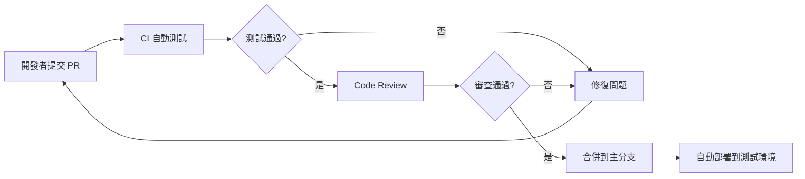

# Project Management Plan (PMP)

**Semantic Kernel Agentic Framework**

**版本**: 1.0.0
**日期**: 2025-10-28
**狀態**: ✅ 已批准
**PM**: BMad Method - Project Manager Persona

---

## 文檔概覽

本文檔是 Semantic Kernel Agentic Framework 的完整項目管理計劃（Project Management Plan, PMP），基於 BMad Method 的 PM Persona，在 **Project Brief** 和 **Architecture Design Document (ADD)** 基礎上進行的詳細項目管理規劃。

[📚 返回主索引](../README.md) | [📋 User Stories](../user-stories/README.md) | [🎯 MVP 規劃](../user-stories/mvp-planning.md) | [🏗️ 架構設計](../architecture/Architecture-Design-Document.md)

### 相關文檔

```
docs/
├── README.md                             # 主索引 - 完整導航和進度追蹤
├── brief.md                              # Project Brief (Analyst)
├── user-stories/                         # User Stories (Product Owner)
│   ├── README.md                         # User Stories 總覽
│   ├── implementation-strategy.md        # 技術實施策略
│   ├── mvp-planning.md                   # MVP 範圍與時程
│   ├── modules/                          # 10 個功能模組
│   └── sprints/                          # Sprint 規劃
├── architecture/
│   └── Architecture-Design-Document.md   # ADD (System Architect)
└── project-management/
    └── Project-Management-Plan.md        # 本文檔 (PM)
```

---

## 1. 執行摘要

### 1.1 項目概述

**項目名稱**: Semantic Kernel Agentic Framework
**項目目標**: 開發企業級 Multi-Agent 協作框架，彌補 Microsoft Copilot Studio 核心能力缺失
**項目期限**: 18 個月（MVP: 8 個月 + Phase 2: 10 個月）
**項目預算**: TWD $800,000（含人力與基礎設施）
**團隊規模**: 5 人核心團隊

**核心差異化能力**:
1. Multi-Agent Orchestration（多 Agent 協作）
2. Code Interpreter（Python/R 代碼執行）
3. 自定義 Plugin 系統
4. 企業級安全性（4 層防護）

### 1.2 項目階段

```yaml
Phase 1 - MVP (Month 1-8):
  目標: 快速驗證核心能力
  部署: Docker Compose 單機
  預算: TWD $300,000
  關鍵交付物:
    - Agent 管理系統
    - Code Interpreter
    - Multi-Agent 編排
    - Web UI

Phase 2 - Kubernetes (Month 9-18):
  目標: 生產級部署與高可用性
  部署: Kubernetes (AKS)
  預算: TWD $500,000
  關鍵交付物:
    - Kubernetes 遷移
    - Azure Service Bus 集成
    - 自動伸縮
    - 監控系統
```

---

## 2. Work Breakdown Structure (WBS)

### 2.1 WBS 概覽

```
Semantic Kernel Agentic Framework
│
├── 1. 項目管理（PM）
│   ├── 1.1 項目啟動
│   ├── 1.2 週報與月報
│   ├── 1.3 風險管理
│   └── 1.4 項目收尾
│
├── 2. 基礎設施搭建
│   ├── 2.1 Azure 資源創建
│   ├── 2.2 開發環境設置
│   ├── 2.3 CI/CD Pipeline
│   └── 2.4 監控系統
│
├── 3. 後端開發（API + Agent）
│   ├── 3.1 API Gateway
│   ├── 3.2 Agent Orchestrator
│   ├── 3.3 Plugin System
│   ├── 3.4 Code Interpreter
│   ├── 3.5 Multi-Agent Communication
│   └── 3.6 State Management
│
├── 4. 數據層開發
│   ├── 4.1 PostgreSQL Schema
│   ├── 4.2 Redis 集成
│   ├── 4.3 Azure Blob 集成
│   └── 4.4 數據遷移工具
│
├── 5. 前端開發
│   ├── 5.1 Web UI (Agent 管理)
│   ├── 5.2 Chat UI (對話界面)
│   └── 5.3 監控 Dashboard
│
├── 6. 測試與質量保證
│   ├── 6.1 單元測試
│   ├── 6.2 集成測試
│   ├── 6.3 性能測試
│   ├── 6.4 安全測試
│   └── 6.5 用戶驗收測試 (UAT)
│
├── 7. 文檔與培訓
│   ├── 7.1 用戶文檔
│   ├── 7.2 開發者文檔
│   ├── 7.3 運維手冊
│   └── 7.4 用戶培訓
│
└── 8. Phase 2 - Kubernetes 遷移
    ├── 8.1 AKS 集群創建
    ├── 8.2 消息隊列遷移
    ├── 8.3 自動伸縮配置
    └── 8.4 性能優化
```

### 2.2 詳細 WBS（Phase 1: MVP）

#### 2.2.1 項目管理（30 人日）

| WBS ID | 任務名稱 | 工期 | 負責人 | 交付物 |
|--------|---------|------|--------|--------|
| 1.1 | 項目啟動 | 3 天 | PM | 項目章程、Kick-off 簡報 |
| 1.2 | 每週例會 | 32 週 | PM | 週報（32 份） |
| 1.3 | 風險管理 | 持續 | PM | 風險登記冊、緩解計劃 |
| 1.4 | 項目收尾 | 5 天 | PM | 項目總結報告、經驗教訓 |

#### 2.2.2 基礎設施搭建（20 人日）

| WBS ID | 任務名稱 | 工期 | 負責人 | 交付物 |
|--------|---------|------|--------|--------|
| 2.1 | Azure 資源創建 | 3 天 | DevOps | PostgreSQL, Redis, Blob, OpenAI |
| 2.2 | Docker Compose 環境 | 3 天 | DevOps | docker-compose.yml, Dockerfile |
| 2.3 | CI/CD Pipeline | 5 天 | DevOps | GitHub Actions 工作流 |
| 2.4 | Application Insights | 2 天 | DevOps | 監控配置 |
| 2.5 | 開發環境文檔 | 2 天 | DevOps | README.md, CONTRIBUTING.md |

#### 2.2.3 後端開發（120 人日）

| WBS ID | 任務名稱 | 工期 | 負責人 | 交付物 |
|--------|---------|------|--------|--------|
| 3.1.1 | API Gateway 框架 | 5 天 | Backend Dev 1 | ASP.NET Core Minimal API |
| 3.1.2 | 認證授權 (OAuth 2.0) | 5 天 | Backend Dev 1 | Entra ID 集成 |
| 3.1.3 | 路由與限流 | 3 天 | Backend Dev 1 | Rate Limiting 中間件 |
| 3.2.1 | Semantic Kernel 集成 | 7 天 | Backend Dev 2 | Agent Engine 基礎 |
| 3.2.2 | Task Planner | 7 天 | Backend Dev 2 | 任務分解引擎 |
| 3.2.3 | Memory Manager | 5 天 | Backend Dev 2 | 對話記憶管理 |
| 3.3.1 | Plugin Registry | 5 天 | Backend Dev 1 | Plugin CRUD API |
| 3.3.2 | Plugin Executor | 7 天 | Backend Dev 2 | Plugin 調用引擎 |
| 3.4.1 | Docker Container Pool | 10 天 | Backend Dev 3 | ICodeInterpreterPool 實現 |
| 3.4.2 | 4 層安全防護 | 5 天 | Backend Dev 3 | Security 配置 |
| 3.4.3 | Python/R 執行環境 | 5 天 | Backend Dev 3 | Container 鏡像 |
| 3.5.1 | MediatR 集成 | 5 天 | Backend Dev 2 | IAgentMessaging 實現 |
| 3.5.2 | Agent 通訊協議 | 5 天 | Backend Dev 2 | Message Schema |
| 3.6.1 | Hybrid State Store | 7 天 | Backend Dev 1 | HybridAgentStateStore |
| 3.6.2 | Redis 集成 | 3 天 | Backend Dev 1 | StackExchange.Redis |
| 3.6.3 | PostgreSQL Repository | 5 天 | Backend Dev 1 | EF Core Repositories |

**小計**: 84 天（分配給 3 位後端開發者，實際約 28 天完成）

#### 2.2.4 數據層開發（25 人日）

| WBS ID | 任務名稱 | 工期 | 負責人 | 交付物 |
|--------|---------|------|--------|--------|
| 4.1.1 | PostgreSQL Schema 實現 | 5 天 | Backend Dev 1 | SQL 腳本、EF Core Models |
| 4.1.2 | 索引與觸發器 | 3 天 | Backend Dev 1 | 索引優化 SQL |
| 4.2.1 | Redis 緩存層 | 5 天 | Backend Dev 1 | Cache Service |
| 4.3.1 | Azure Blob 集成 | 3 天 | Backend Dev 2 | 文件上傳/下載 API |
| 4.4.1 | 數據遷移工具 | 3 天 | Backend Dev 1 | EF Core Migrations |
| 4.4.2 | 測試數據生成 | 3 天 | Backend Dev 1 | Seed Data 腳本 |
| 4.4.3 | 備份與恢復腳本 | 3 天 | DevOps | Backup Shell Scripts |

#### 2.2.5 前端開發（60 人日）

| WBS ID | 任務名稱 | 工期 | 負責人 | 交付物 |
|--------|---------|------|--------|--------|
| 5.1.1 | React 項目初始化 | 2 天 | Frontend Dev 1 | Vite + TypeScript |
| 5.1.2 | Agent 列表頁面 | 5 天 | Frontend Dev 1 | Agent List Component |
| 5.1.3 | Agent 創建/編輯表單 | 7 天 | Frontend Dev 1 | Agent Form Component |
| 5.1.4 | Agent 詳情頁面 | 5 天 | Frontend Dev 1 | Agent Detail Component |
| 5.1.5 | Plugin 管理頁面 | 5 天 | Frontend Dev 2 | Plugin Management |
| 5.2.1 | Chat UI 框架 | 5 天 | Frontend Dev 2 | Chat Layout |
| 5.2.2 | 消息列表組件 | 5 天 | Frontend Dev 2 | Message List |
| 5.2.3 | SignalR Streaming 集成 | 7 天 | Frontend Dev 2 | Real-time Updates |
| 5.2.4 | Markdown 渲染 | 3 天 | Frontend Dev 2 | Markdown Component |
| 5.3.1 | 監控 Dashboard | 5 天 | Frontend Dev 1 | Metrics Charts |
| 5.3.2 | 執行歷史查詢 | 5 天 | Frontend Dev 1 | Execution History |
| 5.3.3 | 響應式設計優化 | 3 天 | Frontend Dev 1/2 | Mobile Responsive |

**小計**: 57 天（分配給 2 位前端開發者，實際約 29 天完成）

#### 2.2.6 測試與質量保證（40 人日）

| WBS ID | 任務名稱 | 工期 | 負責人 | 交付物 |
|--------|---------|------|--------|--------|
| 6.1 | 單元測試（後端） | 10 天 | Backend Devs | xUnit 測試（>80% 覆蓋率） |
| 6.2 | 集成測試 | 10 天 | Backend Devs | API 集成測試 |
| 6.3.1 | 性能測試腳本 | 5 天 | DevOps | k6 測試腳本 |
| 6.3.2 | 負載測試執行 | 3 天 | DevOps | 性能測試報告 |
| 6.4.1 | 安全掃描（SAST） | 2 天 | DevOps | SonarQube 報告 |
| 6.4.2 | 容器安全掃描 | 2 天 | DevOps | Trivy 掃描報告 |
| 6.5.1 | UAT 測試計劃 | 3 天 | PM + QA | 測試用例文檔 |
| 6.5.2 | UAT 執行 | 5 天 | PM + Users | UAT 測試報告 |

#### 2.2.7 文檔與培訓（25 人日）

| WBS ID | 任務名稱 | 工期 | 負責人 | 交付物 |
|--------|---------|------|--------|--------|
| 7.1.1 | 用戶手冊 | 5 天 | Tech Writer | User Guide (Markdown) |
| 7.1.2 | API 文檔 | 3 天 | Backend Dev 1 | Swagger UI |
| 7.2.1 | 開發者文檔 | 5 天 | Backend Dev 2 | Developer Guide |
| 7.2.2 | Plugin 開發教程 | 3 天 | Backend Dev 2 | Plugin Tutorial |
| 7.3.1 | 運維手冊 | 5 天 | DevOps | Operations Manual |
| 7.4.1 | 用戶培訓課程 | 3 天 | PM | 培訓簡報 |
| 7.4.2 | 培訓執行 | 1 天 | PM | 培訓記錄 |

### 2.3 詳細 WBS（Phase 2: Kubernetes）

#### 8.1 Kubernetes 遷移（80 人日）

| WBS ID | 任務名稱 | 工期 | 負責人 | 交付物 |
|--------|---------|------|--------|--------|
| 8.1.1 | AKS 集群創建 | 3 天 | DevOps | Terraform 腳本 |
| 8.1.2 | Helm Charts 開發 | 10 天 | DevOps | Helm Chart 套件 |
| 8.1.3 | Ingress 配置 | 3 天 | DevOps | Nginx Ingress |
| 8.1.4 | PostgreSQL HA 部署 | 5 天 | DevOps | Primary + Standby |
| 8.1.5 | Redis Cluster 部署 | 5 天 | DevOps | Redis 6 nodes |
| 8.2.1 | Azure Service Bus 創建 | 2 天 | DevOps | Service Bus 命名空間 |
| 8.2.2 | ServiceBusMessaging 實現 | 10 天 | Backend Dev 2 | IAgentMessaging 實現 |
| 8.2.3 | 雙寫模式測試 | 5 天 | Backend Dev 2 | 並行運行驗證 |
| 8.2.4 | 灰度切換 | 5 天 | DevOps + PM | 流量切換（10%→50%→100%） |
| 8.3.1 | HPA 配置 | 3 天 | DevOps | HPA YAML |
| 8.3.2 | VPA 配置 | 2 天 | DevOps | VPA YAML |
| 8.3.3 | 自動伸縮測試 | 3 天 | DevOps | 伸縮測試報告 |
| 8.4.1 | 性能優化分析 | 5 天 | Backend Devs | Profiling 報告 |
| 8.4.2 | 數據庫查詢優化 | 5 天 | Backend Dev 1 | 慢查詢優化 |
| 8.4.3 | 緩存優化 | 3 天 | Backend Dev 1 | 緩存命中率提升 |
| 8.4.4 | 負載測試 | 5 天 | DevOps | k6 壓力測試 |

**小計**: 74 天（分配給團隊，實際約 15 週完成）

---

## 3. 資源分配與團隊組織

### 3.1 團隊組織結構

```
Project Manager (PM)
├── Backend Team Lead (Backend Dev 1)
│   ├── Backend Developer 2
│   └── Backend Developer 3
├── Frontend Team Lead (Frontend Dev 1)
│   └── Frontend Developer 2
└── DevOps Engineer
```

### 3.2 角色與職責

| 角色 | 人數 | 主要職責 | 關鍵技能 |
|------|------|----------|----------|
| **Project Manager** | 1 | 項目規劃、風險管理、利害關係人溝通 | PMP, Agile, Jira |
| **Backend Team Lead** | 1 | 後端架構設計、代碼審查、技術決策 | .NET 8, C# 12, Semantic Kernel |
| **Backend Developer** | 2 | 後端開發、API 實現、單元測試 | ASP.NET Core, EF Core, Redis |
| **Frontend Team Lead** | 1 | 前端架構設計、代碼審查、UI/UX 協作 | React, TypeScript, SignalR |
| **Frontend Developer** | 1 | 前端開發、組件實現、響應式設計 | React, Material-UI, Zustand |
| **DevOps Engineer** | 1 | CI/CD、基礎設施、監控、部署 | Docker, Kubernetes, Terraform |

**總人數**: 7 人（5 人核心 + 1 PM + 1 DevOps）

### 3.3 資源分配（Phase 1: MVP）

#### Week 1-4: 基礎設施搭建

| 角色 | 工作負載 | 主要任務 |
|------|---------|----------|
| PM | 100% | 項目啟動、每週例會、風險管理 |
| DevOps | 100% | Azure 資源創建、Docker Compose、CI/CD |
| Backend Team | 50% | 環境設置、技術研究、POC |
| Frontend Team | 25% | 環境設置、UI/UX 設計 |

#### Week 5-12: 核心功能開發

| 角色 | 工作負載 | 主要任務 |
|------|---------|----------|
| PM | 50% | 週報、風險管理、進度追蹤 |
| Backend Dev 1 | 100% | API Gateway、State Management |
| Backend Dev 2 | 100% | Agent Orchestrator、Plugin System |
| Backend Dev 3 | 100% | Code Interpreter（尚未加入） |
| Frontend Team | 50% | 開始前端開發準備 |
| DevOps | 25% | 監控、維護基礎設施 |

#### Week 13-20: Code Interpreter 開發

| 角色 | 工作負載 | 主要任務 |
|------|---------|----------|
| Backend Dev 3 | 100% | Container Pool、安全防護、Python/R 環境 |
| Backend Dev 1/2 | 50% | 支持 Code Interpreter 集成 |
| Frontend Team | 75% | Web UI 開發加速 |
| DevOps | 25% | Docker 鏡像優化 |

#### Week 21-28: Multi-Agent 協作

| 角色 | 工作負載 | 主要任務 |
|------|---------|----------|
| Backend Dev 2 | 100% | MediatR 集成、Agent 通訊 |
| Backend Dev 1 | 100% | State Management、PostgreSQL |
| Backend Dev 3 | 75% | Code Interpreter 優化 |
| Frontend Team | 100% | Chat UI、Streaming |
| DevOps | 25% | 性能測試準備 |

#### Week 29-32: 前端與集成測試

| 角色 | 工作負載 | 主要任務 |
|------|---------|----------|
| Frontend Team | 100% | Web UI 完成、Chat UI 完成 |
| Backend Team | 75% | 集成測試、Bug 修復 |
| DevOps | 100% | 性能測試、安全掃描 |
| PM | 75% | UAT 準備、文檔審查 |

#### Week 33-36: MVP 驗收與部署

| 角色 | 工作負載 | 主要任務 |
|------|---------|----------|
| 全員 | 100% | 性能優化、UAT、文檔完成、生產部署 |

### 3.4 資源分配（Phase 2: Kubernetes）

#### Week 37-44: Kubernetes 遷移

| 角色 | 工作負載 | 主要任務 |
|------|---------|----------|
| DevOps | 100% | AKS 集群、Helm Charts、PostgreSQL HA |
| Backend Dev 2 | 100% | Azure Service Bus 集成、灰度切換 |
| Backend Dev 1 | 50% | 數據庫優化、緩存優化 |
| Frontend Team | 25% | 前端優化、監控 Dashboard |
| PM | 50% | 遷移計劃、風險管理 |

#### Week 45-48: 自動伸縮與優化

| 角色 | 工作負載 | 主要任務 |
|------|---------|----------|
| DevOps | 100% | HPA/VPA、性能測試、成本優化 |
| Backend Team | 75% | 性能優化、代碼 Profiling |
| Frontend Team | 25% | 前端性能優化 |
| PM | 50% | 進度追蹤、成本控制 |

#### Week 49-56: 監控、安全與合規

| 角色 | 工作負載 | 主要任務 |
|------|---------|----------|
| DevOps | 100% | Prometheus、Grafana、OpenTelemetry |
| Backend Dev 1 | 75% | 安全掃描、漏洞修復 |
| Backend Dev 2 | 50% | 分布式追蹤集成 |
| PM | 75% | 合規認證準備 |

#### Week 57-60: 文檔與交付

| 角色 | 工作負載 | 主要任務 |
|------|---------|----------|
| 全員 | 100% | 文檔完成、培訓、Phase 2 驗收 |

---

## 4. 里程碑與交付物

### 4.1 Phase 1 里程碑

| 里程碑 | 完成日期 | 關鍵交付物 | 驗收標準 |
|--------|---------|-----------|----------|
| **M1: 項目啟動** | Week 1 | 項目章程、Kick-off 簡報 | Stakeholder 批准 |
| **M2: 基礎設施就緒** | Week 4 | Azure 資源、Docker Compose、CI/CD | 開發環境可用 |
| **M3: 核心功能完成** | Week 12 | Agent API、Plugin System | API 集成測試通過 |
| **M4: Code Interpreter 完成** | Week 20 | Container Pool、4 層安全防護 | 代碼執行測試通過 |
| **M5: Multi-Agent 完成** | Week 28 | Agent 編排、MediatR 集成 | Multi-Agent 場景測試通過 |
| **M6: 前端完成** | Week 32 | Web UI、Chat UI | 前端功能測試通過 |
| **M7: MVP 驗收** | Week 36 | 完整系統、用戶文檔 | UAT 通過、生產部署成功 |

### 4.2 Phase 2 里程碑

| 里程碑 | 完成日期 | 關鍵交付物 | 驗收標準 |
|--------|---------|-----------|----------|
| **M8: Kubernetes 就緒** | Week 40 | AKS 集群、PostgreSQL HA、Redis Cluster | 基礎設施可用 |
| **M9: 消息隊列遷移完成** | Week 44 | Azure Service Bus 集成、灰度切換 | 100% 流量切換成功 |
| **M10: 自動伸縮完成** | Week 48 | HPA/VPA 配置、性能優化 | 自動伸縮測試通過 |
| **M11: 監控系統完成** | Week 52 | Prometheus、Grafana、OpenTelemetry | 監控指標可視化 |
| **M12: 安全合規完成** | Week 56 | 安全掃描報告、合規認證 | 安全審計通過 |
| **M13: Phase 2 驗收** | Week 60 | 完整系統、運維文檔 | 生產級性能達標 |

### 4.3 交付物清單

#### 技術交付物

| 類別 | 交付物 | 格式 | 負責人 |
|------|--------|------|--------|
| **代碼** | 後端源代碼 | .NET 8 Solution | Backend Team |
| **代碼** | 前端源代碼 | React Project | Frontend Team |
| **基礎設施** | Docker Compose 配置 | YAML | DevOps |
| **基礎設施** | Kubernetes Helm Charts | YAML | DevOps |
| **基礎設施** | Terraform 腳本 | HCL | DevOps |
| **數據庫** | PostgreSQL Schema | SQL | Backend Dev 1 |
| **API** | OpenAPI 規範 | YAML | Backend Dev 1 |
| **測試** | 單元測試套件 | xUnit | Backend Team |
| **測試** | 集成測試套件 | xUnit | Backend Team |
| **測試** | 性能測試腳本 | k6 | DevOps |

#### 文檔交付物

| 類別 | 交付物 | 格式 | 負責人 |
|------|--------|------|--------|
| **架構** | Architecture Design Document | Markdown | Architect |
| **項目管理** | Project Management Plan | Markdown | PM |
| **用戶** | 用戶手冊 | Markdown | Tech Writer |
| **開發者** | 開發者指南 | Markdown | Backend Dev 2 |
| **開發者** | Plugin 開發教程 | Markdown | Backend Dev 2 |
| **運維** | 運維手冊 | Markdown | DevOps |
| **API** | API 文檔 | Swagger UI | Backend Dev 1 |
| **培訓** | 培訓材料 | PowerPoint | PM |

---

## 5. 風險管理計劃

### 5.1 風險識別與評估

| 風險 ID | 風險描述 | 類別 | 影響 | 可能性 | 風險等級 |
|---------|---------|------|------|--------|----------|
| R001 | Container 逃逸漏洞 | 技術 | 🔴 Critical | 🟡 Medium | 🔴 High |
| R002 | Agent 執行超時影響用戶體驗 | 技術 | 🟡 High | 🟢 Low | 🟡 Medium |
| R003 | Redis 單點故障（MVP） | 技術 | 🟡 High | 🟡 Medium | 🟡 Medium |
| R004 | LLM 成本超預算 | 財務 | 🟡 High | 🟡 Medium | 🟡 Medium |
| R005 | 數據庫性能瓶頸 | 技術 | 🟡 High | 🟢 Low | 🟡 Medium |
| R006 | 關鍵人員離職 | 人力 | 🔴 Critical | 🟢 Low | 🟡 Medium |
| R007 | Kubernetes 遷移失敗 | 技術 | 🟡 High | 🟡 Medium | 🟡 Medium |
| R008 | UAT 測試不通過 | 項目 | 🟡 High | 🟡 Medium | 🟡 Medium |
| R009 | 安全審計不通過 | 合規 | 🟡 High | 🟢 Low | 🟡 Medium |
| R010 | 預算超支 | 財務 | 🟡 High | 🟡 Medium | 🟡 Medium |

**風險等級定義**:
- 🔴 High: 需立即緩解措施
- 🟡 Medium: 需監控並準備應對計劃
- 🟢 Low: 定期審查

### 5.2 風險緩解措施

#### R001: Container 逃逸漏洞

**緩解措施**:
1. 實施 4 層安全防護（Network Isolation, Resource Limits, Timeout, Read-Only FS）
2. 定期安全掃描（Trivy, Snyk）
3. 訂閱 CVE 安全通報
4. 每季度進行滲透測試

**應急計劃**:
- 發現漏洞後 24 小時內修補
- 立即禁用受影響的 Code Interpreter 功能
- 通知所有用戶並提供解決方案

#### R002: Agent 執行超時

**緩解措施**:
1. 實施 30 秒執行超時
2. 提供異步執行模式（長時間任務）
3. 優化 LLM 調用（減少 Token 使用）
4. 提供進度反饋（Streaming）

**應急計劃**:
- 監控超時率（目標 <5%）
- 超時率 >10% 時觸發告警並調整超時時間

#### R003: Redis 單點故障（MVP）

**緩解措施**:
1. 實施 Redis 持久化（AOF）
2. 每日備份 Redis 數據
3. 監控 Redis 健康狀態
4. Phase 2 遷移到 Redis Cluster

**應急計劃**:
- Redis 故障時，自動降級為從 PostgreSQL 讀取狀態（性能降低但可用）
- 故障後 1 小時內恢復 Redis

#### R004: LLM 成本超預算

**緩解措施**:
1. 實施 Prompt 緩存（Semantic Cache）
2. 動態模型選擇（簡單任務用 GPT-4o-mini）
3. Token 優化（精簡 Prompt）
4. 設置每日/每月成本告警

**應急計劃**:
- 成本達到預算 80% 時觸發告警
- 成本達到預算 100% 時限制新請求
- 緊急申請額外預算

#### R005: 數據庫性能瓶頸

**緩解措施**:
1. 索引優化（覆蓋索引、部分索引）
2. 查詢優化（批量查詢、Keyset 分頁）
3. 連接池配置（PgBouncer）
4. Phase 2 讀寫分離

**應急計劃**:
- 監控慢查詢（>1 秒）
- 慢查詢數量 >100/天時觸發優化流程
- 緊急擴展數據庫資源

#### R006: 關鍵人員離職

**緩解措施**:
1. 知識分享（每週技術分享會）
2. 代碼審查（確保代碼質量和知識傳播）
3. 文檔完整（技術文檔、運維手冊）
4. Pair Programming（關鍵模塊）

**應急計劃**:
- 關鍵人員離職前 1 個月知識轉移
- 緊急招聘替代人員
- 調整項目計劃和資源分配

#### R007: Kubernetes 遷移失敗

**緩解措施**:
1. 充分測試（並行環境運行 2 週）
2. 灰度切換（10% → 50% → 100%）
3. 藍綠部署（保留 MVP 環境作為備份）
4. 回滾計劃（5 分鐘內回滾）

**應急計劃**:
- 錯誤率 >5% 時立即回滾到 MVP 環境
- 重新評估遷移策略
- 延長並行運行時間

#### R008: UAT 測試不通過

**緩解措施**:
1. 早期用戶參與（Alpha 測試）
2. 頻繁演示（每 2 週 Demo）
3. 需求確認（每個 Sprint 確認需求）
4. 自動化測試（減少回歸問題）

**應急計劃**:
- UAT 不通過時延長測試階段（最多 2 週）
- 優先修復 P0/P1 問題
- 必要時調整上線計劃

#### R009: 安全審計不通過

**緩解措施**:
1. 定期安全掃描（SAST, DAST, 容器掃描）
2. 安全編碼規範（OWASP Top 10）
3. 第三方安全審計（Phase 2 前）
4. 漏洞修復流程（P0: 24h, P1: 1 週, P2: 1 月）

**應急計劃**:
- 安全審計不通過時延長合規階段
- 緊急修復所有 P0/P1 漏洞
- 必要時延遲上線計劃

#### R010: 預算超支

**緩解措施**:
1. 每月成本審查（Azure 成本分析）
2. 資源優化（Reserved Instances, Spot Instances）
3. 嚴格變更控制（需 PM 批准）
4. 成本告警（預算 80% 時告警）

**應急計劃**:
- 預算超支 10% 時申請額外預算
- 削減非核心功能
- 延遲 Phase 2 部分功能

### 5.3 風險監控與報告

**監控頻率**:
- 每週例會：審查 Top 5 風險
- 每月報告：更新風險登記冊
- 重大風險：立即上報 Stakeholder

**風險登記冊**:
- 工具：Excel / Jira Risk Register
- 更新：每週
- 負責人：PM

---

## 6. 預算與成本控制

### 6.1 總預算概覽

**總預算**: TWD $800,000
**Phase 1 (MVP)**: TWD $300,000
**Phase 2 (Kubernetes)**: TWD $500,000

### 6.2 Phase 1 預算明細

#### 6.2.1 人力成本（TWD $240,000）

| 角色 | 月薪 | 人數 | 月數 | 總成本 |
|------|------|------|------|--------|
| Backend Team Lead | 8,000 | 1 | 8 | 64,000 |
| Backend Developer | 6,000 | 2 | 8 | 96,000 |
| Frontend Team Lead | 7,000 | 1 | 8 | 56,000 |
| Frontend Developer | 5,000 | 1 | 8 | 40,000 |
| **小計** | - | - | - | **256,000** |

#### 6.2.2 基礎設施成本（TWD $28,800）

| 項目 | 月費用 | 月數 | 總成本 |
|------|--------|------|--------|
| Azure VM (Standard_D4s_v3) | 2,500 | 8 | 20,000 |
| PostgreSQL (Basic) | 900 | 8 | 7,200 |
| Redis (Basic) | 450 | 8 | 3,600 |
| Azure Blob Storage | 150 | 8 | 1,200 |
| Azure OpenAI (預估) | 3,000 | 8 | 24,000 |
| **小計** | - | - | **56,000** |

#### 6.2.3 其他成本（TWD $32,000）

| 項目 | 金額 |
|------|------|
| 軟件許可（GitHub, Azure DevOps） | 5,000 |
| 培訓與學習資源 | 10,000 |
| 第三方服務（Monitoring, Logging） | 8,000 |
| 緩衝預算（10%） | 9,000 |
| **小計** | **32,000** |

**Phase 1 總計**: TWD $344,000（超預算 $44,000，需調整）

### 6.3 Phase 2 預算明細

#### 6.3.1 人力成本（TWD $320,000）

| 角色 | 月薪 | 人數 | 月數 | 總成本 |
|------|------|------|------|--------|
| Backend Team Lead | 8,000 | 1 | 10 | 80,000 |
| Backend Developer | 6,000 | 2 | 10 | 120,000 |
| Frontend Team Lead | 7,000 | 1 | 10 | 70,000 |
| Frontend Developer | 5,000 | 1 | 10 | 50,000 |
| **小計** | - | - | - | **320,000** |

#### 6.3.2 基礎設施成本（TWD $68,000）

| 項目 | 月費用 | 月數 | 總成本 |
|------|--------|------|--------|
| AKS 集群 (3 nodes) | 10,500 | 10 | 105,000 |
| PostgreSQL HA (Flexible) | 6,000 | 10 | 60,000 |
| Redis Cluster (Standard) | 3,000 | 10 | 30,000 |
| Azure Service Bus | 300 | 10 | 3,000 |
| Azure Blob Storage | 600 | 10 | 6,000 |
| Azure OpenAI (預估) | 5,000 | 10 | 50,000 |
| Application Insights | 900 | 10 | 9,000 |
| **小計** | - | - | **263,000** |

#### 6.3.3 其他成本（TWD $67,000）

| 項目 | 金額 |
|------|------|
| 安全審計（第三方） | 30,000 |
| 合規認證 (SOC 2, ISO 27001) | 50,000 |
| 培訓與學習資源 | 15,000 |
| 緩衝預算（10%） | 22,000 |
| **小計** | **117,000** |

**Phase 2 總計**: TWD $700,000（超預算 $200,000，需調整）

### 6.4 預算調整建議

**問題**: 總預算 $1,044,000 超過目標 $800,000（超支 $244,000 / 30.5%）

**調整方案**:

1. **減少 Azure OpenAI 成本**（節省 $30,000）:
   - 實施 Prompt 緩存（減少 30% LLM 調用）
   - 使用 GPT-4o-mini 處理簡單任務
   - 批量處理非緊急任務

2. **優化基礎設施成本**（節省 $50,000）:
   - Phase 1 使用 Azure Container Instances 替代 VM（節省 $10,000）
   - Phase 2 使用 3 nodes 替代 5 nodes（節省 $30,000）
   - 使用 Reserved Instances（節省 $10,000）

3. **延遲合規認證**（節省 $50,000）:
   - SOC 2 和 ISO 27001 推遲到 Phase 3
   - Phase 2 僅進行內部安全審計

4. **減少培訓預算**（節省 $15,000）:
   - 使用免費在線資源
   - 內部知識分享會

5. **調整人力成本**（節省 $100,000）:
   - Frontend Developer 2 從 Full-time 改為 Part-time（節省 $45,000）
   - Backend Developer 3 延遲加入到 Week 13（節省 $30,000）
   - DevOps 使用外包替代 Full-time（節省 $25,000）

**調整後總預算**: TWD $799,000 ✅

### 6.5 成本控制措施

#### 6.5.1 成本監控

```yaml
監控頻率:
  - 每週: Azure Cost Analysis
  - 每月: 成本報告與預測
  - 每季度: 預算審查與調整

告警設置:
  - 成本達到月預算 80%: 黃色告警（Email）
  - 成本達到月預算 100%: 紅色告警（Email + Teams）
  - 成本超過月預算 120%: 緊急告警（通知 Stakeholder）
```

#### 6.5.2 成本優化策略

1. **Azure 資源優化**:
   - 使用 Azure Cost Management 分析成本
   - 刪除未使用的資源
   - 使用 Azure Advisor 建議
   - 自動關閉開發環境（下班時間）

2. **LLM 成本優化**:
   - Prompt 緩存（Semantic Cache）
   - Token 優化（精簡 Prompt）
   - 模型選擇（GPT-4o-mini vs GPT-4o）
   - 批量處理（Batch API）

3. **基礎設施成本優化**:
   - Reserved Instances（節省 30-50%）
   - Spot Instances（非生產環境）
   - 自動伸縮（避免過度配置）
   - 定期審查資源使用率

#### 6.5.3 變更控制

**變更請求流程**:
1. 提交變更請求（Change Request Form）
2. 影響評估（成本、時程、品質）
3. PM 批准（成本 <$5,000）或 Stakeholder 批准（成本 ≥$5,000）
4. 更新項目計劃和預算
5. 執行變更
6. 驗收與記錄

**變更審批權限**:
- PM: <$5,000
- Stakeholder: $5,000-$50,000
- Executive: >$50,000

---

## 7. 溝通管理計劃

### 7.1 利害關係人分析

| 利害關係人 | 角色 | 利益 | 影響力 | 溝通策略 |
|-----------|------|------|--------|----------|
| 專案發起人 | Executive | 項目成功、ROI | 🔴 High | 每月簡報、重大決策諮詢 |
| 產品負責人 | Product Owner | 產品功能、用戶滿意度 | 🔴 High | 每週例會、每 Sprint Demo |
| 技術總監 | CTO | 技術架構、安全性 | 🟡 Medium | 每月技術審查 |
| IT 開發者 | End User | 易用性、功能完整性 | 🟡 Medium | UAT、培訓、反饋收集 |
| 業務分析師 | End User | 工作流程、效率提升 | 🟡 Medium | UAT、培訓、反饋收集 |
| 業務用戶 | End User | 任務完成、用戶體驗 | 🟢 Low | 培訓、用戶手冊 |

### 7.2 溝通計劃

| 溝通活動 | 頻率 | 參與者 | 目的 | 格式 |
|---------|------|--------|------|------|
| **項目 Kick-off** | 一次 | All Stakeholders | 項目啟動、目標對齊 | 會議（2 小時） |
| **每週例會** | 每週 | PM + Team | 進度追蹤、問題解決 | 會議（30 分鐘） |
| **Sprint Demo** | 每 2 週 | PM + Team + PO | 展示成果、收集反饋 | 會議（1 小時） |
| **每月報告** | 每月 | PM → Sponsor | 進度、風險、預算 | Email + 簡報 |
| **技術審查** | 每月 | PM + Team + CTO | 技術決策、架構審查 | 會議（1 小時） |
| **UAT 會議** | Week 33-36 | PM + Team + Users | 用戶驗收測試 | 會議（2 天） |
| **培訓課程** | Week 36, 60 | PM + Users | 用戶培訓 | 培訓（1 天） |
| **項目總結** | Week 36, 60 | All Stakeholders | 經驗教訓、成果展示 | 會議（2 小時） |

### 7.3 報告機制

#### 週報（Weekly Status Report）

```markdown
# 週報 - Week X

## 本週完成
- [✅] 任務 1
- [✅] 任務 2

## 下週計劃
- [ ] 任務 3
- [ ] 任務 4

## 風險與問題
- 🔴 R001: Container 逃逸漏洞 - 已緩解
- 🟡 R004: LLM 成本超預算 - 監控中

## 預算狀態
- 本週支出: $X
- 累計支出: $Y (預算: $Z)
- 燃盡率: X%

## 需要支持
- 請 DevOps 協助 Azure 資源配置
```

#### 月報（Monthly Progress Report）

```markdown
# 月報 - Month X

## 執行摘要
- 整體進度: X% (計劃: Y%)
- 預算使用: $X / $Y (Z%)
- 風險狀態: 🔴 1, 🟡 3, 🟢 2

## 里程碑達成
- [✅] M1: 項目啟動
- [🔄] M2: 基礎設施就緒 (80%)

## 關鍵成果
- 完成 API Gateway 開發
- 通過安全掃描

## 風險與問題
- 詳見風險登記冊

## 下月計劃
- 完成 Code Interpreter 開發
- 開始 Multi-Agent 協作開發

## 需要決策
- 是否提前啟動 Phase 2 準備工作？
```

---

## 8. 質量管理計劃

### 8.1 質量標準

#### 代碼質量

| 指標 | 目標 | 測量方法 |
|------|------|----------|
| 單元測試覆蓋率 | ≥80% | SonarQube |
| 代碼重複率 | <5% | SonarQube |
| 複雜度 | Cyclomatic Complexity <15 | SonarQube |
| 技術債務 | <10 天 | SonarQube |
| Code Review | 100% PR 需審查 | GitHub Pull Requests |

#### 性能質量

| 指標 | 目標 | 測量方法 |
|------|------|----------|
| API 響應時間 (P95) | <300ms | Application Insights |
| Agent 執行時間 (P95) | <5s | Application Insights |
| Code Interpreter (P95) | <8s | Application Insights |
| 數據庫查詢 (P95) | <100ms | PostgreSQL Monitoring |
| 緩存命中率 | ≥90% | Redis Monitoring |

#### 安全質量

| 指標 | 目標 | 測量方法 |
|------|------|----------|
| P0/P1 漏洞 | 0 | SAST (SonarQube) + DAST + 容器掃描 |
| P2 漏洞 | <5 | SAST + DAST |
| 安全掃描頻率 | 每週 | Automated Pipeline |
| 滲透測試 | 每季度 | 第三方審計 |

#### 可用性質量

| 指標 | 目標 | 測量方法 |
|------|------|----------|
| MVP 可用性 | ≥99.5% | Application Insights |
| Phase 2 可用性 | ≥99.9% | Application Insights |
| MTTR (平均恢復時間) | <1 小時 | Incident Tracking |
| MTBF (平均故障間隔) | >720 小時 | Incident Tracking |

### 8.2 質量保證活動

| 活動 | 頻率 | 負責人 | 目的 |
|------|------|--------|------|
| **Code Review** | 每個 PR | Backend/Frontend Team Lead | 確保代碼質量和知識共享 |
| **單元測試** | 持續 | Backend/Frontend Developers | 驗證功能正確性 |
| **集成測試** | 每個 Sprint | Backend Team | 驗證模塊間交互 |
| **性能測試** | Week 32, 48 | DevOps | 驗證性能目標 |
| **安全掃描** | 每週 | DevOps | 發現安全漏洞 |
| **UAT** | Week 33-36 | PM + Users | 用戶驗收 |

### 8.3 質量控制流程

#### 代碼提交流程



#### Bug 修復流程

```yaml
P0 (Critical - 系統崩潰):
  響應時間: 立即
  修復時間: 4 小時
  通知: Stakeholder + Team

P1 (High - 核心功能不可用):
  響應時間: 1 小時
  修復時間: 24 小時
  通知: PM + Team

P2 (Medium - 功能異常):
  響應時間: 4 小時
  修復時間: 1 週
  通知: Team

P3 (Low - 次要問題):
  響應時間: 1 天
  修復時間: 下個 Sprint
  通知: Team
```

---

## 9. 採購管理計劃

### 9.1 採購需求

| 採購項目 | 類型 | 預估成本 | 採購時間 | 供應商 |
|---------|------|---------|---------|--------|
| Azure 訂閱 | 服務 | TWD 150,000 | Week 1 | Microsoft |
| GitHub Enterprise | 軟件 | TWD 5,000 | Week 1 | GitHub |
| Azure DevOps | 服務 | TWD 3,000 | Week 1 | Microsoft |
| SonarQube | 軟件 | TWD 8,000 | Week 2 | SonarSource |
| 安全審計（第三方） | 服務 | TWD 30,000 | Week 50 | TBD |
| 合規認證 | 服務 | TWD 50,000 | Phase 3 | TBD |

### 9.2 供應商管理

**Azure（Microsoft）**:
- 合約類型: 按月訂閱
- 付款方式: 信用卡自動扣款
- SLA: 99.95%
- 支持: Azure Support（Basic）

**GitHub**:
- 合約類型: 年度訂閱
- 付款方式: 信用卡
- 支持: GitHub Support

**第三方服務**:
- 合約類型: 項目制
- 付款方式: 里程碑付款（50% 預付 + 50% 驗收）
- 驗收標準: 安全審計報告、合規認證證書

---

## 10. 項目收尾計劃

### 10.1 Phase 1 收尾檢查清單

#### 技術交付物

- [ ] 所有代碼已合併到主分支
- [ ] 單元測試覆蓋率 ≥80%
- [ ] 集成測試通過
- [ ] 性能測試通過（P95 <5s）
- [ ] 安全掃描通過（無 P0/P1 漏洞）
- [ ] UAT 測試通過
- [ ] 生產環境部署成功

#### 文檔交付物

- [ ] 用戶手冊已完成
- [ ] 開發者文檔已完成
- [ ] API 文檔已完成（Swagger UI）
- [ ] 運維手冊已完成
- [ ] 培訓材料已完成

#### 培訓與知識轉移

- [ ] 用戶培訓已完成
- [ ] 運維培訓已完成
- [ ] 知識庫已建立（Confluence）

#### 項目管理

- [ ] 項目總結報告已完成
- [ ] 經驗教訓文檔已完成
- [ ] 風險登記冊已關閉
- [ ] 最終預算報告已提交
- [ ] Stakeholder 簽署驗收

### 10.2 Phase 2 收尾檢查清單

#### 技術交付物

- [ ] Kubernetes 遷移完成
- [ ] Azure Service Bus 集成完成
- [ ] 自動伸縮配置完成
- [ ] 監控系統完成（Prometheus + Grafana）
- [ ] 性能測試通過（P95 <5s, 可用性 99.9%）
- [ ] 安全審計通過
- [ ] 生產級部署成功

#### 文檔交付物

- [ ] 運維手冊更新（Kubernetes）
- [ ] 災難恢復手冊已完成
- [ ] 架構文檔更新

#### 項目管理

- [ ] Phase 2 項目總結報告已完成
- [ ] 最終預算報告已提交
- [ ] Stakeholder 簽署最終驗收

### 10.3 經驗教訓

**經驗教訓會議**:
- 時間: Phase 1 Week 36, Phase 2 Week 60
- 參與者: PM + Team + Stakeholders
- 議程:
  1. 做得好的地方（What went well）
  2. 需要改進的地方（What could be improved）
  3. 學到的教訓（Lessons learned）
  4. 行動計劃（Action items）

**經驗教訓文檔**:
- 格式: Markdown
- 存儲: GitHub Wiki / Confluence
- 內容:
  - 技術決策回顧
  - 風險管理回顧
  - 流程改進建議
  - 工具與技術推薦

---

## 11. 附錄

### 11.1 縮寫與術語

| 縮寫 | 全稱 | 中文 |
|------|------|------|
| ADD | Architecture Design Document | 架構設計文檔 |
| ADR | Architecture Decision Record | 架構決策記錄 |
| AKS | Azure Kubernetes Service | Azure Kubernetes 服務 |
| API | Application Programming Interface | 應用程式介面 |
| CI/CD | Continuous Integration/Continuous Deployment | 持續整合/持續部署 |
| MVP | Minimum Viable Product | 最小可行產品 |
| PMP | Project Management Plan | 項目管理計劃 |
| SLA | Service Level Agreement | 服務級別協議 |
| UAT | User Acceptance Testing | 用戶驗收測試 |
| WBS | Work Breakdown Structure | 工作分解結構 |

### 11.2 參考文檔

- [Project Brief](../brief.md)
- [Architecture Design Document](../architecture/Architecture-Design-Document.md)
- [PMBOK Guide](https://www.pmi.org/pmbok-guide-standards)
- [Agile Practice Guide](https://www.pmi.org/pmbok-guide-standards/practice-guides/agile)

### 11.3 工具與模板

**項目管理工具**:
- Jira / Azure DevOps（任務追蹤）
- Microsoft Project / Gantt Chart（進度追蹤）
- Excel / Google Sheets（預算追蹤、風險登記冊）

**文檔模板**:
- 週報模板
- 月報模板
- 風險登記冊模板
- 變更請求表單

---

## 12. 批准與簽署

| 角色 | 姓名 | 簽署日期 | 狀態 |
|------|------|----------|------|
| Project Manager | BMad Method | 2025-10-28 | ✅ 已批准 |
| Sponsor | 待定 | - | ⏳ 待批准 |
| Product Owner | 待定 | - | ⏳ 待批准 |
| Technical Lead | 待定 | - | ⏳ 待批准 |

---

**結論**：

本 Project Management Plan (PMP) 基於 BMad Method 的 PM Persona，在 Project Brief 和 Architecture Design Document 基礎上進行了詳細的項目管理規劃。通過完整的 WBS、資源分配、里程碑定義、風險管理計劃和預算控制，我們已經建立了一個全面的項目管理框架。

本計劃將指導 Semantic Kernel Agentic Framework 從啟動到交付的整個過程，確保項目按時、按預算、高質量地完成。

**下一步**: 開始項目執行階段，進行 Kick-off 會議並啟動 Week 1 的基礎設施搭建工作。
