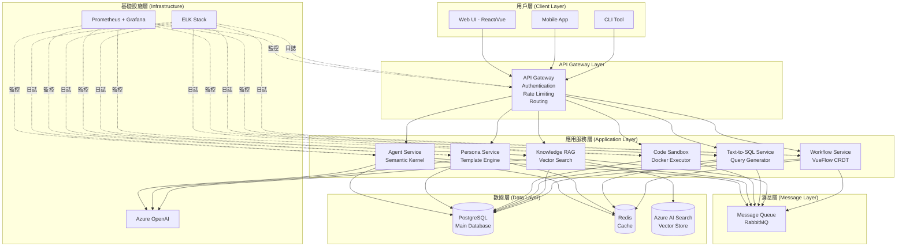
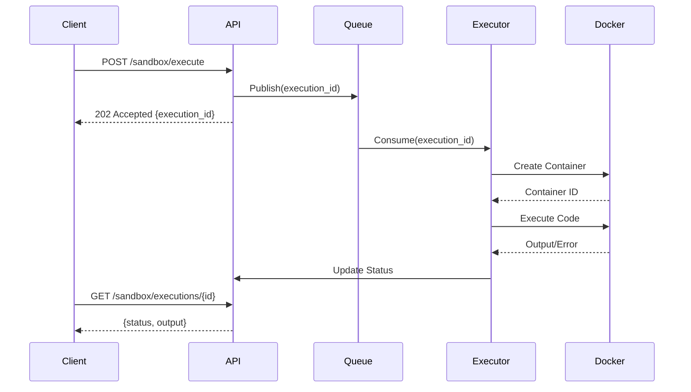

# Part 1: 系統架構設計

**文檔**: Technical Implementation Document - Part 1
**版本**: v1.0.0
**日期**: 2025-10-30
**狀態**: 🚧 撰寫中

---

## 📋 目錄

1. [整體架構概覽](#整體架構概覽)
2. [架構設計原則](#架構設計原則)
3. [系統組件](#系統組件)
4. [服務間通信](#服務間通信)
5. [技術棧選擇](#技術棧選擇)
6. [擴展性設計](#擴展性設計)
7. [高可用性設計](#高可用性設計)

---

## 1. 整體架構概覽

### 1.1 系統願景

AI Workflow Platform 是一個**企業級 AI 工作流編排平台**，整合以下核心能力：

- 🤖 **AI Agent 編排** - 基於 Semantic Kernel 的智能代理系統
- 🎭 **Persona 管理** - 動態 persona 模板生成和一致性驗證
- 💻 **代碼沙箱** - 安全的 Python 代碼執行環境
- 📊 **自然語言查詢** - Text-to-SQL 安全查詢生成
- 📚 **知識檢索** - RAG (Retrieval-Augmented Generation) 知識庫
- 🔀 **工作流編輯器** - 實時協作的可視化工作流設計

### 1.2 高層架構圖



### 1.3 架構層次說明

| 層次 | 職責 | 技術組件 | 說明 |
|------|------|---------|------|
| **用戶層** | 用戶交互界面 | React/Vue, Mobile SDK, CLI | 提供多種訪問方式 |
| **API Gateway** | 統一入口 | Nginx/Kong, OAuth 2.0 | 認證、路由、限流 |
| **應用服務層** | 業務邏輯 | .NET 8, Python 3.11 | 6 個微服務 |
| **消息層** | 異步通信 | RabbitMQ | 服務解耦、削峰填谷 |
| **數據層** | 數據存儲 | PostgreSQL, Redis, Azure AI Search | 持久化 + 緩存 + 向量 |
| **基礎設施層** | 監控運維 | Prometheus, Grafana, ELK | 可觀測性 |

---

## 2. 架構設計原則

### 2.1 核心設計原則

#### 原則 1: 微服務架構 (Microservices)

**理由**:
- 每個 PoC 對應一個獨立服務，職責單一
- 可獨立部署、擴展、升級
- 技術棧異構（.NET + Python）

**實施**:
```yaml
服務劃分:
  - Agent Service (C# .NET 8) - Semantic Kernel 整合
  - Persona Service (C# .NET 8) - Scriban Template + GPT-4 Judge
  - Code Sandbox (C# .NET 8 + Python) - Docker 執行器
  - Text-to-SQL (C# .NET 8) - NL→SQL + 安全驗證
  - Knowledge RAG (C# .NET 8) - Azure AI Search 整合
  - Workflow Service (TypeScript Node.js) - VueFlow + Y.js CRDT
```

#### 原則 2: API-First 設計

**理由**:
- 前後端分離，支持多種客戶端
- 統一接口規範 (OpenAPI 3.0)
- 便於第三方整合

**實施**:
- 所有服務提供 RESTful API
- WebSocket 用於實時功能 (Workflow Editor)
- GraphQL 用於複雜查詢 (可選，MVP 階段暫不實施)

#### 原則 3: 數據隔離與共享平衡

**理由**:
- 每個服務有獨立的數據存儲邏輯
- 通過 API 或消息隊列共享數據
- 避免直接訪問其他服務的數據庫

**實施**:
```yaml
數據所有權:
  - Agent Service: agents, agent_executions
  - Persona Service: personas, templates
  - Code Sandbox: code_executions, sandbox_logs
  - Text-to-SQL: sql_queries, query_results
  - Knowledge RAG: documents, embeddings (Azure AI Search)
  - Workflow Service: workflows, nodes, edges

共享數據:
  - users, roles, permissions (所有服務共享)
  - 通過 API Gateway 統一認證
```

#### 原則 4: 異步優先 (Async-First)

**理由**:
- LLM 調用耗時長 (2-10s)
- 代碼執行可能超時
- 改善用戶體驗

**實施**:
```yaml
同步操作 (< 1s):
  - 查詢列表
  - 獲取狀態
  - 簡單 CRUD

異步操作 (> 1s):
  - Agent 執行
  - Persona 一致性評估
  - 代碼沙箱執行
  - RAG 查詢 + 生成
  - 複雜 SQL 查詢
```

#### 原則 5: 安全多層防護

**理由**:
- Code Sandbox 需要嚴格隔離
- Text-to-SQL 防止注入攻擊
- API 需要認證授權

**實施**:
```yaml
安全層次:
  Layer 1 - Network: API Gateway + Firewall
  Layer 2 - Authentication: OAuth 2.0 + JWT
  Layer 3 - Authorization: RBAC (Role-Based Access Control)
  Layer 4 - Application: Input validation, Output sanitization
  Layer 5 - Data: Encryption at rest + in transit
  Layer 6 - Infrastructure: Docker isolation, Seccomp, AppArmor
```

### 2.2 技術設計原則

#### DDD (Domain-Driven Design)

**領域劃分**:
```yaml
Core Domain (核心領域):
  - Agent Orchestration (代理編排)
  - Workflow Management (工作流管理)

Supporting Domain (支撐領域):
  - Persona Management (角色管理)
  - Knowledge Base (知識庫)

Generic Domain (通用領域):
  - Code Execution (代碼執行)
  - Query Generation (查詢生成)
```

#### CQRS (Command Query Responsibility Segregation)

**應用場景**:
- **Command**: Agent 執行、Workflow 編輯 (寫操作)
- **Query**: 執行歷史查詢、工作流列表 (讀操作)

**實施方式**:
```yaml
Agent Service:
  Command API: POST /api/v1/agents/{id}/execute
  Query API: GET /api/v1/agents/{id}/executions

Workflow Service:
  Command: WebSocket 實時編輯
  Query: GET /api/v1/workflows/{id}
```

#### Event-Driven Architecture

**事件類型**:
```yaml
Domain Events (領域事件):
  - AgentExecutionStarted
  - AgentExecutionCompleted
  - WorkflowNodeAdded
  - PersonaValidated

Integration Events (整合事件):
  - ExecutionResultAvailable (通知其他服務)
  - WorkflowDeployed (觸發 CI/CD)
```

---

## 3. 系統組件

### 3.1 API Gateway

**職責**:
- 統一入口
- 認證授權
- 請求路由
- Rate Limiting
- 請求/響應轉換

**技術選型**:
- **開發環境**: Nginx (簡單輕量)
- **生產環境**: Kong / Azure API Management (企業級功能)

**配置示例**:
```yaml
# nginx.conf (開發環境)
upstream agent_service {
    server agent-service:5001;
}

upstream persona_service {
    server persona-service:5002;
}

server {
    listen 80;

    location /api/v1/agents {
        proxy_pass http://agent_service;
        proxy_set_header Authorization $http_authorization;
    }

    location /api/v1/personas {
        proxy_pass http://persona_service;
        proxy_set_header Authorization $http_authorization;
    }

    # Rate Limiting
    limit_req_zone $binary_remote_addr zone=api_limit:10m rate=100r/s;
    limit_req zone=api_limit burst=200 nodelay;
}
```

**關鍵功能**:

1. **JWT 驗證**
```nginx
location /api/ {
    auth_jwt "API Gateway";
    auth_jwt_key_file /etc/nginx/jwt_key.json;
    proxy_pass http://upstream;
}
```

2. **Rate Limiting 策略**
```yaml
Tiers:
  Free: 100 requests/min
  Pro: 1000 requests/min
  Enterprise: Unlimited

Per-Endpoint Limits:
  /agents/execute: 10 requests/min (resource-intensive)
  /agents: 100 requests/min (normal)
```

3. **CORS 配置**
```nginx
add_header Access-Control-Allow-Origin $allowed_origin;
add_header Access-Control-Allow-Methods "GET, POST, PUT, DELETE, OPTIONS";
add_header Access-Control-Allow-Headers "Authorization, Content-Type";
```

### 3.2 Agent Service (PoC 1)

**職責**:
- 創建和管理 AI Agent
- 執行 Agent 任務
- Plugin 管理
- 執行歷史記錄

**技術棧**:
- .NET 8 (C#)
- Semantic Kernel 1.66.0
- Azure OpenAI
- PostgreSQL

**核心 API**:
```yaml
POST /api/v1/agents:
  描述: 創建新 Agent
  請求: { name, instructions, plugins[] }
  響應: { id, name, status, created_at }

POST /api/v1/agents/{id}/execute:
  描述: 執行 Agent 任務 (異步)
  請求: { input, parameters }
  響應: { execution_id, status, estimated_time }

GET /api/v1/agents/{id}/executions:
  描述: 查詢執行歷史
  響應: { executions[], pagination }

GET /api/v1/agents/{id}/executions/{exec_id}:
  描述: 獲取執行結果
  響應: { status, output, duration, tokens_used }
```

**數據模型**:
```sql
-- agents 表
CREATE TABLE agents (
    id UUID PRIMARY KEY,
    user_id UUID NOT NULL,
    name VARCHAR(255) NOT NULL,
    instructions TEXT,
    model VARCHAR(100) DEFAULT 'gpt-4',
    plugins JSONB,
    created_at TIMESTAMP DEFAULT NOW(),
    updated_at TIMESTAMP DEFAULT NOW()
);

-- agent_executions 表
CREATE TABLE agent_executions (
    id UUID PRIMARY KEY,
    agent_id UUID REFERENCES agents(id),
    input TEXT NOT NULL,
    output TEXT,
    status VARCHAR(50), -- pending, running, completed, failed
    duration_ms INTEGER,
    tokens_used INTEGER,
    error_message TEXT,
    created_at TIMESTAMP DEFAULT NOW(),
    completed_at TIMESTAMP
);
```

**關鍵設計**:

1. **異步執行模式**
```csharp
// AgentExecutionController.cs
[HttpPost("{id}/execute")]
public async Task<IActionResult> ExecuteAgent(Guid id, [FromBody] ExecuteRequest request)
{
    // 創建執行記錄
    var execution = new AgentExecution
    {
        Id = Guid.NewGuid(),
        AgentId = id,
        Input = request.Input,
        Status = ExecutionStatus.Pending
    };
    await _repository.CreateExecutionAsync(execution);

    // 發送到消息隊列 (異步處理)
    await _messageQueue.PublishAsync("agent.execute", new
    {
        ExecutionId = execution.Id,
        AgentId = id,
        Input = request.Input
    });

    // 立即返回 execution_id
    return Accepted(new { execution_id = execution.Id });
}
```

2. **Plugin 動態載入**
```csharp
// PluginLoader.cs
public class PluginLoader
{
    public async Task<KernelPlugin> LoadPluginAsync(AgentPluginConfig config)
    {
        return config.Type switch
        {
            "builtin" => LoadBuiltinPlugin(config.Name),
            "custom" => await LoadCustomPluginAsync(config.Url),
            "openapi" => await LoadOpenApiPluginAsync(config.OpenApiUrl),
            _ => throw new InvalidOperationException($"Unknown plugin type: {config.Type}")
        };
    }
}
```

3. **Token 使用追蹤**
```csharp
// TokenTracker.cs
public class TokenTracker
{
    public async Task TrackUsageAsync(Guid executionId, int tokensUsed, decimal cost)
    {
        await _repository.UpdateExecutionAsync(executionId, new
        {
            TokensUsed = tokensUsed,
            Cost = cost
        });

        // 發送事件到監控系統
        await _metrics.RecordTokenUsage(tokensUsed, cost);
    }
}
```

### 3.3 Persona Service (PoC 2)

**職責**:
- Persona 模板管理
- 動態 Prompt 生成 (Scriban)
- Persona 一致性驗證 (GPT-4 Judge)
- Few-shot 範例管理

**技術棧**:
- .NET 8 (C#)
- Scriban 5.10.0 (Template Engine)
- Newtonsoft.Json.Schema 3.0.15 (Schema Validation)
- Azure OpenAI (GPT-4 Judge)
- PostgreSQL

**核心 API**:
```yaml
POST /api/v1/personas:
  描述: 創建 Persona
  請求: { name, role, personality, few_shot_examples[] }
  響應: { id, name, template, schema_valid }

GET /api/v1/personas/{id}/render:
  描述: 渲染 Persona prompt
  請求: { context_variables }
  響應: { rendered_prompt }

POST /api/v1/personas/{id}/validate:
  描述: 驗證響應一致性 (GPT-4 Judge)
  請求: { responses[] }
  響應: { average_score, reasoning, scores[] }
```

**數據模型**:
```sql
-- personas 表
CREATE TABLE personas (
    id UUID PRIMARY KEY,
    user_id UUID NOT NULL,
    name VARCHAR(255) NOT NULL,
    role VARCHAR(255),
    personality JSONB, -- { tone, traits[], style }
    few_shot_examples JSONB,
    template TEXT, -- Scriban template
    created_at TIMESTAMP DEFAULT NOW()
);

-- persona_validations 表
CREATE TABLE persona_validations (
    id UUID PRIMARY KEY,
    persona_id UUID REFERENCES personas(id),
    responses JSONB,
    average_score DECIMAL(3,2),
    reasoning TEXT,
    created_at TIMESTAMP DEFAULT NOW()
);
```

**Scriban Template 示例**:
```liquid
You are {{ name }}, a {{ role }}.

## Personality
- Tone: {{ personality.tone }}
- Traits: {{ personality.traits | array.join ', ' }}
- Communication Style: {{ personality.style }}

{{ if few_shot_examples }}
## Example Interactions
{{ for example in few_shot_examples }}
**User**: {{ example.user_input }}
**{{ name }}**: {{ example.assistant_response }}

{{ end }}
{{ end }}

## Instructions
{{ instructions }}
```

**GPT-4 Judge 實現**:
```csharp
// PersonaConsistencyValidator.cs
public async Task<ValidationResult> ValidateConsistencyAsync(
    Persona persona,
    List<string> responses)
{
    var judgePrompt = $@"
You are evaluating AI responses for consistency with this persona:
Name: {persona.Name}
Role: {persona.Role}
Personality: {JsonSerializer.Serialize(persona.Personality)}

Evaluate these responses for consistency (0-10 scale):
{string.Join("\n", responses.Select((r, i) => $"{i+1}. {r}"))}

**Output Format (JSON only)**:
{{
  ""scores"": [score1, score2, ...],
  ""average"": average_score,
  ""reasoning"": ""brief explanation""
}}
";

    var result = await _openAIClient.GetChatCompletionAsync(judgePrompt);
    return JsonSerializer.Deserialize<ValidationResult>(result);
}
```

### 3.4 Code Sandbox Service (PoC 3)

**職責**:
- 安全執行 Python 代碼
- Docker 容器管理
- 資源限制 (CPU, Memory, Timeout)
- 執行日誌記錄

**技術棧**:
- .NET 8 (C#)
- Docker.DotNet 3.125.15
- Python 3.11 (Docker Container)
- PostgreSQL

**核心 API**:
```yaml
POST /api/v1/sandbox/execute:
  描述: 執行 Python 代碼 (異步)
  請求: { code, timeout_seconds, language }
  響應: { execution_id, status }

GET /api/v1/sandbox/executions/{id}:
  描述: 獲取執行結果
  響應: { status, output, error, duration_ms }

GET /api/v1/sandbox/health:
  描述: 檢查容器健康狀態
  響應: { container_running, cpu_usage, memory_usage }
```

**安全架構** (4-Layer Defense):
```yaml
Layer 1 - Network Isolation:
  network_mode: "none"  # 完全隔離網絡

Layer 2 - Resource Limits:
  cpus: '1.0'
  memory: 512M

Layer 3 - Filesystem Protection:
  read_only: true
  tmpfs:
    - /tmp:size=100M,mode=1777,noexec
    - /workspace:size=50M,mode=1777

Layer 4 - Security Options:
  security_opt:
    - no-new-privileges:true
    - seccomp:/path/to/custom-seccomp.json  # ← TID 階段設計
  user: "1000:1000"  # 非 root 用戶
  privileged: false
```

**Seccomp Profile 設計** (TID 階段新增):
```json
{
  "defaultAction": "SCMP_ACT_ERRNO",
  "architectures": ["SCMP_ARCH_X86_64"],
  "syscalls": [
    {
      "names": [
        "read", "write", "open", "close", "stat", "fstat",
        "lstat", "poll", "lseek", "mmap", "mprotect", "munmap",
        "brk", "rt_sigaction", "rt_sigprocmask", "ioctl",
        "access", "pipe", "select", "sched_yield", "mremap",
        "dup", "dup2", "pause", "nanosleep", "getitimer",
        "setitimer", "getpid", "socket", "connect", "accept",
        "sendto", "recvfrom", "sendmsg", "recvmsg", "shutdown",
        "bind", "listen", "getsockname", "getpeername", "socketpair",
        "setsockopt", "getsockopt", "clone", "fork", "vfork",
        "execve", "exit", "wait4", "kill", "uname", "fcntl",
        "flock", "fsync", "fdatasync", "truncate", "ftruncate",
        "getcwd", "chdir", "rename", "mkdir", "rmdir", "creat",
        "link", "unlink", "symlink", "readlink", "chmod", "fchmod",
        "chown", "fchown", "lchown", "umask", "gettimeofday",
        "getrlimit", "getrusage", "sysinfo", "times", "getuid",
        "getgid", "setuid", "setgid", "geteuid", "getegid",
        "getppid", "getpgrp", "setsid", "setreuid", "setregid",
        "getgroups", "setgroups", "setresuid", "getresuid",
        "setresgid", "getresgid", "getpgid", "setfsuid", "setfsgid",
        "sigpending", "sigaltstack", "rt_sigsuspend", "rt_sigtimedwait",
        "rt_sigqueueinfo", "rt_sigreturn", "personality", "statfs",
        "fstatfs", "getpriority", "setpriority", "sched_getscheduler",
        "sched_setscheduler", "sched_getparam", "sched_setparam",
        "sched_get_priority_max", "sched_get_priority_min",
        "sched_rr_get_interval", "mlock", "munlock", "mlockall",
        "munlockall", "prctl", "arch_prctl", "setrlimit", "chroot",
        "sync", "acct", "settimeofday", "mount", "umount2",
        "swapon", "swapoff", "reboot", "sethostname", "setdomainname",
        "iopl", "ioperm", "init_module", "delete_module", "quotactl",
        "gettid", "readahead", "setxattr", "lsetxattr", "fsetxattr",
        "getxattr", "lgetxattr", "fgetxattr", "listxattr", "llistxattr",
        "flistxattr", "removexattr", "lremovexattr", "fremovexattr",
        "tkill", "time", "futex", "sched_setaffinity", "sched_getaffinity",
        "io_setup", "io_destroy", "io_getevents", "io_submit", "io_cancel",
        "lookup_dcookie", "epoll_create", "remap_file_pages", "getdents64",
        "set_tid_address", "restart_syscall", "semtimedop", "fadvise64",
        "timer_create", "timer_settime", "timer_gettime", "timer_getoverrun",
        "timer_delete", "clock_settime", "clock_gettime", "clock_getres",
        "clock_nanosleep", "exit_group", "epoll_wait", "epoll_ctl",
        "tgkill", "utimes", "mbind", "set_mempolicy", "get_mempolicy",
        "mq_open", "mq_unlink", "mq_timedsend", "mq_timedreceive",
        "mq_notify", "mq_getsetattr", "waitid", "add_key", "request_key",
        "keyctl", "ioprio_set", "ioprio_get", "inotify_init",
        "inotify_add_watch", "inotify_rm_watch", "openat", "mkdirat",
        "mknodat", "fchownat", "futimesat", "newfstatat", "unlinkat",
        "renameat", "linkat", "symlinkat", "readlinkat", "fchmodat",
        "faccessat", "pselect6", "ppoll", "unshare", "set_robust_list",
        "get_robust_list", "splice", "tee", "sync_file_range",
        "vmsplice", "move_pages", "utimensat", "epoll_pwait",
        "signalfd", "timerfd_create", "eventfd", "fallocate",
        "timerfd_settime", "timerfd_gettime", "accept4", "signalfd4",
        "eventfd2", "epoll_create1", "dup3", "pipe2", "inotify_init1",
        "preadv", "pwritev", "rt_tgsigqueueinfo", "perf_event_open",
        "recvmmsg", "fanotify_init", "fanotify_mark", "prlimit64",
        "name_to_handle_at", "open_by_handle_at", "clock_adjtime",
        "syncfs", "sendmmsg", "setns", "getcpu", "process_vm_readv",
        "process_vm_writev", "kcmp", "finit_module", "sched_setattr",
        "sched_getattr", "renameat2", "seccomp", "getrandom",
        "memfd_create", "kexec_file_load", "bpf"
      ],
      "action": "SCMP_ACT_ALLOW"
    },
    {
      "names": [
        "ptrace", "reboot", "swapon", "swapoff",
        "mount", "umount2", "pivot_root", "chroot"
      ],
      "action": "SCMP_ACT_ERRNO"
    }
  ]
}
```

**執行流程**:


---

## 4. 服務間通信

### 4.1 同步通信 (RESTful API)

**使用場景**:
- 查詢操作 (GET)
- 需要立即響應的操作
- 簡單 CRUD

**通信協議**: HTTP/1.1 (開發), HTTP/2 (生產)

**負載均衡**: Round-robin (Nginx)

**重試策略**:
```yaml
Max Retries: 3
Backoff: Exponential (1s, 2s, 4s)
Timeout: 30s
Circuit Breaker: 50% error rate → Open for 60s
```

### 4.2 異步通信 (Message Queue)

**使用場景**:
- 長時間運行的任務
- 需要解耦的操作
- Event-driven 通信

**消息隊列**: RabbitMQ 3.x

**Exchange 設計**:
```yaml
agent.execute (Direct Exchange):
  Queue: agent.execution.queue
  Consumer: Agent Service Executor

persona.validate (Direct Exchange):
  Queue: persona.validation.queue
  Consumer: Persona Service Validator

code.execute (Direct Exchange):
  Queue: code.execution.queue
  Consumer: Code Sandbox Executor

events (Topic Exchange):
  Pattern: *.completed
  Subscribers:
    - Notification Service
    - Audit Service
    - Analytics Service
```

**消息格式**:
```json
{
  "message_id": "uuid",
  "timestamp": "2025-10-30T14:00:00Z",
  "event_type": "agent.execution.started",
  "payload": {
    "execution_id": "uuid",
    "agent_id": "uuid",
    "user_id": "uuid"
  },
  "metadata": {
    "source": "agent-service",
    "version": "1.0.0"
  }
}
```

### 4.3 實時通信 (WebSocket)

**使用場景**:
- Workflow Editor 實時協作
- 執行狀態即時推送
- 通知推送

**WebSocket Server**: Node.js (Workflow Service)

**連接管理**:
```typescript
// WebSocketManager.ts
export class WebSocketManager {
  private rooms: Map<string, Set<WebSocket>>;

  public joinRoom(ws: WebSocket, roomId: string) {
    if (!this.rooms.has(roomId)) {
      this.rooms.set(roomId, new Set());
    }
    this.rooms.get(roomId)!.add(ws);
  }

  public broadcastToRoom(roomId: string, message: any) {
    const room = this.rooms.get(roomId);
    if (!room) return;

    room.forEach(ws => {
      if (ws.readyState === WebSocket.OPEN) {
        ws.send(JSON.stringify(message));
      }
    });
  }
}
```

---

## 5. 技術棧選擇

### 5.1 後端技術棧

| 組件 | 技術選擇 | 版本 | 理由 |
|------|---------|------|------|
| **Agent Service** | .NET 8 (C#) | 8.0 | Semantic Kernel 原生支持 |
| **Persona Service** | .NET 8 (C#) | 8.0 | Scriban 整合方便 |
| **Code Sandbox** | .NET 8 + Python | 8.0 + 3.11 | Docker.DotNet 管理容器 |
| **Text-to-SQL** | .NET 8 (C#) | 8.0 | Npgsql 高性能 |
| **Knowledge RAG** | .NET 8 (C#) | 8.0 | Azure SDK 整合 |
| **Workflow Service** | Node.js (TypeScript) | 20 LTS | Y.js CRDT 原生支持 |

### 5.2 數據存儲技術棧

| 組件 | 技術選擇 | 版本 | 用途 |
|------|---------|------|------|
| **主數據庫** | PostgreSQL | 16 | 關係型數據、JSON 支持 |
| **緩存** | Redis | 7 | Session, Template cache |
| **向量存儲** | Azure AI Search | Latest | RAG embedding 檢索 |
| **對象存儲** | Azure Blob Storage | Latest | 文件、日誌存儲 |

### 5.3 基礎設施技術棧

| 組件 | 技術選擇 | 理由 |
|------|---------|------|
| **容器化** | Docker 24.x | 標準化部署 |
| **編排** | Kubernetes 1.28+ | 生產環境編排 |
| **API Gateway** | Nginx / Kong | 輕量 / 企業級 |
| **Message Queue** | RabbitMQ 3.x | 簡單可靠 |
| **Monitoring** | Prometheus + Grafana | 開源標準 |
| **Logging** | ELK Stack | 日誌聚合分析 |
| **CI/CD** | GitHub Actions | 免費整合方便 |

### 5.4 前端技術棧 (可選，MVP 階段)

| 組件 | 技術選擇 | 理由 |
|------|---------|------|
| **Framework** | Vue 3 / React 18 | 成熟生態 |
| **UI Library** | Ant Design / Material-UI | 企業級組件 |
| **Workflow Editor** | VueFlow 1.39.0 | 拖拽式編輯 |
| **State Management** | Pinia / Zustand | 輕量狀態管理 |
| **HTTP Client** | Axios | 標準 HTTP 庫 |

---

## 6. 擴展性設計

### 6.1 水平擴展 (Horizontal Scaling)

**無狀態服務設計**:
```yaml
Stateless Services (可任意擴展):
  - Agent Service (多實例)
  - Persona Service (多實例)
  - Text-to-SQL Service (多實例)
  - Knowledge RAG Service (多實例)

Stateful Services (需特殊處理):
  - Workflow Service (WebSocket sticky session)
  - Code Sandbox (容器池管理)
```

**負載均衡策略**:
```yaml
Agent Service:
  Algorithm: Round-robin
  Health Check: GET /health (每 10s)

Workflow Service (WebSocket):
  Algorithm: IP Hash (sticky session)
  Failover: Reconnect to another instance
```

**擴展觸發條件**:
```yaml
Auto-scaling Rules:
  - CPU > 70% for 5 min → Scale up
  - Memory > 80% for 5 min → Scale up
  - Request queue > 1000 → Scale up
  - CPU < 30% for 10 min → Scale down
```

### 6.2 垂直擴展 (Vertical Scaling)

**資源配額**:
```yaml
Agent Service:
  CPU: 2 cores (min) → 8 cores (max)
  Memory: 4GB (min) → 16GB (max)

Code Sandbox:
  CPU: 4 cores (容器池)
  Memory: 8GB (容器池)

PostgreSQL:
  CPU: 4 cores
  Memory: 16GB
  Storage: 500GB SSD
```

### 6.3 數據庫擴展

**讀寫分離**:
```yaml
Primary (Write):
  - All write operations
  - Real-time queries

Replica (Read):
  - Analytics queries
  - Report generation
  - Dashboard queries
```

**分片策略** (未來):
```yaml
Sharding Key: user_id
Shards:
  - Shard 1: user_id % 4 == 0
  - Shard 2: user_id % 4 == 1
  - Shard 3: user_id % 4 == 2
  - Shard 4: user_id % 4 == 3
```

---

## 7. 高可用性設計

### 7.1 故障轉移 (Failover)

**服務層 HA**:
```yaml
Configuration:
  Min Replicas: 2 (每個服務)
  Health Check: HTTP /health endpoint
  Readiness Probe: 初始 10s, 間隔 5s
  Liveness Probe: 初始 30s, 間隔 10s

Failover:
  Detection Time: < 10s
  Recovery Time: < 30s (自動重啟 pod)
```

**數據層 HA**:
```yaml
PostgreSQL:
  Primary-Replica Setup
  Automatic Failover: Patroni + etcd
  RPO (Recovery Point Objective): < 1 min
  RTO (Recovery Time Objective): < 5 min

Redis:
  Master-Slave Setup
  Sentinel for automatic failover
  RPO: < 10s
  RTO: < 1 min
```

### 7.2 降級策略 (Degradation)

**服務降級**:
```yaml
Agent Service:
  Level 1 (輕微): 停用 plugin 調用
  Level 2 (中度): 使用緩存結果
  Level 3 (嚴重): 返回 503 Service Unavailable

Persona Service:
  Level 1: 跳過 GPT-4 Judge 驗證
  Level 2: 使用預渲染模板
  Level 3: 返回基礎模板

Code Sandbox:
  Level 1: 增加執行超時時間
  Level 2: 限制併發執行數
  Level 3: 停止接受新請求
```

### 7.3 熔斷器 (Circuit Breaker)

**實施方式**:
```csharp
// CircuitBreakerPolicy.cs
public class CircuitBreakerPolicy
{
    public async Task<T> ExecuteAsync<T>(Func<Task<T>> action)
    {
        return await Policy
            .Handle<HttpRequestException>()
            .Or<TaskCanceledException>()
            .CircuitBreakerAsync(
                exceptionsAllowedBeforeBreaking: 5,
                durationOfBreak: TimeSpan.FromMinutes(1),
                onBreak: (ex, duration) =>
                {
                    _logger.LogError("Circuit breaker opened for {duration}", duration);
                },
                onReset: () =>
                {
                    _logger.LogInformation("Circuit breaker reset");
                }
            )
            .ExecuteAsync(action);
    }
}
```

---

## 8. 總結

### 8.1 架構優勢

1. **微服務架構**: 獨立部署、擴展、升級
2. **異步優先**: 改善用戶體驗，系統解耦
3. **多層安全**: API Gateway + 應用層 + 數據層 + 基礎設施
4. **高可用性**: 自動故障轉移，服務降級
5. **可擴展性**: 水平 + 垂直擴展，數據庫讀寫分離

### 8.2 技術風險

| 風險 | 等級 | 緩解措施 |
|------|------|---------|
| Azure OpenAI Rate Limit | MEDIUM | 實施 Rate Limiting + Caching |
| Docker 容器逃逸 | LOW | Seccomp + AppArmor 強化 |
| WebSocket 連接穩定性 | MEDIUM | 自動重連 + Session 恢復 |
| PostgreSQL 性能瓶頸 | LOW | 讀寫分離 + Connection Pooling |

### 8.3 下一步

- ✅ Part 1 完成: 系統架構設計
- ⏭️ Part 2 待續: API 規格設計 (OpenAPI/Swagger)

---

**文檔版本**: v1.0.0
**完成日期**: 2025-10-30
**審查狀態**: 待審查
**下一個文檔**: [02-MICROSERVICES-DESIGN.md](./02-MICROSERVICES-DESIGN.md)
