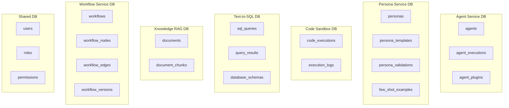
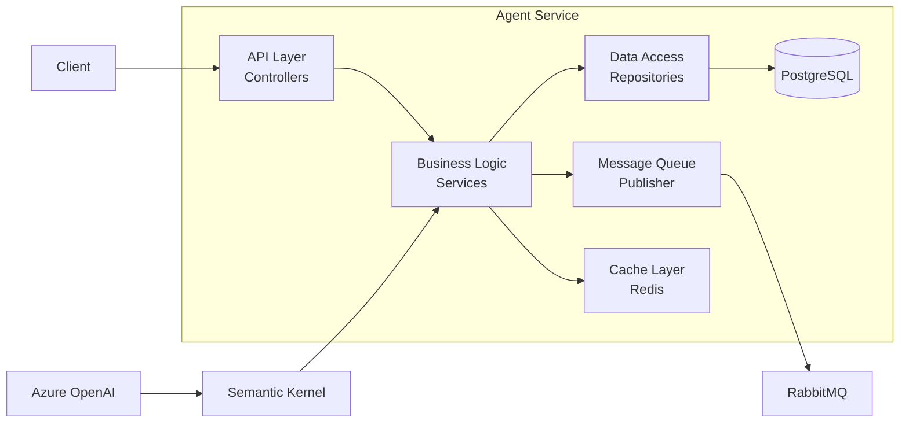
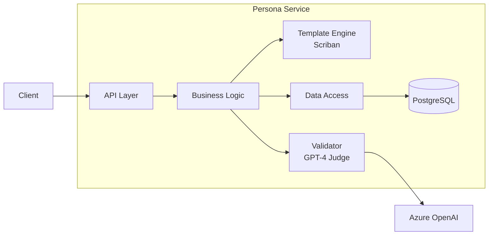
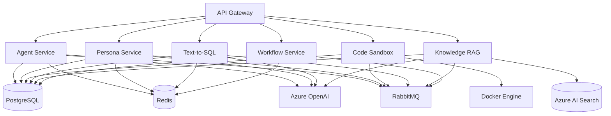

# Part 1.2: 微服務詳細設計

**文檔**: Technical Implementation Document - Part 1.2
**版本**: v1.0.0
**日期**: 2025-10-30
**狀態**: 🚧 撰寫中

---

## 📋 目錄

1. [微服務設計原則](#微服務設計原則)
2. [服務詳細設計](#服務詳細設計)
3. [服務依賴關係](#服務依賴關係)
4. [服務發現與註冊](#服務發現與註冊)
5. [服務間認證](#服務間認證)
6. [服務版本管理](#服務版本管理)

---

## 1. 微服務設計原則

### 1.1 服務邊界劃分

**按業務能力劃分**:
```yaml
Agent Service:
  職責: AI Agent 生命週期管理
  邊界: Agent CRUD + Execution + Plugin Management
  不包含: Persona 管理, 代碼執行, SQL 生成

Persona Service:
  職責: Persona 模板管理
  邊界: Template Rendering + Validation + Few-shot Management
  不包含: Agent 執行邏輯

Code Sandbox Service:
  職責: 安全代碼執行
  邊界: Docker 容器管理 + 代碼執行 + 安全隔離
  不包含: 業務邏輯處理

Text-to-SQL Service:
  職責: 自然語言轉 SQL
  邊界: Query Generation + Validation + Execution
  不包含: 通用數據庫管理

Knowledge RAG Service:
  職責: 知識檢索增強生成
  邊界: Document Management + Embedding + Vector Search + RAG
  不包含: 通用文件存儲

Workflow Service:
  職責: 工作流編排和實時協作
  邊界: Workflow CRUD + Real-time Collaboration + Version Control
  不包含: 具體任務執行邏輯
```

### 1.2 數據所有權

**每個服務擁有自己的數據**:


**共享數據訪問規則**:
```yaml
共享表 (users, roles, permissions):
  寫入: 僅 Auth Service
  讀取: 所有服務 (通過 API Gateway JWT)

跨服務數據訪問:
  方式 1: REST API 調用 (同步)
  方式 2: Event Broadcasting (異步)
  禁止: 直接訪問其他服務的數據庫表
```

### 1.3 服務間通信模式

**同步 vs 異步**:
```yaml
同步通信 (HTTP/REST):
  適用場景:
    - 需要立即響應 (< 1s)
    - 簡單查詢操作
    - 事務性操作

  範例:
    - GET /api/v1/agents/{id}
    - GET /api/v1/personas/{id}/render
    - GET /api/v1/workflows/{id}

異步通信 (Message Queue):
  適用場景:
    - 長時間運行任務 (> 1s)
    - 解耦服務依賴
    - Event-driven 流程

  範例:
    - POST /api/v1/agents/{id}/execute → MQ
    - POST /api/v1/sandbox/execute → MQ
    - POST /api/v1/personas/{id}/validate → MQ

實時通信 (WebSocket):
  適用場景:
    - 實時協作
    - 狀態推送
    - 通知系統

  範例:
    - Workflow Editor 多人協作
    - Agent 執行進度推送
```

---

## 2. 服務詳細設計

### 2.1 Agent Service 詳細設計

#### 2.1.1 服務架構



#### 2.1.2 核心組件

**1. AgentController (API Layer)**
```csharp
[ApiController]
[Route("api/v1/[controller]")]
[Authorize] // JWT 認證
public class AgentsController : ControllerBase
{
    private readonly IAgentService _agentService;
    private readonly ILogger<AgentsController> _logger;

    // GET /api/v1/agents
    [HttpGet]
    [ProducesResponseType(typeof(PagedResult<AgentDto>), 200)]
    public async Task<IActionResult> GetAgents(
        [FromQuery] int page = 1,
        [FromQuery] int pageSize = 20)
    {
        var userId = User.GetUserId();
        var result = await _agentService.GetAgentsAsync(userId, page, pageSize);
        return Ok(result);
    }

    // POST /api/v1/agents
    [HttpPost]
    [ProducesResponseType(typeof(AgentDto), 201)]
    public async Task<IActionResult> CreateAgent([FromBody] CreateAgentRequest request)
    {
        var userId = User.GetUserId();
        var agent = await _agentService.CreateAgentAsync(userId, request);
        return CreatedAtAction(nameof(GetAgent), new { id = agent.Id }, agent);
    }

    // POST /api/v1/agents/{id}/execute (異步)
    [HttpPost("{id}/execute")]
    [ProducesResponseType(typeof(ExecutionResponse), 202)]
    public async Task<IActionResult> ExecuteAgent(
        Guid id,
        [FromBody] ExecuteAgentRequest request)
    {
        var userId = User.GetUserId();
        var executionId = await _agentService.ExecuteAgentAsync(id, userId, request);
        return Accepted(new ExecutionResponse { ExecutionId = executionId });
    }

    // GET /api/v1/agents/{id}/executions/{executionId}
    [HttpGet("{id}/executions/{executionId}")]
    [ProducesResponseType(typeof(ExecutionResultDto), 200)]
    public async Task<IActionResult> GetExecutionResult(
        Guid id,
        Guid executionId)
    {
        var result = await _agentService.GetExecutionResultAsync(executionId);
        return Ok(result);
    }
}
```

**2. AgentService (Business Logic)**
```csharp
public class AgentService : IAgentService
{
    private readonly IAgentRepository _repository;
    private readonly IMessagePublisher _messagePublisher;
    private readonly ICache _cache;
    private readonly ILogger<AgentService> _logger;

    public async Task<Guid> ExecuteAgentAsync(
        Guid agentId,
        Guid userId,
        ExecuteAgentRequest request)
    {
        // 1. 驗證 agent 存在且屬於該用戶
        var agent = await _repository.GetAgentAsync(agentId);
        if (agent == null || agent.UserId != userId)
            throw new NotFoundException("Agent not found");

        // 2. 創建執行記錄
        var execution = new AgentExecution
        {
            Id = Guid.NewGuid(),
            AgentId = agentId,
            UserId = userId,
            Input = request.Input,
            Parameters = request.Parameters,
            Status = ExecutionStatus.Pending,
            CreatedAt = DateTime.UtcNow
        };
        await _repository.CreateExecutionAsync(execution);

        // 3. 發送到消息隊列 (異步處理)
        await _messagePublisher.PublishAsync("agent.execute", new
        {
            ExecutionId = execution.Id,
            AgentId = agentId,
            Input = request.Input,
            Parameters = request.Parameters
        });

        _logger.LogInformation(
            "Agent execution {ExecutionId} queued for agent {AgentId}",
            execution.Id,
            agentId);

        return execution.Id;
    }

    // 從緩存或數據庫獲取執行結果
    public async Task<ExecutionResultDto> GetExecutionResultAsync(Guid executionId)
    {
        // 1. 嘗試從緩存獲取
        var cacheKey = $"execution:{executionId}";
        var cached = await _cache.GetAsync<ExecutionResultDto>(cacheKey);
        if (cached != null)
            return cached;

        // 2. 從數據庫獲取
        var execution = await _repository.GetExecutionAsync(executionId);
        if (execution == null)
            throw new NotFoundException("Execution not found");

        var result = MapToDto(execution);

        // 3. 如果已完成，緩存結果 (1小時)
        if (execution.Status == ExecutionStatus.Completed ||
            execution.Status == ExecutionStatus.Failed)
        {
            await _cache.SetAsync(cacheKey, result, TimeSpan.FromHours(1));
        }

        return result;
    }
}
```

**3. AgentExecutor (Background Worker)**
```csharp
public class AgentExecutor : BackgroundService
{
    private readonly IMessageConsumer _consumer;
    private readonly IAgentRepository _repository;
    private readonly IKernelFactory _kernelFactory;
    private readonly ILogger<AgentExecutor> _logger;

    protected override async Task ExecuteAsync(CancellationToken stoppingToken)
    {
        await _consumer.ConsumeAsync<AgentExecutionMessage>(
            "agent.execute.queue",
            async message =>
            {
                await ProcessExecutionAsync(message);
            },
            stoppingToken);
    }

    private async Task ProcessExecutionAsync(AgentExecutionMessage message)
    {
        var sw = Stopwatch.StartNew();

        try
        {
            // 1. 更新狀態為 Running
            await _repository.UpdateExecutionStatusAsync(
                message.ExecutionId,
                ExecutionStatus.Running);

            // 2. 獲取 Agent 配置
            var agent = await _repository.GetAgentAsync(message.AgentId);

            // 3. 創建 Semantic Kernel 實例
            var kernel = await _kernelFactory.CreateKernelAsync(agent);

            // 4. 載入 Plugins
            foreach (var plugin in agent.Plugins)
            {
                await kernel.ImportPluginAsync(plugin);
            }

            // 5. 創建 Agent
            var chatAgent = new ChatCompletionAgent
            {
                Name = agent.Name,
                Instructions = agent.Instructions,
                Kernel = kernel,
                Arguments = new KernelArguments(new OpenAIPromptExecutionSettings
                {
                    FunctionChoiceBehavior = FunctionChoiceBehavior.Auto(),
                    Temperature = agent.Temperature ?? 0.7,
                    MaxTokens = agent.MaxTokens ?? 2000
                })
            };

            // 6. 執行 Agent
            var result = await chatAgent.InvokeAsync(message.Input);

            sw.Stop();

            // 7. 保存結果
            await _repository.UpdateExecutionAsync(message.ExecutionId, new
            {
                Output = result.Content,
                Status = ExecutionStatus.Completed,
                DurationMs = sw.ElapsedMilliseconds,
                TokensUsed = result.Metadata?.TokenUsage?.TotalTokens ?? 0,
                CompletedAt = DateTime.UtcNow
            });

            _logger.LogInformation(
                "Agent execution {ExecutionId} completed in {Duration}ms",
                message.ExecutionId,
                sw.ElapsedMilliseconds);
        }
        catch (Exception ex)
        {
            sw.Stop();

            _logger.LogError(ex,
                "Agent execution {ExecutionId} failed",
                message.ExecutionId);

            await _repository.UpdateExecutionAsync(message.ExecutionId, new
            {
                Status = ExecutionStatus.Failed,
                ErrorMessage = ex.Message,
                DurationMs = sw.ElapsedMilliseconds,
                CompletedAt = DateTime.UtcNow
            });
        }
    }
}
```

#### 2.1.3 數據模型

```csharp
// Domain Models
public class Agent
{
    public Guid Id { get; set; }
    public Guid UserId { get; set; }
    public string Name { get; set; } = string.Empty;
    public string Instructions { get; set; } = string.Empty;
    public string Model { get; set; } = "gpt-4";
    public double? Temperature { get; set; }
    public int? MaxTokens { get; set; }
    public List<AgentPlugin> Plugins { get; set; } = new();
    public DateTime CreatedAt { get; set; }
    public DateTime UpdatedAt { get; set; }
}

public class AgentExecution
{
    public Guid Id { get; set; }
    public Guid AgentId { get; set; }
    public Guid UserId { get; set; }
    public string Input { get; set; } = string.Empty;
    public string? Output { get; set; }
    public ExecutionStatus Status { get; set; }
    public int? DurationMs { get; set; }
    public int? TokensUsed { get; set; }
    public string? ErrorMessage { get; set; }
    public Dictionary<string, object>? Parameters { get; set; }
    public DateTime CreatedAt { get; set; }
    public DateTime? CompletedAt { get; set; }
}

public enum ExecutionStatus
{
    Pending,
    Running,
    Completed,
    Failed,
    Cancelled
}
```

#### 2.1.4 配置管理

```yaml
# appsettings.json
{
  "AgentService": {
    "Azure": {
      "OpenAI": {
        "Endpoint": "https://openai-rci3ai-uat.openai.azure.com/",
        "ApiKey": "***",
        "DeploymentName": "gpt-5-chat",
        "ApiVersion": "2024-12-01-preview"
      }
    },
    "Execution": {
      "DefaultTimeout": 300,
      "MaxConcurrentExecutions": 10,
      "RetryPolicy": {
        "MaxRetries": 3,
        "BackoffMultiplier": 2
      }
    },
    "Cache": {
      "Redis": {
        "ConnectionString": "localhost:6379",
        "DefaultExpiration": "01:00:00"
      }
    }
  }
}
```

---

### 2.2 Persona Service 詳細設計

#### 2.2.1 服務架構



#### 2.2.2 核心組件

**1. Template Rendering Engine**
```csharp
public class PersonaTemplateEngine
{
    private readonly ITemplateCache _cache;

    public async Task<string> RenderAsync(
        Persona persona,
        Dictionary<string, object> variables)
    {
        // 1. 獲取或編譯模板
        var template = await GetCompiledTemplateAsync(persona.Template);

        // 2. 準備上下文
        var context = new TemplateContext
        {
            MemberRenamer = member => member.Name
        };

        // 3. 注入變量
        var scriptObject = new ScriptObject();
        scriptObject.Import(new
        {
            name = persona.Name,
            role = persona.Role,
            personality = persona.Personality,
            few_shot_examples = persona.FewShotExamples
        });

        foreach (var (key, value) in variables)
        {
            scriptObject[key] = value;
        }

        context.PushGlobal(scriptObject);

        // 4. 渲染模板
        var result = await template.RenderAsync(context);

        return result;
    }

    private async Task<Template> GetCompiledTemplateAsync(string templateSource)
    {
        var cacheKey = $"template:{templateSource.GetHashCode()}";

        return await _cache.GetOrCreateAsync(cacheKey, async () =>
        {
            return Template.Parse(templateSource);
        });
    }
}
```

**2. Persona Consistency Validator (GPT-4 Judge)**
```csharp
public class PersonaConsistencyValidator
{
    private readonly IAzureOpenAIClient _openAIClient;
    private readonly ILogger<PersonaConsistencyValidator> _logger;

    public async Task<ValidationResult> ValidateAsync(
        Persona persona,
        List<string> responses)
    {
        var judgePrompt = BuildJudgePrompt(persona, responses);

        var result = await _openAIClient.GetChatCompletionAsync(
            new ChatCompletionRequest
            {
                Messages = new[]
                {
                    new ChatMessage("system", "You are an AI evaluator."),
                    new ChatMessage("user", judgePrompt)
                },
                Temperature = 0.3, // 低溫度保證穩定性
                ResponseFormat = new { type = "json_object" } // 強制 JSON 輸出
            });

        // 解析 JSON 結果
        var validation = JsonSerializer.Deserialize<ValidationResult>(
            result.Content,
            new JsonSerializerOptions { PropertyNameCaseInsensitive = true });

        return validation ?? throw new InvalidOperationException(
            "Failed to parse validation result");
    }

    private string BuildJudgePrompt(Persona persona, List<string> responses)
    {
        return $@"
Evaluate these AI responses for consistency with the following persona:

**Persona Definition:**
- Name: {persona.Name}
- Role: {persona.Role}
- Personality: {JsonSerializer.Serialize(persona.Personality)}

**Responses to Evaluate:**
{string.Join("\n", responses.Select((r, i) => $"{i + 1}. {r}"))}

**Evaluation Criteria:**
1. Tone consistency (0-10)
2. Role adherence (0-10)
3. Personality trait alignment (0-10)

**Output Format (JSON only):**
{{
  ""scores"": [score1, score2, score3, ...],
  ""average"": average_score,
  ""reasoning"": ""brief explanation of the scores""
}}
";
    }
}
```

#### 2.2.3 Schema Validation

```csharp
public class PersonaSchemaValidator
{
    private static readonly JSchema PersonaSchema = JSchema.Parse(@"
{
  ""type"": ""object"",
  ""required"": [""name"", ""role"", ""personality""],
  ""properties"": {
    ""name"": { ""type"": ""string"", ""minLength"": 1 },
    ""role"": { ""type"": ""string"", ""minLength"": 1 },
    ""personality"": {
      ""type"": ""object"",
      ""required"": [""tone"", ""traits""],
      ""properties"": {
        ""tone"": { ""type"": ""string"" },
        ""traits"": {
          ""type"": ""array"",
          ""items"": { ""type"": ""string"" },
          ""minItems"": 1
        },
        ""style"": { ""type"": ""string"" }
      }
    },
    ""few_shot_examples"": {
      ""type"": ""array"",
      ""items"": {
        ""type"": ""object"",
        ""required"": [""user_input"", ""assistant_response""],
        ""properties"": {
          ""user_input"": { ""type"": ""string"" },
          ""assistant_response"": { ""type"": ""string"" }
        }
      }
    }
  }
}
");

    public ValidationResult Validate(PersonaConfig config)
    {
        var json = JObject.FromObject(config);
        bool isValid = json.IsValid(PersonaSchema, out IList<ValidationError> errors);

        return new ValidationResult
        {
            IsValid = isValid,
            Errors = errors.Select(e => e.Message).ToList()
        };
    }
}
```

---

### 2.3 Code Sandbox Service 詳細設計

#### 2.3.1 容器池管理

```csharp
public class DockerContainerPool
{
    private readonly IDockerClient _dockerClient;
    private readonly SemaphoreSlim _poolSemaphore;
    private readonly Queue<string> _availableContainers;
    private readonly ILogger<DockerContainerPool> _logger;

    private const int MaxPoolSize = 10;
    private const int MinPoolSize = 2;

    public DockerContainerPool(IDockerClient dockerClient)
    {
        _dockerClient = dockerClient;
        _poolSemaphore = new SemaphoreSlim(MaxPoolSize);
        _availableContainers = new Queue<string>();
    }

    public async Task InitializePoolAsync()
    {
        for (int i = 0; i < MinPoolSize; i++)
        {
            var containerId = await CreateContainerAsync();
            _availableContainers.Enqueue(containerId);
        }

        _logger.LogInformation("Container pool initialized with {Count} containers", MinPoolSize);
    }

    public async Task<string> AcquireContainerAsync()
    {
        await _poolSemaphore.WaitAsync();

        if (_availableContainers.TryDequeue(out var containerId))
        {
            // 檢查容器健康
            var isHealthy = await IsContainerHealthyAsync(containerId);
            if (isHealthy)
            {
                return containerId;
            }

            // 容器不健康，重新創建
            await RemoveContainerAsync(containerId);
        }

        // 創建新容器
        return await CreateContainerAsync();
    }

    public async Task ReleaseContainerAsync(string containerId)
    {
        try
        {
            // 清理容器內的臨時文件
            await CleanupContainerAsync(containerId);

            _availableContainers.Enqueue(containerId);
        }
        finally
        {
            _poolSemaphore.Release();
        }
    }

    private async Task<string> CreateContainerAsync()
    {
        var response = await _dockerClient.Containers.CreateContainerAsync(
            new CreateContainerParameters
            {
                Image = "code-interpreter-sandbox:latest",
                HostConfig = new HostConfig
                {
                    NetworkMode = "none",
                    Memory = 512 * 1024 * 1024, // 512MB
                    NanoCPUs = 1_000_000_000, // 1 CPU
                    ReadonlyRootfs = true,
                    Tmpfs = new Dictionary<string, string>
                    {
                        ["/tmp"] = "size=100M,mode=1777,noexec",
                        ["/workspace"] = "size=50M,mode=1777"
                    },
                    SecurityOpt = new List<string>
                    {
                        "no-new-privileges:true",
                        "seccomp=/path/to/custom-seccomp.json"
                    }
                },
                User = "1000:1000"
            });

        await _dockerClient.Containers.StartContainerAsync(
            response.ID,
            new ContainerStartParameters());

        return response.ID;
    }
}
```

#### 2.3.2 代碼執行器

```csharp
public class CodeExecutor
{
    private readonly DockerContainerPool _containerPool;
    private readonly ILogger<CodeExecutor> _logger;
    private const int DefaultTimeoutSeconds = 5;

    public async Task<ExecutionResult> ExecuteAsync(
        string code,
        int timeoutSeconds = DefaultTimeoutSeconds)
    {
        var containerId = await _containerPool.AcquireContainerAsync();
        var sw = Stopwatch.StartNew();

        try
        {
            using var cts = new CancellationTokenSource(
                TimeSpan.FromSeconds(timeoutSeconds));

            var result = await ExecuteInContainerAsync(
                containerId,
                code,
                cts.Token);

            sw.Stop();
            result.ExecutionTimeMs = sw.ElapsedMilliseconds;

            return result;
        }
        catch (OperationCanceledException)
        {
            sw.Stop();
            return new ExecutionResult
            {
                Success = false,
                Error = $"Execution timeout after {timeoutSeconds} seconds",
                ExecutionTimeMs = sw.ElapsedMilliseconds
            };
        }
        finally
        {
            await _containerPool.ReleaseContainerAsync(containerId);
        }
    }

    private async Task<ExecutionResult> ExecuteInContainerAsync(
        string containerId,
        string code,
        CancellationToken cancellationToken)
    {
        // 創建執行命令
        var execConfig = new ContainerExecCreateParameters
        {
            Cmd = new[] { "python3", "-c", code },
            AttachStdout = true,
            AttachStderr = true
        };

        var execCreateResponse = await _dockerClient.Exec.ExecCreateContainerAsync(
            containerId,
            execConfig);

        // 執行並捕獲輸出
        var outputBuilder = new StringBuilder();
        var errorBuilder = new StringBuilder();

        using var stream = await _dockerClient.Exec.StartAndAttachContainerExecAsync(
            execCreateResponse.ID,
            false,
            cancellationToken);

        var buffer = new byte[4096];
        while (true)
        {
            var readResult = await stream.ReadOutputAsync(
                buffer,
                0,
                buffer.Length,
                cancellationToken);

            if (readResult.EOF) break;

            var output = Encoding.UTF8.GetString(buffer, 0, readResult.Count);

            if (readResult.Target == MultiplexedStream.TargetStream.StandardOut)
                outputBuilder.Append(output);
            else if (readResult.Target == MultiplexedStream.TargetStream.StandardError)
                errorBuilder.Append(output);
        }

        return new ExecutionResult
        {
            Success = errorBuilder.Length == 0,
            Output = outputBuilder.ToString(),
            Error = errorBuilder.ToString()
        };
    }
}
```

---

### 2.4 Text-to-SQL Service 詳細設計

#### 2.4.1 Schema Enhancement

```csharp
public class DatabaseSchemaEnhancer
{
    private readonly IDbConnection _connection;

    public async Task EnhanceSchemaAsync()
    {
        // 添加表註釋
        await _connection.ExecuteAsync(@"
            COMMENT ON TABLE users IS 'Application users with authentication details';
            COMMENT ON TABLE agents IS 'AI agents configured by users';
            COMMENT ON TABLE agent_executions IS 'History of agent execution results';
        ");

        // 添加列註釋
        await _connection.ExecuteAsync(@"
            COMMENT ON COLUMN users.email IS 'User email address for login';
            COMMENT ON COLUMN users.created_at IS 'Account creation timestamp';
            COMMENT ON COLUMN agents.name IS 'Human-readable agent name';
            COMMENT ON COLUMN agents.instructions IS 'System prompt for the agent';
        ");
    }

    public async Task<string> GetEnhancedSchemaAsync()
    {
        var schema = await _connection.QueryAsync<SchemaInfo>(@"
            SELECT
                t.table_name,
                obj_description((quote_ident(t.table_schema)||'.'||quote_ident(t.table_name))::regclass, 'pg_class') as table_comment,
                c.column_name,
                c.data_type,
                col_description((quote_ident(t.table_schema)||'.'||quote_ident(t.table_name))::regclass::oid, c.ordinal_position) as column_comment
            FROM information_schema.tables t
            JOIN information_schema.columns c ON t.table_name = c.table_name
            WHERE t.table_schema = 'public'
            ORDER BY t.table_name, c.ordinal_position
        ");

        return FormatSchema(schema);
    }
}
```

#### 2.4.2 SQL Validation

```csharp
public class SqlValidator
{
    private static readonly string[] DangerousKeywords = new[]
    {
        "DROP", "DELETE", "TRUNCATE", "ALTER", "CREATE",
        "INSERT", "UPDATE", "GRANT", "REVOKE",
        "EXEC", "EXECUTE", "xp_", "sp_"
    };

    private static readonly Regex[] DangerousPatterns = new[]
    {
        new Regex(@";\s*(DROP|DELETE|TRUNCATE)", RegexOptions.IgnoreCase),
        new Regex(@"--", RegexOptions.None),
        new Regex(@"/\*", RegexOptions.None),
        new Regex(@"UNION\s+SELECT", RegexOptions.IgnoreCase),
        new Regex(@"OR\s+1\s*=\s*1", RegexOptions.IgnoreCase),
        new Regex(@"'\s*OR\s*'", RegexOptions.IgnoreCase),
        new Regex(@"BENCHMARK\s*\(", RegexOptions.IgnoreCase),
        new Regex(@"SLEEP\s*\(", RegexOptions.IgnoreCase),
        new Regex(@"INTO\s+(OUTFILE|DUMPFILE)", RegexOptions.IgnoreCase)
    };

    public ValidationResult Validate(string sql)
    {
        var errors = new List<string>();

        // 檢查危險關鍵字
        foreach (var keyword in DangerousKeywords)
        {
            if (sql.Contains(keyword, StringComparison.OrdinalIgnoreCase))
            {
                errors.Add($"Dangerous keyword detected: {keyword}");
            }
        }

        // 檢查危險模式
        foreach (var pattern in DangerousPatterns)
        {
            if (pattern.IsMatch(sql))
            {
                errors.Add($"Dangerous pattern detected: {pattern}");
            }
        }

        // 檢查分號數量 (防止多語句)
        if (sql.Count(c => c == ';') > 1)
        {
            errors.Add("Multiple statements not allowed");
        }

        // 檢查是否為 SELECT 查詢
        if (!sql.TrimStart().StartsWith("SELECT", StringComparison.OrdinalIgnoreCase))
        {
            errors.Add("Only SELECT queries are allowed");
        }

        return new ValidationResult
        {
            IsValid = errors.Count == 0,
            Errors = errors
        };
    }
}
```

---

## 3. 服務依賴關係

### 3.1 依賴關係圖



### 3.2 依賴層級

**Tier 0 (基礎設施)**:
- PostgreSQL
- Redis
- RabbitMQ
- Docker Engine
- Azure OpenAI
- Azure AI Search

**Tier 1 (無依賴服務)**:
- Code Sandbox Service (僅依賴 Docker + PostgreSQL)

**Tier 2 (基礎服務)**:
- Agent Service (依賴 Azure OpenAI)
- Persona Service (依賴 Azure OpenAI)
- Text-to-SQL Service (依賴 Azure OpenAI)
- Knowledge RAG Service (依賴 Azure OpenAI + Azure AI Search)
- Workflow Service (僅依賴 PostgreSQL + Redis)

**Tier 3 (API Gateway)**:
- API Gateway (依賴所有 Tier 2 服務)

---

## 4. 服務發現與註冊

### 4.1 Kubernetes Service Discovery

```yaml
# agent-service.yaml
apiVersion: v1
kind: Service
metadata:
  name: agent-service
  labels:
    app: agent-service
spec:
  selector:
    app: agent-service
  ports:
    - protocol: TCP
      port: 80
      targetPort: 5001
  type: ClusterIP
---
apiVersion: apps/v1
kind: Deployment
metadata:
  name: agent-service
spec:
  replicas: 3
  selector:
    matchLabels:
      app: agent-service
  template:
    metadata:
      labels:
        app: agent-service
    spec:
      containers:
      - name: agent-service
        image: ai-workflow/agent-service:latest
        ports:
        - containerPort: 5001
        env:
        - name: AZURE_OPENAI_ENDPOINT
          valueFrom:
            secretKeyRef:
              name: azure-secrets
              key: openai-endpoint
        livenessProbe:
          httpGet:
            path: /health
            port: 5001
          initialDelaySeconds: 30
          periodSeconds: 10
        readinessProbe:
          httpGet:
            path: /ready
            port: 5001
          initialDelaySeconds: 10
          periodSeconds: 5
```

### 4.2 健康檢查

```csharp
// Health Check Implementation
public class AgentServiceHealthCheck : IHealthCheck
{
    private readonly IAgentRepository _repository;
    private readonly IAzureOpenAIClient _openAIClient;
    private readonly IMessagePublisher _messagePublisher;

    public async Task<HealthCheckResult> CheckHealthAsync(
        HealthCheckContext context,
        CancellationToken cancellationToken = default)
    {
        var checks = new Dictionary<string, bool>();

        try
        {
            // 檢查數據庫連接
            checks["database"] = await _repository.PingAsync();

            // 檢查 Azure OpenAI 連接
            checks["azure_openai"] = await _openAIClient.PingAsync();

            // 檢查 RabbitMQ 連接
            checks["message_queue"] = _messagePublisher.IsConnected;

            var allHealthy = checks.Values.All(v => v);

            return allHealthy
                ? HealthCheckResult.Healthy("All dependencies are healthy", checks)
                : HealthCheckResult.Degraded("Some dependencies are unhealthy", null, checks);
        }
        catch (Exception ex)
        {
            return HealthCheckResult.Unhealthy("Health check failed", ex, checks);
        }
    }
}

// Startup.cs
public void ConfigureServices(IServiceCollection services)
{
    services.AddHealthChecks()
        .AddCheck<AgentServiceHealthCheck>("agent-service");
}

public void Configure(IApplicationBuilder app)
{
    app.UseHealthChecks("/health", new HealthCheckOptions
    {
        ResponseWriter = async (context, report) =>
        {
            context.Response.ContentType = "application/json";
            var result = JsonSerializer.Serialize(new
            {
                status = report.Status.ToString(),
                checks = report.Entries.Select(e => new
                {
                    name = e.Key,
                    status = e.Value.Status.ToString(),
                    data = e.Value.Data
                })
            });
            await context.Response.WriteAsync(result);
        }
    });
}
```

---

## 5. 服務間認證

### 5.1 JWT Token 傳遞

```csharp
public class ServiceAuthenticationHandler : DelegatingHandler
{
    private readonly ITokenProvider _tokenProvider;

    protected override async Task<HttpResponseMessage> SendAsync(
        HttpRequestMessage request,
        CancellationToken cancellationToken)
    {
        // 獲取當前用戶的 JWT token
        var token = await _tokenProvider.GetCurrentTokenAsync();

        if (!string.IsNullOrEmpty(token))
        {
            request.Headers.Authorization = new AuthenticationHeaderValue("Bearer", token);
        }

        return await base.SendAsync(request, cancellationToken);
    }
}

// 註冊 HTTP Client
services.AddHttpClient<IPersonaServiceClient, PersonaServiceClient>()
    .AddHttpMessageHandler<ServiceAuthenticationHandler>()
    .ConfigureHttpClient(client =>
    {
        client.BaseAddress = new Uri("http://persona-service");
    })
    .AddPolicyHandler(GetRetryPolicy())
    .AddPolicyHandler(GetCircuitBreakerPolicy());
```

### 5.2 Service-to-Service mTLS (生產環境)

```yaml
# Istio mTLS 配置
apiVersion: security.istio.io/v1beta1
kind: PeerAuthentication
metadata:
  name: default
  namespace: ai-workflow
spec:
  mtls:
    mode: STRICT
---
apiVersion: security.istio.io/v1beta1
kind: AuthorizationPolicy
metadata:
  name: agent-service-authz
  namespace: ai-workflow
spec:
  selector:
    matchLabels:
      app: agent-service
  action: ALLOW
  rules:
  - from:
    - source:
        principals: ["cluster.local/ns/ai-workflow/sa/api-gateway"]
```

---

## 6. 服務版本管理

### 6.1 API 版本策略

```csharp
// URL 版本控制
[ApiController]
[Route("api/v1/[controller]")]
public class AgentsController : ControllerBase
{
    // v1 API endpoints
}

[ApiController]
[Route("api/v2/[controller]")]
public class AgentsV2Controller : ControllerBase
{
    // v2 API endpoints with breaking changes
}
```

### 6.2 藍綠部署

```yaml
# agent-service-v2-deployment.yaml
apiVersion: apps/v1
kind: Deployment
metadata:
  name: agent-service-v2
  labels:
    app: agent-service
    version: v2
spec:
  replicas: 3
  selector:
    matchLabels:
      app: agent-service
      version: v2
  template:
    metadata:
      labels:
        app: agent-service
        version: v2
    spec:
      containers:
      - name: agent-service
        image: ai-workflow/agent-service:v2.0.0
---
# Service 使用 selector 切換版本
apiVersion: v1
kind: Service
metadata:
  name: agent-service
spec:
  selector:
    app: agent-service
    version: v2  # 切換到 v2
```

---

## 7. 總結

### 7.1 微服務設計檢查清單

- ✅ 服務邊界清晰，職責單一
- ✅ 數據所有權明確，避免跨服務直接訪問數據庫
- ✅ 同步/異步通信模式合理選擇
- ✅ 健康檢查和服務發現配置完整
- ✅ 服務間認證機制 (JWT + mTLS)
- ✅ API 版本管理策略
- ✅ 容器池、緩存等性能優化
- ✅ 安全強化 (Seccomp, 輸入驗證)

### 7.2 下一步

- ✅ Part 1.2 完成: 微服務詳細設計
- ⏭️ Part 1.3 待續: 數據流和狀態管理

---

**文檔版本**: v1.0.0
**完成日期**: 2025-10-30
**審查狀態**: 待審查
**下一個文檔**: [03-DATA-FLOW.md](./03-DATA-FLOW.md)
