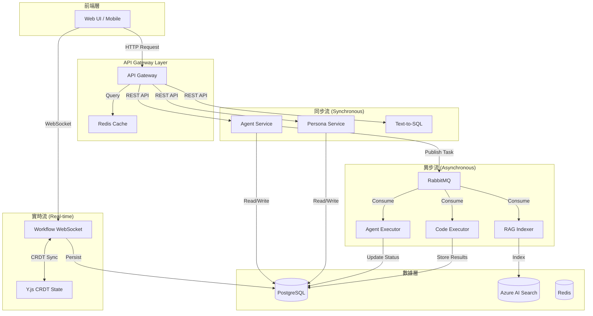
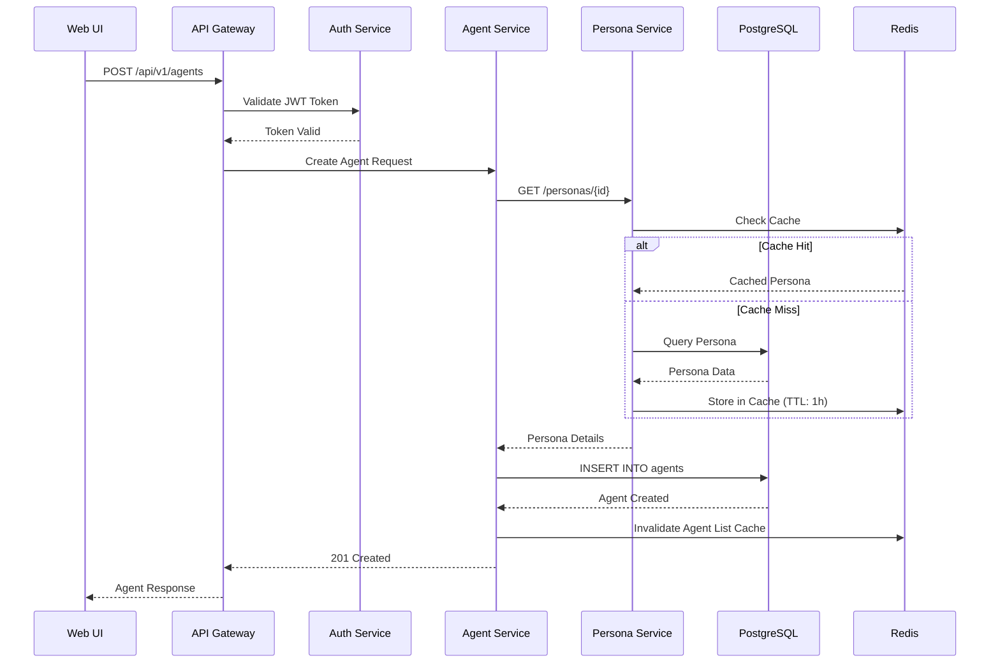
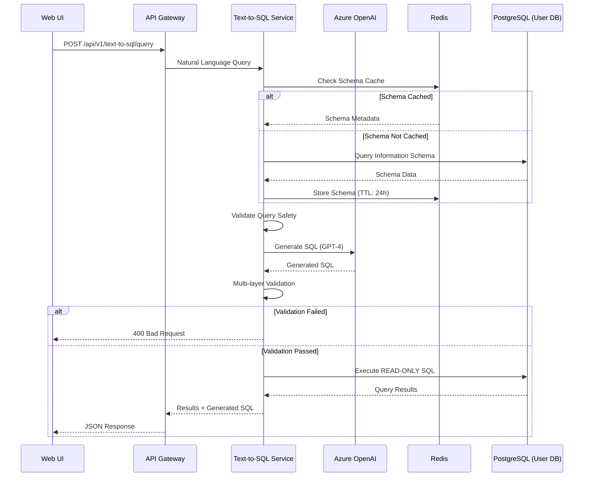
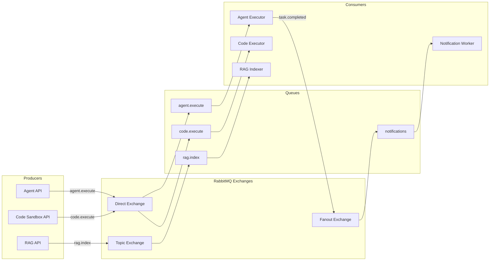
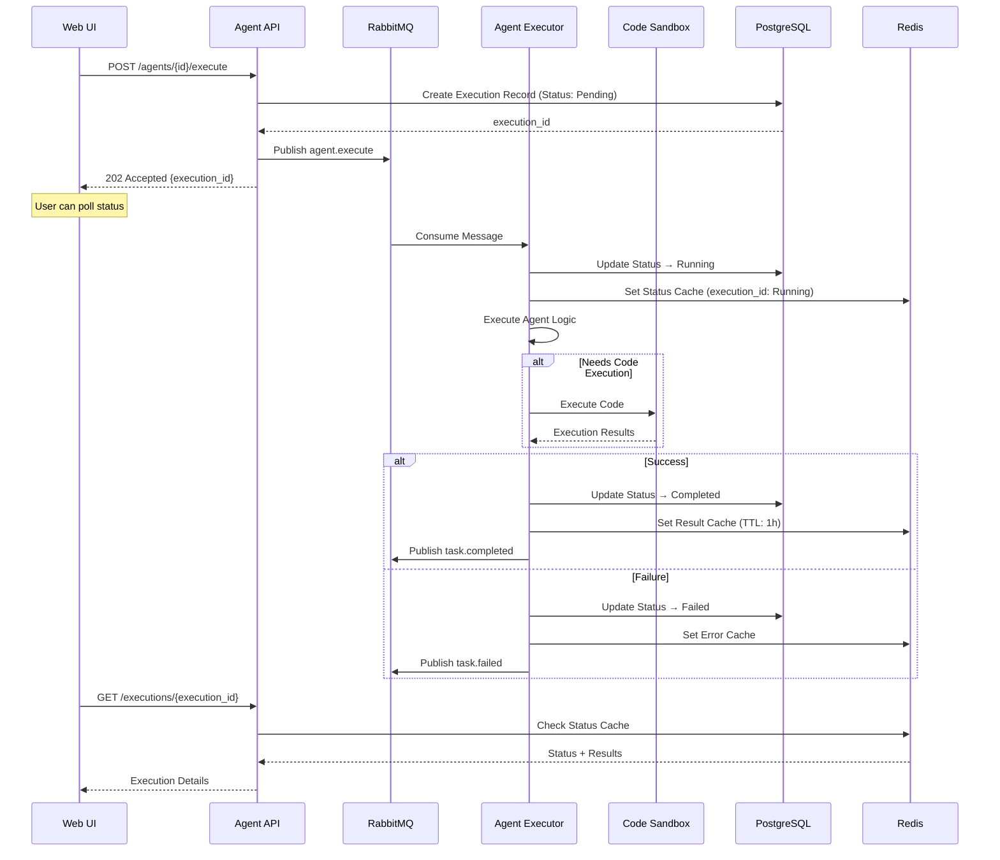
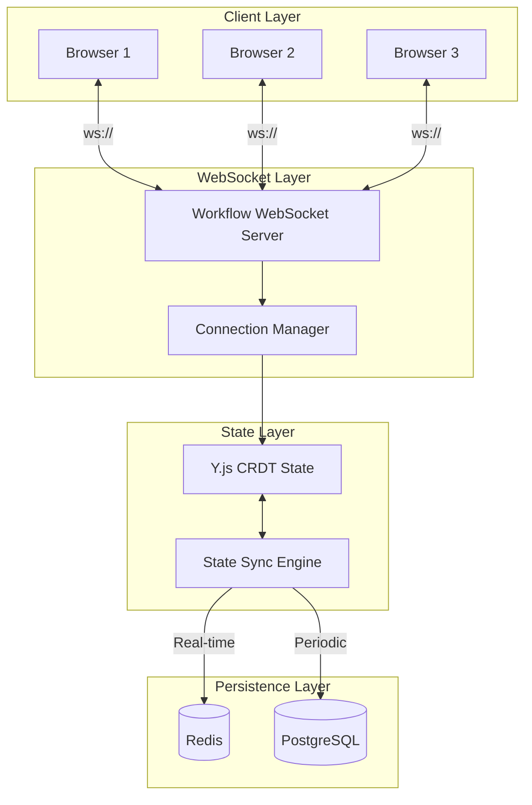
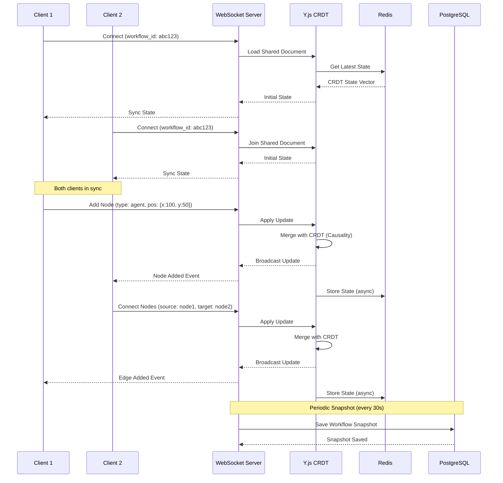
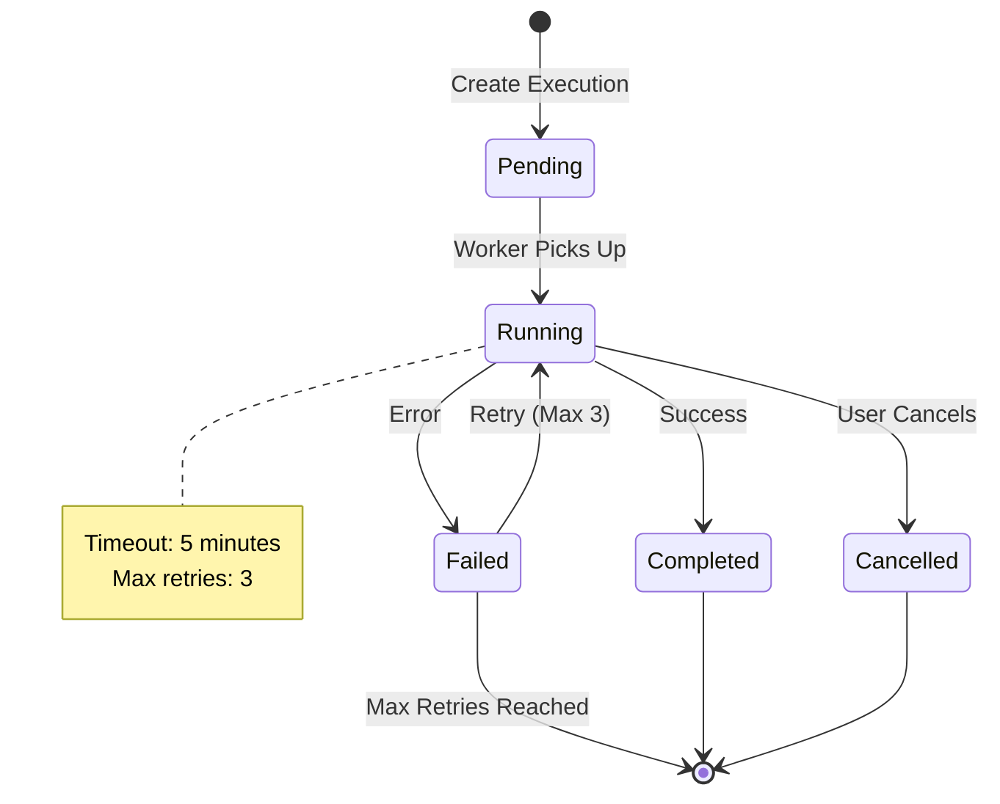
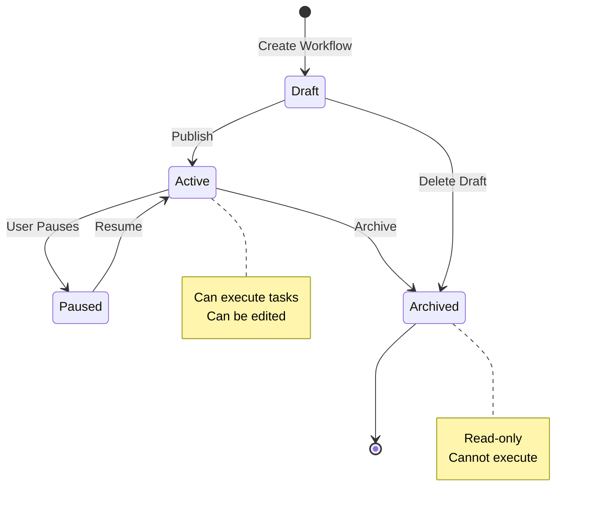
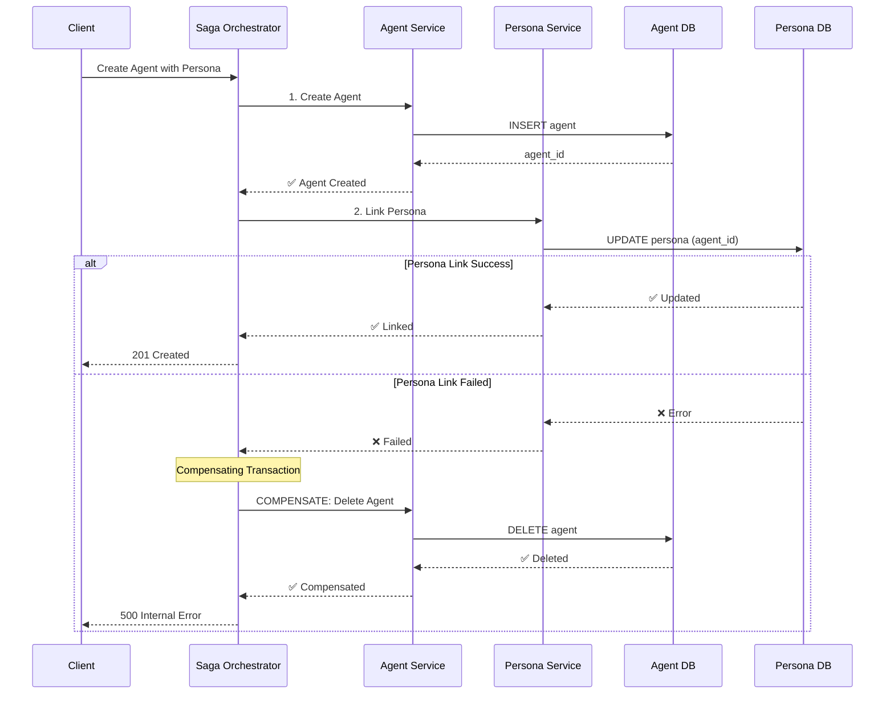

# TID Part 1.3: 數據流設計 (Data Flow Design)

**文檔版本**: v1.0.0
**創建日期**: 2025-10-30
**狀態**: ✅ 完成
**所屬**: Part 1 - System Architecture Design

---

## 目錄

1. [數據流架構概覽](#1-數據流架構概覽)
2. [同步數據流](#2-同步數據流)
3. [異步數據流](#3-異步數據流)
4. [實時數據流](#4-實時數據流)
5. [狀態管理策略](#5-狀態管理策略)
6. [數據一致性模式](#6-數據一致性模式)
7. [事務管理](#7-事務管理)
8. [數據流監控](#8-數據流監控)

---

## 1. 數據流架構概覽

### 1.1 整體數據流圖



### 1.2 三種數據流類型

| 類型 | 用途 | 通信協議 | 延遲 | 可靠性保證 |
|------|------|----------|------|-----------|
| **同步流** | 即時查詢、簡單操作 | HTTP/REST | <100ms | 強一致性 |
| **異步流** | 長時間任務、後台處理 | Message Queue | 秒級 | 最終一致性 |
| **實時流** | 協作編輯、即時更新 | WebSocket | <50ms | 因果一致性 |

### 1.3 數據流設計原則

1. **讀寫分離**: 查詢走同步流，寫操作考慮異步流
2. **緩存優先**: 高頻讀取數據使用 Redis 緩存
3. **異步解耦**: 長時間任務使用消息隊列解耦
4. **實時優化**: 協作場景使用 WebSocket + CRDT
5. **冪等設計**: 所有異步操作支持重試和冪等性

---

## 2. 同步數據流

### 2.1 典型請求-響應流程

#### Scenario 1: 創建 AI Agent



**關鍵點**:
- JWT 認證在 API Gateway 層
- Persona 數據使用 Redis 緩存 (TTL: 1小時)
- 寫操作後主動失效相關緩存
- 完整流程 < 100ms (cache hit)

#### Scenario 2: Text-to-SQL 查詢



**安全措施**:
- Schema 緩存 24 小時減少 DB 查詢
- 多層 SQL 驗證 (14 keywords + 10 patterns)
- READ-ONLY transaction
- 執行超時限制 (30 秒)

### 2.2 緩存策略

#### 2.2.1 Cache-Aside Pattern

```csharp
public async Task<Persona> GetPersonaAsync(Guid personaId)
{
    // 1. Check cache first
    var cacheKey = $"persona:{personaId}";
    var cached = await _cache.GetStringAsync(cacheKey);

    if (cached != null)
    {
        _logger.LogInformation("Cache hit for {PersonaId}", personaId);
        return JsonSerializer.Deserialize<Persona>(cached);
    }

    // 2. Cache miss → Query database
    _logger.LogInformation("Cache miss for {PersonaId}", personaId);
    var persona = await _repository.GetByIdAsync(personaId);

    if (persona == null)
        throw new NotFoundException($"Persona {personaId} not found");

    // 3. Store in cache (TTL: 1 hour)
    await _cache.SetStringAsync(
        cacheKey,
        JsonSerializer.Serialize(persona),
        new DistributedCacheEntryOptions
        {
            AbsoluteExpirationRelativeToNow = TimeSpan.FromHours(1)
        }
    );

    return persona;
}
```

#### 2.2.2 Cache Invalidation

```csharp
public async Task UpdatePersonaAsync(Guid personaId, UpdatePersonaRequest request)
{
    // 1. Update database
    var persona = await _repository.GetByIdAsync(personaId);
    persona.Name = request.Name;
    persona.Template = request.Template;
    persona.UpdatedAt = DateTime.UtcNow;

    await _repository.UpdateAsync(persona);

    // 2. Invalidate cache
    await _cache.RemoveAsync($"persona:{personaId}");

    // 3. Invalidate list cache (if exists)
    await _cache.RemoveAsync($"persona:list:{persona.UserId}");

    _logger.LogInformation("Invalidated cache for {PersonaId}", personaId);
}
```

#### 2.2.3 緩存策略總結

| 數據類型 | TTL | Invalidation 策略 |
|---------|-----|------------------|
| Persona Templates | 1 小時 | 更新時主動失效 |
| Agent Metadata | 30 分鐘 | 更新時主動失效 |
| Database Schema | 24 小時 | DDL 變更時失效 |
| User Sessions | 15 分鐘 | 登出時失效 |
| Query Results (SQL) | 5 分鐘 | 寫操作時失效 |

---

## 3. 異步數據流

### 3.1 消息隊列架構



### 3.2 典型異步流程

#### Scenario 3: Agent 執行任務



**關鍵設計**:
- **異步響應**: API 立即返回 202 Accepted
- **狀態追蹤**: Database + Redis 雙重狀態存儲
- **輪詢優化**: Redis 緩存減少 DB 查詢壓力
- **錯誤處理**: 失敗消息重試機制 (Max 3 次)

### 3.3 消息格式定義

#### Agent Execution Message

```json
{
  "message_id": "uuid",
  "correlation_id": "uuid",
  "timestamp": "2025-10-30T10:15:30Z",
  "routing_key": "agent.execute",
  "payload": {
    "execution_id": "uuid",
    "agent_id": "uuid",
    "user_id": "uuid",
    "input": {
      "query": "Analyze this data",
      "context": {}
    },
    "config": {
      "timeout_seconds": 300,
      "max_tokens": 4000,
      "temperature": 0.7
    }
  },
  "metadata": {
    "retry_count": 0,
    "max_retries": 3,
    "priority": "normal"
  }
}
```

#### Task Completed Event

```json
{
  "message_id": "uuid",
  "correlation_id": "uuid",
  "timestamp": "2025-10-30T10:20:30Z",
  "routing_key": "task.completed",
  "payload": {
    "execution_id": "uuid",
    "agent_id": "uuid",
    "user_id": "uuid",
    "status": "completed",
    "result": {
      "output": "Analysis results...",
      "tokens_used": 1250,
      "execution_time_ms": 3500
    },
    "metrics": {
      "llm_calls": 2,
      "total_cost": 0.05
    }
  }
}
```

### 3.4 重試和冪等性

#### 重試策略

```csharp
public class MessageRetryPolicy
{
    private const int MaxRetries = 3;
    private static readonly TimeSpan[] RetryDelays =
    {
        TimeSpan.FromSeconds(5),    // First retry: 5s
        TimeSpan.FromSeconds(30),   // Second retry: 30s
        TimeSpan.FromMinutes(5)     // Third retry: 5min
    };

    public async Task<bool> ExecuteWithRetryAsync(
        Func<Task> operation,
        string messageId)
    {
        for (int attempt = 0; attempt <= MaxRetries; attempt++)
        {
            try
            {
                await operation();
                return true;
            }
            catch (Exception ex) when (IsTransientError(ex))
            {
                if (attempt == MaxRetries)
                {
                    _logger.LogError(ex,
                        "Max retries reached for {MessageId}", messageId);
                    await SendToDeadLetterQueue(messageId);
                    return false;
                }

                var delay = RetryDelays[attempt];
                _logger.LogWarning(
                    "Retry {Attempt}/{MaxRetries} after {Delay}ms",
                    attempt + 1, MaxRetries, delay.TotalMilliseconds);

                await Task.Delay(delay);
            }
        }
        return false;
    }
}
```

#### 冪等性設計

```csharp
public class AgentExecutor
{
    public async Task ExecuteAsync(AgentExecutionMessage message)
    {
        var executionId = message.Payload.ExecutionId;

        // 1. Check idempotency (已處理過?)
        var processed = await _cache.GetAsync($"processed:{executionId}");
        if (processed != null)
        {
            _logger.LogInformation(
                "Message {ExecutionId} already processed, skipping",
                executionId);
            return;
        }

        // 2. Acquire distributed lock
        await using var lockHandle = await _distributedLock.AcquireAsync(
            $"exec:{executionId}",
            TimeSpan.FromMinutes(10));

        if (lockHandle == null)
        {
            _logger.LogWarning(
                "Failed to acquire lock for {ExecutionId}", executionId);
            throw new ConcurrencyException("Execution already in progress");
        }

        // 3. Execute business logic
        var result = await ExecuteAgentLogicAsync(message);

        // 4. Mark as processed (TTL: 24h)
        await _cache.SetAsync(
            $"processed:{executionId}",
            "true",
            TimeSpan.FromHours(24));

        // 5. Publish completion event
        await _messageQueue.PublishAsync("task.completed", result);
    }
}
```

---

## 4. 實時數據流

### 4.1 WebSocket 架構



### 4.2 實時協作流程

#### Scenario 4: VueFlow Workflow 協作編輯



**CRDT 特性**:
- **因果一致性**: 操作順序自動處理
- **衝突解決**: Last-Write-Wins (LWW) 策略
- **離線支持**: 斷線後重連自動同步
- **無中央協調**: 去中心化合併算法

### 4.3 WebSocket 消息格式

#### Connection Message

```json
{
  "type": "connect",
  "workflow_id": "abc123",
  "user_id": "user456",
  "client_id": "client789",
  "timestamp": "2025-10-30T10:00:00Z"
}
```

#### State Update Message

```json
{
  "type": "update",
  "workflow_id": "abc123",
  "operation": "add_node",
  "payload": {
    "node_id": "node001",
    "node_type": "agent",
    "position": {"x": 100, "y": 50},
    "data": {
      "label": "Data Analyzer",
      "agent_id": "agent123"
    }
  },
  "vector_clock": {
    "client789": 5,
    "client456": 3
  },
  "timestamp": "2025-10-30T10:00:01Z"
}
```

#### Broadcast Message

```json
{
  "type": "broadcast",
  "workflow_id": "abc123",
  "from_client": "client789",
  "operation": "add_node",
  "payload": { /* same as update */ },
  "timestamp": "2025-10-30T10:00:01Z"
}
```

### 4.4 連接管理

```typescript
export class ConnectionManager {
  private connections: Map<string, WebSocket[]> = new Map();

  // 用戶加入 workflow
  public join(workflowId: string, ws: WebSocket, userId: string): void {
    if (!this.connections.has(workflowId)) {
      this.connections.set(workflowId, []);
    }

    this.connections.get(workflowId)!.push(ws);

    // 通知其他用戶
    this.broadcast(workflowId, {
      type: 'user_joined',
      user_id: userId,
      timestamp: new Date().toISOString()
    }, ws);

    logger.info(`User ${userId} joined workflow ${workflowId}`);
  }

  // 廣播消息給所有用戶 (除了發送者)
  public broadcast(
    workflowId: string,
    message: any,
    exclude?: WebSocket
  ): void {
    const connections = this.connections.get(workflowId) || [];
    const payload = JSON.stringify(message);

    for (const ws of connections) {
      if (ws !== exclude && ws.readyState === WebSocket.OPEN) {
        ws.send(payload);
      }
    }
  }

  // 用戶離開
  public leave(workflowId: string, ws: WebSocket): void {
    const connections = this.connections.get(workflowId);
    if (!connections) return;

    const index = connections.indexOf(ws);
    if (index !== -1) {
      connections.splice(index, 1);
    }

    // 如果沒有用戶了，清理資源
    if (connections.length === 0) {
      this.connections.delete(workflowId);
      this.persistState(workflowId); // 持久化最終狀態
    }
  }
}
```

---

## 5. 狀態管理策略

### 5.1 狀態分層架構

```
┌─────────────────────────────────────────┐
│         Application State               │
│  (Frontend: React/Vue State)            │
└──────────────┬──────────────────────────┘
               │
┌──────────────▼──────────────────────────┐
│         Session State                    │
│  (Redis: TTL 15min)                     │
│  - User sessions                         │
│  - Execution status cache                │
└──────────────┬──────────────────────────┘
               │
┌──────────────▼──────────────────────────┐
│         Transient State                  │
│  (Redis: TTL 1h)                        │
│  - Cached query results                  │
│  - Persona templates                     │
└──────────────┬──────────────────────────┘
               │
┌──────────────▼──────────────────────────┐
│         Persistent State                 │
│  (PostgreSQL)                            │
│  - Agents, Workflows, Executions         │
│  - User data, Audit logs                 │
└─────────────────────────────────────────┘
```

### 5.2 狀態同步策略

#### 5.2.1 樂觀鎖 (Optimistic Locking)

```csharp
public class Agent
{
    public Guid Id { get; set; }
    public string Name { get; set; }
    public DateTime UpdatedAt { get; set; }

    [ConcurrencyCheck] // EF Core optimistic concurrency
    public byte[] RowVersion { get; set; }
}

public async Task UpdateAgentAsync(Agent agent)
{
    try
    {
        _context.Agents.Update(agent);
        await _context.SaveChangesAsync();
    }
    catch (DbUpdateConcurrencyException ex)
    {
        // 檢測並發衝突
        var entry = ex.Entries.Single();
        var databaseValues = await entry.GetDatabaseValuesAsync();

        if (databaseValues == null)
        {
            throw new NotFoundException("Agent was deleted");
        }

        // 返回衝突信息給前端
        throw new ConcurrencyException(
            "Agent was modified by another user",
            databaseValues);
    }
}
```

#### 5.2.2 悲觀鎖 (Pessimistic Locking)

```sql
-- 使用 FOR UPDATE 鎖定行
BEGIN;

SELECT * FROM agents
WHERE id = 'abc123'
FOR UPDATE;

-- 執行更新操作
UPDATE agents
SET name = 'New Name', updated_at = NOW()
WHERE id = 'abc123';

COMMIT;
```

```csharp
// C# 實現
public async Task<Agent> LockAndUpdateAsync(
    Guid agentId,
    Func<Agent, Task> updateAction)
{
    await using var transaction = await _context.Database
        .BeginTransactionAsync(IsolationLevel.ReadCommitted);

    try
    {
        // FOR UPDATE lock
        var agent = await _context.Agents
            .FromSqlRaw("SELECT * FROM agents WHERE id = {0} FOR UPDATE", agentId)
            .SingleOrDefaultAsync();

        if (agent == null)
            throw new NotFoundException($"Agent {agentId} not found");

        // 執行更新邏輯
        await updateAction(agent);

        await _context.SaveChangesAsync();
        await transaction.CommitAsync();

        return agent;
    }
    catch
    {
        await transaction.RollbackAsync();
        throw;
    }
}
```

### 5.3 狀態轉移圖

#### Agent Execution State Machine



#### Workflow State Transitions



---

## 6. 數據一致性模式

### 6.1 一致性級別

| 級別 | 描述 | 適用場景 | 實現方式 |
|------|------|---------|---------|
| **強一致性** | 立即可見所有副本 | 金融交易、權限變更 | 同步複製 + 2PC |
| **最終一致性** | 延遲後保證一致 | 用戶資料、Agent metadata | 異步複製 + Event Sourcing |
| **因果一致性** | 保持因果順序 | 協作編輯、聊天消息 | CRDT + Vector Clock |
| **會話一致性** | 同一會話內一致 | 用戶個人視圖 | Sticky Session + Cache |

### 6.2 Saga 模式 (分布式事務)

#### Scenario 5: 創建 Agent 並關聯 Persona



#### Saga 協調器實現

```csharp
public class CreateAgentSaga
{
    private readonly IAgentService _agentService;
    private readonly IPersonaService _personaService;
    private readonly ISagaLogger _logger;

    public async Task<SagaResult> ExecuteAsync(CreateAgentRequest request)
    {
        var sagaId = Guid.NewGuid();
        var compensations = new Stack<Func<Task>>();

        try
        {
            // Step 1: Create Agent
            _logger.LogStep(sagaId, "Creating agent");
            var agent = await _agentService.CreateAsync(request.AgentData);
            compensations.Push(async () =>
                await _agentService.DeleteAsync(agent.Id));

            // Step 2: Link Persona
            _logger.LogStep(sagaId, "Linking persona");
            await _personaService.LinkToAgentAsync(
                request.PersonaId,
                agent.Id);
            compensations.Push(async () =>
                await _personaService.UnlinkFromAgentAsync(request.PersonaId));

            // Step 3: Initialize Agent Executor
            _logger.LogStep(sagaId, "Initializing executor");
            await _agentService.InitializeExecutorAsync(agent.Id);

            _logger.LogSuccess(sagaId);
            return SagaResult.Success(agent);
        }
        catch (Exception ex)
        {
            _logger.LogError(sagaId, ex);

            // Execute compensating transactions in reverse order
            while (compensations.Count > 0)
            {
                var compensate = compensations.Pop();
                try
                {
                    await compensate();
                }
                catch (Exception compensationEx)
                {
                    _logger.LogCompensationError(sagaId, compensationEx);
                }
            }

            return SagaResult.Failed(ex);
        }
    }
}
```

### 6.3 Event Sourcing

```csharp
// Event Store
public abstract class DomainEvent
{
    public Guid EventId { get; set; } = Guid.NewGuid();
    public DateTime Timestamp { get; set; } = DateTime.UtcNow;
    public string EventType { get; set; }
}

public class AgentCreatedEvent : DomainEvent
{
    public Guid AgentId { get; set; }
    public string Name { get; set; }
    public Guid PersonaId { get; set; }
}

public class AgentExecutedEvent : DomainEvent
{
    public Guid AgentId { get; set; }
    public Guid ExecutionId { get; set; }
    public string Status { get; set; }
    public int TokensUsed { get; set; }
}

// Event Store Repository
public class EventStore
{
    private readonly DbContext _context;

    public async Task AppendAsync(Guid aggregateId, DomainEvent @event)
    {
        var eventRecord = new EventRecord
        {
            Id = @event.EventId,
            AggregateId = aggregateId,
            EventType = @event.GetType().Name,
            EventData = JsonSerializer.Serialize(@event),
            Timestamp = @event.Timestamp,
            Version = await GetNextVersionAsync(aggregateId)
        };

        _context.Events.Add(eventRecord);
        await _context.SaveChangesAsync();
    }

    public async Task<List<DomainEvent>> GetEventsAsync(Guid aggregateId)
    {
        var records = await _context.Events
            .Where(e => e.AggregateId == aggregateId)
            .OrderBy(e => e.Version)
            .ToListAsync();

        return records
            .Select(r => DeserializeEvent(r.EventType, r.EventData))
            .ToList();
    }

    // Rebuild state from events
    public async Task<Agent> RehydrateAsync(Guid agentId)
    {
        var events = await GetEventsAsync(agentId);
        var agent = new Agent { Id = agentId };

        foreach (var @event in events)
        {
            agent.Apply(@event);
        }

        return agent;
    }
}
```

---

## 7. 事務管理

### 7.1 本地事務 (Single Database)

```csharp
public async Task<Agent> CreateAgentWithTemplatesAsync(
    CreateAgentRequest request)
{
    await using var transaction = await _context.Database
        .BeginTransactionAsync(IsolationLevel.ReadCommitted);

    try
    {
        // 1. Create agent
        var agent = new Agent
        {
            Id = Guid.NewGuid(),
            Name = request.Name,
            PersonaId = request.PersonaId,
            CreatedAt = DateTime.UtcNow
        };
        _context.Agents.Add(agent);
        await _context.SaveChangesAsync();

        // 2. Create agent plugins
        foreach (var pluginRequest in request.Plugins)
        {
            var plugin = new AgentPlugin
            {
                Id = Guid.NewGuid(),
                AgentId = agent.Id,
                Name = pluginRequest.Name,
                Config = pluginRequest.Config
            };
            _context.AgentPlugins.Add(plugin);
        }
        await _context.SaveChangesAsync();

        // 3. Initialize agent executor
        await _executorService.InitializeAsync(agent.Id);

        await transaction.CommitAsync();
        return agent;
    }
    catch (Exception ex)
    {
        await transaction.RollbackAsync();
        _logger.LogError(ex, "Failed to create agent {Name}", request.Name);
        throw;
    }
}
```

### 7.2 分布式事務 (Two-Phase Commit)

```csharp
public class TwoPhaseCommitCoordinator
{
    private readonly List<ITransactionalResource> _participants;

    public async Task<bool> ExecuteAsync()
    {
        var transactionId = Guid.NewGuid();

        // Phase 1: PREPARE
        _logger.LogInformation("Starting 2PC transaction {TxId}", transactionId);

        var prepareResults = new List<bool>();
        foreach (var participant in _participants)
        {
            var result = await participant.PrepareAsync(transactionId);
            prepareResults.Add(result);

            if (!result)
            {
                _logger.LogWarning(
                    "Participant {Name} failed PREPARE",
                    participant.Name);
                break;
            }
        }

        // Phase 2: COMMIT or ABORT
        if (prepareResults.All(r => r))
        {
            // All prepared successfully → COMMIT
            foreach (var participant in _participants)
            {
                await participant.CommitAsync(transactionId);
            }
            _logger.LogInformation("2PC transaction {TxId} COMMITTED", transactionId);
            return true;
        }
        else
        {
            // At least one failed → ABORT
            foreach (var participant in _participants)
            {
                await participant.AbortAsync(transactionId);
            }
            _logger.LogWarning("2PC transaction {TxId} ABORTED", transactionId);
            return false;
        }
    }
}

public interface ITransactionalResource
{
    string Name { get; }
    Task<bool> PrepareAsync(Guid transactionId);
    Task CommitAsync(Guid transactionId);
    Task AbortAsync(Guid transactionId);
}
```

**注意**: 2PC 在微服務架構中應謹慎使用，推薦使用 **Saga 模式** 或 **Event Sourcing** 代替。

### 7.3 事務隔離級別

| 隔離級別 | 髒讀 | 不可重複讀 | 幻讀 | 性能 | 適用場景 |
|---------|------|-----------|------|------|---------|
| **Read Uncommitted** | ✅ | ✅ | ✅ | 最高 | 日誌、統計 (不需要精確) |
| **Read Committed** | ❌ | ✅ | ✅ | 高 | **默認** (大多數場景) |
| **Repeatable Read** | ❌ | ❌ | ✅ | 中 | 報表生成、批量處理 |
| **Serializable** | ❌ | ❌ | ❌ | 最低 | 金融交易、關鍵操作 |

**推薦配置**:
```csharp
// Default: Read Committed
await _context.Database.BeginTransactionAsync(
    IsolationLevel.ReadCommitted);

// Critical operations: Serializable
await _context.Database.BeginTransactionAsync(
    IsolationLevel.Serializable);
```

---

## 8. 數據流監控

### 8.1 關鍵指標 (KPIs)

#### 8.1.1 同步流指標

| 指標 | 目標 | 告警閾值 | 監控工具 |
|------|------|---------|---------|
| API 響應時間 (P95) | < 200ms | > 500ms | Prometheus |
| API 錯誤率 | < 0.1% | > 1% | Prometheus |
| Cache 命中率 | > 80% | < 60% | Redis INFO |
| Database 查詢時間 | < 50ms | > 100ms | PG slow log |

#### 8.1.2 異步流指標

| 指標 | 目標 | 告警閾值 | 監控工具 |
|------|------|---------|---------|
| 消息處理延遲 | < 1s | > 5s | RabbitMQ Management |
| 隊列積壓 | < 100 | > 1000 | RabbitMQ Management |
| 消息重試率 | < 5% | > 10% | Application Logs |
| Worker CPU 使用率 | < 70% | > 85% | Prometheus |

#### 8.1.3 實時流指標

| 指標 | 目標 | 告警閾值 | 監控工具 |
|------|------|---------|---------|
| WebSocket 連接數 | - | > 10,000 | Custom Metrics |
| 消息延遲 (P95) | < 50ms | > 200ms | Custom Metrics |
| CRDT 合併衝突率 | < 1% | > 5% | Application Logs |
| 斷線重連率 | < 5% | > 15% | Custom Metrics |

### 8.2 監控儀表板 (Grafana)

#### Dashboard 1: API Gateway Metrics

```yaml
panels:
  - title: "Request Rate (req/s)"
    type: graph
    query: rate(http_requests_total[5m])

  - title: "Response Time (P50, P95, P99)"
    type: graph
    queries:
      - histogram_quantile(0.50, http_request_duration_seconds_bucket)
      - histogram_quantile(0.95, http_request_duration_seconds_bucket)
      - histogram_quantile(0.99, http_request_duration_seconds_bucket)

  - title: "Error Rate (%)"
    type: graph
    query: |
      rate(http_requests_total{status=~"5.."}[5m]) /
      rate(http_requests_total[5m]) * 100
    alert:
      condition: value > 1
      severity: warning

  - title: "Cache Hit Rate (%)"
    type: singlestat
    query: |
      redis_keyspace_hits_total /
      (redis_keyspace_hits_total + redis_keyspace_misses_total) * 100
```

#### Dashboard 2: Message Queue Metrics

```yaml
panels:
  - title: "Queue Depth"
    type: graph
    queries:
      - rabbitmq_queue_messages{queue="agent.execute"}
      - rabbitmq_queue_messages{queue="code.execute"}
      - rabbitmq_queue_messages{queue="rag.index"}
    alert:
      condition: value > 1000
      severity: critical

  - title: "Message Throughput (msg/s)"
    type: graph
    query: rate(rabbitmq_queue_messages_published_total[5m])

  - title: "Consumer Lag"
    type: graph
    query: |
      rabbitmq_queue_messages_ready -
      rate(rabbitmq_queue_messages_acked_total[5m])
```

#### Dashboard 3: Database Metrics

```yaml
panels:
  - title: "Query Duration (P95)"
    type: graph
    query: histogram_quantile(0.95, pg_stat_statements_duration_bucket)
    alert:
      condition: value > 100
      severity: warning

  - title: "Active Connections"
    type: singlestat
    query: pg_stat_database_numbackends

  - title: "Deadlocks"
    type: graph
    query: rate(pg_stat_database_deadlocks[5m])
    alert:
      condition: value > 0
      severity: warning

  - title: "Cache Hit Ratio"
    type: singlestat
    query: |
      pg_stat_database_blks_hit /
      (pg_stat_database_blks_hit + pg_stat_database_blks_read) * 100
```

### 8.3 告警策略

```yaml
alerting_rules:
  - name: high_api_latency
    condition: http_request_duration_seconds{quantile="0.95"} > 0.5
    duration: 5m
    severity: warning
    notification: slack, email

  - name: high_error_rate
    condition: |
      rate(http_requests_total{status=~"5.."}[5m]) /
      rate(http_requests_total[5m]) > 0.01
    duration: 2m
    severity: critical
    notification: pagerduty, slack

  - name: queue_backlog
    condition: rabbitmq_queue_messages{queue="agent.execute"} > 1000
    duration: 5m
    severity: warning
    notification: slack

  - name: database_slow_queries
    condition: pg_stat_statements_duration{quantile="0.95"} > 0.1
    duration: 10m
    severity: warning
    notification: slack

  - name: cache_hit_rate_low
    condition: redis_keyspace_hits / (redis_keyspace_hits + redis_keyspace_misses) < 0.6
    duration: 15m
    severity: warning
    notification: slack

  - name: websocket_connection_spike
    condition: websocket_active_connections > 10000
    duration: 5m
    severity: warning
    notification: slack
```

### 8.4 分布式追蹤 (Distributed Tracing)

```csharp
// OpenTelemetry Integration
public class Program
{
    public static void Main(string[] args)
    {
        var builder = WebApplication.CreateBuilder(args);

        // Add OpenTelemetry
        builder.Services.AddOpenTelemetry()
            .WithTracing(tracerProviderBuilder =>
            {
                tracerProviderBuilder
                    .AddAspNetCoreInstrumentation()
                    .AddHttpClientInstrumentation()
                    .AddEntityFrameworkCoreInstrumentation()
                    .AddRedisInstrumentation()
                    .AddSource("AgentService")
                    .AddJaegerExporter(options =>
                    {
                        options.AgentHost = "jaeger";
                        options.AgentPort = 6831;
                    });
            });

        var app = builder.Build();
        app.Run();
    }
}

// Manual span creation
public async Task<Agent> ExecuteAgentAsync(Guid agentId, string input)
{
    using var activity = ActivitySource.StartActivity("ExecuteAgent");
    activity?.SetTag("agent.id", agentId);
    activity?.SetTag("input.length", input.Length);

    try
    {
        var result = await _executor.ExecuteAsync(agentId, input);
        activity?.SetTag("tokens.used", result.TokensUsed);
        return result;
    }
    catch (Exception ex)
    {
        activity?.SetStatus(ActivityStatusCode.Error, ex.Message);
        throw;
    }
}
```

**Trace 示例**:
```
Trace: agent-execution-abc123
├─ Span: HTTP POST /agents/{id}/execute (150ms)
│  ├─ Span: Validate JWT Token (5ms)
│  ├─ Span: Query Agent from DB (12ms)
│  ├─ Span: Publish to RabbitMQ (3ms)
│  └─ Span: Return 202 Accepted (1ms)
│
└─ Span: Worker Process Message (3200ms)
   ├─ Span: Load Persona Template (Redis) (8ms)
   ├─ Span: Call Azure OpenAI (2800ms)
   │  ├─ Span: Generate Prompt (50ms)
   │  └─ Span: API Request (2750ms)
   ├─ Span: Code Execution (Docker) (350ms)
   └─ Span: Save Results to DB (42ms)
```

---

## 總結

### 數據流設計要點

1. **分層設計**: 同步/異步/實時三種流清晰分離
2. **緩存策略**: Redis 多層緩存減少 DB 壓力
3. **異步解耦**: RabbitMQ 消息隊列處理長時間任務
4. **實時協作**: WebSocket + CRDT 實現無衝突協作
5. **一致性保證**: 根據業務需求選擇合適的一致性級別
6. **事務管理**: Saga 模式處理分布式事務
7. **監控完善**: Prometheus + Grafana 全方位監控

### 性能指標總結

| 數據流類型 | 延遲目標 | 吞吐量 | 可靠性 |
|-----------|---------|--------|--------|
| 同步流 (REST API) | < 100ms | 1000 req/s | 99.9% |
| 異步流 (Message Queue) | < 5s | 500 msg/s | 99.99% |
| 實時流 (WebSocket) | < 50ms | 10K connections | 99.5% |

### 下一步

✅ **Part 1 完成**: 系統架構設計 (3/3 files)
- 01-SYSTEM-ARCHITECTURE.md
- 02-MICROSERVICES-DESIGN.md
- 03-DATA-FLOW.md

📋 **接下來**: Part 2 - API 規格設計
- 04-API-SPECIFICATION.md
- 05-OPENAPI-SPEC.yaml

---

**文檔版本**: v1.0.0
**最後更新**: 2025-10-30
**作者**: AI Workflow Platform Team
