# TID Part 3.1: 數據庫 Schema 設計 (Database Schema Design)

**文檔版本**: v1.0.0
**創建日期**: 2025-10-30
**狀態**: ✅ 完成
**所屬**: Part 3 - Data Model Design

---

## 目錄

1. [數據庫架構概覽](#1-數據庫架構概覽)
2. [PostgreSQL Schema 設計](#2-postgresql-schema-設計)
3. [Azure AI Search Schema](#3-azure-ai-search-schema)
4. [Redis 數據結構](#4-redis-數據結構)
5. [索引策略](#5-索引策略)
6. [分區策略](#6-分區策略)
7. [數據遷移](#7-數據遷移)
8. [備份恢復](#8-備份恢復)

---

## 1. 數據庫架構概覽

### 1.1 整體架構

```mermaid
graph TB
    subgraph "應用層"
        AgentSvc[Agent Service]
        PersonaSvc[Persona Service]
        CodeSvc[Code Sandbox]
        SQLSvc[Text-to-SQL]
        RAGSvc[Knowledge RAG]
        WorkflowSvc[Workflow Service]
    end

    subgraph "數據層"
        PG1[(Agent DB)]
        PG2[(Persona DB)]
        PG3[(Code DB)]
        PG4[(SQL DB)]
        PG5[(Knowledge DB)]
        PG6[(Workflow DB)]
        AzureSearch[(Azure AI Search)]
        Redis[(Redis Cache)]
    end

    AgentSvc --> PG1
    PersonaSvc --> PG2
    CodeSvc --> PG3
    SQLSvc --> PG4
    RAGSvc --> PG5
    RAGSvc --> AzureSearch
    WorkflowSvc --> PG6

    AgentSvc -.-> Redis
    PersonaSvc -.-> Redis
    SQLSvc -.-> Redis
```



### 1.2 數據庫選型

| 數據庫 | 類型 | 版本 | 用途 | 數據規模 |
|--------|------|------|------|---------|
| **PostgreSQL** | 關係型 | 16.x | 主數據存儲 | 10-100 GB |
| **Azure AI Search** | 向量數據庫 | - | 文檔檢索 | 1-10 GB |
| **Redis** | KV 緩存 | 7.x | 緩存/會話 | 1-5 GB |

### 1.3 數據庫分離策略

每個微服務使用獨立的 PostgreSQL Database:

```yaml
databases:
  agent_db:
    owner: agent_service
    tables: [users, agents, agent_plugins, executions]

  persona_db:
    owner: persona_service
    tables: [personas, persona_templates, persona_validations]

  code_db:
    owner: code_service
    tables: [code_executions, code_outputs]

  sql_db:
    owner: sql_service
    tables: [databases, schemas, tables, sql_queries]

  knowledge_db:
    owner: knowledge_service
    tables: [documents, document_chunks]

  workflow_db:
    owner: workflow_service
    tables: [workflows, workflow_nodes, workflow_edges, workflow_executions]
```

---

## 2. PostgreSQL Schema 設計

### 2.1 Agent Database

#### 2.1.1 users 表

```sql
CREATE TABLE users (
    id UUID PRIMARY KEY DEFAULT gen_random_uuid(),
    email VARCHAR(255) NOT NULL UNIQUE,
    password_hash VARCHAR(255) NOT NULL,
    name VARCHAR(100) NOT NULL,
    roles TEXT[] NOT NULL DEFAULT ARRAY['user'],
    permissions TEXT[] NOT NULL DEFAULT ARRAY[]::TEXT[],
    is_active BOOLEAN NOT NULL DEFAULT true,
    email_verified BOOLEAN NOT NULL DEFAULT false,
    last_login_at TIMESTAMP WITH TIME ZONE,
    created_at TIMESTAMP WITH TIME ZONE NOT NULL DEFAULT NOW(),
    updated_at TIMESTAMP WITH TIME ZONE NOT NULL DEFAULT NOW(),
    deleted_at TIMESTAMP WITH TIME ZONE
);

-- Indexes
CREATE INDEX idx_users_email ON users(email);
CREATE INDEX idx_users_created_at ON users(created_at DESC);
CREATE INDEX idx_users_is_active ON users(is_active) WHERE is_active = true;

-- Soft delete support
CREATE INDEX idx_users_deleted_at ON users(deleted_at) WHERE deleted_at IS NULL;

-- Comments
COMMENT ON TABLE users IS 'Platform users with authentication and authorization';
COMMENT ON COLUMN users.roles IS 'User roles: admin, developer, analyst, viewer';
COMMENT ON COLUMN users.permissions IS 'Granular permissions: agent:read, agent:write, etc.';
```

#### 2.1.2 agents 表

```sql
CREATE TABLE agents (
    id UUID PRIMARY KEY DEFAULT gen_random_uuid(),
    user_id UUID NOT NULL REFERENCES users(id) ON DELETE CASCADE,
    persona_id UUID NOT NULL, -- Foreign key to persona_db.personas
    name VARCHAR(100) NOT NULL,
    description TEXT,
    status VARCHAR(20) NOT NULL DEFAULT 'active',
    settings JSONB NOT NULL DEFAULT '{
        "temperature": 0.7,
        "max_tokens": 4000,
        "top_p": 1.0
    }'::jsonb,
    metadata JSONB DEFAULT '{}'::jsonb,
    version INTEGER NOT NULL DEFAULT 1,
    created_at TIMESTAMP WITH TIME ZONE NOT NULL DEFAULT NOW(),
    updated_at TIMESTAMP WITH TIME ZONE NOT NULL DEFAULT NOW(),
    deleted_at TIMESTAMP WITH TIME ZONE,

    CONSTRAINT chk_agents_status CHECK (status IN ('active', 'inactive', 'archived'))
);

-- Indexes
CREATE INDEX idx_agents_user_id ON agents(user_id);
CREATE INDEX idx_agents_persona_id ON agents(persona_id);
CREATE INDEX idx_agents_status ON agents(status);
CREATE INDEX idx_agents_created_at ON agents(created_at DESC);

-- GIN index for JSONB columns
CREATE INDEX idx_agents_settings ON agents USING GIN (settings);
CREATE INDEX idx_agents_metadata ON agents USING GIN (metadata);

-- Full-text search
CREATE INDEX idx_agents_name_fts ON agents USING GIN (to_tsvector('english', name));
CREATE INDEX idx_agents_description_fts ON agents USING GIN (to_tsvector('english', description));

-- Comments
COMMENT ON TABLE agents IS 'AI agents with persona and configuration';
COMMENT ON COLUMN agents.settings IS 'LLM settings: temperature, max_tokens, top_p';
COMMENT ON COLUMN agents.metadata IS 'Custom metadata for extensions';
```

#### 2.1.3 agent_plugins 表

```sql
CREATE TABLE agent_plugins (
    id UUID PRIMARY KEY DEFAULT gen_random_uuid(),
    agent_id UUID NOT NULL REFERENCES agents(id) ON DELETE CASCADE,
    name VARCHAR(100) NOT NULL,
    plugin_type VARCHAR(50) NOT NULL,
    config JSONB NOT NULL DEFAULT '{}'::jsonb,
    is_enabled BOOLEAN NOT NULL DEFAULT true,
    order_index INTEGER NOT NULL DEFAULT 0,
    created_at TIMESTAMP WITH TIME ZONE NOT NULL DEFAULT NOW(),
    updated_at TIMESTAMP WITH TIME ZONE NOT NULL DEFAULT NOW(),

    CONSTRAINT chk_plugin_type CHECK (plugin_type IN (
        'code_executor',
        'text_to_sql',
        'knowledge_rag',
        'web_search',
        'file_upload'
    ))
);

-- Indexes
CREATE INDEX idx_agent_plugins_agent_id ON agent_plugins(agent_id);
CREATE INDEX idx_agent_plugins_enabled ON agent_plugins(is_enabled) WHERE is_enabled = true;

-- Unique constraint: one plugin type per agent
CREATE UNIQUE INDEX idx_agent_plugins_unique ON agent_plugins(agent_id, plugin_type)
WHERE is_enabled = true;

-- Comments
COMMENT ON TABLE agent_plugins IS 'Plugins attached to agents';
COMMENT ON COLUMN agent_plugins.order_index IS 'Execution order of plugins';
```

#### 2.1.4 executions 表

```sql
CREATE TABLE executions (
    id UUID PRIMARY KEY DEFAULT gen_random_uuid(),
    agent_id UUID NOT NULL REFERENCES agents(id) ON DELETE CASCADE,
    user_id UUID NOT NULL REFERENCES users(id) ON DELETE CASCADE,
    workflow_id UUID, -- Optional: if triggered by workflow
    status VARCHAR(20) NOT NULL DEFAULT 'pending',
    progress INTEGER NOT NULL DEFAULT 0,

    -- Input/Output
    input JSONB NOT NULL,
    output JSONB,
    error JSONB,

    -- Metrics
    execution_time_ms INTEGER,
    tokens_used INTEGER,
    cost DECIMAL(10, 4),

    -- Timestamps
    created_at TIMESTAMP WITH TIME ZONE NOT NULL DEFAULT NOW(),
    started_at TIMESTAMP WITH TIME ZONE,
    completed_at TIMESTAMP WITH TIME ZONE,

    -- Retry logic
    retry_count INTEGER NOT NULL DEFAULT 0,
    max_retries INTEGER NOT NULL DEFAULT 3,
    parent_execution_id UUID REFERENCES executions(id),

    CONSTRAINT chk_executions_status CHECK (status IN (
        'pending', 'running', 'completed', 'failed', 'cancelled', 'timeout'
    )),
    CONSTRAINT chk_executions_progress CHECK (progress >= 0 AND progress <= 100)
);

-- Indexes
CREATE INDEX idx_executions_agent_id ON executions(agent_id);
CREATE INDEX idx_executions_user_id ON executions(user_id);
CREATE INDEX idx_executions_workflow_id ON executions(workflow_id);
CREATE INDEX idx_executions_status ON executions(status);
CREATE INDEX idx_executions_created_at ON executions(created_at DESC);

-- Composite index for user queries
CREATE INDEX idx_executions_user_status ON executions(user_id, status, created_at DESC);

-- Partial index for active executions
CREATE INDEX idx_executions_active ON executions(agent_id, status)
WHERE status IN ('pending', 'running');

-- GIN index for JSONB
CREATE INDEX idx_executions_input ON executions USING GIN (input);
CREATE INDEX idx_executions_output ON executions USING GIN (output);

-- Comments
COMMENT ON TABLE executions IS 'Agent execution history and status';
COMMENT ON COLUMN executions.cost IS 'Execution cost in USD';
```

#### 2.1.5 execution_logs 表

```sql
CREATE TABLE execution_logs (
    id BIGSERIAL PRIMARY KEY,
    execution_id UUID NOT NULL REFERENCES executions(id) ON DELETE CASCADE,
    level VARCHAR(10) NOT NULL,
    message TEXT NOT NULL,
    metadata JSONB,
    created_at TIMESTAMP WITH TIME ZONE NOT NULL DEFAULT NOW(),

    CONSTRAINT chk_log_level CHECK (level IN ('debug', 'info', 'warning', 'error'))
);

-- Indexes
CREATE INDEX idx_execution_logs_execution_id ON execution_logs(execution_id, created_at DESC);
CREATE INDEX idx_execution_logs_level ON execution_logs(level);

-- Partition by month (for large volume)
-- See section 6 for partitioning strategy

COMMENT ON TABLE execution_logs IS 'Detailed logs for execution debugging';
```

---

### 2.2 Persona Database

#### 2.2.1 personas 表

```sql
CREATE TABLE personas (
    id UUID PRIMARY KEY DEFAULT gen_random_uuid(),
    user_id UUID NOT NULL, -- References agent_db.users
    name VARCHAR(100) NOT NULL,
    description TEXT,
    template TEXT NOT NULL,
    variables JSONB NOT NULL DEFAULT '{}'::jsonb,
    is_public BOOLEAN NOT NULL DEFAULT false,
    usage_count INTEGER NOT NULL DEFAULT 0,
    rating DECIMAL(3, 2),
    created_at TIMESTAMP WITH TIME ZONE NOT NULL DEFAULT NOW(),
    updated_at TIMESTAMP WITH TIME ZONE NOT NULL DEFAULT NOW(),
    deleted_at TIMESTAMP WITH TIME ZONE
);

-- Indexes
CREATE INDEX idx_personas_user_id ON personas(user_id);
CREATE INDEX idx_personas_is_public ON personas(is_public) WHERE is_public = true;
CREATE INDEX idx_personas_usage_count ON personas(usage_count DESC);
CREATE INDEX idx_personas_rating ON personas(rating DESC NULLS LAST);

-- Full-text search
CREATE INDEX idx_personas_name_fts ON personas USING GIN (to_tsvector('english', name));
CREATE INDEX idx_personas_description_fts ON personas USING GIN (to_tsvector('english', description));

-- GIN index for variables
CREATE INDEX idx_personas_variables ON personas USING GIN (variables);

COMMENT ON TABLE personas IS 'Persona templates for agents';
COMMENT ON COLUMN personas.template IS 'Scriban template string';
COMMENT ON COLUMN personas.variables IS 'JSON schema for template variables';
```

#### 2.2.2 persona_validations 表

```sql
CREATE TABLE persona_validations (
    id UUID PRIMARY KEY DEFAULT gen_random_uuid(),
    persona_id UUID NOT NULL REFERENCES personas(id) ON DELETE CASCADE,
    validator VARCHAR(50) NOT NULL,
    validation_result JSONB NOT NULL,
    is_valid BOOLEAN NOT NULL,
    issues TEXT[],
    validated_at TIMESTAMP WITH TIME ZONE NOT NULL DEFAULT NOW(),

    CONSTRAINT chk_validator CHECK (validator IN ('gpt4_judge', 'template_syntax', 'variable_schema'))
);

-- Indexes
CREATE INDEX idx_persona_validations_persona_id ON persona_validations(persona_id);
CREATE INDEX idx_persona_validations_is_valid ON persona_validations(is_valid);

COMMENT ON TABLE persona_validations IS 'Persona validation results from GPT-4 Judge';
```

---

### 2.3 Code Execution Database

#### 2.3.1 code_executions 表

```sql
CREATE TABLE code_executions (
    id UUID PRIMARY KEY DEFAULT gen_random_uuid(),
    user_id UUID NOT NULL, -- References agent_db.users
    agent_id UUID, -- Optional: if triggered by agent
    language VARCHAR(20) NOT NULL,
    code TEXT NOT NULL,
    status VARCHAR(20) NOT NULL DEFAULT 'pending',

    -- Container info
    container_id VARCHAR(100),
    container_ip VARCHAR(45),

    -- Results
    stdout TEXT,
    stderr TEXT,
    exit_code INTEGER,

    -- Metrics
    execution_time_ms INTEGER,
    memory_used_mb INTEGER,
    cpu_usage_percent DECIMAL(5, 2),

    -- Security
    security_score INTEGER,
    security_issues TEXT[],

    -- Timestamps
    created_at TIMESTAMP WITH TIME ZONE NOT NULL DEFAULT NOW(),
    started_at TIMESTAMP WITH TIME ZONE,
    completed_at TIMESTAMP WITH TIME ZONE,

    CONSTRAINT chk_code_language CHECK (language IN ('python', 'javascript', 'typescript')),
    CONSTRAINT chk_code_status CHECK (status IN (
        'pending', 'running', 'completed', 'failed', 'timeout', 'cancelled'
    ))
);

-- Indexes
CREATE INDEX idx_code_executions_user_id ON code_executions(user_id);
CREATE INDEX idx_code_executions_agent_id ON code_executions(agent_id);
CREATE INDEX idx_code_executions_status ON code_executions(status);
CREATE INDEX idx_code_executions_created_at ON code_executions(created_at DESC);

-- Partial index for active executions
CREATE INDEX idx_code_executions_active ON code_executions(container_id)
WHERE status IN ('pending', 'running');

COMMENT ON TABLE code_executions IS 'Code execution history in sandbox';
COMMENT ON COLUMN code_executions.security_score IS 'Security score 0-100 from Docker escape tests';
```

---

### 2.4 Text-to-SQL Database

#### 2.4.1 databases 表

```sql
CREATE TABLE databases (
    id UUID PRIMARY KEY DEFAULT gen_random_uuid(),
    user_id UUID NOT NULL, -- References agent_db.users
    name VARCHAR(100) NOT NULL,
    connection_string TEXT NOT NULL, -- Encrypted
    database_type VARCHAR(50) NOT NULL,
    is_active BOOLEAN NOT NULL DEFAULT true,
    last_sync_at TIMESTAMP WITH TIME ZONE,
    created_at TIMESTAMP WITH TIME ZONE NOT NULL DEFAULT NOW(),
    updated_at TIMESTAMP WITH TIME ZONE NOT NULL DEFAULT NOW(),

    CONSTRAINT chk_db_type CHECK (database_type IN (
        'postgresql', 'mysql', 'mssql', 'sqlite'
    ))
);

-- Indexes
CREATE INDEX idx_databases_user_id ON databases(user_id);
CREATE INDEX idx_databases_is_active ON databases(is_active) WHERE is_active = true;

COMMENT ON TABLE databases IS 'User database connections';
COMMENT ON COLUMN databases.connection_string IS 'Encrypted connection string';
```

#### 2.4.2 schemas 表

```sql
CREATE TABLE schemas (
    id UUID PRIMARY KEY DEFAULT gen_random_uuid(),
    database_id UUID NOT NULL REFERENCES databases(id) ON DELETE CASCADE,
    schema_name VARCHAR(100) NOT NULL,
    description TEXT,
    is_enhanced BOOLEAN NOT NULL DEFAULT false,
    enhanced_at TIMESTAMP WITH TIME ZONE,
    created_at TIMESTAMP WITH TIME ZONE NOT NULL DEFAULT NOW(),
    updated_at TIMESTAMP WITH TIME ZONE NOT NULL DEFAULT NOW()
);

-- Indexes
CREATE INDEX idx_schemas_database_id ON schemas(database_id);
CREATE UNIQUE INDEX idx_schemas_unique ON schemas(database_id, schema_name);

COMMENT ON TABLE schemas IS 'Database schemas metadata';
```

#### 2.4.3 tables 表

```sql
CREATE TABLE tables (
    id UUID PRIMARY KEY DEFAULT gen_random_uuid(),
    schema_id UUID NOT NULL REFERENCES schemas(id) ON DELETE CASCADE,
    table_name VARCHAR(100) NOT NULL,
    description TEXT,
    row_count BIGINT,
    columns JSONB NOT NULL,
    indexes JSONB,
    foreign_keys JSONB,
    sample_data JSONB,
    last_analyzed_at TIMESTAMP WITH TIME ZONE,
    created_at TIMESTAMP WITH TIME ZONE NOT NULL DEFAULT NOW(),
    updated_at TIMESTAMP WITH TIME ZONE NOT NULL DEFAULT NOW()
);

-- Indexes
CREATE INDEX idx_tables_schema_id ON tables(schema_id);
CREATE INDEX idx_tables_table_name ON tables(table_name);
CREATE INDEX idx_tables_columns ON tables USING GIN (columns);

-- Full-text search
CREATE INDEX idx_tables_description_fts ON tables USING GIN (to_tsvector('english', description));

COMMENT ON TABLE tables IS 'Table metadata with enhanced descriptions';
COMMENT ON COLUMN tables.columns IS 'JSON array of column definitions';
```

#### 2.4.4 sql_queries 表

```sql
CREATE TABLE sql_queries (
    id UUID PRIMARY KEY DEFAULT gen_random_uuid(),
    user_id UUID NOT NULL, -- References agent_db.users
    database_id UUID NOT NULL REFERENCES databases(id) ON DELETE CASCADE,
    natural_language TEXT NOT NULL,
    generated_sql TEXT NOT NULL,
    validation_result JSONB,
    is_safe BOOLEAN NOT NULL,

    -- Execution
    executed BOOLEAN NOT NULL DEFAULT false,
    result_rows INTEGER,
    execution_time_ms INTEGER,

    -- Timestamps
    created_at TIMESTAMP WITH TIME ZONE NOT NULL DEFAULT NOW(),
    executed_at TIMESTAMP WITH TIME ZONE
);

-- Indexes
CREATE INDEX idx_sql_queries_user_id ON sql_queries(user_id);
CREATE INDEX idx_sql_queries_database_id ON sql_queries(database_id);
CREATE INDEX idx_sql_queries_is_safe ON sql_queries(is_safe);
CREATE INDEX idx_sql_queries_created_at ON sql_queries(created_at DESC);

-- Full-text search on natural language
CREATE INDEX idx_sql_queries_nl_fts ON sql_queries
USING GIN (to_tsvector('english', natural_language));

COMMENT ON TABLE sql_queries IS 'Text-to-SQL query history';
```

---

### 2.5 Knowledge Database

#### 2.5.1 documents 表

```sql
CREATE TABLE documents (
    id UUID PRIMARY KEY DEFAULT gen_random_uuid(),
    user_id UUID NOT NULL, -- References agent_db.users
    title VARCHAR(255) NOT NULL,
    content TEXT NOT NULL,
    content_type VARCHAR(50) NOT NULL,
    file_path TEXT,
    file_size BIGINT,
    metadata JSONB DEFAULT '{}'::jsonb,

    -- Processing status
    status VARCHAR(20) NOT NULL DEFAULT 'uploaded',
    chunk_count INTEGER NOT NULL DEFAULT 0,
    indexed_at TIMESTAMP WITH TIME ZONE,

    -- Timestamps
    created_at TIMESTAMP WITH TIME ZONE NOT NULL DEFAULT NOW(),
    updated_at TIMESTAMP WITH TIME ZONE NOT NULL DEFAULT NOW(),
    deleted_at TIMESTAMP WITH TIME ZONE,

    CONSTRAINT chk_doc_status CHECK (status IN (
        'uploaded', 'processing', 'indexed', 'failed'
    )),
    CONSTRAINT chk_content_type CHECK (content_type IN (
        'text/plain', 'text/markdown', 'application/pdf',
        'application/msword', 'text/html'
    ))
);

-- Indexes
CREATE INDEX idx_documents_user_id ON documents(user_id);
CREATE INDEX idx_documents_status ON documents(status);
CREATE INDEX idx_documents_created_at ON documents(created_at DESC);
CREATE INDEX idx_documents_metadata ON documents USING GIN (metadata);

-- Full-text search
CREATE INDEX idx_documents_title_fts ON documents USING GIN (to_tsvector('english', title));
CREATE INDEX idx_documents_content_fts ON documents USING GIN (to_tsvector('english', content));

COMMENT ON TABLE documents IS 'Documents for RAG knowledge base';
```

#### 2.5.2 document_chunks 表

```sql
CREATE TABLE document_chunks (
    id UUID PRIMARY KEY DEFAULT gen_random_uuid(),
    document_id UUID NOT NULL REFERENCES documents(id) ON DELETE CASCADE,
    chunk_index INTEGER NOT NULL,
    content TEXT NOT NULL,
    content_length INTEGER NOT NULL,

    -- Vector embedding (for fallback, primary storage in Azure AI Search)
    embedding vector(1536), -- OpenAI ada-002 dimension

    -- Metadata
    metadata JSONB DEFAULT '{}'::jsonb,

    created_at TIMESTAMP WITH TIME ZONE NOT NULL DEFAULT NOW(),

    CONSTRAINT chk_chunk_index CHECK (chunk_index >= 0)
);

-- Indexes
CREATE INDEX idx_document_chunks_document_id ON document_chunks(document_id, chunk_index);

-- Vector similarity search (using pgvector extension)
CREATE INDEX idx_document_chunks_embedding ON document_chunks
USING ivfflat (embedding vector_cosine_ops)
WITH (lists = 100);

COMMENT ON TABLE document_chunks IS 'Document chunks with embeddings';
COMMENT ON COLUMN document_chunks.embedding IS 'Vector embedding for similarity search (fallback)';
```

---

### 2.6 Workflow Database

#### 2.6.1 workflows 表

```sql
CREATE TABLE workflows (
    id UUID PRIMARY KEY DEFAULT gen_random_uuid(),
    user_id UUID NOT NULL, -- References agent_db.users
    name VARCHAR(100) NOT NULL,
    description TEXT,
    status VARCHAR(20) NOT NULL DEFAULT 'draft',
    version INTEGER NOT NULL DEFAULT 1,

    -- Workflow definition (VueFlow format)
    nodes JSONB NOT NULL DEFAULT '[]'::jsonb,
    edges JSONB NOT NULL DEFAULT '[]'::jsonb,
    viewport JSONB DEFAULT '{"x": 0, "y": 0, "zoom": 1}'::jsonb,

    -- Metadata
    metadata JSONB DEFAULT '{}'::jsonb,
    tags TEXT[],

    -- Timestamps
    created_at TIMESTAMP WITH TIME ZONE NOT NULL DEFAULT NOW(),
    updated_at TIMESTAMP WITH TIME ZONE NOT NULL DEFAULT NOW(),
    published_at TIMESTAMP WITH TIME ZONE,
    deleted_at TIMESTAMP WITH TIME ZONE,

    CONSTRAINT chk_workflow_status CHECK (status IN (
        'draft', 'active', 'paused', 'archived'
    ))
);

-- Indexes
CREATE INDEX idx_workflows_user_id ON workflows(user_id);
CREATE INDEX idx_workflows_status ON workflows(status);
CREATE INDEX idx_workflows_created_at ON workflows(created_at DESC);
CREATE INDEX idx_workflows_tags ON workflows USING GIN (tags);
CREATE INDEX idx_workflows_nodes ON workflows USING GIN (nodes);
CREATE INDEX idx_workflows_edges ON workflows USING GIN (edges);

-- Full-text search
CREATE INDEX idx_workflows_name_fts ON workflows USING GIN (to_tsvector('english', name));

COMMENT ON TABLE workflows IS 'Visual workflows with VueFlow format';
COMMENT ON COLUMN workflows.nodes IS 'VueFlow nodes array';
COMMENT ON COLUMN workflows.edges IS 'VueFlow edges array';
```

#### 2.6.2 workflow_executions 表

```sql
CREATE TABLE workflow_executions (
    id UUID PRIMARY KEY DEFAULT gen_random_uuid(),
    workflow_id UUID NOT NULL REFERENCES workflows(id) ON DELETE CASCADE,
    user_id UUID NOT NULL, -- References agent_db.users
    status VARCHAR(20) NOT NULL DEFAULT 'pending',

    -- Input/Output
    input JSONB NOT NULL,
    output JSONB,
    error JSONB,

    -- Execution trace
    node_executions JSONB NOT NULL DEFAULT '[]'::jsonb,
    current_node_id VARCHAR(100),

    -- Metrics
    total_nodes INTEGER,
    completed_nodes INTEGER NOT NULL DEFAULT 0,
    execution_time_ms INTEGER,
    cost DECIMAL(10, 4),

    -- Timestamps
    created_at TIMESTAMP WITH TIME ZONE NOT NULL DEFAULT NOW(),
    started_at TIMESTAMP WITH TIME ZONE,
    completed_at TIMESTAMP WITH TIME ZONE,

    CONSTRAINT chk_wf_exec_status CHECK (status IN (
        'pending', 'running', 'completed', 'failed', 'cancelled'
    ))
);

-- Indexes
CREATE INDEX idx_workflow_executions_workflow_id ON workflow_executions(workflow_id);
CREATE INDEX idx_workflow_executions_user_id ON workflow_executions(user_id);
CREATE INDEX idx_workflow_executions_status ON workflow_executions(status);
CREATE INDEX idx_workflow_executions_created_at ON workflow_executions(created_at DESC);

-- Composite index for workflow queries
CREATE INDEX idx_wf_exec_workflow_status ON workflow_executions(workflow_id, status, created_at DESC);

COMMENT ON TABLE workflow_executions IS 'Workflow execution history';
COMMENT ON COLUMN workflow_executions.node_executions IS 'Array of node execution results';
```

#### 2.6.3 workflow_snapshots 表

```sql
CREATE TABLE workflow_snapshots (
    id UUID PRIMARY KEY DEFAULT gen_random_uuid(),
    workflow_id UUID NOT NULL REFERENCES workflows(id) ON DELETE CASCADE,
    snapshot_data JSONB NOT NULL,
    created_by UUID NOT NULL, -- References agent_db.users
    created_at TIMESTAMP WITH TIME ZONE NOT NULL DEFAULT NOW()
);

-- Indexes
CREATE INDEX idx_workflow_snapshots_workflow_id ON workflow_snapshots(workflow_id, created_at DESC);

COMMENT ON TABLE workflow_snapshots IS 'Workflow version snapshots for CRDT persistence';
```

---

## 3. Azure AI Search Schema

### 3.1 Index: knowledge-base

```json
{
  "name": "knowledge-base",
  "fields": [
    {
      "name": "chunk_id",
      "type": "Edm.String",
      "key": true,
      "searchable": false,
      "filterable": true
    },
    {
      "name": "document_id",
      "type": "Edm.String",
      "searchable": false,
      "filterable": true,
      "facetable": true
    },
    {
      "name": "user_id",
      "type": "Edm.String",
      "searchable": false,
      "filterable": true
    },
    {
      "name": "title",
      "type": "Edm.String",
      "searchable": true,
      "filterable": true,
      "sortable": true,
      "analyzer": "en.microsoft"
    },
    {
      "name": "content",
      "type": "Edm.String",
      "searchable": true,
      "analyzer": "en.microsoft"
    },
    {
      "name": "content_vector",
      "type": "Collection(Edm.Single)",
      "dimensions": 1536,
      "vectorSearchProfile": "vector-profile-1536",
      "searchable": true
    },
    {
      "name": "chunk_index",
      "type": "Edm.Int32",
      "filterable": true,
      "sortable": true
    },
    {
      "name": "metadata",
      "type": "Edm.ComplexType",
      "fields": [
        {
          "name": "source",
          "type": "Edm.String",
          "filterable": true
        },
        {
          "name": "tags",
          "type": "Collection(Edm.String)",
          "filterable": true,
          "facetable": true
        },
        {
          "name": "created_at",
          "type": "Edm.DateTimeOffset",
          "filterable": true,
          "sortable": true
        }
      ]
    }
  ],
  "vectorSearch": {
    "algorithms": [
      {
        "name": "hnsw-config",
        "kind": "hnsw",
        "hnswParameters": {
          "m": 4,
          "efConstruction": 400,
          "efSearch": 500,
          "metric": "cosine"
        }
      }
    ],
    "profiles": [
      {
        "name": "vector-profile-1536",
        "algorithm": "hnsw-config"
      }
    ]
  }
}
```

### 3.2 查詢示例

#### 向量相似度搜索

```json
POST /indexes/knowledge-base/docs/search?api-version=2023-11-01
{
  "search": "*",
  "vectorQueries": [
    {
      "kind": "vector",
      "vector": [0.018990106, -0.0073809814, ...],
      "fields": "content_vector",
      "k": 5
    }
  ],
  "filter": "user_id eq 'user-123'",
  "select": "chunk_id,document_id,content,chunk_index",
  "top": 5
}
```

#### 混合搜索 (Text + Vector)

```json
{
  "search": "machine learning",
  "vectorQueries": [
    {
      "kind": "vector",
      "vector": [...],
      "fields": "content_vector",
      "k": 10
    }
  ],
  "filter": "metadata/tags/any(t: t eq 'AI')",
  "top": 5
}
```

---

## 4. Redis 數據結構

### 4.1 緩存鍵命名規範

```
Pattern: {service}:{resource_type}:{id}:{attribute}
TTL: Based on data volatility
```

### 4.2 數據結構定義

#### 4.2.1 Session 緩存

```redis
# User session
Key: session:{user_id}
Type: Hash
TTL: 15 minutes
Fields:
  - user_id: UUID
  - email: string
  - roles: JSON array
  - permissions: JSON array
  - last_active: timestamp

Example:
HSET session:user-123 user_id "user-123"
HSET session:user-123 email "user@example.com"
HSET session:user-123 roles '["developer"]'
EXPIRE session:user-123 900
```

#### 4.2.2 Persona 緩存

```redis
# Persona template
Key: persona:{persona_id}
Type: String (JSON)
TTL: 1 hour

Example:
SET persona:abc-123 '{"id":"abc-123","name":"Data Analyst","template":"..."}'
EXPIRE persona:abc-123 3600
```

#### 4.2.3 Execution 狀態緩存

```redis
# Execution status
Key: execution:{execution_id}:status
Type: String
TTL: 1 hour

Example:
SET execution:exec-123:status "running"
EXPIRE execution:exec-123:status 3600

# Execution result (completed)
Key: execution:{execution_id}:result
Type: String (JSON)
TTL: 1 hour

Example:
SET execution:exec-123:result '{"output":"...","tokens_used":1250}'
EXPIRE execution:exec-123:result 3600
```

#### 4.2.4 Rate Limiting

```redis
# Sliding window rate limit
Key: ratelimit:{user_id}
Type: Sorted Set
TTL: 60 seconds

Members: timestamp (score and value)

Example:
ZADD ratelimit:user-123 1698652800 1698652800
ZADD ratelimit:user-123 1698652801 1698652801
ZCOUNT ratelimit:user-123 1698652740 1698652800  # Count in last 60s
EXPIRE ratelimit:user-123 60
```

#### 4.2.5 Database Schema 緩存

```redis
# Database schema metadata
Key: sql:schema:{database_id}
Type: String (JSON)
TTL: 24 hours

Example:
SET sql:schema:db-123 '{"tables":[...],"columns":[...]}'
EXPIRE sql:schema:db-123 86400
```

#### 4.2.6 Distributed Lock

```redis
# Distributed lock for idempotency
Key: lock:{resource_type}:{resource_id}
Type: String
TTL: 10 minutes

Example:
SET lock:execution:exec-123 "worker-node-1" NX EX 600
```

### 4.3 緩存策略總結

| 數據類型 | TTL | 失效策略 | 預熱策略 |
|---------|-----|---------|---------|
| User Session | 15 min | Sliding expiry | On login |
| Persona | 1 hour | Write-through | On demand |
| Execution Status | 1 hour | Write-through | On creation |
| Schema Metadata | 24 hours | Lazy invalidation | On first query |
| Rate Limit | 60 sec | Auto expiry | On first request |

---

## 5. 索引策略

### 5.1 索引類型

| 索引類型 | 用途 | 範例 |
|---------|------|------|
| **B-tree** | 默認索引，範圍查詢 | `created_at`, `updated_at` |
| **Hash** | 等值查詢 | `id`, `email` |
| **GIN** | JSONB、全文搜索、數組 | `metadata`, `tags`, `to_tsvector()` |
| **GiST** | 幾何、全文搜索 | 地理位置 (未來) |
| **BRIN** | 大表塊範圍索引 | 分區表的 `created_at` |
| **IVFFlat** | 向量相似度 (pgvector) | `embedding` |

### 5.2 索引優化原則

#### 5.2.1 復合索引順序

```sql
-- ✅ 正確: 高選擇性列在前
CREATE INDEX idx_executions_user_status ON executions(user_id, status, created_at DESC);

-- ❌ 錯誤: 低選擇性列在前
CREATE INDEX idx_executions_bad ON executions(status, user_id, created_at DESC);
```

#### 5.2.2 部分索引 (Partial Index)

```sql
-- 只索引 active 的記錄
CREATE INDEX idx_agents_active ON agents(user_id, created_at DESC)
WHERE status = 'active' AND deleted_at IS NULL;

-- 只索引運行中的執行
CREATE INDEX idx_executions_running ON executions(agent_id)
WHERE status IN ('pending', 'running');
```

#### 5.2.3 表達式索引

```sql
-- Lower case email for case-insensitive search
CREATE INDEX idx_users_email_lower ON users(LOWER(email));

-- Date truncation for daily aggregation
CREATE INDEX idx_executions_date ON executions(DATE(created_at));
```

### 5.3 索引監控

```sql
-- 查找未使用的索引
SELECT
    schemaname,
    tablename,
    indexname,
    idx_scan,
    pg_size_pretty(pg_relation_size(indexrelid)) AS index_size
FROM pg_stat_user_indexes
WHERE idx_scan = 0
ORDER BY pg_relation_size(indexrelid) DESC;

-- 查找缺失的索引 (根據查詢統計)
SELECT
    schemaname,
    tablename,
    seq_scan,
    seq_tup_read,
    idx_scan,
    seq_tup_read / seq_scan AS avg_rows_per_scan
FROM pg_stat_user_tables
WHERE seq_scan > 0
ORDER BY seq_tup_read DESC
LIMIT 25;
```

---

## 6. 分區策略

### 6.1 execution_logs 表分區 (時間分區)

```sql
-- 創建分區表
CREATE TABLE execution_logs (
    id BIGSERIAL,
    execution_id UUID NOT NULL,
    level VARCHAR(10) NOT NULL,
    message TEXT NOT NULL,
    metadata JSONB,
    created_at TIMESTAMP WITH TIME ZONE NOT NULL DEFAULT NOW(),
    PRIMARY KEY (id, created_at)
) PARTITION BY RANGE (created_at);

-- 創建月度分區
CREATE TABLE execution_logs_2025_10 PARTITION OF execution_logs
FOR VALUES FROM ('2025-10-01') TO ('2025-11-01');

CREATE TABLE execution_logs_2025_11 PARTITION OF execution_logs
FOR VALUES FROM ('2025-11-01') TO ('2025-12-01');

CREATE TABLE execution_logs_2025_12 PARTITION OF execution_logs
FOR VALUES FROM ('2025-12-01') TO ('2026-01-01');

-- 索引 (每個分區自動繼承)
CREATE INDEX idx_execution_logs_execution_id_p ON execution_logs(execution_id, created_at DESC);
CREATE INDEX idx_execution_logs_level_p ON execution_logs(level);
```

### 6.2 自動分區管理

```sql
-- Function: 自動創建下個月分區
CREATE OR REPLACE FUNCTION create_next_month_partition()
RETURNS void AS $$
DECLARE
    partition_name TEXT;
    start_date DATE;
    end_date DATE;
BEGIN
    start_date := DATE_TRUNC('month', NOW() + INTERVAL '1 month');
    end_date := start_date + INTERVAL '1 month';
    partition_name := 'execution_logs_' || TO_CHAR(start_date, 'YYYY_MM');

    EXECUTE FORMAT(
        'CREATE TABLE IF NOT EXISTS %I PARTITION OF execution_logs
         FOR VALUES FROM (%L) TO (%L)',
        partition_name,
        start_date,
        end_date
    );

    RAISE NOTICE 'Created partition: %', partition_name;
END;
$$ LANGUAGE plpgsql;

-- 調度任務 (使用 pg_cron 或外部 scheduler)
-- Run on the 25th of each month
SELECT cron.schedule('create-partition', '0 0 25 * *', 'SELECT create_next_month_partition()');
```

### 6.3 分區裁剪 (Partition Pruning)

```sql
-- ✅ 分區裁剪生效 (只掃描 2025-10 分區)
SELECT *
FROM execution_logs
WHERE created_at >= '2025-10-15'
  AND created_at < '2025-10-20';

-- ❌ 分區裁剪失效 (掃描所有分區)
SELECT *
FROM execution_logs
WHERE EXTRACT(MONTH FROM created_at) = 10;
```

---

## 7. 數據遷移

### 7.1 Entity Framework Core Migrations

#### 7.1.1 初始遷移

```bash
# 創建初始遷移
dotnet ef migrations add InitialCreate --project AgentService

# 查看生成的 SQL
dotnet ef migrations script --output migrations.sql

# 應用遷移
dotnet ef database update
```

#### 7.1.2 遷移文件示例

```csharp
public partial class InitialCreate : Migration
{
    protected override void Up(MigrationBuilder migrationBuilder)
    {
        migrationBuilder.CreateTable(
            name: "users",
            columns: table => new
            {
                id = table.Column<Guid>(nullable: false),
                email = table.Column<string>(maxLength: 255, nullable: false),
                password_hash = table.Column<string>(maxLength: 255, nullable: false),
                name = table.Column<string>(maxLength: 100, nullable: false),
                roles = table.Column<string[]>(nullable: false),
                created_at = table.Column<DateTime>(nullable: false, defaultValueSql: "NOW()"),
                updated_at = table.Column<DateTime>(nullable: false, defaultValueSql: "NOW()")
            },
            constraints: table =>
            {
                table.PrimaryKey("PK_users", x => x.id);
            });

        migrationBuilder.CreateIndex(
            name: "idx_users_email",
            table: "users",
            column: "email",
            unique: true);
    }

    protected override void Down(MigrationBuilder migrationBuilder)
    {
        migrationBuilder.DropTable(name: "users");
    }
}
```

### 7.2 版本化遷移策略

```
migrations/
├── V001__initial_schema.sql
├── V002__add_agent_plugins.sql
├── V003__add_execution_logs_partitions.sql
├── V004__add_vector_search.sql
└── V005__add_workflow_snapshots.sql
```

### 7.3 零停機遷移

#### 添加新列 (兼容)

```sql
-- Step 1: Add column (nullable)
ALTER TABLE agents ADD COLUMN new_field TEXT;

-- Step 2: Backfill data (in batches)
UPDATE agents SET new_field = 'default_value'
WHERE new_field IS NULL
LIMIT 1000;

-- Step 3: Make NOT NULL (after all data backfilled)
ALTER TABLE agents ALTER COLUMN new_field SET NOT NULL;
```

#### 刪除列 (兼容)

```sql
-- Step 1: Stop writing to column (code deploy)
-- Step 2: Drop column (after code deployed)
ALTER TABLE agents DROP COLUMN old_field;
```

---

## 8. 備份恢復

### 8.1 備份策略

| 備份類型 | 頻率 | 保留期 | 工具 |
|---------|------|--------|------|
| **完整備份** | 每日 0:00 | 30 天 | pg_dump |
| **增量備份** | 每 6 小時 | 7 天 | WAL archiving |
| **快照備份** | 每週日 | 90 天 | Azure Backup |
| **邏輯備份** | 每月 1 號 | 1 年 | pg_dump (gzip) |

### 8.2 完整備份

```bash
# 完整備份 (所有數據庫)
pg_dumpall -U postgres -h localhost \
  --clean --if-exists \
  --file=backup_$(date +%Y%m%d_%H%M%S).sql

# 單個數據庫備份
pg_dump -U postgres -h localhost -d agent_db \
  --format=custom \
  --compress=9 \
  --file=agent_db_$(date +%Y%m%d).dump

# 僅 schema 備份
pg_dump -U postgres -d agent_db --schema-only \
  --file=schema_backup.sql
```

### 8.3 增量備份 (WAL Archiving)

```ini
# postgresql.conf
wal_level = replica
archive_mode = on
archive_command = 'cp %p /var/lib/postgresql/wal_archive/%f'
archive_timeout = 300  # 5 minutes

# 或使用 wal-g / pgBackRest
archive_command = 'wal-g wal-push %p'
```

### 8.4 恢復流程

#### 完整恢復

```bash
# 1. 停止服務
systemctl stop postgresql

# 2. 恢復數據
pg_restore -U postgres -d agent_db \
  --clean --if-exists \
  agent_db_20251030.dump

# 3. 啟動服務
systemctl start postgresql
```

#### Point-in-Time Recovery (PITR)

```bash
# 1. 恢復基礎備份
pg_restore -d agent_db base_backup.dump

# 2. 配置 recovery.conf
cat > recovery.conf <<EOF
restore_command = 'cp /var/lib/postgresql/wal_archive/%f %p'
recovery_target_time = '2025-10-30 14:00:00'
EOF

# 3. 啟動 PostgreSQL (自動應用 WAL)
systemctl start postgresql
```

### 8.5 備份驗證

```bash
# 每週驗證備份完整性
pg_restore --list agent_db_20251030.dump > /dev/null
if [ $? -eq 0 ]; then
  echo "Backup valid"
else
  echo "Backup corrupted!" | mail -s "Backup Alert" admin@example.com
fi
```

---

## 總結

### Schema 設計要點

1. **數據庫分離**: 每個微服務獨立數據庫
2. **JSONB 靈活性**: metadata, settings 使用 JSONB
3. **全文搜索**: GIN 索引支持 FTS
4. **軟刪除**: deleted_at 列支持恢復
5. **審計追蹤**: created_at, updated_at 自動記錄
6. **分區表**: 日誌表按月分區
7. **向量搜索**: pgvector + Azure AI Search 雙重支持
8. **緩存策略**: Redis 多層緩存減少 DB 壓力

### 數據庫統計

| Database | Tables | Indexes | Est. Size (1 year) |
|----------|--------|---------|-------------------|
| agent_db | 5 | 25 | 10 GB |
| persona_db | 2 | 8 | 1 GB |
| code_db | 1 | 6 | 5 GB |
| sql_db | 4 | 15 | 2 GB |
| knowledge_db | 2 | 10 | 20 GB |
| workflow_db | 3 | 12 | 5 GB |
| **Total** | **17** | **76** | **~43 GB** |

### 下一步

✅ **Part 3.1 完成**: 數據庫 Schema 設計
📋 **接下來**: 07-ENTITY-RELATIONSHIPS.md - ER 圖和關係設計

---

**文檔版本**: v1.0.0
**最後更新**: 2025-10-30
**作者**: AI Workflow Platform Team
