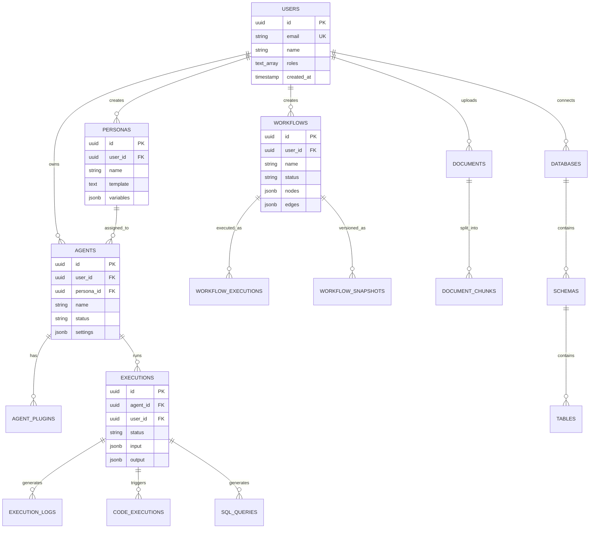
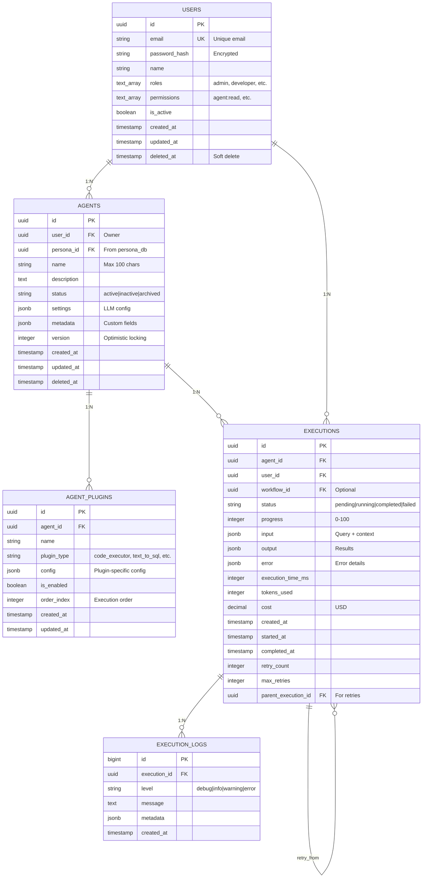
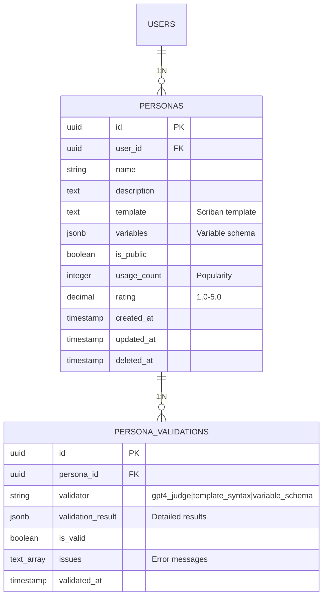
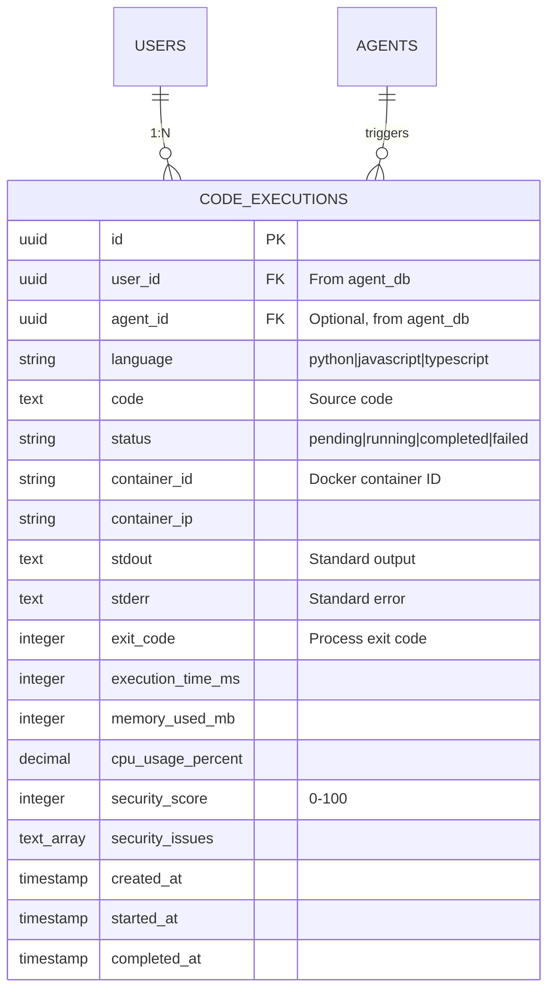
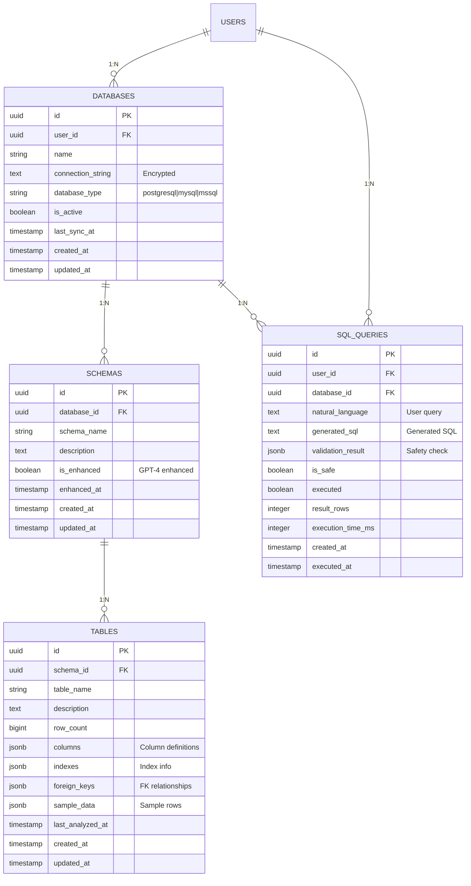
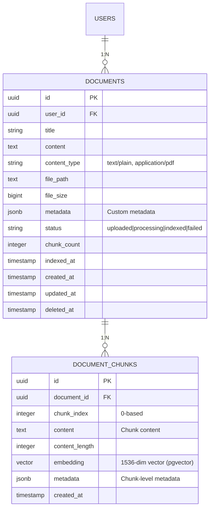
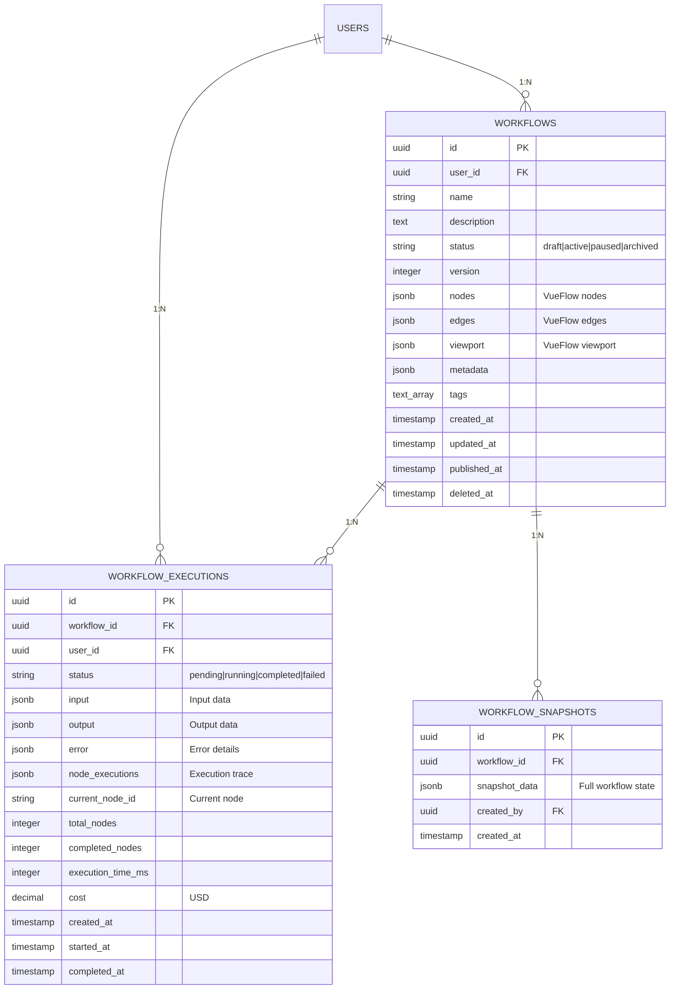

# TID Part 3.2: 實體關係設計 (Entity Relationships Design)

**文檔版本**: v1.0.0
**創建日期**: 2025-10-30
**狀態**: ✅ 完成
**所屬**: Part 3 - Data Model Design

---

## 目錄

1. [整體 ER 圖](#1-整體-er-圖)
2. [Agent Service 關係](#2-agent-service-關係)
3. [Persona Service 關係](#3-persona-service-關係)
4. [Code Execution Service 關係](#4-code-execution-service-關係)
5. [Text-to-SQL Service 關係](#5-text-to-sql-service-關係)
6. [Knowledge Base Service 關係](#6-knowledge-base-service-關係)
7. [Workflow Service 關係](#7-workflow-service-關係)
8. [跨服務關係](#8-跨服務關係)
9. [數據完整性約束](#9-數據完整性約束)

---

## 1. 整體 ER 圖

### 1.1 跨服務實體關係



### 1.2 關係類型說明

| 關係 | 基數 | 說明 |
|------|------|------|
| User → Agent | 1:N | 用戶可創建多個 Agent |
| User → Persona | 1:N | 用戶可創建多個 Persona |
| Persona → Agent | 1:N | Persona 可被多個 Agent 使用 |
| Agent → Execution | 1:N | Agent 可有多次執行 |
| Agent → Plugin | 1:N | Agent 可有多個插件 |
| Workflow → Execution | 1:N | Workflow 可被多次執行 |
| Document → Chunk | 1:N | 文檔可分割為多個 Chunk |
| Database → Schema | 1:N | 數據庫包含多個 Schema |
| Execution → Log | 1:N | 執行產生多條日誌 |

---

## 2. Agent Service 關係

### 2.1 Agent Service ER 圖



### 2.2 關係詳細說明

#### 2.2.1 User → Agent (1:N)

```sql
-- 外鍵約束
ALTER TABLE agents
ADD CONSTRAINT fk_agents_user_id
FOREIGN KEY (user_id)
REFERENCES users(id)
ON DELETE CASCADE;

-- 查詢: 獲取用戶的所有 Agent
SELECT a.*
FROM agents a
WHERE a.user_id = 'user-123'
  AND a.deleted_at IS NULL
ORDER BY a.created_at DESC;
```

#### 2.2.2 Agent → AgentPlugin (1:N)

```sql
-- 外鍵約束
ALTER TABLE agent_plugins
ADD CONSTRAINT fk_agent_plugins_agent_id
FOREIGN KEY (agent_id)
REFERENCES agents(id)
ON DELETE CASCADE;

-- 查詢: 獲取 Agent 的所有啟用插件
SELECT ap.*
FROM agent_plugins ap
WHERE ap.agent_id = 'agent-123'
  AND ap.is_enabled = true
ORDER BY ap.order_index;
```

#### 2.2.3 Agent → Execution (1:N)

```sql
-- 外鍵約束
ALTER TABLE executions
ADD CONSTRAINT fk_executions_agent_id
FOREIGN KEY (agent_id)
REFERENCES agents(id)
ON DELETE CASCADE;

-- 查詢: 獲取 Agent 的最近 10 次執行
SELECT e.*
FROM executions e
WHERE e.agent_id = 'agent-123'
ORDER BY e.created_at DESC
LIMIT 10;
```

#### 2.2.4 Execution → ExecutionLog (1:N, 分區表)

```sql
-- 外鍵約束 (注意: 分區表不支持跨分區 FK)
-- 使用應用層保證一致性

-- 查詢: 獲取執行的日誌
SELECT el.*
FROM execution_logs el
WHERE el.execution_id = 'exec-123'
  AND el.created_at >= '2025-10-01'  -- 分區裁剪
  AND el.created_at < '2025-11-01'
ORDER BY el.created_at;
```

#### 2.2.5 Execution → Execution (自引用: 重試)

```sql
-- 外鍵約束
ALTER TABLE executions
ADD CONSTRAINT fk_executions_parent_id
FOREIGN KEY (parent_execution_id)
REFERENCES executions(id)
ON DELETE SET NULL;

-- 查詢: 獲取重試鏈
WITH RECURSIVE retry_chain AS (
  SELECT id, parent_execution_id, retry_count, status
  FROM executions
  WHERE id = 'exec-123'

  UNION ALL

  SELECT e.id, e.parent_execution_id, e.retry_count, e.status
  FROM executions e
  INNER JOIN retry_chain rc ON e.parent_execution_id = rc.id
)
SELECT * FROM retry_chain;
```

---

## 3. Persona Service 關係

### 3.1 Persona Service ER 圖



### 3.2 關係詳細說明

#### 3.2.1 User → Persona (1:N)

```sql
-- 跨數據庫引用 (無 FK，應用層保證)
-- user_id references agent_db.users(id)

-- 查詢: 獲取用戶創建的 Persona
SELECT p.*
FROM personas p
WHERE p.user_id = 'user-123'
  AND p.deleted_at IS NULL
ORDER BY p.usage_count DESC;
```

#### 3.2.2 Persona → PersonaValidation (1:N)

```sql
-- 外鍵約束
ALTER TABLE persona_validations
ADD CONSTRAINT fk_persona_validations_persona_id
FOREIGN KEY (persona_id)
REFERENCES personas(id)
ON DELETE CASCADE;

-- 查詢: 獲取 Persona 的最新驗證結果
SELECT pv.*
FROM persona_validations pv
WHERE pv.persona_id = 'persona-123'
ORDER BY pv.validated_at DESC
LIMIT 1;
```

#### 3.2.3 跨服務關係: Persona → Agent

```sql
-- 無物理 FK (跨數據庫)
-- Agent 通過 persona_id 引用 Persona

-- 查詢: 獲取使用此 Persona 的所有 Agent (跨數據庫)
-- 方法 1: 應用層查詢
SELECT a.*
FROM agent_db.agents a
WHERE a.persona_id = 'persona-123';

-- 方法 2: PostgreSQL Foreign Data Wrapper (生產環境不推薦)
-- 方法 3: API Gateway 聚合查詢
```

---

## 4. Code Execution Service 關係

### 4.1 Code Execution ER 圖



### 4.2 關係詳細說明

#### 4.2.1 User → CodeExecution (1:N)

```sql
-- 跨數據庫引用 (無 FK)
-- user_id references agent_db.users(id)

-- 查詢: 獲取用戶的代碼執行歷史
SELECT ce.*
FROM code_executions ce
WHERE ce.user_id = 'user-123'
ORDER BY ce.created_at DESC
LIMIT 20;
```

#### 4.2.2 Agent → CodeExecution (1:N, Optional)

```sql
-- 跨數據庫引用 (無 FK)
-- agent_id references agent_db.agents(id)

-- 查詢: 獲取 Agent 觸發的代碼執行
SELECT ce.*
FROM code_executions ce
WHERE ce.agent_id = 'agent-123'
  AND ce.status = 'completed'
ORDER BY ce.created_at DESC;
```

---

## 5. Text-to-SQL Service 關係

### 5.1 Text-to-SQL ER 圖



### 5.2 關係詳細說明

#### 5.2.1 User → Database (1:N)

```sql
-- 跨數據庫引用
-- user_id references agent_db.users(id)

-- 查詢: 獲取用戶的數據庫連接
SELECT d.*
FROM databases d
WHERE d.user_id = 'user-123'
  AND d.is_active = true
ORDER BY d.name;
```

#### 5.2.2 Database → Schema (1:N)

```sql
-- 外鍵約束
ALTER TABLE schemas
ADD CONSTRAINT fk_schemas_database_id
FOREIGN KEY (database_id)
REFERENCES databases(id)
ON DELETE CASCADE;

-- 查詢: 獲取數據庫的所有 Schema
SELECT s.*
FROM schemas s
WHERE s.database_id = 'db-123'
ORDER BY s.schema_name;
```

#### 5.2.3 Schema → Table (1:N)

```sql
-- 外鍵約束
ALTER TABLE tables
ADD CONSTRAINT fk_tables_schema_id
FOREIGN KEY (schema_id)
REFERENCES schemas(id)
ON DELETE CASCADE;

-- 查詢: 獲取 Schema 的所有表
SELECT t.*
FROM tables t
WHERE t.schema_id = 'schema-123'
ORDER BY t.table_name;

-- 查詢: 搜索包含特定列的表
SELECT t.table_name, t.columns
FROM tables t
WHERE t.schema_id = 'schema-123'
  AND t.columns @> '[{"name": "user_id"}]'::jsonb;
```

#### 5.2.4 User + Database → SqlQuery (N:1:N)

```sql
-- 跨數據庫引用 + 本地引用
ALTER TABLE sql_queries
ADD CONSTRAINT fk_sql_queries_database_id
FOREIGN KEY (database_id)
REFERENCES databases(id)
ON DELETE CASCADE;

-- 查詢: 獲取用戶在特定數據庫的查詢歷史
SELECT sq.*
FROM sql_queries sq
WHERE sq.user_id = 'user-123'
  AND sq.database_id = 'db-123'
  AND sq.is_safe = true
ORDER BY sq.created_at DESC
LIMIT 10;
```

---

## 6. Knowledge Base Service 關係

### 6.1 Knowledge Base ER 圖



### 6.2 關係詳細說明

#### 6.2.1 User → Document (1:N)

```sql
-- 跨數據庫引用
-- user_id references agent_db.users(id)

-- 查詢: 獲取用戶的文檔
SELECT d.*
FROM documents d
WHERE d.user_id = 'user-123'
  AND d.deleted_at IS NULL
  AND d.status = 'indexed'
ORDER BY d.created_at DESC;
```

#### 6.2.2 Document → DocumentChunk (1:N)

```sql
-- 外鍵約束
ALTER TABLE document_chunks
ADD CONSTRAINT fk_document_chunks_document_id
FOREIGN KEY (document_id)
REFERENCES documents(id)
ON DELETE CASCADE;

-- 查詢: 獲取文檔的所有 Chunk
SELECT dc.*
FROM document_chunks dc
WHERE dc.document_id = 'doc-123'
ORDER BY dc.chunk_index;

-- 查詢: 向量相似度搜索 (pgvector)
SELECT dc.*, dc.embedding <=> '[0.1, 0.2, ...]'::vector AS distance
FROM document_chunks dc
WHERE dc.document_id IN (
  SELECT id FROM documents WHERE user_id = 'user-123'
)
ORDER BY distance
LIMIT 5;
```

---

## 7. Workflow Service 關係

### 7.1 Workflow Service ER 圖



### 7.2 關係詳細說明

#### 7.2.1 User → Workflow (1:N)

```sql
-- 跨數據庫引用
-- user_id references agent_db.users(id)

-- 查詢: 獲取用戶的 Workflow
SELECT w.*
FROM workflows w
WHERE w.user_id = 'user-123'
  AND w.deleted_at IS NULL
  AND w.status = 'active'
ORDER BY w.updated_at DESC;
```

#### 7.2.2 Workflow → WorkflowExecution (1:N)

```sql
-- 外鍵約束
ALTER TABLE workflow_executions
ADD CONSTRAINT fk_workflow_executions_workflow_id
FOREIGN KEY (workflow_id)
REFERENCES workflows(id)
ON DELETE CASCADE;

-- 查詢: 獲取 Workflow 的執行歷史
SELECT we.*
FROM workflow_executions we
WHERE we.workflow_id = 'workflow-123'
ORDER BY we.created_at DESC
LIMIT 10;
```

#### 7.2.3 Workflow → WorkflowSnapshot (1:N)

```sql
-- 外鍵約束
ALTER TABLE workflow_snapshots
ADD CONSTRAINT fk_workflow_snapshots_workflow_id
FOREIGN KEY (workflow_id)
REFERENCES workflows(id)
ON DELETE CASCADE;

-- 查詢: 獲取 Workflow 的最新快照
SELECT ws.*
FROM workflow_snapshots ws
WHERE ws.workflow_id = 'workflow-123'
ORDER BY ws.created_at DESC
LIMIT 1;

-- 查詢: 獲取 30 分鐘前的快照 (CRDT 恢復)
SELECT ws.*
FROM workflow_snapshots ws
WHERE ws.workflow_id = 'workflow-123'
  AND ws.created_at >= NOW() - INTERVAL '30 minutes'
ORDER BY ws.created_at DESC;
```

---

## 8. 跨服務關係

### 8.1 跨數據庫引用策略

```yaml
cross_database_references:
  strategy: "Application-level enforcement"
  reasons:
    - PostgreSQL 不支持跨數據庫 FK
    - 微服務獨立性
    - 避免分布式事務

  implementation:
    - API level validation
    - Eventual consistency
    - Saga pattern for transactions
```

### 8.2 跨服務查詢示例

#### 8.2.1 獲取 Agent 及其 Persona 詳情

```csharp
// Application-level join
public async Task<AgentWithPersonaDto> GetAgentWithPersonaAsync(Guid agentId)
{
    // 1. Query Agent from agent_db
    var agent = await _agentRepository.GetByIdAsync(agentId);

    // 2. Query Persona from persona_db via API/gRPC
    var persona = await _personaServiceClient.GetPersonaAsync(agent.PersonaId);

    // 3. Combine results
    return new AgentWithPersonaDto
    {
        Agent = agent,
        Persona = persona
    };
}
```

#### 8.2.2 獲取 Execution 及其觸發的 Code Execution

```csharp
public async Task<ExecutionDetailsDto> GetExecutionDetailsAsync(Guid executionId)
{
    // 1. Query Execution from agent_db
    var execution = await _executionRepository.GetByIdAsync(executionId);

    // 2. Query related Code Executions from code_db
    var codeExecutions = await _codeServiceClient
        .GetExecutionsByAgentExecutionAsync(executionId);

    // 3. Query related SQL Queries from sql_db
    var sqlQueries = await _sqlServiceClient
        .GetQueriesByAgentExecutionAsync(executionId);

    return new ExecutionDetailsDto
    {
        Execution = execution,
        CodeExecutions = codeExecutions,
        SqlQueries = sqlQueries
    };
}
```

### 8.3 數據一致性保證

#### 8.3.1 Saga Pattern 示例

```csharp
// Create Agent with Persona validation
public async Task<Agent> CreateAgentWithValidationAsync(CreateAgentRequest request)
{
    var sagaId = Guid.NewGuid();

    try
    {
        // Step 1: Validate Persona exists (via API)
        var persona = await _personaServiceClient.GetPersonaAsync(request.PersonaId);
        if (persona == null)
            throw new NotFoundException($"Persona {request.PersonaId} not found");

        // Step 2: Create Agent
        var agent = new Agent
        {
            Id = Guid.NewGuid(),
            UserId = request.UserId,
            PersonaId = request.PersonaId,
            Name = request.Name
        };
        await _agentRepository.CreateAsync(agent);

        // Step 3: Increment Persona usage count (via API)
        await _personaServiceClient.IncrementUsageCountAsync(request.PersonaId);

        return agent;
    }
    catch (Exception ex)
    {
        // Compensating transaction: rollback
        _logger.LogError(ex, "Saga {SagaId} failed", sagaId);
        // Clean up created agent if needed
        throw;
    }
}
```

---

## 9. 數據完整性約束

### 9.1 主鍵約束

```sql
-- 所有表使用 UUID 主鍵
-- 優點: 分布式友好、無序列依賴
-- 缺點: 索引略大

CREATE TABLE agents (
    id UUID PRIMARY KEY DEFAULT gen_random_uuid(),
    ...
);
```

### 9.2 外鍵約束

```sql
-- 本地外鍵 (同數據庫)
ALTER TABLE agent_plugins
ADD CONSTRAINT fk_agent_plugins_agent_id
FOREIGN KEY (agent_id)
REFERENCES agents(id)
ON DELETE CASCADE  -- 級聯刪除
ON UPDATE CASCADE; -- 級聯更新

-- 跨數據庫引用 (無 FK，應用層保證)
-- agents.persona_id → persona_db.personas.id
-- 使用 CHECK constraint 驗證 UUID 格式
ALTER TABLE agents
ADD CONSTRAINT chk_agents_persona_id
CHECK (persona_id ~ '^[0-9a-f]{8}-[0-9a-f]{4}-[0-9a-f]{4}-[0-9a-f]{4}-[0-9a-f]{12}$');
```

### 9.3 唯一約束

```sql
-- 單列唯一
ALTER TABLE users
ADD CONSTRAINT uk_users_email UNIQUE (email);

-- 多列唯一
ALTER TABLE agent_plugins
ADD CONSTRAINT uk_agent_plugins_type
UNIQUE (agent_id, plugin_type)
WHERE is_enabled = true;  -- 部分唯一約束
```

### 9.4 檢查約束

```sql
-- 枚舉值檢查
ALTER TABLE agents
ADD CONSTRAINT chk_agents_status
CHECK (status IN ('active', 'inactive', 'archived'));

-- 範圍檢查
ALTER TABLE executions
ADD CONSTRAINT chk_executions_progress
CHECK (progress >= 0 AND progress <= 100);

-- 邏輯檢查
ALTER TABLE executions
ADD CONSTRAINT chk_executions_timestamps
CHECK (
    (started_at IS NULL OR started_at >= created_at) AND
    (completed_at IS NULL OR completed_at >= started_at)
);
```

### 9.5 NOT NULL 約束

```sql
-- 必填字段
ALTER TABLE agents
ALTER COLUMN name SET NOT NULL,
ALTER COLUMN user_id SET NOT NULL,
ALTER COLUMN persona_id SET NOT NULL,
ALTER COLUMN status SET NOT NULL;
```

### 9.6 默認值

```sql
-- 時間戳默認值
ALTER TABLE agents
ALTER COLUMN created_at SET DEFAULT NOW(),
ALTER COLUMN updated_at SET DEFAULT NOW();

-- JSONB 默認值
ALTER TABLE agents
ALTER COLUMN settings SET DEFAULT '{
    "temperature": 0.7,
    "max_tokens": 4000,
    "top_p": 1.0
}'::jsonb;

-- 數組默認值
ALTER TABLE users
ALTER COLUMN roles SET DEFAULT ARRAY['user']::TEXT[];
```

### 9.7 觸發器約束

```sql
-- 自動更新 updated_at
CREATE OR REPLACE FUNCTION update_updated_at_column()
RETURNS TRIGGER AS $$
BEGIN
    NEW.updated_at = NOW();
    RETURN NEW;
END;
$$ LANGUAGE plpgsql;

CREATE TRIGGER trigger_agents_updated_at
BEFORE UPDATE ON agents
FOR EACH ROW
EXECUTE FUNCTION update_updated_at_column();

-- 自動更新 Persona usage_count
CREATE OR REPLACE FUNCTION increment_persona_usage()
RETURNS TRIGGER AS $$
BEGIN
    -- 跨數據庫操作需要通過 API/Message Queue
    -- 這裡僅示例，實際應在應用層處理
    PERFORM pg_notify('persona_usage_increment', NEW.persona_id::text);
    RETURN NEW;
END;
$$ LANGUAGE plpgsql;

CREATE TRIGGER trigger_agents_persona_usage
AFTER INSERT ON agents
FOR EACH ROW
EXECUTE FUNCTION increment_persona_usage();
```

---

## 總結

### ER 設計要點

1. **清晰的關係定義**: 明確 1:1, 1:N, N:M 關係
2. **跨服務引用**: 應用層保證一致性，無物理 FK
3. **級聯操作**: 合理使用 ON DELETE CASCADE
4. **約束完整**: PK, FK, UK, CHK, NOT NULL 齊全
5. **索引優化**: 外鍵列、查詢列添加索引
6. **軟刪除支持**: deleted_at 列保留歷史數據
7. **審計追蹤**: created_at, updated_at 自動維護

### 關係統計

| 服務 | 表數 | 本地關係 | 跨服務關係 |
|------|------|---------|-----------|
| Agent Service | 5 | 8 | 2 (Persona, Workflow) |
| Persona Service | 2 | 1 | 1 (Agent) |
| Code Execution | 1 | 0 | 2 (User, Agent) |
| Text-to-SQL | 4 | 3 | 1 (User) |
| Knowledge Base | 2 | 1 | 1 (User) |
| Workflow Service | 3 | 3 | 1 (User) |
| **Total** | **17** | **16** | **8** |

### ER 圖工具推薦

| 工具 | 類型 | 適用場景 |
|------|------|---------|
| **Mermaid** | 文本驅動 | 文檔嵌入、版本控制 |
| **dbdiagram.io** | 在線工具 | 快速原型設計 |
| **pgAdmin** | PostgreSQL 工具 | 從現有數據庫生成 |
| **DataGrip** | IDE | 專業數據庫開發 |

### 下一步

✅ **Part 3 完成**: 數據模型設計 (2/2 files)
- 06-DATABASE-SCHEMA.md
- 07-ENTITY-RELATIONSHIPS.md

📋 **接下來**: Part 4 - 安全架構設計 (3 files)
- 08-SECURITY-ARCHITECTURE.md
- 09-AUTHENTICATION-AUTHORIZATION.md
- 10-POC3-SECURITY-HARDENING.md

---

**文檔版本**: v1.0.0
**最後更新**: 2025-10-30
**作者**: AI Workflow Platform Team
