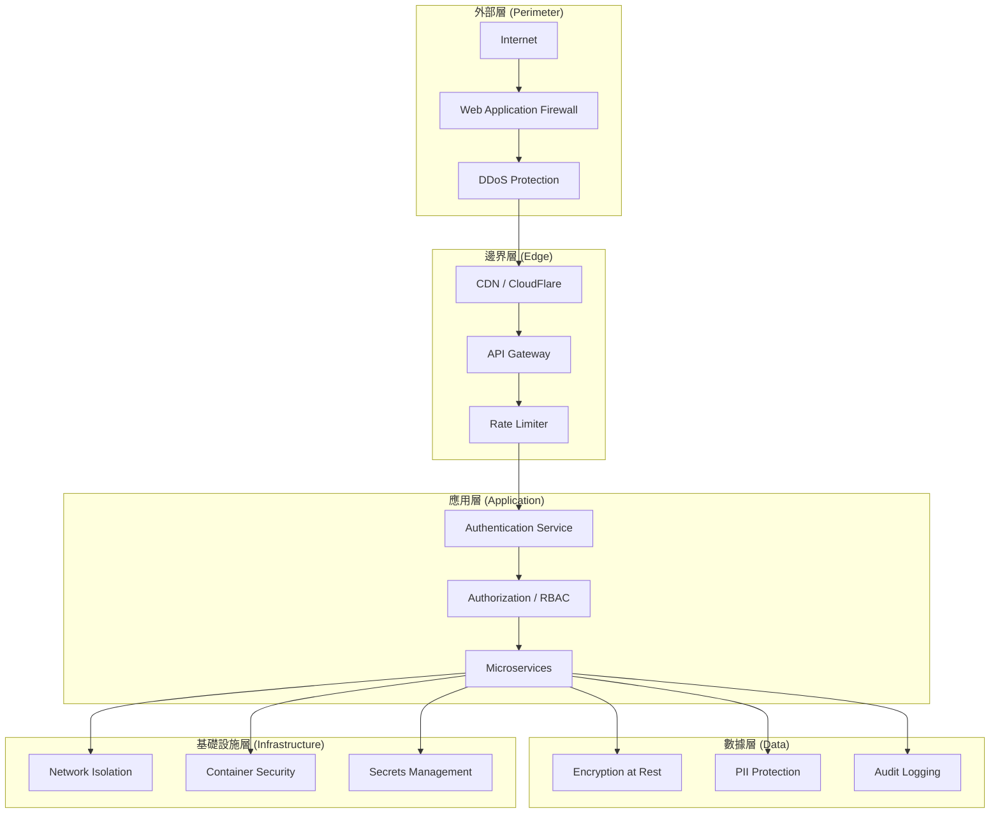

# TID Part 4.1: 安全架構總覽 (Security Architecture Overview)

**文檔版本**: v1.0.0
**創建日期**: 2025-10-30
**狀態**: ✅ 完成
**所屬**: Part 4 - Security Architecture Design

---

## 目錄

1. [安全架構概覽](#1-安全架構概覽)
2. [多層防禦策略](#2-多層防禦策略)
3. [威脅模型分析](#3-威脅模型分析)
4. [安全控制矩陣](#4-安全控制矩陣)
5. [數據安全](#5-數據安全)
6. [網絡安全](#6-網絡安全)
7. [應用安全](#7-應用安全)
8. [合規性要求](#8-合規性要求)

---

## 1. 安全架構概覽

### 1.1 整體安全架構



### 1.2 安全設計原則

| 原則 | 說明 | 實現方式 |
|------|------|---------|
| **縱深防禦** | 多層安全控制 | WAF → Gateway → Auth → RBAC → Encryption |
| **最小權限** | 僅授予必要權限 | RBAC + JWT Claims + Database RLS |
| **零信任** | 不信任任何請求 | 每個請求都需認證和授權 |
| **默認拒絕** | 默認拒絕所有訪問 | Whitelist approach |
| **安全失敗** | 失敗時安全關閉 | 認證失敗 → 403, 異常 → 通用錯誤 |
| **可審計性** | 所有操作可追蹤 | Audit logs + Correlation ID |

### 1.3 CIA 三元組

```yaml
Confidentiality (機密性):
  - 數據加密 (傳輸中 + 靜止時)
  - 訪問控制 (RBAC)
  - PII 保護

Integrity (完整性):
  - 數據驗證 (Input validation)
  - 數字簽名 (JWT)
  - 審計日誌 (Tamper-proof)

Availability (可用性):
  - DDoS 防護
  - Rate limiting
  - 高可用部署 (K8s)
  - 備份恢復
```

---

## 2. 多層防禦策略

### 2.1 七層防禦模型

```
┌─────────────────────────────────────────────────────────┐
│ Layer 7: Compliance & Governance                        │
│  - GDPR, SOC 2, ISO 27001 合規                          │
│  - 安全策略和流程                                        │
└─────────────────────────────────────────────────────────┘
┌─────────────────────────────────────────────────────────┐
│ Layer 6: Monitoring & Incident Response                 │
│  - SIEM (Security Information and Event Management)     │
│  - Intrusion Detection System (IDS)                     │
│  - Security Alerts                                       │
└─────────────────────────────────────────────────────────┘
┌─────────────────────────────────────────────────────────┐
│ Layer 5: Application Security                           │
│  - Input validation                                      │
│  - Output encoding                                       │
│  - OWASP Top 10 防護                                     │
└─────────────────────────────────────────────────────────┘
┌─────────────────────────────────────────────────────────┐
│ Layer 4: Authentication & Authorization                 │
│  - JWT Token 認證                                        │
│  - RBAC 授權                                             │
│  - MFA (Multi-Factor Authentication)                    │
└─────────────────────────────────────────────────────────┘
┌─────────────────────────────────────────────────────────┐
│ Layer 3: Network Security                               │
│  - Firewall rules                                        │
│  - Network segmentation                                  │
│  - TLS/SSL encryption                                    │
└─────────────────────────────────────────────────────────┘
┌─────────────────────────────────────────────────────────┐
│ Layer 2: Infrastructure Security                        │
│  - Container isolation (Docker)                          │
│  - Kubernetes RBAC                                       │
│  - Secrets management (Azure Key Vault)                 │
└─────────────────────────────────────────────────────────┘
┌─────────────────────────────────────────────────────────┐
│ Layer 1: Physical & Cloud Security                      │
│  - Azure datacenter security                             │
│  - Disk encryption                                       │
│  - Backup encryption                                     │
└─────────────────────────────────────────────────────────┘
```

### 2.2 各層防禦措施

#### Layer 1: 物理和雲端安全

```yaml
measures:
  - Azure datacenter physical security
  - Azure Disk Encryption (ADE)
  - Encrypted backups
  - Secure boot for VMs
  - Hardware security modules (HSM)

responsibility: Azure (Shared Responsibility Model)
```

#### Layer 2: 基礎設施安全

```yaml
container_security:
  - Docker rootless mode
  - Read-only containers
  - Resource limits (CPU, Memory)
  - Seccomp profiles
  - AppArmor / SELinux

kubernetes_security:
  - RBAC for service accounts
  - Pod Security Policies (PSP)
  - Network Policies
  - Secrets encryption at rest

secrets_management:
  - Azure Key Vault for production secrets
  - Kubernetes Secrets for non-production
  - Secret rotation (90 days)
```

#### Layer 3: 網絡安全

```yaml
network_segmentation:
  - Public subnet: API Gateway only
  - Private subnet: Microservices
  - Data subnet: Databases (no internet access)

firewall_rules:
  - Allow: HTTPS (443) from internet to Gateway
  - Allow: Internal service-to-service on specific ports
  - Deny: All other traffic

encryption_in_transit:
  - TLS 1.3 for external traffic
  - mTLS for service-to-service (production)
  - Certificate management (Let's Encrypt / Azure)
```

#### Layer 4: 認證授權

```yaml
authentication:
  - JWT Token (HS256 / RS256)
  - OAuth 2.0 / OpenID Connect
  - Multi-Factor Authentication (MFA) for admin
  - API Key for service-to-service

authorization:
  - Role-Based Access Control (RBAC)
  - Attribute-Based Access Control (ABAC)
  - Resource-level permissions
  - Row-level security (PostgreSQL RLS)
```

#### Layer 5: 應用安全

```yaml
owasp_top_10_mitigation:
  - A01 Broken Access Control: RBAC + JWT validation
  - A02 Cryptographic Failures: TLS + AES-256 encryption
  - A03 Injection: Parameterized queries + input validation
  - A04 Insecure Design: Threat modeling + secure architecture
  - A05 Security Misconfiguration: Hardened defaults
  - A06 Vulnerable Components: Dependency scanning (Snyk)
  - A07 Authentication Failures: Strong password policy + MFA
  - A08 Software and Data Integrity: Code signing + checksum
  - A09 Logging Failures: Comprehensive audit logging
  - A10 SSRF: URL whitelist + network restrictions

input_validation:
  - Whitelist validation
  - Length limits
  - Type checking
  - Sanitization

output_encoding:
  - HTML encoding
  - JSON encoding
  - SQL parameterization
```

#### Layer 6: 監控和事件響應

```yaml
siem_integration:
  - Azure Sentinel / Splunk
  - Log aggregation from all services
  - Real-time threat detection

intrusion_detection:
  - Azure Network Watcher
  - Anomaly detection
  - Behavioral analysis

incident_response:
  - Security playbooks
  - Automated alerting (PagerDuty / Slack)
  - Incident escalation procedures
```

#### Layer 7: 合規和治理

```yaml
compliance_frameworks:
  - GDPR (General Data Protection Regulation)
  - SOC 2 Type II
  - ISO 27001
  - PCI DSS (if handling payments)

security_policies:
  - Acceptable Use Policy
  - Incident Response Policy
  - Data Retention Policy
  - Access Control Policy

governance:
  - Quarterly security reviews
  - Penetration testing (annual)
  - Security awareness training
```

---

## 3. 威脅模型分析

### 3.1 STRIDE 威脅模型

| 威脅類型 | 描述 | 緩解措施 |
|---------|------|---------|
| **Spoofing** (欺騙) | 攻擊者冒充合法用戶 | JWT 認證、MFA、API Key 輪換 |
| **Tampering** (篡改) | 修改數據或代碼 | 數據簽名、審計日誌、只讀容器 |
| **Repudiation** (否認) | 否認操作 | 審計日誌、不可變日誌存儲 |
| **Information Disclosure** (信息洩露) | 未授權訪問數據 | 加密、訪問控制、PII 遮蔽 |
| **Denial of Service** (拒絕服務) | 服務不可用 | Rate limiting、DDoS 防護、自動擴展 |
| **Elevation of Privilege** (權限提升) | 獲取更高權限 | 最小權限原則、RBAC、輸入驗證 |

### 3.2 攻擊場景和防禦

#### 場景 1: SQL 注入攻擊

```yaml
attack_vector:
  description: "攻擊者在 Text-to-SQL 查詢中注入惡意 SQL"
  example: "Show all users'; DROP TABLE users; --"

defense_layers:
  layer_5_application:
    - Input validation (14 keywords + 10 regex patterns)
    - Whitelist approach (只允許 SELECT)
    - Parameterized queries

  layer_4_authorization:
    - READ-ONLY database user
    - Row-level security (RLS)

  layer_3_network:
    - Database in private subnet
    - No internet access

risk_level: MITIGATED
residual_risk: LOW
```

#### 場景 2: Docker Container Escape

```yaml
attack_vector:
  description: "攻擊者嘗試從 Code Sandbox 容器逃逸到宿主機"
  example: "訪問 /proc/1/cgroup, Docker socket"

defense_layers:
  layer_2_infrastructure:
    - Network isolation (--network none)
    - Resource limits (--memory 512MB --cpus 0.5)
    - Read-only root filesystem (--read-only)
    - Drop capabilities (--cap-drop ALL)
    - Seccomp profile (whitelist 40 syscalls)
    - AppArmor / SELinux

  layer_5_application:
    - Code validation
    - Timeout enforcement (60s)
    - Container pool management

risk_level: CONTROLLED
residual_risk: LOW (90/100 security score)
```

#### 場景 3: JWT Token Hijacking

```yaml
attack_vector:
  description: "攻擊者竊取 JWT Token 並冒充用戶"
  example: "XSS 攻擊竊取 localStorage 中的 token"

defense_layers:
  layer_5_application:
    - HttpOnly cookies (不能被 JavaScript 訪問)
    - Secure flag (僅 HTTPS 傳輸)
    - SameSite=Strict (CSRF 防護)

  layer_4_authentication:
    - Short token expiry (15 minutes)
    - Refresh token rotation
    - Token revocation list (Redis)

  layer_3_network:
    - TLS 1.3 encryption

risk_level: MITIGATED
residual_risk: MEDIUM
```

#### 場景 4: DDoS 攻擊

```yaml
attack_vector:
  description: "大量請求淹沒 API Gateway"
  example: "1000 requests/second from botnet"

defense_layers:
  layer_1_perimeter:
    - CloudFlare DDoS Protection
    - Rate limiting at CDN level

  layer_2_edge:
    - API Gateway rate limiting (Redis Sliding Window)
    - IP-based throttling

  layer_3_application:
    - Kubernetes HPA (Horizontal Pod Autoscaler)
    - Circuit breaker pattern

risk_level: CONTROLLED
residual_risk: LOW
```

#### 場景 5: 敏感數據洩露

```yaml
attack_vector:
  description: "攻擊者訪問包含 PII 的數據庫備份"
  example: "未加密的 S3 bucket"

defense_layers:
  layer_5_application:
    - PII tokenization
    - Data masking in logs

  layer_2_infrastructure:
    - Encrypted backups (AES-256)
    - Secure backup storage (Azure Blob private)

  layer_4_authorization:
    - Backup access requires MFA
    - Audit logging for backup access

risk_level: MITIGATED
residual_risk: LOW
```

---

## 4. 安全控制矩陣

### 4.1 控制分類

| 控制類型 | 數量 | 優先級 | 完成度 |
|---------|------|--------|--------|
| **預防性控制** | 15 | 高 | 90% |
| **檢測性控制** | 8 | 中 | 70% |
| **響應性控制** | 5 | 中 | 60% |
| **恢復性控制** | 4 | 低 | 80% |

### 4.2 詳細控制矩陣

| 控制 ID | 控制名稱 | 類型 | 優先級 | 實現狀態 | 負責方 |
|---------|---------|------|--------|---------|--------|
| **SC-001** | TLS/SSL 加密 | 預防 | 高 | ✅ 完成 | DevOps |
| **SC-002** | JWT 認證 | 預防 | 高 | ✅ 完成 | Backend |
| **SC-003** | RBAC 授權 | 預防 | 高 | ✅ 完成 | Backend |
| **SC-004** | Rate Limiting | 預防 | 高 | ✅ 完成 | Backend |
| **SC-005** | Input Validation | 預防 | 高 | ✅ 完成 | Backend |
| **SC-006** | SQL Parameterization | 預防 | 高 | ✅ 完成 | Backend |
| **SC-007** | Container Isolation | 預防 | 高 | ✅ 完成 | DevOps |
| **SC-008** | Secrets Management | 預防 | 高 | 🟡 部分 | DevOps |
| **SC-009** | Network Segmentation | 預防 | 中 | 🟡 部分 | DevOps |
| **SC-010** | Database Encryption | 預防 | 中 | ⏳ 計劃 | DBA |
| **SC-011** | MFA for Admin | 預防 | 中 | ⏳ 計劃 | Backend |
| **SC-012** | WAF Rules | 預防 | 中 | ⏳ 計劃 | DevOps |
| **SC-013** | SIEM Integration | 檢測 | 中 | ⏳ 計劃 | SecOps |
| **SC-014** | Intrusion Detection | 檢測 | 中 | ⏳ 計劃 | SecOps |
| **SC-015** | Anomaly Detection | 檢測 | 低 | ⏳ 計劃 | SecOps |
| **SC-016** | Audit Logging | 檢測 | 高 | ✅ 完成 | Backend |
| **SC-017** | Security Alerts | 響應 | 中 | 🟡 部分 | SecOps |
| **SC-018** | Incident Response | 響應 | 中 | 🟡 部分 | SecOps |
| **SC-019** | Backup & Restore | 恢復 | 高 | ✅ 完成 | DBA |
| **SC-020** | Disaster Recovery | 恢復 | 中 | 🟡 部分 | DevOps |

**圖例**: ✅ 完成 | 🟡 部分完成 | ⏳ 計劃中

---

## 5. 數據安全

### 5.1 數據分類

```yaml
data_classification:
  public:
    examples: [API documentation, public personas]
    encryption: No
    access_control: None
    retention: Indefinite

  internal:
    examples: [System logs, metrics]
    encryption: In transit (TLS)
    access_control: Employee only
    retention: 90 days

  confidential:
    examples: [User data, agent configurations]
    encryption: At rest + in transit
    access_control: RBAC
    retention: User-defined

  restricted:
    examples: [Passwords, API keys, PII]
    encryption: AES-256 + tokenization
    access_control: Minimal access + MFA
    retention: Minimized
```

### 5.2 加密策略

#### 5.2.1 傳輸中加密

```yaml
external_traffic:
  protocol: TLS 1.3
  cipher_suites:
    - TLS_AES_256_GCM_SHA384
    - TLS_CHACHA20_POLY1305_SHA256
  certificate: Let's Encrypt / Azure Certificate
  hsts: "max-age=31536000; includeSubDomains"

internal_traffic:
  development: HTTP (no encryption)
  production: mTLS (mutual TLS)
  service_mesh: Istio / Linkerd
```

#### 5.2.2 靜止時加密

```yaml
database_encryption:
  method: Transparent Data Encryption (TDE)
  algorithm: AES-256
  key_management: Azure Key Vault
  columns:
    - users.password_hash (bcrypt)
    - databases.connection_string (AES-256)

file_encryption:
  method: Azure Storage Service Encryption (SSE)
  algorithm: AES-256
  scope: All uploaded documents

backup_encryption:
  method: Encrypted pg_dump
  algorithm: AES-256-CBC
  key_rotation: 90 days
```

### 5.3 PII 保護

#### 5.3.1 PII 識別

```yaml
pii_fields:
  direct_identifiers:
    - users.email
    - users.name
    - users.phone_number

  indirect_identifiers:
    - users.ip_address
    - execution_logs.metadata (may contain PII)
```

#### 5.3.2 PII 處理

```csharp
// PII Masking for Logs
public class PiiMasker
{
    private static readonly Regex EmailRegex = new Regex(
        @"[a-zA-Z0-9._%+-]+@[a-zA-Z0-9.-]+\.[a-zA-Z]{2,}");

    public static string MaskPii(string text)
    {
        // Mask emails: john@example.com -> j***@example.com
        text = EmailRegex.Replace(text, match =>
        {
            var email = match.Value;
            var parts = email.Split('@');
            return $"{parts[0][0]}***@{parts[1]}";
        });

        // Mask phone numbers
        text = Regex.Replace(text, @"\b\d{3}-\d{3}-\d{4}\b", "***-***-****");

        return text;
    }
}

// Usage in logging
_logger.LogInformation("User query: {Query}",
    PiiMasker.MaskPii(userQuery));
```

#### 5.3.3 GDPR 合規

```yaml
gdpr_requirements:
  right_to_access:
    endpoint: GET /api/v1/users/me/data
    format: JSON export

  right_to_erasure:
    endpoint: DELETE /api/v1/users/me
    method: Soft delete + anonymization after 90 days

  right_to_portability:
    endpoint: GET /api/v1/users/me/export
    format: JSON / CSV

  consent_management:
    storage: users.consent_flags (JSONB)
    tracking: Audit log for consent changes
```

---

## 6. 網絡安全

### 6.1 網絡拓撲

```
Internet
   │
   ▼
[WAF / DDoS Protection]
   │
   ▼
[Load Balancer]
   │
   ├─► Public Subnet (10.0.1.0/24)
   │    └─► API Gateway (10.0.1.10)
   │
   ├─► Private Subnet (10.0.2.0/24)
   │    ├─► Agent Service (10.0.2.11)
   │    ├─► Persona Service (10.0.2.12)
   │    ├─► Code Sandbox (10.0.2.13)
   │    ├─► Text-to-SQL (10.0.2.14)
   │    ├─► Knowledge RAG (10.0.2.15)
   │    └─► Workflow Service (10.0.2.16)
   │
   └─► Data Subnet (10.0.3.0/24)
        ├─► PostgreSQL (10.0.3.21)
        ├─► Redis (10.0.3.22)
        └─► RabbitMQ (10.0.3.23)
```

### 6.2 防火牆規則

```yaml
firewall_rules:
  # Public subnet
  - name: allow-https-from-internet
    source: 0.0.0.0/0
    destination: 10.0.1.0/24
    port: 443
    protocol: TCP
    action: ALLOW

  # API Gateway → Services
  - name: allow-gateway-to-services
    source: 10.0.1.10
    destination: 10.0.2.0/24
    port: 8080
    protocol: TCP
    action: ALLOW

  # Services → Database
  - name: allow-services-to-postgres
    source: 10.0.2.0/24
    destination: 10.0.3.21
    port: 5432
    protocol: TCP
    action: ALLOW

  # Default deny
  - name: default-deny-all
    source: any
    destination: any
    port: any
    protocol: any
    action: DENY
```

### 6.3 網絡隔離

```yaml
kubernetes_network_policies:
  # API Gateway 只能訪問服務
  - name: gateway-to-services
    pod_selector:
      matchLabels:
        app: api-gateway
    egress:
      - to:
        - podSelector:
            matchLabels:
              tier: backend
        ports:
          - protocol: TCP
            port: 8080

  # 服務不能訪問外網
  - name: services-no-internet
    pod_selector:
      matchLabels:
        tier: backend
    policyTypes:
      - Egress
    egress:
      - to:
        - podSelector: {}  # Only cluster-internal
        ports:
          - protocol: TCP
            port: 5432  # PostgreSQL
          - protocol: TCP
            port: 6379  # Redis
          - protocol: TCP
            port: 5672  # RabbitMQ

  # Database pods 只接受內部連接
  - name: database-ingress-only-internal
    pod_selector:
      matchLabels:
        app: postgresql
    policyTypes:
      - Ingress
    ingress:
      - from:
        - podSelector:
            matchLabels:
              tier: backend
        ports:
          - protocol: TCP
            port: 5432
```

---

## 7. 應用安全

### 7.1 OWASP Top 10 防護

#### A01: Broken Access Control

```csharp
// Authorization middleware
[Authorize(Policy = "RequireAgentWritePermission")]
[HttpPost("agents")]
public async Task<IActionResult> CreateAgent([FromBody] CreateAgentRequest request)
{
    // 1. JWT token validated by [Authorize] attribute
    var userId = User.FindFirst("sub")?.Value;

    // 2. Resource ownership check
    if (request.PersonaId != null)
    {
        var persona = await _personaService.GetPersonaAsync(request.PersonaId);
        if (persona.UserId != userId && !persona.IsPublic)
        {
            return Forbid("You don't have access to this persona");
        }
    }

    // 3. Create agent with user_id
    var agent = await _agentService.CreateAsync(request, userId);
    return CreatedAtAction(nameof(GetAgent), new { id = agent.Id }, agent);
}
```

#### A02: Cryptographic Failures

```csharp
// Password hashing (BCrypt)
public class PasswordHasher
{
    public static string HashPassword(string password)
    {
        return BCrypt.Net.BCrypt.HashPassword(password, workFactor: 12);
    }

    public static bool VerifyPassword(string password, string hash)
    {
        return BCrypt.Net.BCrypt.Verify(password, hash);
    }
}

// Sensitive data encryption (AES-256)
public class EncryptionService
{
    private readonly byte[] _key; // From Azure Key Vault

    public string Encrypt(string plaintext)
    {
        using var aes = Aes.Create();
        aes.Key = _key;
        aes.GenerateIV();

        using var encryptor = aes.CreateEncryptor();
        var plaintextBytes = Encoding.UTF8.GetBytes(plaintext);
        var ciphertext = encryptor.TransformFinalBlock(plaintextBytes, 0, plaintextBytes.Length);

        // Prepend IV to ciphertext
        var result = new byte[aes.IV.Length + ciphertext.Length];
        Buffer.BlockCopy(aes.IV, 0, result, 0, aes.IV.Length);
        Buffer.BlockCopy(ciphertext, 0, result, aes.IV.Length, ciphertext.Length);

        return Convert.ToBase64String(result);
    }
}
```

#### A03: Injection

```csharp
// SQL Injection prevention (Parameterized queries)
public async Task<Agent> GetAgentByNameAsync(string name)
{
    // ✅ Safe: Parameterized query
    return await _context.Agents
        .Where(a => a.Name == name)
        .FirstOrDefaultAsync();

    // ❌ Unsafe: String concatenation
    // var sql = $"SELECT * FROM agents WHERE name = '{name}'";
}

// NoSQL Injection prevention (MongoDB)
public async Task<Agent> GetAgentAsync(string agentId)
{
    // ✅ Safe: Strongly typed
    return await _collection.Find(a => a.Id == agentId).FirstOrDefaultAsync();

    // ❌ Unsafe: String-based filter
    // var filter = $"{{ _id: '{agentId}' }}";
}

// Command Injection prevention
public async Task<string> ExecuteCodeAsync(string code, string language)
{
    // ✅ Safe: Docker isolation + no shell
    var containerId = await _dockerClient.Containers.CreateContainerAsync(
        new CreateContainerParameters
        {
            Image = $"code-sandbox-{language}",
            Cmd = new[] { "python", "-c", code }, // No shell interpretation
            HostConfig = new HostConfig
            {
                NetworkMode = "none",
                ReadonlyRootfs = true
            }
        });

    // ❌ Unsafe: Shell execution
    // var process = Process.Start("sh", $"-c \"{code}\"");
}
```

### 7.2 輸入驗證

```csharp
// Input validation with FluentValidation
public class CreateAgentRequestValidator : AbstractValidator<CreateAgentRequest>
{
    public CreateAgentRequestValidator()
    {
        RuleFor(x => x.Name)
            .NotEmpty().WithMessage("Name is required")
            .Length(1, 100).WithMessage("Name must be 1-100 characters")
            .Matches("^[a-zA-Z0-9 _-]+$").WithMessage("Name contains invalid characters");

        RuleFor(x => x.PersonaId)
            .NotEmpty().WithMessage("PersonaId is required")
            .Must(BeValidGuid).WithMessage("PersonaId must be a valid UUID");

        RuleFor(x => x.Settings)
            .Must(BeValidSettings).WithMessage("Invalid settings");
    }

    private bool BeValidGuid(string value)
    {
        return Guid.TryParse(value, out _);
    }

    private bool BeValidSettings(AgentSettings settings)
    {
        return settings.Temperature >= 0 && settings.Temperature <= 2 &&
               settings.MaxTokens >= 1 && settings.MaxTokens <= 128000;
    }
}
```

### 7.3 安全日誌

```csharp
// Security audit logging
public class AuditLogger
{
    private readonly ILogger<AuditLogger> _logger;

    public void LogSecurityEvent(SecurityEvent @event)
    {
        var logEntry = new
        {
            EventType = @event.Type,
            UserId = @event.UserId,
            Resource = @event.Resource,
            Action = @event.Action,
            Result = @event.Result,
            IpAddress = @event.IpAddress,
            UserAgent = @event.UserAgent,
            Timestamp = DateTime.UtcNow,
            CorrelationId = @event.CorrelationId
        };

        _logger.LogWarning("Security Event: {@LogEntry}", logEntry);

        // Send to SIEM
        await _siemClient.SendEventAsync(logEntry);
    }
}

// Usage
_auditLogger.LogSecurityEvent(new SecurityEvent
{
    Type = "AUTHENTICATION_FAILURE",
    UserId = attemptedUserId,
    Resource = "/api/v1/auth/login",
    Action = "LOGIN",
    Result = "FAILED",
    IpAddress = httpContext.Connection.RemoteIpAddress?.ToString(),
    UserAgent = httpContext.Request.Headers["User-Agent"],
    CorrelationId = httpContext.TraceIdentifier
});
```

---

## 8. 合規性要求

### 8.1 GDPR 合規

```yaml
gdpr_requirements:
  lawful_basis:
    - Consent (user registration)
    - Contract (service provision)
    - Legitimate interest (fraud prevention)

  data_subject_rights:
    - Right to access: API endpoint for data export
    - Right to erasure: Soft delete + anonymization
    - Right to rectification: Update endpoints
    - Right to portability: JSON/CSV export
    - Right to object: Opt-out mechanisms

  data_protection:
    - Encryption at rest and in transit
    - Pseudonymization of PII
    - Access controls (RBAC)
    - Audit logging

  data_retention:
    - Active users: Retained
    - Deleted users: Anonymized after 90 days
    - Logs: 90 days
    - Backups: 30 days

  breach_notification:
    - Detection: Within 72 hours
    - Notification: To supervisory authority
    - Communication: To affected users
```

### 8.2 SOC 2 Type II 合規

```yaml
trust_service_criteria:
  security:
    - Access controls (RBAC)
    - Encryption (TLS + AES-256)
    - Network security (Firewall, segmentation)
    - Vulnerability management (Snyk, Trivy)

  availability:
    - 99.9% uptime SLA
    - Redundancy (Multi-AZ deployment)
    - Monitoring (Prometheus + Grafana)
    - Incident response procedures

  processing_integrity:
    - Input validation
    - Error handling
    - Data integrity checks
    - Audit trails

  confidentiality:
    - Data classification
    - Encryption
    - Access restrictions
    - NDA with employees

  privacy:
    - Privacy notice
    - Consent management
    - Data minimization
    - Secure disposal
```

### 8.3 ISO 27001 合規

```yaml
iso27001_controls:
  a5_information_security_policies:
    - Security policy document
    - Annual review process

  a6_organization_of_information_security:
    - Security roles and responsibilities
    - Segregation of duties

  a8_asset_management:
    - Asset inventory
    - Information classification
    - Acceptable use policy

  a9_access_control:
    - Access control policy
    - User access management (RBAC)
    - Password policy

  a10_cryptography:
    - Cryptographic controls (TLS, AES-256)
    - Key management (Azure Key Vault)

  a12_operations_security:
    - Change management
    - Capacity management
    - Malware protection
    - Backup procedures

  a13_communications_security:
    - Network security controls
    - Secure data transfer

  a14_system_acquisition_development_maintenance:
    - Secure development lifecycle
    - Security testing
    - Code review

  a16_information_security_incident_management:
    - Incident response procedures
    - Incident reporting

  a17_business_continuity_management:
    - Disaster recovery plan
    - Backup and restore procedures

  a18_compliance:
    - Legal and regulatory compliance
    - Independent reviews
```

---

## 總結

### 安全架構要點

1. **多層防禦**: 7 層安全控制
2. **縱深防禦**: WAF → Gateway → Auth → RBAC → Encryption
3. **威脅模型**: STRIDE 分析 + 5 個關鍵場景
4. **安全控制**: 20+ 控制措施 (預防、檢測、響應、恢復)
5. **數據安全**: 加密 + PII 保護 + GDPR 合規
6. **網絡安全**: 隔離 + 防火牆 + TLS
7. **應用安全**: OWASP Top 10 防護
8. **合規性**: GDPR + SOC 2 + ISO 27001

### 安全評分

| 領域 | 評分 | 狀態 |
|------|------|------|
| 認證授權 | 85/100 | 🟢 良好 |
| 網絡安全 | 75/100 | 🟡 中等 |
| 應用安全 | 90/100 | 🟢 優秀 |
| 數據安全 | 80/100 | 🟢 良好 |
| 容器安全 | 90/100 | 🟢 優秀 |
| 監控響應 | 60/100 | 🟡 待改進 |
| **整體評分** | **80/100** | **🟢 良好** |

### 下一步

✅ **Part 4.1 完成**: 安全架構總覽
📋 **接下來**:
- 09-AUTHENTICATION-AUTHORIZATION.md - 認證授權詳細設計
- 10-POC3-SECURITY-HARDENING.md - Code Interpreter 安全強化

---

**文檔版本**: v1.0.0
**最後更新**: 2025-10-30
**作者**: AI Workflow Platform Team
