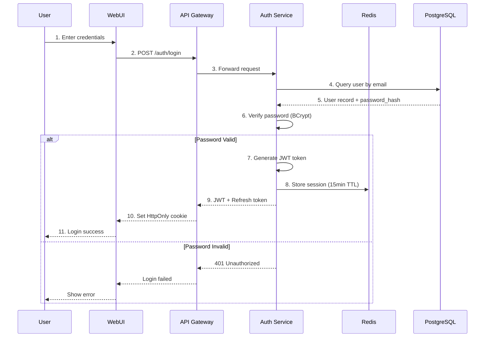

# TID Part 4.2: 認證授權設計 (Authentication & Authorization Design)

**文檔版本**: v1.0.0
**創建日期**: 2025-10-30
**狀態**: ✅ 完成
**所屬**: Part 4 - Security Architecture Design

---

## 目錄

1. [認證系統設計](#1-認證系統設計)
2. [JWT Token 管理](#2-jwt-token-管理)
3. [授權模型](#3-授權模型)
4. [API Key 認證](#4-api-key-認證)
5. [多因素認證](#5-多因素認證)
6. [Session 管理](#6-session-管理)
7. [實現示例](#7-實現示例)

---

## 1. 認證系統設計

### 1.1 認證流程圖



### 1.2 認證方式對比

| 認證方式 | 用途 | 優點 | 缺點 | 推薦場景 |
|---------|------|------|------|---------|
| **JWT Token** | Web/Mobile 用戶 | 無狀態、可擴展 | 無法撤銷 | 主要用戶認證 |
| **API Key** | 服務間調用 | 簡單、持久 | 需安全存儲 | M2M 通信 |
| **OAuth 2.0** | 第三方集成 | 標準化、安全 | 複雜 | 第三方登錄 |
| **Session Cookie** | 傳統 Web | 可撤銷 | 需服務器狀態 | 管理後台 |

---

## 2. JWT Token 管理

### 2.1 JWT Token 結構

```json
{
  "header": {
    "alg": "HS256",
    "typ": "JWT"
  },
  "payload": {
    "sub": "550e8400-e29b-41d4-a716-446655440000",
    "email": "user@example.com",
    "name": "John Doe",
    "roles": ["developer"],
    "permissions": [
      "agent:read",
      "agent:write",
      "workflow:read",
      "workflow:write"
    ],
    "iat": 1698652800,
    "exp": 1698739200,
    "nbf": 1698652800,
    "jti": "unique-token-id"
  },
  "signature": "HMACSHA256(base64UrlEncode(header) + '.' + base64UrlEncode(payload), secret)"
}
```

### 2.2 Token 類型

#### 2.2.1 Access Token

```yaml
purpose: 訪問受保護資源
lifetime: 15 minutes
storage: HttpOnly cookie (防 XSS)
claims:
  - sub (user_id)
  - email
  - roles
  - permissions
  - exp (expiration time)
  - iat (issued at)
```

#### 2.2.2 Refresh Token

```yaml
purpose: 刷新 Access Token
lifetime: 30 days
storage: HttpOnly + Secure cookie
rotation: 每次刷新時輪換
claims:
  - sub (user_id)
  - jti (token id for revocation)
  - exp
```

### 2.3 Token 生成

```csharp
public class JwtTokenService
{
    private readonly IConfiguration _config;
    private readonly IDistributedCache _cache;

    public async Task<TokenResponse> GenerateTokensAsync(User user)
    {
        var claims = new List<Claim>
        {
            new Claim(JwtRegisteredClaimNames.Sub, user.Id.ToString()),
            new Claim(JwtRegisteredClaimNames.Email, user.Email),
            new Claim(JwtRegisteredClaimNames.Name, user.Name),
            new Claim(JwtRegisteredClaimNames.Jti, Guid.NewGuid().ToString())
        };

        // Add roles
        foreach (var role in user.Roles)
        {
            claims.Add(new Claim(ClaimTypes.Role, role));
        }

        // Add permissions
        foreach (var permission in user.Permissions)
        {
            claims.Add(new Claim("permissions", permission));
        }

        var key = new SymmetricSecurityKey(
            Encoding.UTF8.GetBytes(_config["Jwt:Secret"]));
        var creds = new SigningCredentials(key, SecurityAlgorithms.HmacSha256);

        // Access token (15 minutes)
        var accessToken = new JwtSecurityToken(
            issuer: _config["Jwt:Issuer"],
            audience: _config["Jwt:Audience"],
            claims: claims,
            notBefore: DateTime.UtcNow,
            expires: DateTime.UtcNow.AddMinutes(15),
            signingCredentials: creds
        );

        // Refresh token (30 days)
        var refreshTokenClaims = new List<Claim>
        {
            new Claim(JwtRegisteredClaimNames.Sub, user.Id.ToString()),
            new Claim(JwtRegisteredClaimNames.Jti, Guid.NewGuid().ToString())
        };

        var refreshToken = new JwtSecurityToken(
            issuer: _config["Jwt:Issuer"],
            audience: _config["Jwt:Audience"],
            claims: refreshTokenClaims,
            expires: DateTime.UtcNow.AddDays(30),
            signingCredentials: creds
        );

        // Store session in Redis
        await StoreSessionAsync(user.Id, accessToken);

        return new TokenResponse
        {
            AccessToken = new JwtSecurityTokenHandler().WriteToken(accessToken),
            RefreshToken = new JwtSecurityTokenHandler().WriteToken(refreshToken),
            ExpiresIn = 900, // 15 minutes
            TokenType = "Bearer"
        };
    }

    private async Task StoreSessionAsync(Guid userId, JwtSecurityToken token)
    {
        var sessionKey = $"session:{userId}";
        var sessionData = new
        {
            UserId = userId,
            TokenId = token.Id,
            IssuedAt = token.ValidFrom,
            ExpiresAt = token.ValidTo
        };

        await _cache.SetStringAsync(
            sessionKey,
            JsonSerializer.Serialize(sessionData),
            new DistributedCacheEntryOptions
            {
                AbsoluteExpiration = token.ValidTo
            }
        );
    }
}
```

### 2.4 Token 驗證

```csharp
public class JwtTokenValidator
{
    private readonly TokenValidationParameters _validationParams;
    private readonly IDistributedCache _cache;

    public async Task<ClaimsPrincipal> ValidateTokenAsync(string token)
    {
        try
        {
            var handler = new JwtSecurityTokenHandler();
            var principal = handler.ValidateToken(
                token,
                _validationParams,
                out SecurityToken validatedToken);

            var jwtToken = (JwtSecurityToken)validatedToken;

            // Check if token is revoked (blacklist in Redis)
            var tokenId = jwtToken.Id;
            var isRevoked = await _cache.GetStringAsync($"revoked:{tokenId}");
            if (isRevoked != null)
            {
                throw new SecurityTokenException("Token has been revoked");
            }

            // Check if session exists (whitelist)
            var userId = principal.FindFirst(ClaimTypes.NameIdentifier)?.Value;
            var session = await _cache.GetStringAsync($"session:{userId}");
            if (session == null)
            {
                throw new SecurityTokenException("Session not found or expired");
            }

            return principal;
        }
        catch (SecurityTokenException ex)
        {
            _logger.LogWarning(ex, "Token validation failed");
            throw;
        }
    }
}
```

### 2.5 Token 刷新

```csharp
[HttpPost("auth/refresh")]
public async Task<IActionResult> RefreshToken([FromBody] RefreshTokenRequest request)
{
    try
    {
        // 1. Validate refresh token
        var principal = await _tokenValidator.ValidateTokenAsync(request.RefreshToken);
        var userId = principal.FindFirst(ClaimTypes.NameIdentifier)?.Value;

        // 2. Get user from database
        var user = await _userRepository.GetByIdAsync(Guid.Parse(userId));
        if (user == null || !user.IsActive)
        {
            return Unauthorized("User not found or inactive");
        }

        // 3. Revoke old refresh token (token rotation)
        var oldTokenId = principal.FindFirst(JwtRegisteredClaimNames.Jti)?.Value;
        await _cache.SetStringAsync(
            $"revoked:{oldTokenId}",
            "true",
            new DistributedCacheEntryOptions
            {
                AbsoluteExpirationRelativeToNow = TimeSpan.FromDays(30)
            }
        );

        // 4. Generate new tokens
        var tokens = await _tokenService.GenerateTokensAsync(user);

        // 5. Set cookies
        SetTokenCookies(tokens);

        return Ok(new { message = "Token refreshed successfully" });
    }
    catch (SecurityTokenException ex)
    {
        return Unauthorized(ex.Message);
    }
}

private void SetTokenCookies(TokenResponse tokens)
{
    // Access token cookie
    Response.Cookies.Append("access_token", tokens.AccessToken, new CookieOptions
    {
        HttpOnly = true,
        Secure = true,
        SameSite = SameSiteMode.Strict,
        Expires = DateTimeOffset.UtcNow.AddMinutes(15)
    });

    // Refresh token cookie
    Response.Cookies.Append("refresh_token", tokens.RefreshToken, new CookieOptions
    {
        HttpOnly = true,
        Secure = true,
        SameSite = SameSiteMode.Strict,
        Expires = DateTimeOffset.UtcNow.AddDays(30)
    });
}
```

### 2.6 Token 撤銷

```csharp
[HttpPost("auth/logout")]
[Authorize]
public async Task<IActionResult> Logout()
{
    var userId = User.FindFirst(ClaimTypes.NameIdentifier)?.Value;
    var tokenId = User.FindFirst(JwtRegisteredClaimNames.Jti)?.Value;

    // 1. Remove session from Redis
    await _cache.RemoveAsync($"session:{userId}");

    // 2. Add token to revocation list
    await _cache.SetStringAsync(
        $"revoked:{tokenId}",
        "true",
        new DistributedCacheEntryOptions
        {
            AbsoluteExpirationRelativeToNow = TimeSpan.FromMinutes(15)
        }
    );

    // 3. Clear cookies
    Response.Cookies.Delete("access_token");
    Response.Cookies.Delete("refresh_token");

    return Ok(new { message = "Logged out successfully" });
}
```

---

## 3. 授權模型

### 3.1 RBAC (Role-Based Access Control)

#### 3.1.1 角色定義

```yaml
roles:
  admin:
    description: "系統管理員"
    permissions:
      - "*:*"  # All operations on all resources

  developer:
    description: "開發者"
    permissions:
      - "agent:*"
      - "persona:*"
      - "workflow:*"
      - "code:execute"
      - "sql:query"
      - "rag:search"
      - "execution:read"

  analyst:
    description: "數據分析師"
    permissions:
      - "agent:read"
      - "agent:execute"
      - "workflow:read"
      - "workflow:execute"
      - "sql:query"
      - "rag:search"
      - "execution:read"

  viewer:
    description: "查看者"
    permissions:
      - "agent:read"
      - "persona:read"
      - "workflow:read"
      - "execution:read"
```

#### 3.1.2 權限命名規範

```
Pattern: {resource}:{action}

Resources:
  - agent (AI agents)
  - persona (persona templates)
  - workflow (workflows)
  - code (code execution)
  - sql (text-to-sql)
  - rag (knowledge base)
  - execution (execution history)

Actions:
  - read (query, get, list)
  - write (create, update, delete)
  - execute (run operations)
  - * (all actions)

Examples:
  - agent:read → Can view agents
  - agent:write → Can create/update/delete agents
  - agent:* → All agent operations
  - *:* → All operations (admin only)
```

#### 3.1.3 授權檢查

```csharp
// Policy-based authorization
public class Startup
{
    public void ConfigureServices(IServiceCollection services)
    {
        services.AddAuthorization(options =>
        {
            // Admin policy
            options.AddPolicy("RequireAdminRole", policy =>
                policy.RequireRole("admin"));

            // Resource-specific policies
            options.AddPolicy("RequireAgentRead", policy =>
                policy.RequireClaim("permissions", "agent:read", "agent:*", "*:*"));

            options.AddPolicy("RequireAgentWrite", policy =>
                policy.RequireClaim("permissions", "agent:write", "agent:*", "*:*"));

            options.AddPolicy("RequireCodeExecute", policy =>
                policy.RequireClaim("permissions", "code:execute", "*:*"));
        });
    }
}

// Usage in controllers
[Authorize(Policy = "RequireAgentWrite")]
[HttpPost("agents")]
public async Task<IActionResult> CreateAgent([FromBody] CreateAgentRequest request)
{
    // Additional resource-level authorization
    var userId = User.FindFirst(ClaimTypes.NameIdentifier)?.Value;

    // Check if user owns the persona
    if (request.PersonaId != null)
    {
        var persona = await _personaService.GetAsync(request.PersonaId);
        if (persona.UserId != userId && !persona.IsPublic)
        {
            return Forbid("You don't have access to this persona");
        }
    }

    var agent = await _agentService.CreateAsync(request, userId);
    return CreatedAtAction(nameof(GetAgent), new { id = agent.Id }, agent);
}
```

### 3.2 資源級授權

#### 3.2.1 所有權檢查

```csharp
public class ResourceAuthorizationService
{
    public async Task<bool> CanAccessAgentAsync(Guid userId, Guid agentId)
    {
        var agent = await _context.Agents.FindAsync(agentId);
        if (agent == null)
            return false;

        // Owner can access
        if (agent.UserId == userId)
            return true;

        // Admin can access all
        var user = await _context.Users.FindAsync(userId);
        if (user.Roles.Contains("admin"))
            return true;

        // TODO: Check if shared with user
        return false;
    }
}

// Authorization handler
public class AgentAuthorizationHandler : AuthorizationHandler<OperationAuthorizationRequirement, Agent>
{
    protected override Task HandleRequirementAsync(
        AuthorizationHandlerContext context,
        OperationAuthorizationRequirement requirement,
        Agent resource)
    {
        var userId = context.User.FindFirst(ClaimTypes.NameIdentifier)?.Value;

        if (requirement.Name == "Read" || requirement.Name == "Update" || requirement.Name == "Delete")
        {
            // Check ownership
            if (resource.UserId.ToString() == userId)
            {
                context.Succeed(requirement);
            }
        }

        return Task.CompletedTask;
    }
}
```

#### 3.2.2 Row-Level Security (PostgreSQL)

```sql
-- Enable RLS on agents table
ALTER TABLE agents ENABLE ROW LEVEL SECURITY;

-- Policy: Users can only see their own agents
CREATE POLICY agents_isolation_policy ON agents
    FOR SELECT
    USING (user_id = current_setting('app.current_user_id')::uuid);

-- Policy: Users can only insert with their own user_id
CREATE POLICY agents_insert_policy ON agents
    FOR INSERT
    WITH CHECK (user_id = current_setting('app.current_user_id')::uuid);

-- Policy: Users can only update their own agents
CREATE POLICY agents_update_policy ON agents
    FOR UPDATE
    USING (user_id = current_setting('app.current_user_id')::uuid);

-- Policy: Admins can see all agents
CREATE POLICY agents_admin_policy ON agents
    FOR ALL
    USING (
        EXISTS (
            SELECT 1 FROM users
            WHERE id = current_setting('app.current_user_id')::uuid
              AND 'admin' = ANY(roles)
        )
    );
```

```csharp
// Set RLS context in application
public class DatabaseContext : DbContext
{
    public async Task SetCurrentUserAsync(Guid userId)
    {
        await Database.ExecuteSqlRawAsync(
            "SET app.current_user_id = {0}", userId.ToString());
    }
}

// Usage in middleware
public class RlsMiddleware
{
    private readonly RequestDelegate _next;

    public async Task InvokeAsync(HttpContext context, DatabaseContext dbContext)
    {
        if (context.User.Identity?.IsAuthenticated == true)
        {
            var userId = context.User.FindFirst(ClaimTypes.NameIdentifier)?.Value;
            if (Guid.TryParse(userId, out var userGuid))
            {
                await dbContext.SetCurrentUserAsync(userGuid);
            }
        }

        await _next(context);
    }
}
```

---

## 4. API Key 認證

### 4.1 API Key 生成

```csharp
public class ApiKeyService
{
    public async Task<ApiKey> GenerateApiKeyAsync(Guid userId, CreateApiKeyRequest request)
    {
        // Generate secure random key
        var keyBytes = new byte[32];
        using (var rng = RandomNumberGenerator.Create())
        {
            rng.GetBytes(keyBytes);
        }
        var key = $"ak_live_{Convert.ToBase64String(keyBytes)}";

        // Hash key for storage
        var keyHash = BCrypt.Net.BCrypt.HashPassword(key, workFactor: 12);

        var apiKey = new ApiKey
        {
            Id = Guid.NewGuid(),
            UserId = userId,
            Name = request.Name,
            KeyHash = keyHash,
            KeyPrefix = key.Substring(0, 12), // For identification
            Scopes = request.Scopes,
            RateLimit = new RateLimit
            {
                RequestsPerMinute = request.RateLimit?.RequestsPerMinute ?? 100,
                RequestsPerDay = request.RateLimit?.RequestsPerDay ?? 10000
            },
            CreatedAt = DateTime.UtcNow,
            ExpiresAt = request.ExpiresAt ?? DateTime.UtcNow.AddYears(1)
        };

        await _context.ApiKeys.AddAsync(apiKey);
        await _context.SaveChangesAsync();

        // Return plaintext key only once
        return new ApiKeyResponse
        {
            Id = apiKey.Id,
            Key = key, // Only shown once!
            Name = apiKey.Name,
            Scopes = apiKey.Scopes,
            CreatedAt = apiKey.CreatedAt,
            ExpiresAt = apiKey.ExpiresAt
        };
    }
}
```

### 4.2 API Key 驗證

```csharp
public class ApiKeyAuthenticationHandler : AuthenticationHandler<ApiKeyAuthenticationOptions>
{
    protected override async Task<AuthenticateResult> HandleAuthenticateAsync()
    {
        // Get API key from header
        if (!Request.Headers.TryGetValue("X-API-Key", out var apiKeyValues))
        {
            return AuthenticateResult.NoResult();
        }

        var apiKey = apiKeyValues.FirstOrDefault();
        if (string.IsNullOrEmpty(apiKey))
        {
            return AuthenticateResult.NoResult();
        }

        // Get key prefix for lookup
        var keyPrefix = apiKey.Substring(0, Math.Min(12, apiKey.Length));

        // Find API key by prefix
        var storedKey = await _context.ApiKeys
            .Include(k => k.User)
            .FirstOrDefaultAsync(k => k.KeyPrefix == keyPrefix && !k.IsRevoked);

        if (storedKey == null || storedKey.ExpiresAt < DateTime.UtcNow)
        {
            return AuthenticateResult.Fail("Invalid or expired API key");
        }

        // Verify key hash
        if (!BCrypt.Net.BCrypt.Verify(apiKey, storedKey.KeyHash))
        {
            return AuthenticateResult.Fail("Invalid API key");
        }

        // Check rate limit
        var rateLimitResult = await _rateLimiter.CheckRateLimitAsync(
            storedKey.Id.ToString(),
            storedKey.RateLimit
        );

        if (!rateLimitResult.IsAllowed)
        {
            return AuthenticateResult.Fail("Rate limit exceeded");
        }

        // Update last used timestamp
        storedKey.LastUsedAt = DateTime.UtcNow;
        await _context.SaveChangesAsync();

        // Create claims
        var claims = new List<Claim>
        {
            new Claim(ClaimTypes.NameIdentifier, storedKey.UserId.ToString()),
            new Claim("api_key_id", storedKey.Id.ToString())
        };

        foreach (var scope in storedKey.Scopes)
        {
            claims.Add(new Claim("permissions", scope));
        }

        var identity = new ClaimsIdentity(claims, Scheme.Name);
        var principal = new ClaimsPrincipal(identity);
        var ticket = new AuthenticationTicket(principal, Scheme.Name);

        return AuthenticateResult.Success(ticket);
    }
}
```

---

## 5. 多因素認證

### 5.1 TOTP (Time-Based One-Time Password)

```csharp
public class TotpService
{
    public async Task<TotpSetupResponse> SetupTotpAsync(Guid userId)
    {
        var user = await _context.Users.FindAsync(userId);

        // Generate secret key
        var secretKey = Base32Encoding.ToString(
            Encoding.UTF8.GetBytes(Guid.NewGuid().ToString()));

        // Store secret
        user.TotpSecret = EncryptSecret(secretKey);
        user.TotpEnabled = false; // Not enabled until verified
        await _context.SaveChangesAsync();

        // Generate QR code
        var issuer = "AI Workflow Platform";
        var otpAuthUrl = $"otpauth://totp/{issuer}:{user.Email}?secret={secretKey}&issuer={issuer}";

        return new TotpSetupResponse
        {
            Secret = secretKey,
            QrCodeUrl = GenerateQrCodeUrl(otpAuthUrl),
            BackupCodes = await GenerateBackupCodesAsync(userId)
        };
    }

    public async Task<bool> VerifyTotpAsync(Guid userId, string code)
    {
        var user = await _context.Users.FindAsync(userId);
        if (user?.TotpSecret == null)
            return false;

        var secretKey = DecryptSecret(user.TotpSecret);
        var totp = new Totp(Base32Encoding.ToBytes(secretKey));

        // Verify with 30-second window (allow ±1 time step)
        return totp.VerifyTotp(code, out _, new VerificationWindow(1, 1));
    }

    public async Task<bool> EnableTotpAsync(Guid userId, string verificationCode)
    {
        // Verify code first
        if (!await VerifyTotpAsync(userId, verificationCode))
            return false;

        var user = await _context.Users.FindAsync(userId);
        user.TotpEnabled = true;
        await _context.SaveChangesAsync();

        return true;
    }
}
```

### 5.2 MFA 登錄流程

```csharp
[HttpPost("auth/login")]
public async Task<IActionResult> Login([FromBody] LoginRequest request)
{
    // 1. Validate credentials
    var user = await _userRepository.GetByEmailAsync(request.Email);
    if (user == null || !_passwordHasher.VerifyPassword(request.Password, user.PasswordHash))
    {
        return Unauthorized("Invalid credentials");
    }

    // 2. Check if MFA is enabled
    if (user.TotpEnabled)
    {
        // Generate temporary MFA token
        var mfaToken = Guid.NewGuid().ToString();
        await _cache.SetStringAsync(
            $"mfa:{mfaToken}",
            user.Id.ToString(),
            new DistributedCacheEntryOptions
            {
                AbsoluteExpirationRelativeToNow = TimeSpan.FromMinutes(5)
            }
        );

        return Ok(new
        {
            RequiresMfa = true,
            MfaToken = mfaToken
        });
    }

    // 3. No MFA required, generate tokens
    var tokens = await _tokenService.GenerateTokensAsync(user);
    SetTokenCookies(tokens);

    return Ok(new { message = "Login successful" });
}

[HttpPost("auth/mfa/verify")]
public async Task<IActionResult> VerifyMfa([FromBody] MfaVerificationRequest request)
{
    // 1. Get user ID from MFA token
    var userIdStr = await _cache.GetStringAsync($"mfa:{request.MfaToken}");
    if (userIdStr == null)
    {
        return Unauthorized("Invalid or expired MFA token");
    }

    var userId = Guid.Parse(userIdStr);
    var user = await _userRepository.GetByIdAsync(userId);

    // 2. Verify TOTP code
    if (!await _totpService.VerifyTotpAsync(userId, request.Code))
    {
        return Unauthorized("Invalid MFA code");
    }

    // 3. Delete MFA token
    await _cache.RemoveAsync($"mfa:{request.MfaToken}");

    // 4. Generate tokens
    var tokens = await _tokenService.GenerateTokensAsync(user);
    SetTokenCookies(tokens);

    return Ok(new { message = "MFA verification successful" });
}
```

---

## 6. Session 管理

### 6.1 Session 存儲 (Redis)

```csharp
public class SessionManager
{
    private readonly IDistributedCache _cache;

    public async Task CreateSessionAsync(Guid userId, string tokenId)
    {
        var sessionKey = $"session:{userId}";
        var session = new UserSession
        {
            UserId = userId,
            TokenId = tokenId,
            CreatedAt = DateTime.UtcNow,
            ExpiresAt = DateTime.UtcNow.AddMinutes(15),
            IpAddress = _httpContextAccessor.HttpContext.Connection.RemoteIpAddress?.ToString(),
            UserAgent = _httpContextAccessor.HttpContext.Request.Headers["User-Agent"].ToString()
        };

        await _cache.SetStringAsync(
            sessionKey,
            JsonSerializer.Serialize(session),
            new DistributedCacheEntryOptions
            {
                AbsoluteExpiration = session.ExpiresAt
            }
        );
    }

    public async Task<UserSession> GetSessionAsync(Guid userId)
    {
        var sessionKey = $"session:{userId}";
        var sessionJson = await _cache.GetStringAsync(sessionKey);

        if (sessionJson == null)
            return null;

        return JsonSerializer.Deserialize<UserSession>(sessionJson);
    }

    public async Task RefreshSessionAsync(Guid userId)
    {
        var session = await GetSessionAsync(userId);
        if (session != null)
        {
            session.ExpiresAt = DateTime.UtcNow.AddMinutes(15);
            await _cache.SetStringAsync(
                $"session:{userId}",
                JsonSerializer.Serialize(session),
                new DistributedCacheEntryOptions
                {
                    AbsoluteExpiration = session.ExpiresAt
                }
            );
        }
    }

    public async Task RevokeSessionAsync(Guid userId)
    {
        await _cache.RemoveAsync($"session:{userId}");
    }
}
```

### 6.2 活躍 Session 管理

```csharp
[HttpGet("auth/sessions")]
[Authorize]
public async Task<IActionResult> GetActiveSessions()
{
    var userId = User.FindFirst(ClaimTypes.NameIdentifier)?.Value;

    // Query all active sessions for user (stored in database for management)
    var sessions = await _context.UserSessions
        .Where(s => s.UserId == Guid.Parse(userId) && s.ExpiresAt > DateTime.UtcNow)
        .OrderByDescending(s => s.CreatedAt)
        .ToListAsync();

    return Ok(sessions.Select(s => new
    {
        s.Id,
        s.IpAddress,
        s.UserAgent,
        s.CreatedAt,
        s.LastActiveAt,
        IsCurrent = s.TokenId == User.FindFirst(JwtRegisteredClaimNames.Jti)?.Value
    }));
}

[HttpDelete("auth/sessions/{sessionId}")]
[Authorize]
public async Task<IActionResult> RevokeSession(Guid sessionId)
{
    var userId = User.FindFirst(ClaimTypes.NameIdentifier)?.Value;
    var session = await _context.UserSessions.FindAsync(sessionId);

    if (session == null || session.UserId.ToString() != userId)
    {
        return NotFound();
    }

    // Revoke token
    await _cache.SetStringAsync(
        $"revoked:{session.TokenId}",
        "true",
        new DistributedCacheEntryOptions
        {
            AbsoluteExpirationRelativeToNow = TimeSpan.FromMinutes(15)
        }
    );

    // Remove session
    await _cache.RemoveAsync($"session:{userId}");
    _context.UserSessions.Remove(session);
    await _context.SaveChangesAsync();

    return NoContent();
}
```

---

## 7. 實現示例

### 7.1 完整認證中間件

```csharp
public class AuthenticationMiddleware
{
    private readonly RequestDelegate _next;

    public async Task InvokeAsync(
        HttpContext context,
        JwtTokenValidator tokenValidator,
        ILogger<AuthenticationMiddleware> logger)
    {
        // 1. Try JWT token from cookie
        if (context.Request.Cookies.TryGetValue("access_token", out var jwtToken))
        {
            try
            {
                var principal = await tokenValidator.ValidateTokenAsync(jwtToken);
                context.User = principal;
                await _next(context);
                return;
            }
            catch (SecurityTokenException ex)
            {
                logger.LogWarning(ex, "JWT validation failed");
            }
        }

        // 2. Try API key from header
        if (context.Request.Headers.TryGetValue("X-API-Key", out var apiKey))
        {
            // API key authentication handled by ApiKeyAuthenticationHandler
            await _next(context);
            return;
        }

        // 3. No valid authentication
        await _next(context);
    }
}
```

### 7.2 授權中間件

```csharp
public class AuthorizationMiddleware
{
    private readonly RequestDelegate _next;

    public async Task InvokeAsync(
        HttpContext context,
        ResourceAuthorizationService authzService)
    {
        var endpoint = context.GetEndpoint();
        var authorizeAttribute = endpoint?.Metadata.GetMetadata<AuthorizeAttribute>();

        if (authorizeAttribute != null && !context.User.Identity.IsAuthenticated)
        {
            context.Response.StatusCode = 401;
            await context.Response.WriteAsJsonAsync(new
            {
                error = new
                {
                    code = "UNAUTHORIZED",
                    message = "Authentication required"
                }
            });
            return;
        }

        // Check policy if specified
        if (authorizeAttribute?.Policy != null)
        {
            var userId = context.User.FindFirst(ClaimTypes.NameIdentifier)?.Value;
            // Policy check logic here
        }

        await _next(context);
    }
}
```

---

## 總結

### 認證授權要點

1. **JWT Token**: HS256 簽名、15 分鐘過期、HttpOnly cookie
2. **Refresh Token**: 30 天有效、輪換機制、撤銷列表
3. **RBAC**: 4 種角色 (admin, developer, analyst, viewer)
4. **權限**: 資源:操作格式 (agent:read, workflow:write)
5. **API Key**: 服務間認證、BCrypt 雜湊、速率限制
6. **MFA**: TOTP 雙因素認證、備份碼
7. **Session**: Redis 存儲、15 分鐘 TTL、活躍管理

### 安全措施

| 措施 | 實現 | 目的 |
|------|------|------|
| HttpOnly Cookie | ✅ | 防 XSS 攻擊 |
| Secure Flag | ✅ | 僅 HTTPS 傳輸 |
| SameSite=Strict | ✅ | 防 CSRF 攻擊 |
| Token Rotation | ✅ | 限制 Token 生命週期 |
| Token Revocation | ✅ | 登出時撤銷 |
| Rate Limiting | ✅ | 防暴力破解 |
| Password Hashing | ✅ BCrypt | 安全存儲密碼 |
| RLS (Row-Level Security) | ✅ | 數據隔離 |

---

**文檔版本**: v1.0.0
**最後更新**: 2025-10-30
**作者**: AI Workflow Platform Team
