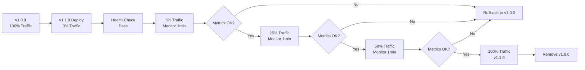
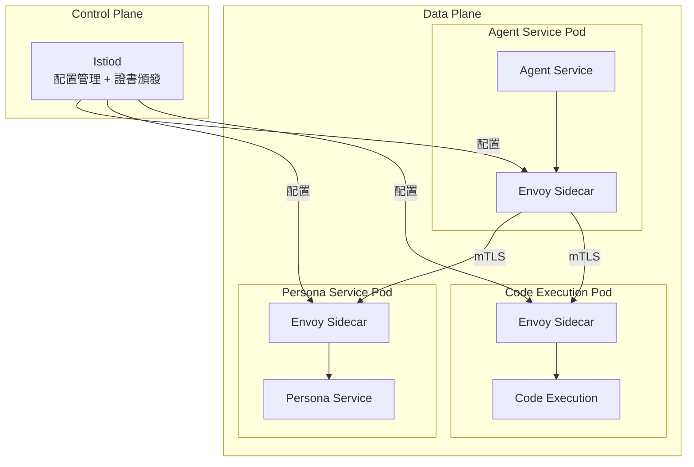
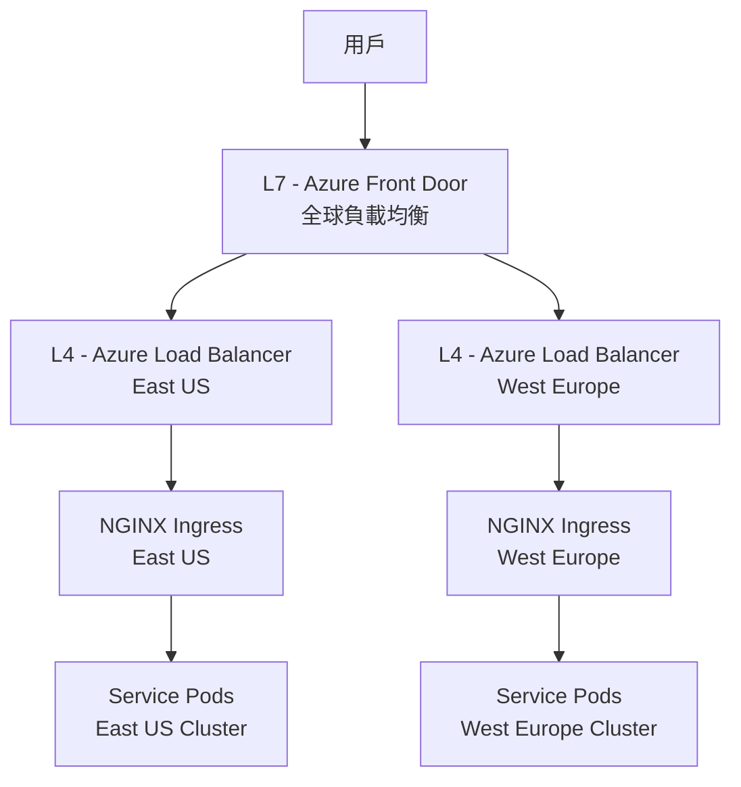
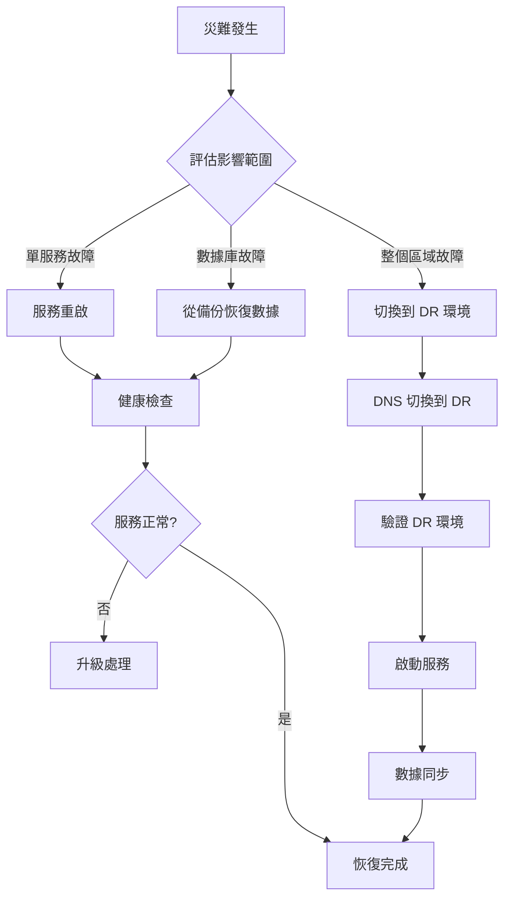

# 11. 部署架構設計 (Deployment Architecture)

## 文檔資訊

| 項目 | 內容 |
|------|------|
| **文檔版本** | 1.0.0 |
| **創建日期** | 2025-01-15 |
| **最後更新** | 2025-01-15 |
| **狀態** | Draft |
| **作者** | AI Workflow Platform Team |
| **關聯文檔** | 08-SECURITY-ARCHITECTURE.md, 12-DOCKER-COMPOSE.md, 13-KUBERNETES.md, 14-CICD-PIPELINE.md |

---

## 目錄

- [11.1 部署架構總覽](#111-部署架構總覽)
- [11.2 環境策略](#112-環境策略)
- [11.3 基礎設施需求](#113-基礎設施需求)
- [11.4 部署模式](#114-部署模式)
- [11.5 服務網格](#115-服務網格)
- [11.6 負載均衡](#116-負載均衡)
- [11.7 自動擴展](#117-自動擴展)
- [11.8 災難恢復](#118-災難恢復)
- [11.9 部署檢查清單](#119-部署檢查清單)

---

## 11.1 部署架構總覽

### 11.1.1 架構原則

**核心原則:**
1. **高可用性 (HA)**: 99.9% 可用性目標 (SLA)
2. **可擴展性**: 水平擴展優先
3. **安全性**: 零信任網路架構
4. **可觀測性**: 全鏈路追蹤和監控
5. **成本優化**: 資源彈性調度

**架構特性:**
- **微服務**: 6 個獨立可部署服務
- **容器化**: Docker 容器標準化
- **編排**: Kubernetes 自動化管理
- **不可變基礎設施**: 容器映像不可變
- **基礎設施即代碼 (IaC)**: 聲明式配置管理

### 11.1.2 整體部署拓撲

```mermaid
graph TB
    subgraph "Internet"
        Users[用戶]
        Admin[管理員]
    end

    subgraph "Edge Layer"
        CDN[Azure CDN]
        WAF[Web Application Firewall]
    end

    subgraph "Load Balancer Layer"
        ALB[Application Load Balancer<br/>Azure Front Door]
    end

    subgraph "Kubernetes Cluster - Production"
        subgraph "Ingress"
            Ingress[NGINX Ingress Controller]
        end

        subgraph "Application Pods"
            Gateway[API Gateway<br/>3 replicas]
            AuthSvc[Auth Service<br/>3 replicas]
            AgentSvc[Agent Service<br/>5 replicas]
            PersonaSvc[Persona Service<br/>3 replicas]
            CodeSvc[Code Execution<br/>5 replicas]
            SQLSvc[Text-to-SQL<br/>3 replicas]
            KnowledgeSvc[Knowledge Base<br/>3 replicas]
            WorkflowSvc[Workflow Service<br/>5 replicas]
        end

        subgraph "Monitoring"
            Prometheus[Prometheus]
            Grafana[Grafana]
            Loki[Loki]
        end
    end

    subgraph "Data Layer"
        PostgreSQL[(PostgreSQL 16<br/>HA Cluster)]
        Redis[(Redis 7<br/>Sentinel)]
        Search[Azure AI Search]
        Storage[Azure Blob Storage]
    end

    subgraph "Message Queue"
        RabbitMQ[RabbitMQ Cluster]
    end

    Users --> CDN
    Admin --> CDN
    CDN --> WAF
    WAF --> ALB
    ALB --> Ingress
    Ingress --> Gateway
    Gateway --> AuthSvc
    Gateway --> AgentSvc
    Gateway --> PersonaSvc
    Gateway --> CodeSvc
    Gateway --> SQLSvc
    Gateway --> KnowledgeSvc
    Gateway --> WorkflowSvc

    AuthSvc --> PostgreSQL
    AgentSvc --> PostgreSQL
    PersonaSvc --> PostgreSQL
    CodeSvc --> PostgreSQL
    SQLSvc --> PostgreSQL
    KnowledgeSvc --> PostgreSQL
    WorkflowSvc --> PostgreSQL

    AuthSvc --> Redis
    AgentSvc --> Redis
    PersonaSvc --> Redis

    KnowledgeSvc --> Search
    AgentSvc --> Storage

    AgentSvc --> RabbitMQ
    WorkflowSvc --> RabbitMQ

    Gateway --> Prometheus
    AuthSvc --> Prometheus
    AgentSvc --> Prometheus
    Prometheus --> Grafana
```

### 11.1.3 部署層次

**7 層部署架構:**

| 層級 | 組件 | 職責 | 技術棧 |
|------|------|------|--------|
| **L7 - CDN Layer** | Azure CDN | 靜態資源加速、DDoS 防護 | Azure CDN + WAF |
| **L6 - Load Balancer** | Azure Front Door | 全球負載均衡、SSL 終止 | Azure Front Door |
| **L5 - Ingress** | NGINX Ingress | 路由、認證、限流 | NGINX Ingress Controller |
| **L4 - Gateway** | API Gateway | 服務聚合、協議轉換 | Kong Gateway |
| **L3 - Service** | Microservices | 業務邏輯處理 | .NET 8 / C# |
| **L2 - Data** | Databases/Cache | 數據持久化、緩存 | PostgreSQL + Redis |
| **L1 - Storage** | Object Storage | 文件存儲、備份 | Azure Blob Storage |

---

## 11.2 環境策略

### 11.2.1 環境定義

**4 環境策略:**

```yaml
environments:
  development:
    purpose: "本地開發和單元測試"
    deployment: "Docker Compose (本地機器)"
    resources: "最小資源 (2 vCPU + 8GB RAM)"
    data: "測試數據集 (1000 筆記錄)"
    monitoring: "基礎日誌 (stdout)"

  staging:
    purpose: "集成測試和 UAT"
    deployment: "Kubernetes (單區域)"
    resources: "中等資源 (50% Production)"
    data: "生產數據快照 (去識別化)"
    monitoring: "完整監控 (Prometheus + Grafana)"

  production:
    purpose: "生產環境服務"
    deployment: "Kubernetes (多區域 HA)"
    resources: "生產資源 (auto-scaling)"
    data: "生產數據 (完整備份)"
    monitoring: "完整監控 + 告警"

  dr:
    purpose: "災難恢復環境"
    deployment: "Kubernetes (異地備份)"
    resources: "生產資源 (冷備)"
    data: "異地複製 (RPO < 1 hour)"
    monitoring: "健康檢查 + 告警"
```

### 11.2.2 環境配置管理

**ConfigMap 策略:**

```yaml
# config/development/appsettings.yaml
apiVersion: v1
kind: ConfigMap
metadata:
  name: agent-service-config
  namespace: ai-workflow-dev
data:
  appsettings.json: |
    {
      "Environment": "Development",
      "Logging": {
        "LogLevel": {
          "Default": "Debug",
          "Microsoft": "Information"
        }
      },
      "Database": {
        "ConnectionString": "Host=postgres-dev;Database=agent_db;Username=agent_user;Password=${DB_PASSWORD}"
      },
      "Redis": {
        "ConnectionString": "redis-dev:6379,abortConnect=false"
      },
      "RateLimiting": {
        "RequestsPerMinute": 1000
      },
      "OpenAI": {
        "ApiKey": "${OPENAI_API_KEY}",
        "Model": "gpt-4",
        "MaxTokens": 4000
      }
    }
```

**Secret 管理:**

```yaml
# secrets/production/secrets.yaml (encrypted with Azure Key Vault)
apiVersion: v1
kind: Secret
metadata:
  name: agent-service-secrets
  namespace: ai-workflow-prod
type: Opaque
data:
  DB_PASSWORD: <base64-encoded>
  OPENAI_API_KEY: <base64-encoded>
  JWT_SECRET: <base64-encoded>
  REDIS_PASSWORD: <base64-encoded>
```

**C# 配置載入:**

```csharp
public class Startup
{
    public IConfiguration Configuration { get; }

    public Startup(IConfiguration configuration)
    {
        Configuration = configuration;
    }

    public void ConfigureServices(IServiceCollection services)
    {
        // 環境檢測
        var environment = Environment.GetEnvironmentVariable("ASPNETCORE_ENVIRONMENT");

        // 配置來源優先級 (後面覆蓋前面)
        var builder = new ConfigurationBuilder()
            .SetBasePath(Directory.GetCurrentDirectory())
            .AddJsonFile("appsettings.json", optional: false, reloadOnChange: true)
            .AddJsonFile($"appsettings.{environment}.json", optional: true, reloadOnChange: true)
            .AddEnvironmentVariables()  // Environment variables 最高優先級
            .AddAzureKeyVault(  // Azure Key Vault for secrets
                new Uri($"https://{Configuration["KeyVault:VaultName"]}.vault.azure.net/"),
                new DefaultAzureCredential());

        Configuration = builder.Build();

        // 綁定配置到強型別類
        services.Configure<DatabaseOptions>(Configuration.GetSection("Database"));
        services.Configure<RedisOptions>(Configuration.GetSection("Redis"));
        services.Configure<OpenAIOptions>(Configuration.GetSection("OpenAI"));
    }
}

public class DatabaseOptions
{
    public string ConnectionString { get; set; }
    public int MaxRetryCount { get; set; } = 3;
    public int CommandTimeout { get; set; } = 30;
}
```

### 11.2.3 環境隔離策略

**網路隔離:**

```yaml
# Kubernetes Namespace 隔離
namespaces:
  - ai-workflow-dev     # Development environment
  - ai-workflow-staging # Staging environment
  - ai-workflow-prod    # Production environment
  - ai-workflow-dr      # Disaster Recovery environment

# Network Policies (禁止跨環境訪問)
apiVersion: networking.k8s.io/v1
kind: NetworkPolicy
metadata:
  name: deny-cross-namespace
  namespace: ai-workflow-prod
spec:
  podSelector: {}
  policyTypes:
  - Ingress
  - Egress
  ingress:
  - from:
    - podSelector: {}  # 只允許同 namespace 內 Pods
  egress:
  - to:
    - podSelector: {}
    - namespaceSelector:
        matchLabels:
          name: kube-system  # 允許訪問 kube-system (DNS)
```

**數據隔離:**

| 環境 | 數據庫實例 | 數據來源 | 訪問控制 |
|------|-----------|---------|----------|
| **Development** | postgres-dev.local | 測試數據生成器 | 無限制 (本地) |
| **Staging** | postgres-staging.azure | 生產數據快照 (去識別化) | IP 白名單 |
| **Production** | postgres-prod.azure | 實際用戶數據 | Private Endpoint |
| **DR** | postgres-dr.azure | 生產數據複製 (異地) | Private Endpoint |

---

## 11.3 基礎設施需求

### 11.3.1 計算資源規劃

**Kubernetes Node Pool 配置 (Production):**

```yaml
node_pools:
  # 系統組件 Node Pool
  system:
    count: 3
    vm_size: "Standard_D4s_v5"  # 4 vCPU, 16 GB RAM
    os_disk: 128 GB SSD
    labels:
      workload: system
    taints:
      - key: CriticalAddonsOnly
        value: "true"
        effect: NoSchedule

  # 應用服務 Node Pool
  application:
    count: 5
    vm_size: "Standard_D8s_v5"  # 8 vCPU, 32 GB RAM
    os_disk: 256 GB SSD
    auto_scaling:
      min: 5
      max: 20
    labels:
      workload: application

  # Code Execution Node Pool (隔離沙箱)
  code_execution:
    count: 3
    vm_size: "Standard_D8s_v5"  # 8 vCPU, 32 GB RAM
    os_disk: 256 GB SSD
    auto_scaling:
      min: 3
      max: 15
    labels:
      workload: code-execution
    taints:
      - key: code-execution
        value: "true"
        effect: NoSchedule
```

**Pod 資源配置:**

```yaml
# agent-service deployment
apiVersion: apps/v1
kind: Deployment
metadata:
  name: agent-service
spec:
  replicas: 5
  template:
    spec:
      containers:
      - name: agent-service
        image: aiworkflow.azurecr.io/agent-service:v1.0.0
        resources:
          requests:
            cpu: "500m"      # 0.5 vCPU
            memory: "1Gi"    # 1 GB RAM
          limits:
            cpu: "2000m"     # 2 vCPU
            memory: "4Gi"    # 4 GB RAM

        # 健康檢查
        livenessProbe:
          httpGet:
            path: /health/live
            port: 8080
          initialDelaySeconds: 30
          periodSeconds: 10
          timeoutSeconds: 5
          failureThreshold: 3

        readinessProbe:
          httpGet:
            path: /health/ready
            port: 8080
          initialDelaySeconds: 10
          periodSeconds: 5
          timeoutSeconds: 3
          failureThreshold: 3
```

**資源需求總覽:**

| 服務 | Replicas | CPU (request) | Memory (request) | 總 CPU | 總 Memory |
|------|----------|---------------|------------------|--------|-----------|
| API Gateway | 3 | 500m | 1Gi | 1.5 vCPU | 3 GB |
| Auth Service | 3 | 500m | 1Gi | 1.5 vCPU | 3 GB |
| Agent Service | 5 | 500m | 1Gi | 2.5 vCPU | 5 GB |
| Persona Service | 3 | 500m | 1Gi | 1.5 vCPU | 3 GB |
| Code Execution | 5 | 1000m | 2Gi | 5 vCPU | 10 GB |
| Text-to-SQL | 3 | 500m | 1Gi | 1.5 vCPU | 3 GB |
| Knowledge Base | 3 | 500m | 1Gi | 1.5 vCPU | 3 GB |
| Workflow Service | 5 | 500m | 1Gi | 2.5 vCPU | 5 GB |
| **Total** | **30** | - | - | **17.5 vCPU** | **35 GB** |

**Node Pool 總需求 (含冗餘):**
- **Application Nodes**: 5 nodes × 8 vCPU = 40 vCPU (使用率 ~44%)
- **System Nodes**: 3 nodes × 4 vCPU = 12 vCPU (Ingress + Monitoring)
- **Total**: 52 vCPU, 144 GB RAM

### 11.3.2 存儲資源規劃

**Azure Storage 配置:**

```yaml
storage_requirements:
  # PostgreSQL 存儲
  postgresql:
    type: "Azure Premium SSD"
    size: 1 TB
    iops: 5000
    throughput: 200 MB/s
    backup:
      type: "Azure Backup"
      retention: 30 days
      geo_redundant: true

  # Redis 存儲
  redis:
    type: "Azure Premium SSD"
    size: 256 GB
    iops: 2000
    throughput: 100 MB/s
    persistence: "AOF + RDB"

  # Azure Blob Storage (文件存儲)
  blob_storage:
    tier: "Hot"
    size: "10 TB (estimated)"
    redundancy: "GRS"  # Geo-Redundant Storage
    lifecycle:
      cool_after: 90 days
      archive_after: 365 days

  # Azure AI Search
  ai_search:
    tier: "Standard S1"
    replicas: 3
    partitions: 3
    storage: "300 GB (25 GB per replica)"

  # Container Registry
  acr:
    sku: "Premium"
    storage: "500 GB"
    geo_replication: ["East US", "West Europe"]
```

**Kubernetes PV/PVC 配置:**

```yaml
# PostgreSQL StatefulSet PVC
apiVersion: v1
kind: PersistentVolumeClaim
metadata:
  name: postgresql-pvc
spec:
  accessModes:
  - ReadWriteOnce
  storageClassName: managed-premium
  resources:
    requests:
      storage: 1Ti

---
# Redis StatefulSet PVC
apiVersion: v1
kind: PersistentVolumeClaim
metadata:
  name: redis-pvc
spec:
  accessModes:
  - ReadWriteOnce
  storageClassName: managed-premium
  resources:
    requests:
      storage: 256Gi
```

### 11.3.3 網路資源規劃

**Azure 網路架構:**

```yaml
virtual_network:
  name: "ai-workflow-vnet"
  address_space: "10.0.0.0/16"

  subnets:
    # AKS Cluster Subnet
    aks_subnet:
      name: "aks-subnet"
      address_prefix: "10.0.0.0/20"  # 10.0.0.1 - 10.0.15.254 (4094 IPs)
      service_endpoints: ["Microsoft.Sql", "Microsoft.Storage"]

    # Database Subnet
    db_subnet:
      name: "database-subnet"
      address_prefix: "10.0.16.0/24"  # 10.0.16.1 - 10.0.16.254 (254 IPs)
      service_endpoints: ["Microsoft.Sql"]
      private_endpoint: true

    # Redis Subnet
    redis_subnet:
      name: "redis-subnet"
      address_prefix: "10.0.17.0/24"  # 10.0.17.1 - 10.0.17.254 (254 IPs)
      private_endpoint: true

    # Application Gateway Subnet
    appgw_subnet:
      name: "appgw-subnet"
      address_prefix: "10.0.32.0/27"  # 10.0.32.1 - 10.0.32.30 (30 IPs)

  # Network Security Groups
  nsgs:
    aks_nsg:
      rules:
        - name: "Allow-HTTPS-Inbound"
          priority: 100
          direction: Inbound
          access: Allow
          protocol: Tcp
          source: Internet
          destination_port: 443

        - name: "Allow-K8s-API"
          priority: 110
          direction: Inbound
          access: Allow
          protocol: Tcp
          source: "Corporate-IP-Range"
          destination_port: 6443

    db_nsg:
      rules:
        - name: "Allow-PostgreSQL-From-AKS"
          priority: 100
          direction: Inbound
          access: Allow
          protocol: Tcp
          source: "10.0.0.0/20"  # AKS subnet
          destination_port: 5432
```

**負載均衡配置:**

```yaml
load_balancers:
  # Azure Front Door (全球負載均衡)
  front_door:
    name: "ai-workflow-fd"
    backend_pools:
      - name: "primary-pool"
        backends:
          - address: "ai-workflow-aks-primary.eastus.cloudapp.azure.com"
            weight: 100
            priority: 1
          - address: "ai-workflow-aks-secondary.westeurope.cloudapp.azure.com"
            weight: 50
            priority: 2

    routing_rules:
      - name: "api-route"
        frontend_endpoint: "api.aiworkflow.com"
        accepted_protocols: ["Https"]
        patterns: ["/api/*"]
        backend_pool: "primary-pool"

    waf_policy:
      mode: "Prevention"
      managed_rules:
        - type: "Microsoft_DefaultRuleSet"
          version: "2.1"

  # NGINX Ingress Controller
  nginx_ingress:
    replicas: 3
    service_type: LoadBalancer
    annotations:
      service.beta.kubernetes.io/azure-load-balancer-internal: "false"
    resources:
      requests:
        cpu: 500m
        memory: 512Mi
      limits:
        cpu: 1000m
        memory: 1Gi
```

---

## 11.4 部署模式

### 11.4.1 藍綠部署 (Blue-Green Deployment)

**概念:**
- 維護兩個相同的生產環境 (Blue 和 Green)
- 一次只有一個環境接收流量
- 新版本部署到閒置環境，驗證後切換流量

**實施策略:**

```yaml
# Blue Environment (當前生產)
apiVersion: v1
kind: Service
metadata:
  name: agent-service-blue
  labels:
    app: agent-service
    version: v1.0.0
    environment: blue
spec:
  selector:
    app: agent-service
    version: v1.0.0
  ports:
  - port: 8080
    targetPort: 8080

---
# Green Environment (新版本)
apiVersion: v1
kind: Service
metadata:
  name: agent-service-green
  labels:
    app: agent-service
    version: v1.1.0
    environment: green
spec:
  selector:
    app: agent-service
    version: v1.1.0
  ports:
  - port: 8080
    targetPort: 8080

---
# Ingress (流量控制)
apiVersion: networking.k8s.io/v1
kind: Ingress
metadata:
  name: agent-service-ingress
  annotations:
    nginx.ingress.kubernetes.io/upstream-vhost: "agent-service-blue.ai-workflow-prod.svc.cluster.local"
spec:
  rules:
  - host: api.aiworkflow.com
    http:
      paths:
      - path: /api/agents
        pathType: Prefix
        backend:
          service:
            name: agent-service-blue  # 指向 Blue 環境
            port:
              number: 8080
```

**切換流程:**

```bash
#!/bin/bash
# deploy-blue-green.sh

# Step 1: 部署新版本到 Green 環境
kubectl apply -f deployments/agent-service-v1.1.0-green.yaml

# Step 2: 等待 Green 環境 Ready
kubectl wait --for=condition=ready pod \
  -l app=agent-service,version=v1.1.0 \
  --timeout=300s

# Step 3: 健康檢查 Green 環境
echo "Running health checks on Green environment..."
for i in {1..10}; do
  response=$(curl -s -o /dev/null -w "%{http_code}" \
    http://agent-service-green:8080/health)
  if [ "$response" -eq 200 ]; then
    echo "Health check $i: OK"
  else
    echo "Health check $i: FAILED (HTTP $response)"
    exit 1
  fi
  sleep 2
done

# Step 4: 切換流量到 Green 環境
kubectl patch ingress agent-service-ingress \
  -p '{"spec":{"rules":[{"host":"api.aiworkflow.com","http":{"paths":[{"path":"/api/agents","pathType":"Prefix","backend":{"service":{"name":"agent-service-green","port":{"number":8080}}}}]}}]}}'

echo "Traffic switched to Green environment"

# Step 5: 監控 5 分鐘，無問題則刪除 Blue 環境
echo "Monitoring for 5 minutes..."
sleep 300

# Step 6: 刪除舊的 Blue 環境
kubectl delete deployment agent-service-blue
echo "Blue environment removed. Deployment complete."
```

**優點:**
- 零停機部署
- 快速回滾 (只需切換流量)
- 完整驗證新版本

**缺點:**
- 需要雙倍資源 (兩個環境同時運行)
- 數據庫 schema 變更困難

### 11.4.2 金絲雀部署 (Canary Deployment)

**概念:**
- 逐步將流量從舊版本遷移到新版本
- 小部分用戶先體驗新版本 (5% → 25% → 50% → 100%)
- 監控指標，發現問題立即回滾

**Flagger 自動化金絲雀部署:**

```yaml
# Canary 配置
apiVersion: flagger.app/v1beta1
kind: Canary
metadata:
  name: agent-service
  namespace: ai-workflow-prod
spec:
  # 目標 Deployment
  targetRef:
    apiVersion: apps/v1
    kind: Deployment
    name: agent-service

  # 自動擴展設定
  autoscalerRef:
    apiVersion: autoscaling/v2
    kind: HorizontalPodAutoscaler
    name: agent-service

  # Service 設定
  service:
    port: 8080
    targetPort: 8080

  # 分析配置
  analysis:
    interval: 1m
    threshold: 5
    maxWeight: 50
    stepWeight: 10

    # 成功率閾值
    metrics:
    - name: request-success-rate
      thresholdRange:
        min: 99
      interval: 1m

    - name: request-duration
      thresholdRange:
        max: 500  # 500ms
      interval: 1m

    # Prometheus 查詢
    webhooks:
    - name: prometheus
      url: http://prometheus:9090
      timeout: 5s
      metadata:
        query: |
          sum(
            rate(
              http_requests_total{
                app="agent-service",
                status!~"5.."
              }[1m]
            )
          )
          /
          sum(
            rate(
              http_requests_total{
                app="agent-service"
              }[1m]
            )
          )
          * 100
```

**金絲雀部署流程:**



**優點:**
- 風險最小化 (逐步釋出)
- 實時監控和自動回滾
- 用戶體驗影響小

**缺點:**
- 部署時間較長
- 需要複雜的監控和指標

### 11.4.3 滾動更新 (Rolling Update)

**概念:**
- 逐個替換舊版本 Pod
- Kubernetes 原生支持
- 適合無狀態應用

**配置:**

```yaml
apiVersion: apps/v1
kind: Deployment
metadata:
  name: agent-service
spec:
  replicas: 5

  # 滾動更新策略
  strategy:
    type: RollingUpdate
    rollingUpdate:
      maxSurge: 1         # 最多額外創建 1 個 Pod (總共 6 個)
      maxUnavailable: 1   # 最多 1 個 Pod 不可用 (最少 4 個)

  template:
    spec:
      containers:
      - name: agent-service
        image: aiworkflow.azurecr.io/agent-service:v1.1.0

        # 優雅終止
        lifecycle:
          preStop:
            exec:
              command: ["/bin/sh", "-c", "sleep 15"]

        # 就緒檢查 (新 Pod 必須 Ready 才算成功)
        readinessProbe:
          httpGet:
            path: /health/ready
            port: 8080
          initialDelaySeconds: 10
          periodSeconds: 5
```

**執行滾動更新:**

```bash
# 更新映像
kubectl set image deployment/agent-service \
  agent-service=aiworkflow.azurecr.io/agent-service:v1.1.0

# 查看滾動狀態
kubectl rollout status deployment/agent-service

# 查看滾動歷史
kubectl rollout history deployment/agent-service

# 回滾到上一個版本
kubectl rollout undo deployment/agent-service

# 回滾到特定版本
kubectl rollout undo deployment/agent-service --to-revision=3
```

**優點:**
- Kubernetes 原生支持，簡單易用
- 自動化程度高
- 適合無狀態應用

**缺點:**
- 舊版本和新版本短暫共存
- 數據庫 schema 變更需要向後兼容

### 11.4.4 部署模式選擇決策

| 場景 | 推薦模式 | 原因 |
|------|---------|------|
| **重大版本升級** | 藍綠部署 | 完整驗證，快速回滾 |
| **高風險功能** | 金絲雀部署 | 逐步驗證，風險最小化 |
| **日常更新** | 滾動更新 | 自動化，簡單快速 |
| **數據庫 Schema 變更** | 藍綠部署 | 需要數據遷移驗證 |
| **Hotfix** | 滾動更新 | 快速修復，立即生效 |

---

## 11.5 服務網格 (Service Mesh)

### 11.5.1 Istio 服務網格架構

**為什麼使用 Service Mesh:**
- **流量管理**: 精細化路由、負載均衡、熔斷
- **安全性**: mTLS 加密、服務間認證
- **可觀測性**: 全鏈路追蹤、指標收集
- **策略控制**: 流量限制、訪問控制

**Istio 架構:**



**安裝 Istio:**

```bash
# 1. 下載 Istio
curl -L https://istio.io/downloadIstio | sh -
cd istio-1.20.0

# 2. 安裝 Istio (production profile)
istioctl install --set profile=production -y

# 3. 啟用 Sidecar 自動注入
kubectl label namespace ai-workflow-prod istio-injection=enabled

# 4. 驗證安裝
kubectl get pods -n istio-system
```

### 11.5.2 流量管理配置

**VirtualService (路由規則):**

```yaml
# 金絲雀部署: 95% v1.0.0, 5% v1.1.0
apiVersion: networking.istio.io/v1beta1
kind: VirtualService
metadata:
  name: agent-service
spec:
  hosts:
  - agent-service
  http:
  - match:
    - headers:
        canary:
          exact: "true"
    route:
    - destination:
        host: agent-service
        subset: v1-1-0

  - route:
    - destination:
        host: agent-service
        subset: v1-0-0
      weight: 95
    - destination:
        host: agent-service
        subset: v1-1-0
      weight: 5

---
# DestinationRule (版本定義)
apiVersion: networking.istio.io/v1beta1
kind: DestinationRule
metadata:
  name: agent-service
spec:
  host: agent-service
  trafficPolicy:
    connectionPool:
      tcp:
        maxConnections: 100
      http:
        http1MaxPendingRequests: 50
        http2MaxRequests: 100
    loadBalancer:
      simple: LEAST_REQUEST
    outlierDetection:
      consecutiveErrors: 5
      interval: 30s
      baseEjectionTime: 30s
      maxEjectionPercent: 50

  subsets:
  - name: v1-0-0
    labels:
      version: v1.0.0

  - name: v1-1-0
    labels:
      version: v1.1.0
```

**熔斷器配置:**

```yaml
apiVersion: networking.istio.io/v1beta1
kind: DestinationRule
metadata:
  name: code-execution-circuit-breaker
spec:
  host: code-execution-service
  trafficPolicy:
    connectionPool:
      tcp:
        maxConnections: 50
      http:
        http1MaxPendingRequests: 10
        maxRequestsPerConnection: 2

    outlierDetection:
      consecutiveGatewayErrors: 3   # 連續 3 次 5xx 錯誤
      interval: 30s                  # 檢測間隔
      baseEjectionTime: 30s          # 驅逐時間
      maxEjectionPercent: 50         # 最多驅逐 50% 實例
      minHealthPercent: 40           # 最少保持 40% 健康實例
```

### 11.5.3 安全配置 (mTLS)

**PeerAuthentication (強制 mTLS):**

```yaml
# Namespace 級別 mTLS
apiVersion: security.istio.io/v1beta1
kind: PeerAuthentication
metadata:
  name: default
  namespace: ai-workflow-prod
spec:
  mtls:
    mode: STRICT  # 強制所有服務間通信使用 mTLS

---
# 特定服務允許 PERMISSIVE (兼容模式)
apiVersion: security.istio.io/v1beta1
kind: PeerAuthentication
metadata:
  name: code-execution-permissive
  namespace: ai-workflow-prod
spec:
  selector:
    matchLabels:
      app: code-execution-service
  mtls:
    mode: PERMISSIVE  # 允許 mTLS 和明文流量
```

**AuthorizationPolicy (訪問控制):**

```yaml
# 只允許 Agent Service 訪問 Code Execution Service
apiVersion: security.istio.io/v1beta1
kind: AuthorizationPolicy
metadata:
  name: code-execution-authz
  namespace: ai-workflow-prod
spec:
  selector:
    matchLabels:
      app: code-execution-service

  action: ALLOW
  rules:
  - from:
    - source:
        principals: ["cluster.local/ns/ai-workflow-prod/sa/agent-service"]
    to:
    - operation:
        methods: ["POST"]
        paths: ["/api/code-execution/execute"]

---
# 禁止外部直接訪問 Database
apiVersion: security.istio.io/v1beta1
kind: AuthorizationPolicy
metadata:
  name: database-deny-all
  namespace: ai-workflow-prod
spec:
  selector:
    matchLabels:
      app: postgresql

  action: DENY
  rules:
  - from:
    - source:
        notNamespaces: ["ai-workflow-prod"]
```

### 11.5.4 可觀測性配置

**分佈式追蹤 (Jaeger):**

```yaml
# Istio Telemetry 配置
apiVersion: telemetry.istio.io/v1alpha1
kind: Telemetry
metadata:
  name: tracing-default
  namespace: ai-workflow-prod
spec:
  tracing:
  - providers:
    - name: jaeger
    randomSamplingPercentage: 10.0  # 採樣 10% 請求
    customTags:
      environment:
        literal:
          value: production
      version:
        literal:
          value: v1.0.0
```

**Prometheus 指標:**

```yaml
# ServiceMonitor for Istio
apiVersion: monitoring.coreos.com/v1
kind: ServiceMonitor
metadata:
  name: istio-component-monitor
  namespace: istio-system
spec:
  selector:
    matchLabels:
      istio: pilot
  endpoints:
  - port: http-monitoring
    interval: 15s
```

---

## 11.6 負載均衡

### 11.6.1 多層負載均衡架構

**3 層負載均衡:**



### 11.6.2 NGINX Ingress 配置

**全局配置:**

```yaml
# NGINX ConfigMap
apiVersion: v1
kind: ConfigMap
metadata:
  name: nginx-configuration
  namespace: ingress-nginx
data:
  # 連接池設置
  upstream-keepalive-connections: "100"
  upstream-keepalive-timeout: "60"

  # 超時設置
  proxy-connect-timeout: "10"
  proxy-send-timeout: "60"
  proxy-read-timeout: "60"

  # 緩衝設置
  proxy-buffer-size: "16k"
  proxy-buffers: "4 16k"

  # 日誌格式
  log-format-upstream: '$remote_addr - $remote_user [$time_local] "$request" $status $body_bytes_sent "$http_referer" "$http_user_agent" $request_length $request_time [$proxy_upstream_name] [$proxy_alternative_upstream_name] $upstream_addr $upstream_response_length $upstream_response_time $upstream_status $req_id'

  # 限流設置
  limit-rate-after: "10m"
  limit-rate: "1m"

  # SSL 配置
  ssl-protocols: "TLSv1.2 TLSv1.3"
  ssl-ciphers: "ECDHE-ECDSA-AES128-GCM-SHA256:ECDHE-RSA-AES128-GCM-SHA256"
  ssl-prefer-server-ciphers: "true"
```

**Ingress 路由配置:**

```yaml
apiVersion: networking.k8s.io/v1
kind: Ingress
metadata:
  name: ai-workflow-ingress
  namespace: ai-workflow-prod
  annotations:
    # 限流 (每個 IP 每秒 10 個請求)
    nginx.ingress.kubernetes.io/limit-rps: "10"

    # 熔斷 (連續 3 次 5xx 錯誤則熔斷 30 秒)
    nginx.ingress.kubernetes.io/upstream-fail-timeout: "30"
    nginx.ingress.kubernetes.io/upstream-max-fails: "3"

    # Sticky Session (會話保持)
    nginx.ingress.kubernetes.io/affinity: "cookie"
    nginx.ingress.kubernetes.io/session-cookie-name: "route"
    nginx.ingress.kubernetes.io/session-cookie-max-age: "172800"  # 2 days

    # CORS 配置
    nginx.ingress.kubernetes.io/enable-cors: "true"
    nginx.ingress.kubernetes.io/cors-allow-origin: "https://app.aiworkflow.com"
    nginx.ingress.kubernetes.io/cors-allow-methods: "GET, POST, PUT, DELETE, OPTIONS"

    # SSL 重定向
    nginx.ingress.kubernetes.io/ssl-redirect: "true"

    # 請求大小限制
    nginx.ingress.kubernetes.io/proxy-body-size: "50m"

spec:
  ingressClassName: nginx

  tls:
  - hosts:
    - api.aiworkflow.com
    secretName: aiworkflow-tls-secret

  rules:
  - host: api.aiworkflow.com
    http:
      paths:
      # Auth Service
      - path: /api/auth
        pathType: Prefix
        backend:
          service:
            name: auth-service
            port:
              number: 8080

      # Agent Service
      - path: /api/agents
        pathType: Prefix
        backend:
          service:
            name: agent-service
            port:
              number: 8080

      # Persona Service
      - path: /api/personas
        pathType: Prefix
        backend:
          service:
            name: persona-service
            port:
              number: 8080

      # Code Execution Service
      - path: /api/code-execution
        pathType: Prefix
        backend:
          service:
            name: code-execution-service
            port:
              number: 8080
```

### 11.6.3 負載均衡演算法

**Kubernetes Service LoadBalancer 配置:**

```yaml
apiVersion: v1
kind: Service
metadata:
  name: agent-service
  annotations:
    # Azure Load Balancer 配置
    service.beta.kubernetes.io/azure-load-balancer-tcp-idle-timeout: "15"

    # 會話親和性 (基於 Client IP)
    service.beta.kubernetes.io/azure-load-balancer-mode: "ClientIP"
spec:
  type: LoadBalancer
  sessionAffinity: ClientIP
  sessionAffinityConfig:
    clientIP:
      timeoutSeconds: 10800  # 3 hours

  ports:
  - port: 80
    targetPort: 8080
    protocol: TCP

  selector:
    app: agent-service
```

**Istio 負載均衡策略:**

```yaml
apiVersion: networking.istio.io/v1beta1
kind: DestinationRule
metadata:
  name: agent-service-lb
spec:
  host: agent-service
  trafficPolicy:
    loadBalancer:
      # 負載均衡演算法選擇
      consistentHash:
        httpHeaderName: "x-user-id"  # 基於 User ID 的一致性哈希

      # 備選: LEAST_REQUEST (最少請求)
      # simple: LEAST_REQUEST

      # 備選: ROUND_ROBIN (輪詢)
      # simple: ROUND_ROBIN

      # 備選: RANDOM (隨機)
      # simple: RANDOM
```

---

## 11.7 自動擴展 (Auto-Scaling)

### 11.7.1 Horizontal Pod Autoscaler (HPA)

**HPA v2 配置 (基於 CPU + Memory):**

```yaml
apiVersion: autoscaling/v2
kind: HorizontalPodAutoscaler
metadata:
  name: agent-service-hpa
  namespace: ai-workflow-prod
spec:
  scaleTargetRef:
    apiVersion: apps/v1
    kind: Deployment
    name: agent-service

  minReplicas: 3
  maxReplicas: 20

  metrics:
  # CPU 使用率
  - type: Resource
    resource:
      name: cpu
      target:
        type: Utilization
        averageUtilization: 70  # 70% CPU 觸發擴展

  # Memory 使用率
  - type: Resource
    resource:
      name: memory
      target:
        type: Utilization
        averageUtilization: 80  # 80% Memory 觸發擴展

  # 自定義指標 (請求數)
  - type: Pods
    pods:
      metric:
        name: http_requests_per_second
      target:
        type: AverageValue
        averageValue: "1000"  # 每個 Pod 1000 RPS

  # 擴縮容行為
  behavior:
    scaleUp:
      stabilizationWindowSeconds: 60  # 穩定窗口 60 秒
      policies:
      - type: Percent
        value: 50  # 每次擴展 50%
        periodSeconds: 60
      - type: Pods
        value: 2  # 或每次增加 2 個 Pod
        periodSeconds: 60
      selectPolicy: Max  # 選擇最大值

    scaleDown:
      stabilizationWindowSeconds: 300  # 縮容前等待 5 分鐘
      policies:
      - type: Percent
        value: 10  # 每次縮減 10%
        periodSeconds: 60
      - type: Pods
        value: 1  # 或每次減少 1 個 Pod
        periodSeconds: 60
      selectPolicy: Min  # 選擇最小值
```

**自定義指標 (Prometheus Adapter):**

```yaml
# Prometheus Adapter 配置
apiVersion: v1
kind: ConfigMap
metadata:
  name: adapter-config
  namespace: monitoring
data:
  config.yaml: |
    rules:
    - seriesQuery: 'http_requests_total{namespace="ai-workflow-prod",app="agent-service"}'
      resources:
        overrides:
          namespace: {resource: "namespace"}
          pod: {resource: "pod"}
      name:
        matches: "^(.*)_total"
        as: "${1}_per_second"
      metricsQuery: 'sum(rate(<<.Series>>{<<.LabelMatchers>>}[2m])) by (<<.GroupBy>>)'
```

### 11.7.2 Vertical Pod Autoscaler (VPA)

**VPA 配置 (自動調整資源請求):**

```yaml
apiVersion: autoscaling.k8s.io/v1
kind: VerticalPodAutoscaler
metadata:
  name: agent-service-vpa
  namespace: ai-workflow-prod
spec:
  targetRef:
    apiVersion: apps/v1
    kind: Deployment
    name: agent-service

  updatePolicy:
    updateMode: "Auto"  # Auto, Initial, Off

  resourcePolicy:
    containerPolicies:
    - containerName: agent-service
      minAllowed:
        cpu: 500m
        memory: 1Gi
      maxAllowed:
        cpu: 4000m
        memory: 8Gi
      controlledResources: ["cpu", "memory"]
```

**VPA Recommender 查看建議:**

```bash
kubectl describe vpa agent-service-vpa

# Output:
# Recommendation:
#   Container Recommendations:
#     Container Name:  agent-service
#     Lower Bound:
#       Cpu:     500m
#       Memory:  1Gi
#     Target:
#       Cpu:     1500m
#       Memory:  3Gi
#     Uncapped Target:
#       Cpu:     1800m
#       Memory:  3.5Gi
#     Upper Bound:
#       Cpu:     4000m
#       Memory:  8Gi
```

### 11.7.3 Cluster Autoscaler

**Cluster Autoscaler 配置 (Node Pool 自動擴展):**

```yaml
# Azure AKS Node Pool Auto-scaling
az aks nodepool update \
  --resource-group ai-workflow-rg \
  --cluster-name ai-workflow-aks \
  --name application \
  --enable-cluster-autoscaler \
  --min-count 5 \
  --max-count 20

# Cluster Autoscaler Deployment
apiVersion: apps/v1
kind: Deployment
metadata:
  name: cluster-autoscaler
  namespace: kube-system
spec:
  replicas: 1
  template:
    spec:
      containers:
      - name: cluster-autoscaler
        image: mcr.microsoft.com/oss/kubernetes/autoscaler/cluster-autoscaler:v1.28.0
        command:
        - ./cluster-autoscaler
        - --v=4
        - --stderrthreshold=info
        - --cloud-provider=azure
        - --skip-nodes-with-local-storage=false
        - --expander=least-waste
        - --node-group-auto-discovery=label:cluster-autoscaler-enabled=true
        - --balance-similar-node-groups
        - --skip-nodes-with-system-pods=false
        - --scale-down-delay-after-add=10m
        - --scale-down-unneeded-time=10m
        - --scale-down-utilization-threshold=0.5
```

### 11.7.4 KEDA (Event-Driven Autoscaling)

**KEDA RabbitMQ Scaler (基於消息隊列):**

```yaml
apiVersion: keda.sh/v1alpha1
kind: ScaledObject
metadata:
  name: workflow-execution-scaler
  namespace: ai-workflow-prod
spec:
  scaleTargetRef:
    name: workflow-execution-service

  minReplicaCount: 2
  maxReplicaCount: 50

  triggers:
  # RabbitMQ 消息隊列長度
  - type: rabbitmq
    metadata:
      host: amqp://rabbitmq:5672
      queueName: workflow-execution-queue
      mode: QueueLength
      value: "10"  # 每 10 個消息一個 Pod

  # Prometheus 自定義指標
  - type: prometheus
    metadata:
      serverAddress: http://prometheus:9090
      metricName: pending_workflow_executions
      threshold: "5"
      query: |
        sum(workflow_executions_pending{namespace="ai-workflow-prod"})
```

---

## 11.8 災難恢復 (Disaster Recovery)

### 11.8.1 備份策略

**數據庫備份 (PostgreSQL):**

```yaml
# CronJob for PostgreSQL Backup
apiVersion: batch/v1
kind: CronJob
metadata:
  name: postgresql-backup
  namespace: ai-workflow-prod
spec:
  schedule: "0 2 * * *"  # 每天 02:00 UTC
  jobTemplate:
    spec:
      template:
        spec:
          containers:
          - name: backup
            image: postgres:16
            command:
            - /bin/bash
            - -c
            - |
              TIMESTAMP=$(date +%Y%m%d_%H%M%S)
              BACKUP_FILE="/backups/postgresql_backup_${TIMESTAMP}.sql"

              # 執行備份
              pg_dump -h postgresql -U postgres -d agent_db > ${BACKUP_FILE}

              # 壓縮備份
              gzip ${BACKUP_FILE}

              # 上傳到 Azure Blob Storage
              az storage blob upload \
                --account-name aiworkflowbackup \
                --container-name postgresql-backups \
                --name postgresql_backup_${TIMESTAMP}.sql.gz \
                --file ${BACKUP_FILE}.gz

              # 刪除 30 天前的備份
              find /backups -name "*.sql.gz" -mtime +30 -delete

            env:
            - name: PGPASSWORD
              valueFrom:
                secretKeyRef:
                  name: postgresql-secret
                  key: password

            volumeMounts:
            - name: backup-storage
              mountPath: /backups

          restartPolicy: OnFailure

          volumes:
          - name: backup-storage
            persistentVolumeClaim:
              claimName: backup-pvc
```

**應用數據備份 (Velero):**

```bash
# 安裝 Velero
velero install \
  --provider azure \
  --plugins velero/velero-plugin-for-microsoft-azure:v1.9.0 \
  --bucket velero-backups \
  --secret-file ./credentials-velero \
  --backup-location-config resourceGroup=ai-workflow-backups-rg,storageAccount=aiworkflowvelero \
  --snapshot-location-config apiTimeout=5m,resourceGroup=ai-workflow-backups-rg

# 創建定期備份
velero schedule create daily-backup \
  --schedule="0 2 * * *" \
  --include-namespaces ai-workflow-prod \
  --ttl 720h  # 保留 30 天
```

### 11.8.2 災難恢復計劃

**RPO/RTO 目標:**

| 服務 | RPO (恢復點目標) | RTO (恢復時間目標) | 備份頻率 | 恢復策略 |
|------|-----------------|-------------------|---------|---------|
| **PostgreSQL** | < 1 hour | < 2 hours | 每小時增量備份 | 從最近備份恢復 |
| **Redis** | < 5 minutes | < 30 minutes | AOF + RDB | 從持久化文件恢復 |
| **Kubernetes State** | < 24 hours | < 1 hour | 每日 Velero 備份 | 從 Velero 恢復 |
| **Blob Storage** | 0 (GRS 自動複製) | < 1 hour | 實時複製 | 切換到次要區域 |

**災難恢復流程:**



**PostgreSQL 恢復腳本:**

```bash
#!/bin/bash
# restore-postgresql.sh

BACKUP_DATE=$1  # 例如: 20250115_020000

# 1. 停止所有服務 (防止寫入)
kubectl scale deployment --all --replicas=0 -n ai-workflow-prod

# 2. 下載備份文件
az storage blob download \
  --account-name aiworkflowbackup \
  --container-name postgresql-backups \
  --name postgresql_backup_${BACKUP_DATE}.sql.gz \
  --file /tmp/backup.sql.gz

# 3. 解壓備份
gunzip /tmp/backup.sql.gz

# 4. 恢復數據庫
kubectl exec -it postgresql-0 -n ai-workflow-prod -- \
  psql -U postgres -d agent_db < /tmp/backup.sql

# 5. 驗證數據完整性
kubectl exec -it postgresql-0 -n ai-workflow-prod -- \
  psql -U postgres -d agent_db -c "SELECT COUNT(*) FROM agents;"

# 6. 重啟所有服務
kubectl scale deployment --all --replicas=3 -n ai-workflow-prod

echo "Recovery completed successfully"
```

---

## 11.9 部署檢查清單 (Deployment Checklist)

### 11.9.1 部署前檢查 (Pre-Deployment)

**✅ 代碼質量檢查:**
- [ ] 所有單元測試通過 (覆蓋率 > 80%)
- [ ] 集成測試通過
- [ ] 靜態代碼分析無嚴重問題 (SonarQube)
- [ ] 安全掃描無高危漏洞 (Trivy)
- [ ] 代碼審查已完成並批准

**✅ 配置驗證:**
- [ ] 環境變數配置正確
- [ ] Secret 已創建並加密
- [ ] ConfigMap 已更新
- [ ] 數據庫遷移腳本已準備
- [ ] 資源限制已設置 (CPU/Memory)

**✅ 基礎設施準備:**
- [ ] Kubernetes 集群健康狀態正常
- [ ] Node Pool 資源充足
- [ ] 持久化存儲已創建
- [ ] 網路策略已配置
- [ ] 監控和告警已啟用

**✅ 備份與回滾:**
- [ ] 數據庫備份已完成
- [ ] 應用狀態備份已完成 (Velero)
- [ ] 回滾計劃已準備
- [ ] 舊版本映像已保留

### 11.9.2 部署中檢查 (During Deployment)

**✅ 部署進度監控:**
- [ ] Pod 狀態正常 (Running)
- [ ] 就緒檢查通過 (Readiness Probe)
- [ ] 存活檢查通過 (Liveness Probe)
- [ ] 日誌無異常錯誤
- [ ] 資源使用正常 (CPU/Memory)

**✅ 流量監控:**
- [ ] 請求成功率 > 99%
- [ ] 平均響應時間 < 500ms
- [ ] P95 響應時間 < 1000ms
- [ ] 錯誤率 < 1%
- [ ] 無異常流量模式

**✅ 數據一致性:**
- [ ] 數據庫連接正常
- [ ] 數據遷移完成
- [ ] 緩存更新成功
- [ ] 消息隊列處理正常

### 11.9.3 部署後檢查 (Post-Deployment)

**✅ 功能驗證:**
- [ ] 冒煙測試通過
- [ ] 關鍵業務流程正常
- [ ] API 端點可訪問
- [ ] 認證授權正常
- [ ] 第三方集成正常 (OpenAI, Azure)

**✅ 性能驗證:**
- [ ] 負載測試通過
- [ ] 響應時間符合 SLA
- [ ] 併發處理能力達標
- [ ] 資源使用在預期範圍

**✅ 監控與告警:**
- [ ] Prometheus 指標收集正常
- [ ] Grafana 儀表板顯示正常
- [ ] 日誌聚合正常 (Loki)
- [ ] 分佈式追蹤正常 (Jaeger)
- [ ] 告警規則觸發測試通過

**✅ 安全驗證:**
- [ ] SSL 證書有效
- [ ] mTLS 通信正常
- [ ] RBAC 權限正確
- [ ] 網路策略生效
- [ ] 安全掃描無新增漏洞

**✅ 文檔更新:**
- [ ] 部署文檔已更新
- [ ] API 文檔已更新
- [ ] 變更日誌已記錄
- [ ] 用戶通知已發送

---

## 附錄 A: 部署腳本示例

### A.1 全自動部署腳本

```bash
#!/bin/bash
# deploy.sh - 自動化部署腳本

set -e  # 遇到錯誤立即退出

# 配置
ENVIRONMENT=$1  # dev, staging, prod
VERSION=$2      # v1.0.0
NAMESPACE="ai-workflow-${ENVIRONMENT}"

# 顏色輸出
RED='\033[0;31m'
GREEN='\033[0;32m'
YELLOW='\033[1;33m'
NC='\033[0m'

# 日誌函數
log() {
  echo -e "${GREEN}[$(date +'%Y-%m-%d %H:%M:%S')]${NC} $1"
}

error() {
  echo -e "${RED}[ERROR]${NC} $1"
  exit 1
}

warning() {
  echo -e "${YELLOW}[WARNING]${NC} $1"
}

# 1. 參數驗證
if [ -z "$ENVIRONMENT" ] || [ -z "$VERSION" ]; then
  error "Usage: ./deploy.sh <environment> <version>"
fi

log "Starting deployment to ${ENVIRONMENT} environment (version: ${VERSION})"

# 2. Pre-deployment checks
log "Running pre-deployment checks..."

# 檢查 Kubernetes 連接
kubectl cluster-info > /dev/null 2>&1 || error "Cannot connect to Kubernetes cluster"

# 檢查 namespace 是否存在
kubectl get namespace ${NAMESPACE} > /dev/null 2>&1 || error "Namespace ${NAMESPACE} does not exist"

# 檢查映像是否存在
log "Verifying container images..."
for service in auth-service agent-service persona-service code-execution-service text-to-sql-service knowledge-base-service workflow-service; do
  IMAGE="aiworkflow.azurecr.io/${service}:${VERSION}"
  docker manifest inspect ${IMAGE} > /dev/null 2>&1 || error "Image ${IMAGE} not found"
  log "✓ ${IMAGE} verified"
done

# 3. 數據庫備份
log "Creating database backup..."
kubectl exec -it postgresql-0 -n ${NAMESPACE} -- \
  pg_dumpall -U postgres | gzip > /tmp/backup_$(date +%Y%m%d_%H%M%S).sql.gz
log "✓ Database backup completed"

# 4. 應用 Kubernetes 配置
log "Applying Kubernetes configurations..."

# ConfigMap
kubectl apply -f config/${ENVIRONMENT}/configmaps.yaml

# Secrets
kubectl apply -f secrets/${ENVIRONMENT}/secrets.yaml

# Deployments
for service in auth-service agent-service persona-service code-execution-service text-to-sql-service knowledge-base-service workflow-service; do
  log "Deploying ${service}..."
  kubectl set image deployment/${service} ${service}=aiworkflow.azurecr.io/${service}:${VERSION} -n ${NAMESPACE}

  # 等待 rollout 完成
  kubectl rollout status deployment/${service} -n ${NAMESPACE} --timeout=5m || error "${service} deployment failed"
  log "✓ ${service} deployed successfully"
done

# 5. 健康檢查
log "Running health checks..."
sleep 30  # 等待 Pods 完全啟動

for service in auth-service agent-service persona-service; do
  POD=$(kubectl get pods -n ${NAMESPACE} -l app=${service} -o jsonpath='{.items[0].metadata.name}')
  HEALTH=$(kubectl exec ${POD} -n ${NAMESPACE} -- curl -s -o /dev/null -w "%{http_code}" http://localhost:8080/health)

  if [ "$HEALTH" -eq 200 ]; then
    log "✓ ${service} health check passed"
  else
    error "${service} health check failed (HTTP ${HEALTH})"
  fi
done

# 6. 冒煙測試
log "Running smoke tests..."
./tests/smoke-tests.sh ${ENVIRONMENT} || error "Smoke tests failed"

# 7. 監控驗證
log "Verifying monitoring..."
kubectl get pods -n monitoring | grep prometheus || warning "Prometheus not running"
kubectl get pods -n monitoring | grep grafana || warning "Grafana not running"

# 8. 部署完成
log "Deployment completed successfully! 🎉"
log "Environment: ${ENVIRONMENT}"
log "Version: ${VERSION}"
log "Timestamp: $(date)"
```

---

## 總結

本文檔定義了 AI Workflow Platform 的完整部署架構設計，涵蓋:

1. **部署架構總覽**: 7 層部署架構，微服務容器化部署
2. **環境策略**: Development, Staging, Production, DR 四環境
3. **基礎設施需求**: 計算資源 (52 vCPU, 144 GB RAM)，存儲資源 (1 TB PostgreSQL + 10 TB Blob)
4. **部署模式**: 藍綠部署、金絲雀部署、滾動更新
5. **服務網格**: Istio mTLS 加密、流量管理、熔斷器
6. **負載均衡**: 3 層負載均衡 (Azure Front Door + NGINX Ingress + Istio)
7. **自動擴展**: HPA (CPU/Memory)、VPA、Cluster Autoscaler、KEDA
8. **災難恢復**: RPO < 1 hour, RTO < 2 hours
9. **部署檢查清單**: 部署前、中、後完整檢查

**關鍵指標:**
- **可用性**: 99.9% SLA
- **擴展性**: 水平擴展 (3-20 replicas)
- **恢復能力**: RPO < 1 hour, RTO < 2 hours
- **安全性**: mTLS + RBAC + Network Policies

**相關文檔:**
- 12-DOCKER-COMPOSE.md - Docker Compose 本地開發環境
- 13-KUBERNETES.md - Kubernetes 生產環境完整配置
- 14-CICD-PIPELINE.md - CI/CD 自動化流水線

---

**版本歷史:**

| 版本 | 日期 | 作者 | 變更說明 |
|------|------|------|----------|
| 1.0.0 | 2025-01-15 | AI Workflow Team | 初始版本 |
