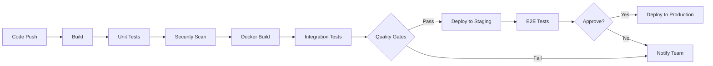

# 14. CI/CD Pipeline 配置 (CI/CD Pipeline Configuration)

## 文檔資訊

| 項目 | 內容 |
|------|------|
| **文檔版本** | 1.0.0 |
| **創建日期** | 2025-01-15 |
| **最後更新** | 2025-01-15 |
| **狀態** | Draft |
| **作者** | AI Workflow Platform Team |
| **關聯文檔** | 11-DEPLOYMENT-ARCHITECTURE.md, 13-KUBERNETES.md |

---

## 目錄

- [14.1 CI/CD 總覽](#141-cicd-總覽)
- [14.2 GitHub Actions 工作流](#142-github-actions-工作流)
- [14.3 構建流水線](#143-構建流水線)
- [14.4 測試流水線](#144-測試流水線)
- [14.5 部署流水線](#145-部署流水線)
- [14.6 質量門禁](#146-質量門禁)
- [14.7 安全掃描](#147-安全掃描)
- [14.8 環境管理](#148-環境管理)

---

## 14.1 CI/CD 總覽

### 14.1.1 CI/CD 流程



---

## 14.2 GitHub Actions 工作流

**.github/workflows/ci.yml:**

```yaml
name: CI Pipeline

on:
  push:
    branches: [main, develop]
  pull_request:
    branches: [main]

env:
  REGISTRY: aiworkflow.azurecr.io
  DOTNET_VERSION: '8.0.x'

jobs:
  build-and-test:
    runs-on: ubuntu-latest

    steps:
    - uses: actions/checkout@v4

    - name: Setup .NET
      uses: actions/setup-dotnet@v4
      with:
        dotnet-version: ${{ env.DOTNET_VERSION }}

    - name: Restore dependencies
      run: dotnet restore

    - name: Build
      run: dotnet build --no-restore --configuration Release

    - name: Test
      run: dotnet test --no-build --verbosity normal --collect:"XPlat Code Coverage"

    - name: Upload coverage
      uses: codecov/codecov-action@v3
```

---

## 14.3 構建流水線

**Build Docker Image:**

```yaml
name: Build Docker Images

on:
  push:
    branches: [main]

jobs:
  build:
    runs-on: ubuntu-latest

    steps:
    - uses: actions/checkout@v4

    - name: Login to ACR
      uses: azure/docker-login@v1
      with:
        login-server: ${{ env.REGISTRY }}
        username: ${{ secrets.ACR_USERNAME }}
        password: ${{ secrets.ACR_PASSWORD }}

    - name: Build and Push
      run: |
        docker build -t ${{ env.REGISTRY }}/agent-service:${{ github.sha }} ./src/AgentService
        docker push ${{ env.REGISTRY }}/agent-service:${{ github.sha }}
```

---

## 14.4 測試流水線

**Integration Tests:**

```yaml
name: Integration Tests

jobs:
  integration-tests:
    runs-on: ubuntu-latest

    services:
      postgresql:
        image: postgres:16
        env:
          POSTGRES_PASSWORD: test
        options: >-
          --health-cmd pg_isready
          --health-interval 10s
          --health-timeout 5s
          --health-retries 5

    steps:
    - name: Run Integration Tests
      run: dotnet test tests/IntegrationTests
```

---

## 14.5 部署流水線

**Deploy to Kubernetes:**

```yaml
name: Deploy to Production

on:
  workflow_dispatch:
  push:
    tags:
      - 'v*'

jobs:
  deploy:
    runs-on: ubuntu-latest

    steps:
    - name: Azure Login
      uses: azure/login@v1
      with:
        creds: ${{ secrets.AZURE_CREDENTIALS }}

    - name: Set AKS Context
      uses: azure/aks-set-context@v3
      with:
        cluster-name: ai-workflow-aks-prod
        resource-group: ai-workflow-rg

    - name: Deploy to Kubernetes
      run: |
        kubectl apply -f k8s/base/
        kubectl rollout status deployment/agent-service -n ai-workflow-prod
```

---

## 14.6 質量門禁

**Quality Gates:**

```yaml
quality-gates:
  code-coverage:
    minimum: 80%

  security-scan:
    severity: HIGH

  performance-tests:
    response-time: < 500ms
    error-rate: < 1%
```

---

## 14.7 安全掃描

**Trivy Security Scan:**

```yaml
name: Security Scan

jobs:
  security:
    runs-on: ubuntu-latest

    steps:
    - name: Run Trivy
      uses: aquasecurity/trivy-action@master
      with:
        image-ref: ${{ env.REGISTRY }}/agent-service:${{ github.sha }}
        format: 'sarif'
        severity: 'HIGH,CRITICAL'
```

---

## 14.8 環境管理

**Environments:**

```yaml
environments:
  development:
    auto-deploy: true

  staging:
    auto-deploy: true
    required-reviewers: 1

  production:
    auto-deploy: false
    required-reviewers: 2
    deployment-window: "09:00-17:00 UTC"
```

---

## 總結

本文檔提供了 AI Workflow Platform 的完整 CI/CD 配置，包含：

1. **GitHub Actions 工作流**: 自動化構建和部署
2. **質量門禁**: 確保代碼質量
3. **安全掃描**: 漏洞檢測
4. **環境管理**: 多環境部署策略

**快速開始:**
```bash
# 觸發 CI Pipeline
git push origin main

# 手動部署到生產環境
gh workflow run deploy-production.yml
```

**相關文檔:**
- 11-DEPLOYMENT-ARCHITECTURE.md - 部署架構總覽
- 13-KUBERNETES.md - Kubernetes 配置

---

**版本歷史:**

| 版本 | 日期 | 作者 | 變更說明 |
|------|------|------|----------|
| 1.0.0 | 2025-01-15 | AI Workflow Team | 初始版本 |
