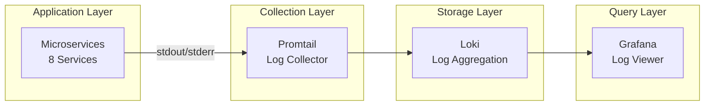

# 16. 日誌系統設計 (Logging System Design)

## 文檔資訊

| 項目 | 內容 |
|------|------|
| **文檔版本** | 1.0.0 |
| **創建日期** | 2025-01-15 |
| **最後更新** | 2025-01-15 |
| **狀態** | Draft |
| **作者** | AI Workflow Platform Team |
| **關聯文檔** | 15-MONITORING.md, 17-ALERTING.md |

---

## 目錄

- [16.1 日誌架構總覽](#161-日誌架構總覽)
- [16.2 日誌級別和格式](#162-日誌級別和格式)
- [16.3 結構化日誌](#163-結構化日誌)
- [16.4 日誌收集 (Loki)](#164-日誌收集-loki)
- [16.5 日誌查詢和分析](#165-日誌查詢和分析)
- [16.6 日誌保留策略](#166-日誌保留策略)
- [16.7 日誌最佳實踐](#167-日誌最佳實踐)

---

## 16.1 日誌架構總覽

### 16.1.1 日誌流架構



### 16.1.2 日誌類型

| 類型 | 來源 | 用途 | 示例 |
|------|------|------|------|
| **Application Logs** | 應用程序 | 業務邏輯追蹤 | "User 123 created agent" |
| **Access Logs** | Web Server | HTTP 請求記錄 | "GET /api/agents 200 50ms" |
| **Error Logs** | 應用程序 | 錯誤追蹤 | "Database connection failed" |
| **Audit Logs** | 應用程序 | 安全審計 | "Admin deleted user 456" |
| **Performance Logs** | 應用程序 | 性能分析 | "Query took 2.5s" |

---

## 16.2 日誌級別和格式

### 16.2.1 日誌級別

**ASP.NET Core 日誌級別:**

| 級別 | 數值 | 描述 | 使用場景 | 生產環境 |
|------|------|------|----------|----------|
| **Trace** | 0 | 詳細追蹤信息 | 深度調試 | ❌ 禁用 |
| **Debug** | 1 | 調試信息 | 開發調試 | ❌ 禁用 |
| **Information** | 2 | 一般信息 | 正常操作 | ✅ 啟用 |
| **Warning** | 3 | 警告信息 | 潛在問題 | ✅ 啟用 |
| **Error** | 4 | 錯誤信息 | 可恢復錯誤 | ✅ 啟用 |
| **Critical** | 5 | 嚴重錯誤 | 系統崩潰 | ✅ 啟用 |

**日誌級別配置 (appsettings.json):**

```json
{
  "Logging": {
    "LogLevel": {
      "Default": "Information",
      "Microsoft": "Warning",
      "Microsoft.Hosting.Lifetime": "Information",
      "Microsoft.EntityFrameworkCore": "Warning",
      "System": "Warning"
    }
  }
}
```

### 16.2.2 日誌格式

**標準日誌格式:**

```
[2025-01-15 10:30:45.123 +00:00] [INFO] [AgentService.CreateAgent] [RequestId:abc123] [UserId:user-456] Agent created successfully | AgentId=789 PersonaId=321 Duration=125ms
```

**格式結構:**
```
[Timestamp] [Level] [Category] [RequestId] [UserId] Message | Key1=Value1 Key2=Value2
```

---

## 16.3 結構化日誌

### 16.3.1 Serilog 配置

**安裝 Serilog:**

```bash
dotnet add package Serilog.AspNetCore
dotnet add package Serilog.Sinks.Console
dotnet add package Serilog.Sinks.File
dotnet add package Serilog.Enrichers.Environment
dotnet add package Serilog.Enrichers.Thread
dotnet add package Serilog.Settings.Configuration
```

**Program.cs 配置:**

```csharp
using Serilog;
using Serilog.Events;

var builder = WebApplication.CreateBuilder(args);

// 配置 Serilog
Log.Logger = new LoggerConfiguration()
    .ReadFrom.Configuration(builder.Configuration)
    .Enrich.FromLogContext()
    .Enrich.WithMachineName()
    .Enrich.WithEnvironmentName()
    .Enrich.WithProperty("Application", "AgentService")
    .Enrich.WithProperty("Version", "1.0.0")
    .WriteTo.Console(
        outputTemplate: "[{Timestamp:yyyy-MM-dd HH:mm:ss.fff zzz}] [{Level:u3}] [{SourceContext}] {Message:lj}{NewLine}{Exception}")
    .WriteTo.File(
        path: "logs/agent-service-.log",
        rollingInterval: RollingInterval.Day,
        retainedFileCountLimit: 30,
        outputTemplate: "{Timestamp:yyyy-MM-dd HH:mm:ss.fff zzz} [{Level:u3}] [{SourceContext}] {Message:lj}{NewLine}{Exception}")
    .CreateLogger();

builder.Host.UseSerilog();

var app = builder.Build();

// 記錄請求日誌
app.UseSerilogRequestLogging(options =>
{
    options.MessageTemplate = "HTTP {RequestMethod} {RequestPath} responded {StatusCode} in {Elapsed:0.0000}ms";
    options.GetLevel = (httpContext, elapsed, ex) =>
    {
        if (ex != null) return LogEventLevel.Error;
        if (httpContext.Response.StatusCode >= 500) return LogEventLevel.Error;
        if (httpContext.Response.StatusCode >= 400) return LogEventLevel.Warning;
        return LogEventLevel.Information;
    };
    options.EnrichDiagnosticContext = (diagnosticContext, httpContext) =>
    {
        diagnosticContext.Set("RequestHost", httpContext.Request.Host.Value);
        diagnosticContext.Set("RequestScheme", httpContext.Request.Scheme);
        diagnosticContext.Set("UserAgent", httpContext.Request.Headers["User-Agent"].ToString());
        diagnosticContext.Set("UserId", httpContext.User.FindFirst("sub")?.Value);
    };
});

app.Run();
```

**appsettings.json Serilog 配置:**

```json
{
  "Serilog": {
    "Using": ["Serilog.Sinks.Console", "Serilog.Sinks.File"],
    "MinimumLevel": {
      "Default": "Information",
      "Override": {
        "Microsoft": "Warning",
        "System": "Warning"
      }
    },
    "WriteTo": [
      {
        "Name": "Console",
        "Args": {
          "outputTemplate": "[{Timestamp:yyyy-MM-dd HH:mm:ss.fff zzz}] [{Level:u3}] [{SourceContext}] {Message:lj}{NewLine}{Exception}"
        }
      },
      {
        "Name": "File",
        "Args": {
          "path": "logs/agent-service-.log",
          "rollingInterval": "Day",
          "retainedFileCountLimit": 30,
          "outputTemplate": "{Timestamp:yyyy-MM-dd HH:mm:ss.fff zzz} [{Level:u3}] [{SourceContext}] {Message:lj}{NewLine}{Exception}"
        }
      }
    ],
    "Enrich": ["FromLogContext", "WithMachineName", "WithEnvironmentName"]
  }
}
```

### 16.3.2 結構化日誌使用

**基本日誌記錄:**

```csharp
public class AgentService
{
    private readonly ILogger<AgentService> _logger;

    public AgentService(ILogger<AgentService> logger)
    {
        _logger = logger;
    }

    public async Task<Agent> CreateAgentAsync(CreateAgentRequest request)
    {
        // Information 級別
        _logger.LogInformation(
            "Creating agent for user {UserId} with persona {PersonaId}",
            request.UserId,
            request.PersonaId);

        try
        {
            var agent = new Agent
            {
                UserId = request.UserId,
                PersonaId = request.PersonaId,
                Name = request.Name
            };

            await _dbContext.Agents.AddAsync(agent);
            await _dbContext.SaveChangesAsync();

            // 成功日誌 (帶結構化數據)
            _logger.LogInformation(
                "Agent created successfully. AgentId={AgentId} Name={Name} UserId={UserId}",
                agent.Id,
                agent.Name,
                agent.UserId);

            return agent;
        }
        catch (Exception ex)
        {
            // 錯誤日誌 (帶異常)
            _logger.LogError(
                ex,
                "Failed to create agent for user {UserId}",
                request.UserId);
            throw;
        }
    }

    public async Task<ExecutionResult> ExecuteAgentAsync(Guid agentId)
    {
        var stopwatch = Stopwatch.StartNew();

        _logger.LogInformation("Starting agent execution. AgentId={AgentId}", agentId);

        try
        {
            var agent = await _dbContext.Agents.FindAsync(agentId);
            if (agent == null)
            {
                _logger.LogWarning("Agent not found. AgentId={AgentId}", agentId);
                throw new NotFoundException($"Agent {agentId} not found");
            }

            // 執行邏輯...
            var result = await ExecuteLogicAsync(agent);

            stopwatch.Stop();

            // 性能日誌
            _logger.LogInformation(
                "Agent execution completed. AgentId={AgentId} Duration={Duration}ms Status={Status}",
                agentId,
                stopwatch.ElapsedMilliseconds,
                result.Status);

            return result;
        }
        catch (Exception ex)
        {
            stopwatch.Stop();

            _logger.LogError(
                ex,
                "Agent execution failed. AgentId={AgentId} Duration={Duration}ms",
                agentId,
                stopwatch.ElapsedMilliseconds);
            throw;
        }
    }
}
```

**使用 LoggerMessage (高性能日誌):**

```csharp
public static partial class LoggerExtensions
{
    [LoggerMessage(
        EventId = 1001,
        Level = LogLevel.Information,
        Message = "Creating agent for user {UserId} with persona {PersonaId}")]
    public static partial void LogAgentCreating(
        this ILogger logger,
        Guid userId,
        Guid personaId);

    [LoggerMessage(
        EventId = 1002,
        Level = LogLevel.Information,
        Message = "Agent created successfully. AgentId={AgentId} Name={Name}")]
    public static partial void LogAgentCreated(
        this ILogger logger,
        Guid agentId,
        string name);

    [LoggerMessage(
        EventId = 1003,
        Level = LogLevel.Error,
        Message = "Failed to create agent for user {UserId}")]
    public static partial void LogAgentCreationFailed(
        this ILogger logger,
        Exception ex,
        Guid userId);
}

// 使用
public class AgentService
{
    public async Task<Agent> CreateAgentAsync(CreateAgentRequest request)
    {
        _logger.LogAgentCreating(request.UserId, request.PersonaId);

        try
        {
            // ...
            _logger.LogAgentCreated(agent.Id, agent.Name);
            return agent;
        }
        catch (Exception ex)
        {
            _logger.LogAgentCreationFailed(ex, request.UserId);
            throw;
        }
    }
}
```

### 16.3.3 上下文增強

**請求上下文中間件:**

```csharp
public class RequestLoggingMiddleware
{
    private readonly RequestDelegate _next;
    private readonly ILogger<RequestLoggingMiddleware> _logger;

    public RequestLoggingMiddleware(
        RequestDelegate next,
        ILogger<RequestLoggingMiddleware> logger)
    {
        _next = next;
        _logger = logger;
    }

    public async Task InvokeAsync(HttpContext context)
    {
        var requestId = context.TraceIdentifier;
        var userId = context.User.FindFirst("sub")?.Value;

        // 添加到日誌上下文
        using (LogContext.PushProperty("RequestId", requestId))
        using (LogContext.PushProperty("UserId", userId))
        using (LogContext.PushProperty("UserAgent", context.Request.Headers["User-Agent"].ToString()))
        using (LogContext.PushProperty("ClientIP", context.Connection.RemoteIpAddress?.ToString()))
        {
            await _next(context);
        }
    }
}

// 註冊中間件
app.UseMiddleware<RequestLoggingMiddleware>();
```

---

## 16.4 日誌收集 (Loki)

### 16.4.1 Loki 部署

**部署 Loki:**

```yaml
apiVersion: v1
kind: ConfigMap
metadata:
  name: loki-config
  namespace: monitoring
data:
  loki.yaml: |
    auth_enabled: false

    server:
      http_listen_port: 3100

    ingester:
      lifecycler:
        address: 127.0.0.1
        ring:
          kvstore:
            store: inmemory
          replication_factor: 1
      chunk_idle_period: 5m
      chunk_retain_period: 30s
      max_chunk_age: 1h

    schema_config:
      configs:
      - from: 2023-01-01
        store: boltdb-shipper
        object_store: filesystem
        schema: v11
        index:
          prefix: index_
          period: 24h

    storage_config:
      boltdb_shipper:
        active_index_directory: /loki/boltdb-shipper-active
        cache_location: /loki/boltdb-shipper-cache
        cache_ttl: 24h
        shared_store: filesystem
      filesystem:
        directory: /loki/chunks

    limits_config:
      enforce_metric_name: false
      reject_old_samples: true
      reject_old_samples_max_age: 168h  # 7 days
      ingestion_rate_mb: 10
      ingestion_burst_size_mb: 20

    chunk_store_config:
      max_look_back_period: 720h  # 30 days

    table_manager:
      retention_deletes_enabled: true
      retention_period: 720h  # 30 days

---
apiVersion: apps/v1
kind: Deployment
metadata:
  name: loki
  namespace: monitoring
spec:
  replicas: 1
  selector:
    matchLabels:
      app: loki
  template:
    metadata:
      labels:
        app: loki
    spec:
      containers:
      - name: loki
        image: grafana/loki:latest
        args:
        - -config.file=/etc/loki/loki.yaml
        ports:
        - containerPort: 3100
        volumeMounts:
        - name: config
          mountPath: /etc/loki
        - name: storage
          mountPath: /loki
        resources:
          requests:
            cpu: 500m
            memory: 1Gi
          limits:
            cpu: 2000m
            memory: 4Gi
      volumes:
      - name: config
        configMap:
          name: loki-config
      - name: storage
        persistentVolumeClaim:
          claimName: loki-pvc

---
apiVersion: v1
kind: Service
metadata:
  name: loki
  namespace: monitoring
spec:
  ports:
  - port: 3100
    targetPort: 3100
  selector:
    app: loki

---
apiVersion: v1
kind: PersistentVolumeClaim
metadata:
  name: loki-pvc
  namespace: monitoring
spec:
  accessModes:
  - ReadWriteOnce
  storageClassName: managed-premium
  resources:
    requests:
      storage: 500Gi
```

### 16.4.2 Promtail 部署

**部署 Promtail (DaemonSet):**

```yaml
apiVersion: v1
kind: ConfigMap
metadata:
  name: promtail-config
  namespace: monitoring
data:
  promtail.yaml: |
    server:
      http_listen_port: 9080
      grpc_listen_port: 0

    positions:
      filename: /tmp/positions.yaml

    clients:
      - url: http://loki:3100/loki/api/v1/push

    scrape_configs:
      # Kubernetes Pod Logs
      - job_name: kubernetes-pods
        kubernetes_sd_configs:
        - role: pod
        pipeline_stages:
        - docker: {}
        relabel_configs:
        - source_labels: [__meta_kubernetes_pod_node_name]
          target_label: __host__
        - action: labelmap
          regex: __meta_kubernetes_pod_label_(.+)
        - source_labels: [__meta_kubernetes_namespace]
          target_label: namespace
        - source_labels: [__meta_kubernetes_pod_name]
          target_label: pod
        - source_labels: [__meta_kubernetes_pod_container_name]
          target_label: container
        - replacement: /var/log/pods/*$1/*.log
          separator: /
          source_labels:
          - __meta_kubernetes_pod_uid
          - __meta_kubernetes_pod_container_name
          target_label: __path__

---
apiVersion: apps/v1
kind: DaemonSet
metadata:
  name: promtail
  namespace: monitoring
spec:
  selector:
    matchLabels:
      app: promtail
  template:
    metadata:
      labels:
        app: promtail
    spec:
      serviceAccountName: promtail
      containers:
      - name: promtail
        image: grafana/promtail:latest
        args:
        - -config.file=/etc/promtail/promtail.yaml
        volumeMounts:
        - name: config
          mountPath: /etc/promtail
        - name: varlog
          mountPath: /var/log
        - name: varlibdockercontainers
          mountPath: /var/lib/docker/containers
          readOnly: true
        resources:
          requests:
            cpu: 100m
            memory: 128Mi
          limits:
            cpu: 500m
            memory: 512Mi
      volumes:
      - name: config
        configMap:
          name: promtail-config
      - name: varlog
        hostPath:
          path: /var/log
      - name: varlibdockercontainers
        hostPath:
          path: /var/lib/docker/containers
```

---

## 16.5 日誌查詢和分析

### 16.5.1 LogQL 查詢語言

**基本查詢:**

```logql
# 查詢特定 namespace 的日誌
{namespace="ai-workflow-prod"}

# 查詢特定服務的日誌
{namespace="ai-workflow-prod", app="agent-service"}

# 查詢包含特定文本的日誌
{app="agent-service"} |= "error"

# 查詢不包含特定文本的日誌
{app="agent-service"} != "health check"

# 正則表達式匹配
{app="agent-service"} |~ "error|exception"

# 查詢特定時間範圍
{app="agent-service"} |= "error" [5m]
```

**日誌過濾和解析:**

```logql
# JSON 日誌解析
{app="agent-service"} | json

# 提取特定字段
{app="agent-service"} | json | level="ERROR"

# 正則表達式提取
{app="agent-service"} |~ "Duration=(?P<duration>\\d+)ms"

# 多條件過濾
{app="agent-service"} | json | level="ERROR" | user_id="123"
```

**聚合查詢:**

```logql
# 計數
count_over_time({app="agent-service"}[5m])

# 錯誤率
sum(rate({app="agent-service"} |= "error" [5m]))

# 按標籤分組計數
sum by (level) (count_over_time({app="agent-service"} | json [5m]))

# P95 延遲
quantile_over_time(0.95, {app="agent-service"} | json | __error__="" | unwrap duration [5m])
```

### 16.5.2 常見查詢示例

**1. 錯誤日誌查詢:**

```logql
{namespace="ai-workflow-prod"} | json | level="ERROR" | line_format "{{.timestamp}} [{{.level}}] {{.message}}"
```

**2. 特定用戶操作日誌:**

```logql
{app="agent-service"} | json | user_id="123" | line_format "{{.timestamp}} {{.message}}"
```

**3. 慢查詢日誌:**

```logql
{app="agent-service"} | json | unwrap duration | duration > 1000
```

**4. HTTP 5xx 錯誤:**

```logql
{app="agent-service"} | json | status_code >= 500
```

**5. 每分鐘錯誤數:**

```logql
sum(count_over_time({namespace="ai-workflow-prod"} | json | level="ERROR" [1m])) by (app)
```

### 16.5.3 Grafana 日誌面板

**日誌查詢面板配置:**

```json
{
  "targets": [
    {
      "expr": "{namespace=\"ai-workflow-prod\", app=\"agent-service\"}",
      "refId": "A"
    }
  ],
  "options": {
    "showTime": true,
    "showLabels": false,
    "showCommonLabels": false,
    "wrapLogMessage": false,
    "prettifyLogMessage": false,
    "enableLogDetails": true,
    "dedupStrategy": "none",
    "sortOrder": "Descending"
  }
}
```

---

## 16.6 日誌保留策略

### 16.6.1 保留策略配置

**Loki 保留策略:**

```yaml
# loki-config.yaml
limits_config:
  retention_period: 720h  # 30 days

table_manager:
  retention_deletes_enabled: true
  retention_period: 720h  # 30 days
```

**按環境的保留策略:**

| 環境 | 保留期限 | 存儲類型 | 壓縮 |
|------|---------|---------|------|
| **Development** | 7 days | 本地存儲 | 否 |
| **Staging** | 14 days | Azure Blob | 是 |
| **Production** | 30 days | Azure Blob | 是 |

### 16.6.2 日誌歸檔

**自動歸檔腳本:**

```bash
#!/bin/bash
# log-archive.sh

ARCHIVE_DIR="/archive/logs"
RETENTION_DAYS=30

# 查找 30 天前的日誌
find /loki/chunks -name "*.gz" -mtime +${RETENTION_DAYS} | while read file; do
  # 上傳到 Azure Blob Storage
  az storage blob upload \
    --account-name aiworkflowlogs \
    --container-name archived-logs \
    --name "$(basename $file)" \
    --file "$file"

  # 刪除本地文件
  rm -f "$file"
done

echo "Log archival completed"
```

---

## 16.7 日誌最佳實踐

### 16.7.1 日誌記錄原則

**✅ DO:**
- ✅ 使用結構化日誌 (JSON 格式)
- ✅ 包含請求 ID 和用戶 ID
- ✅ 記錄關鍵業務操作
- ✅ 記錄異常和錯誤詳情
- ✅ 記錄性能指標 (執行時間)
- ✅ 使用適當的日誌級別
- ✅ 保護敏感信息 (密碼、Token)

**❌ DON'T:**
- ❌ 記錄敏感數據 (密碼、信用卡)
- ❌ 在循環中記錄過多日誌
- ❌ 使用字符串拼接 (使用參數化)
- ❌ 記錄過大的對象
- ❌ 在生產環境使用 Debug 級別

### 16.7.2 敏感信息保護

**敏感信息過濾:**

```csharp
public class SensitiveDataFilter : ILogEventEnricher
{
    private static readonly string[] SensitiveKeys =
    {
        "password", "token", "secret", "apikey", "creditcard"
    };

    public void Enrich(LogEvent logEvent, ILogEventPropertyFactory propertyFactory)
    {
        foreach (var property in logEvent.Properties)
        {
            if (SensitiveKeys.Any(k => property.Key.Contains(k, StringComparison.OrdinalIgnoreCase)))
            {
                logEvent.RemovePropertyIfPresent(property.Key);
                logEvent.AddPropertyIfAbsent(
                    propertyFactory.CreateProperty(property.Key, "***REDACTED***"));
            }
        }
    }
}

// 註冊過濾器
Log.Logger = new LoggerConfiguration()
    .Enrich.With<SensitiveDataFilter>()
    .CreateLogger();
```

### 16.7.3 日誌性能優化

**異步日誌:**

```csharp
Log.Logger = new LoggerConfiguration()
    .WriteTo.Async(a => a.File("logs/app.log"))
    .CreateLogger();
```

**條件日誌:**

```csharp
// 僅在 Debug 級別啟用時執行
if (_logger.IsEnabled(LogLevel.Debug))
{
    var debugInfo = ExpensiveDebugInfoGeneration();
    _logger.LogDebug("Debug info: {Info}", debugInfo);
}
```

### 16.7.4 日誌 Checklist

**✅ 應用日誌:**
- [ ] 結構化日誌格式
- [ ] 請求 ID 追蹤
- [ ] 用戶 ID 關聯
- [ ] 異常完整記錄
- [ ] 性能指標記錄

**✅ 安全性:**
- [ ] 敏感信息過濾
- [ ] 訪問控制 (RBAC)
- [ ] 日誌加密傳輸
- [ ] 審計日誌記錄

**✅ 運維:**
- [ ] 日誌集中收集
- [ ] 日誌保留策略
- [ ] 日誌歸檔機制
- [ ] 日誌查詢性能

**✅ 監控:**
- [ ] 錯誤日誌告警
- [ ] 日誌量監控
- [ ] 日誌延遲監控

---

## 總結

本文檔提供了 AI Workflow Platform 的完整日誌系統設計，涵蓋:

1. **日誌架構**: Loki + Promtail + Grafana 日誌聚合
2. **日誌級別**: Trace/Debug/Info/Warning/Error/Critical
3. **結構化日誌**: Serilog 配置和使用
4. **日誌收集**: Promtail 自動收集 Kubernetes Pod 日誌
5. **日誌查詢**: LogQL 查詢語言和常見查詢
6. **保留策略**: 30 天保留 + 自動歸檔
7. **最佳實踐**: 日誌原則、敏感信息保護、性能優化

**關鍵配置:**
- **日誌格式**: JSON 結構化日誌
- **日誌級別**: Production = Information 以上
- **保留期限**: 30 天
- **日誌上下文**: RequestId + UserId + Timestamp

**相關文檔:**
- 15-MONITORING.md - 監控系統設計
- 17-ALERTING.md - 告警系統設計

---

**版本歷史:**

| 版本 | 日期 | 作者 | 變更說明 |
|------|------|------|----------|
| 1.0.0 | 2025-01-15 | AI Workflow Team | 初始版本 |
