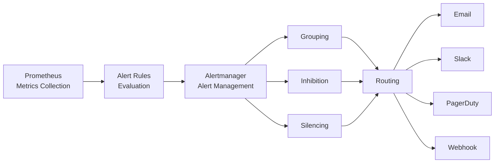

# 17. 告警系統設計 (Alerting System Design)

## 文檔資訊

| 項目 | 內容 |
|------|------|
| **文檔版本** | 1.0.0 |
| **創建日期** | 2025-01-15 |
| **最後更新** | 2025-01-15 |
| **狀態** | Draft |
| **作者** | AI Workflow Platform Team |
| **關聯文檔** | 15-MONITORING.md, 16-LOGGING.md |

---

## 目錄

- [17.1 告警架構總覽](#171-告警架構總覽)
- [17.2 Alertmanager 配置](#172-alertmanager-配置)
- [17.3 告警規則定義](#173-告警規則定義)
- [17.4 告警路由策略](#174-告警路由策略)
- [17.5 通知渠道配置](#175-通知渠道配置)
- [17.6 告警靜默和抑制](#176-告警靜默和抑制)
- [17.7 告警最佳實踐](#177-告警最佳實踐)

---

## 17.1 告警架構總覽

### 17.1.1 告警流程



### 17.1.2 告警級別

| 級別 | 嚴重程度 | 響應時間 | 通知方式 | 示例 |
|------|----------|---------|---------|------|
| **Critical** | 嚴重 | 立即 (5 分鐘內) | PagerDuty + Slack + Email | 服務完全宕機 |
| **High** | 高 | 15 分鐘內 | Slack + Email | 錯誤率 > 5% |
| **Warning** | 警告 | 1 小時內 | Email | CPU 使用率 > 80% |
| **Info** | 信息 | 不需要立即響應 | Email (匯總) | 部署完成通知 |

### 17.1.3 告警原則

**✅ 好的告警:**
- ✅ 可操作性: 需要人工干預
- ✅ 明確性: 清楚說明問題
- ✅ 及時性: 在問題影響用戶前觸發
- ✅ 準確性: 誤報率低

**❌ 壞的告警:**
- ❌ 噪音: 頻繁觸發但不需要處理
- ❌ 模糊: 無法確定問題來源
- ❌ 滯後: 用戶已經受到影響
- ❌ 誤報: 實際沒有問題

---

## 17.2 Alertmanager 配置

### 17.2.1 部署 Alertmanager

**k8s/monitoring/alertmanager/alertmanager.yaml:**

```yaml
apiVersion: v1
kind: ConfigMap
metadata:
  name: alertmanager-config
  namespace: monitoring
data:
  alertmanager.yml: |
    global:
      resolve_timeout: 5m
      slack_api_url: 'https://hooks.slack.com/services/YOUR/SLACK/WEBHOOK'
      pagerduty_url: 'https://events.pagerduty.com/v2/enqueue'

    # 模板路徑
    templates:
    - '/etc/alertmanager/templates/*.tmpl'

    # 路由配置
    route:
      group_by: ['alertname', 'cluster', 'service']
      group_wait: 10s
      group_interval: 10s
      repeat_interval: 12h
      receiver: 'default'

      routes:
      # Critical 告警 -> PagerDuty + Slack
      - match:
          severity: critical
        receiver: 'pagerduty-critical'
        continue: true

      - match:
          severity: critical
        receiver: 'slack-critical'

      # High 告警 -> Slack + Email
      - match:
          severity: high
        receiver: 'slack-high'
        continue: true

      - match:
          severity: high
        receiver: 'email-ops'

      # Warning 告警 -> Email
      - match:
          severity: warning
        receiver: 'email-ops'

      # 數據庫告警 -> DBA 團隊
      - match:
          service: postgresql
        receiver: 'slack-dba'

    # 接收器配置
    receivers:
    # 默認接收器
    - name: 'default'
      email_configs:
      - to: 'ops@aiworkflow.com'
        from: 'alertmanager@aiworkflow.com'
        smarthost: 'smtp.gmail.com:587'
        auth_username: 'alertmanager@aiworkflow.com'
        auth_password: 'password'

    # PagerDuty - Critical
    - name: 'pagerduty-critical'
      pagerduty_configs:
      - service_key: 'YOUR_PAGERDUTY_SERVICE_KEY'
        severity: 'critical'
        description: '{{ .CommonAnnotations.summary }}'
        details:
          firing: '{{ .Alerts.Firing | len }}'
          resolved: '{{ .Alerts.Resolved | len }}'
          description: '{{ .CommonAnnotations.description }}'

    # Slack - Critical
    - name: 'slack-critical'
      slack_configs:
      - channel: '#alerts-critical'
        title: '🚨 Critical Alert: {{ .CommonLabels.alertname }}'
        text: |
          *Summary:* {{ .CommonAnnotations.summary }}
          *Description:* {{ .CommonAnnotations.description }}
          *Severity:* {{ .CommonLabels.severity }}
          *Service:* {{ .CommonLabels.service }}
          *Firing Alerts:* {{ .Alerts.Firing | len }}
        send_resolved: true

    # Slack - High
    - name: 'slack-high'
      slack_configs:
      - channel: '#alerts-high'
        title: '⚠️ High Alert: {{ .CommonLabels.alertname }}'
        text: '{{ .CommonAnnotations.summary }}'
        send_resolved: true

    # Slack - DBA
    - name: 'slack-dba'
      slack_configs:
      - channel: '#alerts-dba'
        title: '🗄️ Database Alert: {{ .CommonLabels.alertname }}'
        text: '{{ .CommonAnnotations.summary }}'

    # Email - Ops Team
    - name: 'email-ops'
      email_configs:
      - to: 'ops@aiworkflow.com'
        from: 'alertmanager@aiworkflow.com'
        smarthost: 'smtp.gmail.com:587'
        auth_username: 'alertmanager@aiworkflow.com'
        auth_password: 'password'
        headers:
          Subject: '[{{ .Status }}] {{ .CommonLabels.alertname }}'
        html: |
          <h2>{{ .CommonLabels.alertname }}</h2>
          <p><strong>Summary:</strong> {{ .CommonAnnotations.summary }}</p>
          <p><strong>Description:</strong> {{ .CommonAnnotations.description }}</p>
          <p><strong>Severity:</strong> {{ .CommonLabels.severity }}</p>
          <p><strong>Service:</strong> {{ .CommonLabels.service }}</p>
          <p><strong>Firing Alerts:</strong> {{ .Alerts.Firing | len }}</p>

    # 抑制規則
    inhibit_rules:
    # 如果集群宕機，抑制所有其他告警
    - source_match:
        severity: 'critical'
        alertname: 'ClusterDown'
      target_match_re:
        severity: 'warning|high'
      equal: ['cluster']

    # 如果節點宕機，抑制該節點上所有 Pod 告警
    - source_match:
        severity: 'critical'
        alertname: 'NodeDown'
      target_match:
        severity: 'warning'
      equal: ['instance']

---
apiVersion: apps/v1
kind: Deployment
metadata:
  name: alertmanager
  namespace: monitoring
spec:
  replicas: 1
  selector:
    matchLabels:
      app: alertmanager
  template:
    metadata:
      labels:
        app: alertmanager
    spec:
      containers:
      - name: alertmanager
        image: prom/alertmanager:latest
        args:
        - '--config.file=/etc/alertmanager/alertmanager.yml'
        - '--storage.path=/alertmanager'
        ports:
        - containerPort: 9093
        volumeMounts:
        - name: config
          mountPath: /etc/alertmanager
        - name: storage
          mountPath: /alertmanager
        - name: templates
          mountPath: /etc/alertmanager/templates
        resources:
          requests:
            cpu: 250m
            memory: 512Mi
          limits:
            cpu: 1000m
            memory: 2Gi
      volumes:
      - name: config
        configMap:
          name: alertmanager-config
      - name: storage
        emptyDir: {}
      - name: templates
        configMap:
          name: alertmanager-templates

---
apiVersion: v1
kind: Service
metadata:
  name: alertmanager
  namespace: monitoring
spec:
  type: ClusterIP
  ports:
  - port: 9093
    targetPort: 9093
  selector:
    app: alertmanager
```

### 17.2.2 告警模板

**alertmanager-templates.yaml:**

```yaml
apiVersion: v1
kind: ConfigMap
metadata:
  name: alertmanager-templates
  namespace: monitoring
data:
  slack.tmpl: |
    {{ define "slack.default.title" }}
    [{{ .Status | toUpper }}{{ if eq .Status "firing" }}:{{ .Alerts.Firing | len }}{{ end }}] {{ .CommonLabels.alertname }}
    {{ end }}

    {{ define "slack.default.text" }}
    {{ range .Alerts }}
    *Alert:* {{ .Labels.alertname }} - `{{ .Labels.severity }}`
    *Description:* {{ .Annotations.description }}
    *Details:*
      {{ range .Labels.SortedPairs }} • *{{ .Name }}:* `{{ .Value }}`
      {{ end }}
    {{ end }}
    {{ end }}

  email.tmpl: |
    {{ define "email.default.subject" }}
    [{{ .Status | toUpper }}] {{ .CommonLabels.alertname }}
    {{ end }}

    {{ define "email.default.html" }}
    <!DOCTYPE html>
    <html>
    <head>
      <style>
        body { font-family: Arial, sans-serif; }
        .alert { padding: 20px; margin: 10px 0; border-radius: 5px; }
        .critical { background-color: #f8d7da; color: #721c24; }
        .high { background-color: #fff3cd; color: #856404; }
        .warning { background-color: #d1ecf1; color: #0c5460; }
      </style>
    </head>
    <body>
      <h2>{{ .CommonLabels.alertname }}</h2>
      <div class="alert {{ .CommonLabels.severity }}">
        <p><strong>Summary:</strong> {{ .CommonAnnotations.summary }}</p>
        <p><strong>Description:</strong> {{ .CommonAnnotations.description }}</p>
        <p><strong>Severity:</strong> {{ .CommonLabels.severity }}</p>
        <p><strong>Service:</strong> {{ .CommonLabels.service }}</p>
        <p><strong>Firing Alerts:</strong> {{ .Alerts.Firing | len }}</p>
      </div>

      <h3>Alert Details</h3>
      <table border="1" cellpadding="5" cellspacing="0">
        <tr>
          <th>Alert Name</th>
          <th>Status</th>
          <th>Started At</th>
          <th>Labels</th>
        </tr>
        {{ range .Alerts }}
        <tr>
          <td>{{ .Labels.alertname }}</td>
          <td>{{ .Status }}</td>
          <td>{{ .StartsAt }}</td>
          <td>{{ range .Labels.SortedPairs }}{{ .Name }}={{ .Value }}<br/>{{ end }}</td>
        </tr>
        {{ end }}
      </table>
    </body>
    </html>
    {{ end }}
```

---

## 17.3 告警規則定義

### 17.3.1 Prometheus 告警規則

**k8s/monitoring/prometheus/rules/application-rules.yaml:**

```yaml
apiVersion: v1
kind: ConfigMap
metadata:
  name: prometheus-application-rules
  namespace: monitoring
data:
  application.rules.yml: |
    groups:
    - name: application_alerts
      interval: 30s
      rules:

      # 服務可用性告警
      - alert: ServiceDown
        expr: up{job=~".*-service"} == 0
        for: 1m
        labels:
          severity: critical
          service: '{{ $labels.job }}'
        annotations:
          summary: "Service {{ $labels.job }} is down"
          description: "{{ $labels.job }} has been down for more than 1 minute. Instance: {{ $labels.instance }}"
          runbook_url: "https://wiki.aiworkflow.com/runbooks/service-down"

      # 高錯誤率告警
      - alert: HighErrorRate
        expr: |
          (
            sum(rate(http_requests_total{status=~"5.."}[5m])) by (job)
            /
            sum(rate(http_requests_total[5m])) by (job)
          ) > 0.05
        for: 5m
        labels:
          severity: high
          service: '{{ $labels.job }}'
        annotations:
          summary: "High error rate on {{ $labels.job }}"
          description: "{{ $labels.job }} has error rate {{ $value | humanizePercentage }} (threshold: 5%)"
          runbook_url: "https://wiki.aiworkflow.com/runbooks/high-error-rate"

      # 高延遲告警
      - alert: HighLatency
        expr: |
          histogram_quantile(0.95,
            sum(rate(http_request_duration_seconds_bucket[5m])) by (job, le)
          ) > 1
        for: 10m
        labels:
          severity: warning
          service: '{{ $labels.job }}'
        annotations:
          summary: "High latency on {{ $labels.job }}"
          description: "{{ $labels.job }} P95 latency is {{ $value }}s (threshold: 1s)"

      # Pod 重啟頻繁
      - alert: PodRestartingTooOften
        expr: |
          rate(kube_pod_container_status_restarts_total{namespace="ai-workflow-prod"}[15m]) > 0
        for: 5m
        labels:
          severity: warning
          service: '{{ $labels.pod }}'
        annotations:
          summary: "Pod {{ $labels.pod }} is restarting too often"
          description: "Pod {{ $labels.pod }} has restarted {{ $value }} times in the last 15 minutes"

      # Pod CrashLoopBackOff
      - alert: PodCrashLoopBackOff
        expr: |
          kube_pod_container_status_waiting_reason{reason="CrashLoopBackOff", namespace="ai-workflow-prod"} == 1
        for: 5m
        labels:
          severity: critical
          service: '{{ $labels.pod }}'
        annotations:
          summary: "Pod {{ $labels.pod }} is in CrashLoopBackOff"
          description: "Pod {{ $labels.pod }} has been in CrashLoopBackOff for more than 5 minutes"

      # 高 CPU 使用率
      - alert: HighCPUUsage
        expr: |
          (
            sum(rate(container_cpu_usage_seconds_total{namespace="ai-workflow-prod"}[5m])) by (pod)
            /
            sum(container_spec_cpu_quota{namespace="ai-workflow-prod"} / container_spec_cpu_period{namespace="ai-workflow-prod"}) by (pod)
          ) > 0.8
        for: 10m
        labels:
          severity: warning
          service: '{{ $labels.pod }}'
        annotations:
          summary: "High CPU usage on {{ $labels.pod }}"
          description: "{{ $labels.pod }} CPU usage is {{ $value | humanizePercentage }} (threshold: 80%)"

      # 高內存使用率
      - alert: HighMemoryUsage
        expr: |
          (
            sum(container_memory_usage_bytes{namespace="ai-workflow-prod"}) by (pod)
            /
            sum(container_spec_memory_limit_bytes{namespace="ai-workflow-prod"}) by (pod)
          ) > 0.85
        for: 10m
        labels:
          severity: warning
          service: '{{ $labels.pod }}'
        annotations:
          summary: "High memory usage on {{ $labels.pod }}"
          description: "{{ $labels.pod }} memory usage is {{ $value | humanizePercentage }} (threshold: 85%)"

      # API 請求量異常低
      - alert: LowRequestVolume
        expr: |
          sum(rate(http_requests_total{job="agent-service"}[5m])) < 1
        for: 10m
        labels:
          severity: warning
          service: 'agent-service'
        annotations:
          summary: "Low request volume on agent-service"
          description: "agent-service receiving {{ $value }} requests/sec (expected > 1 req/s)"
```

### 17.3.2 數據庫告警規則

**k8s/monitoring/prometheus/rules/database-rules.yaml:**

```yaml
apiVersion: v1
kind: ConfigMap
metadata:
  name: prometheus-database-rules
  namespace: monitoring
data:
  database.rules.yml: |
    groups:
    - name: database_alerts
      interval: 30s
      rules:

      # PostgreSQL 宕機
      - alert: PostgreSQLDown
        expr: pg_up == 0
        for: 1m
        labels:
          severity: critical
          service: postgresql
        annotations:
          summary: "PostgreSQL is down"
          description: "PostgreSQL has been down for more than 1 minute"
          runbook_url: "https://wiki.aiworkflow.com/runbooks/postgresql-down"

      # 數據庫連接數過高
      - alert: HighDatabaseConnections
        expr: |
          sum(pg_stat_database_numbackends) by (datname) > 80
        for: 5m
        labels:
          severity: warning
          service: postgresql
        annotations:
          summary: "High database connections on {{ $labels.datname }}"
          description: "Database {{ $labels.datname }} has {{ $value }} connections (threshold: 80)"

      # 慢查詢數量過多
      - alert: HighSlowQueries
        expr: |
          rate(pg_stat_statements_calls{query=~".*"}[5m]) > 10
        for: 10m
        labels:
          severity: warning
          service: postgresql
        annotations:
          summary: "High number of slow queries"
          description: "{{ $value }} slow queries per second (threshold: 10)"

      # 數據庫大小接近上限
      - alert: DatabaseSizeNearLimit
        expr: |
          (pg_database_size_bytes / 1099511627776) > 0.9
        for: 1h
        labels:
          severity: high
          service: postgresql
        annotations:
          summary: "Database {{ $labels.datname }} size near limit"
          description: "Database {{ $labels.datname }} is {{ $value | humanize }}TB (90% of 1TB limit)"

      # Redis 宕機
      - alert: RedisDown
        expr: redis_up == 0
        for: 1m
        labels:
          severity: critical
          service: redis
        annotations:
          summary: "Redis is down"
          description: "Redis has been down for more than 1 minute"

      # Redis 內存使用率高
      - alert: HighRedisMemory
        expr: |
          (redis_memory_used_bytes / redis_memory_max_bytes) > 0.9
        for: 5m
        labels:
          severity: high
          service: redis
        annotations:
          summary: "High Redis memory usage"
          description: "Redis memory usage is {{ $value | humanizePercentage }} (threshold: 90%)"

      # Redis 緩存命中率低
      - alert: LowRedisCacheHitRate
        expr: |
          (
            rate(redis_keyspace_hits_total[5m])
            /
            (rate(redis_keyspace_hits_total[5m]) + rate(redis_keyspace_misses_total[5m]))
          ) < 0.8
        for: 10m
        labels:
          severity: warning
          service: redis
        annotations:
          summary: "Low Redis cache hit rate"
          description: "Redis cache hit rate is {{ $value | humanizePercentage }} (expected > 80%)"
```

### 17.3.3 業務指標告警規則

**k8s/monitoring/prometheus/rules/business-rules.yaml:**

```yaml
apiVersion: v1
kind: ConfigMap
metadata:
  name: prometheus-business-rules
  namespace: monitoring
data:
  business.rules.yml: |
    groups:
    - name: business_alerts
      interval: 1m
      rules:

      # Agent 創建失敗率高
      - alert: HighAgentCreationFailureRate
        expr: |
          (
            sum(rate(agent_creations_total{status="error"}[5m]))
            /
            sum(rate(agent_creations_total[5m]))
          ) > 0.1
        for: 10m
        labels:
          severity: high
          service: agent-service
        annotations:
          summary: "High agent creation failure rate"
          description: "Agent creation failure rate is {{ $value | humanizePercentage }} (threshold: 10%)"

      # 執行失敗率高
      - alert: HighExecutionFailureRate
        expr: |
          (
            sum(rate(executions_total{status="error"}[5m]))
            /
            sum(rate(executions_total[5m]))
          ) > 0.05
        for: 10m
        labels:
          severity: high
          service: agent-service
        annotations:
          summary: "High execution failure rate"
          description: "Execution failure rate is {{ $value | humanizePercentage }} (threshold: 5%)"

      # OpenAI API 調用失敗率高
      - alert: HighOpenAIAPIFailureRate
        expr: |
          (
            sum(rate(openai_api_calls_total{status="error"}[5m]))
            /
            sum(rate(openai_api_calls_total[5m]))
          ) > 0.1
        for: 5m
        labels:
          severity: critical
          service: agent-service
        annotations:
          summary: "High OpenAI API failure rate"
          description: "OpenAI API failure rate is {{ $value | humanizePercentage }} (threshold: 10%)"

      # 每日成本異常高
      - alert: HighDailyCost
        expr: |
          sum(increase(cost_usd_total[24h])) > 1000
        labels:
          severity: high
          service: billing
        annotations:
          summary: "Daily cost exceeds threshold"
          description: "Daily cost is ${{ $value }} (threshold: $1000)"

      # OpenAI Token 使用量異常高
      - alert: HighTokenUsage
        expr: |
          sum(increase(openai_tokens_total[1h])) > 1000000
        labels:
          severity: warning
          service: agent-service
        annotations:
          summary: "High OpenAI token usage"
          description: "OpenAI token usage is {{ $value }} tokens/hour (threshold: 1M)"
```

---

## 17.4 告警路由策略

### 17.4.1 路由配置

**路由決策樹:**

```yaml
route:
  receiver: 'default'
  group_by: ['alertname', 'cluster', 'service']
  group_wait: 10s        # 等待同組告警聚合
  group_interval: 10s    # 同組告警發送間隔
  repeat_interval: 12h   # 重複告警間隔

  routes:
  # Critical 級別 -> PagerDuty (24/7 on-call)
  - match:
      severity: critical
    receiver: 'pagerduty-critical'
    group_wait: 10s
    repeat_interval: 5m
    continue: true  # 繼續匹配後續路由

  # Critical 級別 -> Slack (實時通知)
  - match:
      severity: critical
    receiver: 'slack-critical'

  # High 級別 -> Slack + Email
  - match:
      severity: high
    receiver: 'slack-high'
    continue: true

  - match:
      severity: high
    receiver: 'email-ops'

  # Warning 級別 -> Email (非工作時間靜默)
  - match:
      severity: warning
    receiver: 'email-ops'
    active_time_intervals:
      - business-hours

  # 按服務路由
  - match:
      service: postgresql
    receiver: 'slack-dba'

  - match:
      service: redis
    receiver: 'slack-dba'

  # 按命名空間路由
  - match:
      namespace: ai-workflow-staging
    receiver: 'slack-staging'
```

### 17.4.2 時間窗口配置

**工作時間定義:**

```yaml
time_intervals:
  - name: business-hours
    time_intervals:
    - times:
      - start_time: '09:00'
        end_time: '17:00'
      weekdays: ['monday:friday']
      location: 'America/New_York'

  - name: out-of-hours
    time_intervals:
    - times:
      - start_time: '17:00'
        end_time: '09:00'
      weekdays: ['monday:friday']
    - weekdays: ['saturday', 'sunday']
```

---

## 17.5 通知渠道配置

### 17.5.1 Slack 通知

**Slack Webhook 配置:**

```yaml
receivers:
- name: 'slack-critical'
  slack_configs:
  - api_url: 'https://hooks.slack.com/services/YOUR/SLACK/WEBHOOK'
    channel: '#alerts-critical'
    username: 'Alertmanager'
    icon_emoji: ':fire:'
    title: '🚨 {{ .CommonLabels.alertname }}'
    title_link: 'http://alertmanager:9093'
    text: |
      *Summary:* {{ .CommonAnnotations.summary }}
      *Description:* {{ .CommonAnnotations.description }}
      *Severity:* {{ .CommonLabels.severity }}
      *Service:* {{ .CommonLabels.service }}
      *Firing:* {{ .Alerts.Firing | len }} | *Resolved:* {{ .Alerts.Resolved | len }}
    actions:
    - type: button
      text: 'View in Prometheus'
      url: 'http://prometheus:9090/alerts'
    - type: button
      text: 'View in Grafana'
      url: 'http://grafana:3000/dashboards'
    - type: button
      text: 'Silence'
      url: 'http://alertmanager:9093/#/silences/new'
    send_resolved: true
```

### 17.5.2 Email 通知

**Email 配置:**

```yaml
receivers:
- name: 'email-ops'
  email_configs:
  - to: 'ops@aiworkflow.com'
    from: 'alertmanager@aiworkflow.com'
    smarthost: 'smtp.gmail.com:587'
    auth_username: 'alertmanager@aiworkflow.com'
    auth_password: 'password'
    require_tls: true
    headers:
      Subject: '[{{ .Status }}] {{ .CommonLabels.severity | toUpper }}: {{ .CommonLabels.alertname }}'
    html: |
      {{ template "email.default.html" . }}
    send_resolved: true
```

### 17.5.3 PagerDuty 通知

**PagerDuty 配置:**

```yaml
receivers:
- name: 'pagerduty-critical'
  pagerduty_configs:
  - service_key: 'YOUR_PAGERDUTY_SERVICE_KEY'
    severity: '{{ .CommonLabels.severity }}'
    description: '{{ .CommonAnnotations.summary }}'
    client: 'Alertmanager'
    client_url: 'http://alertmanager:9093'
    details:
      firing: '{{ .Alerts.Firing | len }}'
      resolved: '{{ .Alerts.Resolved | len }}'
      num_firing: '{{ .Alerts.Firing | len }}'
      num_resolved: '{{ .Alerts.Resolved | len }}'
      description: '{{ .CommonAnnotations.description }}'
      service: '{{ .CommonLabels.service }}'
```

### 17.5.4 Webhook 通知 (自定義)

**Webhook 配置:**

```yaml
receivers:
- name: 'webhook-custom'
  webhook_configs:
  - url: 'http://custom-webhook-service/alerts'
    send_resolved: true
    http_config:
      basic_auth:
        username: 'alertmanager'
        password: 'secret'
```

**Webhook Payload 格式:**

```json
{
  "receiver": "webhook-custom",
  "status": "firing",
  "alerts": [
    {
      "status": "firing",
      "labels": {
        "alertname": "HighErrorRate",
        "severity": "high",
        "service": "agent-service"
      },
      "annotations": {
        "summary": "High error rate on agent-service",
        "description": "agent-service has error rate 7.5% (threshold: 5%)"
      },
      "startsAt": "2025-01-15T10:30:00Z",
      "endsAt": "0001-01-01T00:00:00Z",
      "generatorURL": "http://prometheus:9090/graph?g0.expr=...",
      "fingerprint": "abc123"
    }
  ],
  "groupLabels": {
    "alertname": "HighErrorRate"
  },
  "commonLabels": {
    "alertname": "HighErrorRate",
    "severity": "high",
    "service": "agent-service"
  },
  "commonAnnotations": {
    "summary": "High error rate on agent-service",
    "description": "agent-service has error rate 7.5% (threshold: 5%)"
  },
  "externalURL": "http://alertmanager:9093",
  "version": "4",
  "groupKey": "{}:{alertname=\"HighErrorRate\"}"
}
```

---

## 17.6 告警靜默和抑制

### 17.6.1 告警靜默 (Silencing)

**手動靜默 (通過 UI):**

```bash
# 訪問 Alertmanager UI
http://alertmanager:9093/#/silences

# 創建靜默規則
- Matchers: alertname="HighCPUUsage", service="agent-service"
- Start: 2025-01-15 10:00:00
- End: 2025-01-15 12:00:00
- Creator: ops@aiworkflow.com
- Comment: "Planned maintenance window"
```

**通過 API 創建靜默:**

```bash
curl -X POST http://alertmanager:9093/api/v2/silences \
  -H "Content-Type: application/json" \
  -d '{
    "matchers": [
      {
        "name": "alertname",
        "value": "HighCPUUsage",
        "isRegex": false
      },
      {
        "name": "service",
        "value": "agent-service",
        "isRegex": false
      }
    ],
    "startsAt": "2025-01-15T10:00:00Z",
    "endsAt": "2025-01-15T12:00:00Z",
    "createdBy": "ops@aiworkflow.com",
    "comment": "Planned maintenance window"
  }'
```

### 17.6.2 告警抑制 (Inhibition)

**抑制規則配置:**

```yaml
inhibit_rules:
# 如果集群宕機，抑制所有其他告警
- source_match:
    severity: 'critical'
    alertname: 'ClusterDown'
  target_match_re:
    severity: 'warning|high'
  equal: ['cluster']

# 如果節點宕機，抑制該節點上所有 Pod 告警
- source_match:
    severity: 'critical'
    alertname: 'NodeDown'
  target_match:
    severity: 'warning'
  equal: ['instance']

# 如果數據庫宕機，抑制數據庫連接告警
- source_match:
    alertname: 'PostgreSQLDown'
  target_match:
    alertname: 'HighDatabaseConnections'
  equal: ['instance']

# 如果服務宕機，抑制高錯誤率告警
- source_match:
    severity: 'critical'
    alertname: 'ServiceDown'
  target_match:
    severity: 'high'
    alertname: 'HighErrorRate'
  equal: ['service']
```

---

## 17.7 告警最佳實踐

### 17.7.1 告警設計原則

**1. 告警必須可操作:**
```yaml
# ✅ 好的告警
- alert: HighErrorRate
  expr: (rate(http_requests_total{status=~"5.."}[5m]) / rate(http_requests_total[5m])) > 0.05
  annotations:
    summary: "High error rate"
    description: "Error rate is {{ $value | humanizePercentage }}"
    runbook_url: "https://wiki.aiworkflow.com/runbooks/high-error-rate"
    action: "Check logs: kubectl logs -l app=agent-service --tail=100 | grep ERROR"

# ❌ 壞的告警
- alert: Something Wrong
  expr: some_metric > 100
  annotations:
    description: "Something is wrong"  # 不明確，無法操作
```

**2. 避免告警疲勞:**
```yaml
# ✅ 合理的閾值和持續時間
- alert: HighCPUUsage
  expr: cpu_usage > 0.8
  for: 10m  # 避免短暫波動

# ❌ 過於敏感
- alert: HighCPUUsage
  expr: cpu_usage > 0.5
  for: 1m  # 會產生大量噪音
```

**3. 提供上下文信息:**
```yaml
annotations:
  summary: "High error rate on {{ $labels.service }}"
  description: |
    Service {{ $labels.service }} error rate is {{ $value | humanizePercentage }}
    Current RPS: {{ printf "rate(http_requests_total[5m])" | query | first | value }}
    Error count: {{ printf "sum(rate(http_requests_total{status=~\"5..\"}[5m]))" | query | first | value }}
  runbook_url: "https://wiki.aiworkflow.com/runbooks/{{ $labels.alertname }}"
  dashboard_url: "https://grafana.aiworkflow.com/d/service-dashboard?var-service={{ $labels.service }}"
```

### 17.7.2 告警 Runbook

**Runbook 範例:**

```markdown
# Runbook: HighErrorRate

## 概述
服務錯誤率超過 5% 閾值。

## 影響
用戶請求失敗，影響用戶體驗。

## 診斷步驟

### 1. 查看錯誤日誌
```bash
kubectl logs -l app=agent-service -n ai-workflow-prod --tail=100 | grep ERROR
```

### 2. 檢查最近的部署
```bash
kubectl rollout history deployment/agent-service -n ai-workflow-prod
```

### 3. 查看依賴服務狀態
```bash
# PostgreSQL
kubectl exec -it postgresql-0 -n ai-workflow-prod -- pg_isready

# Redis
kubectl exec -it redis-0 -n ai-workflow-prod -- redis-cli ping
```

### 4. 查看 Grafana Dashboard
http://grafana:3000/d/agent-service

## 解決方案

### 臨時措施
- 回滾到上一個穩定版本:
  ```bash
  kubectl rollout undo deployment/agent-service -n ai-workflow-prod
  ```

### 根本解決
1. 識別錯誤根因
2. 修復代碼
3. 測試修復
4. 部署新版本

## 升級路徑
- 如果 15 分鐘內無法解決 → 通知 Tech Lead
- 如果 30 分鐘內無法解決 → 升級到 CTO
```

### 17.7.3 告警 Checklist

**✅ 告警配置:**
- [ ] 告警規則已定義
- [ ] 閾值經過測試和調優
- [ ] 持續時間合理 (避免誤報)
- [ ] 告警級別正確 (Critical/High/Warning)
- [ ] 包含 Runbook 連結

**✅ 通知配置:**
- [ ] Slack 通知已配置
- [ ] Email 通知已配置
- [ ] PagerDuty 已配置 (Critical 級別)
- [ ] 告警路由正確
- [ ] 通知模板清晰易讀

**✅ 運維準備:**
- [ ] Runbook 已撰寫
- [ ] 團隊已培訓
- [ ] 告警測試已完成
- [ ] On-call 輪值已安排
- [ ] 升級路徑已定義

**✅ 持續優化:**
- [ ] 定期審查誤報告警
- [ ] 調整閾值和持續時間
- [ ] 更新 Runbook
- [ ] 收集團隊反饋

---

## 總結

本文檔提供了 AI Workflow Platform 的完整告警系統設計，涵蓋:

1. **告警架構**: Prometheus + Alertmanager + 通知渠道
2. **Alertmanager 配置**: 路由、接收器、抑制規則
3. **告警規則**: 應用/數據庫/業務指標告警規則
4. **路由策略**: 按級別、服務、時間窗口路由
5. **通知渠道**: Slack、Email、PagerDuty、Webhook
6. **靜默和抑制**: 手動靜默、自動抑制規則
7. **最佳實踐**: 告警設計原則、Runbook、Checklist

**關鍵配置:**
- **告警級別**: Critical (PagerDuty) > High (Slack+Email) > Warning (Email)
- **響應時間**: Critical (5分鐘) > High (15分鐘) > Warning (1小時)
- **告警原則**: 可操作、明確、及時、準確

**相關文檔:**
- 15-MONITORING.md - 監控系統設計
- 16-LOGGING.md - 日誌系統設計

---

**版本歷史:**

| 版本 | 日期 | 作者 | 變更說明 |
|------|------|------|----------|
| 1.0.0 | 2025-01-15 | AI Workflow Team | 初始版本 |
