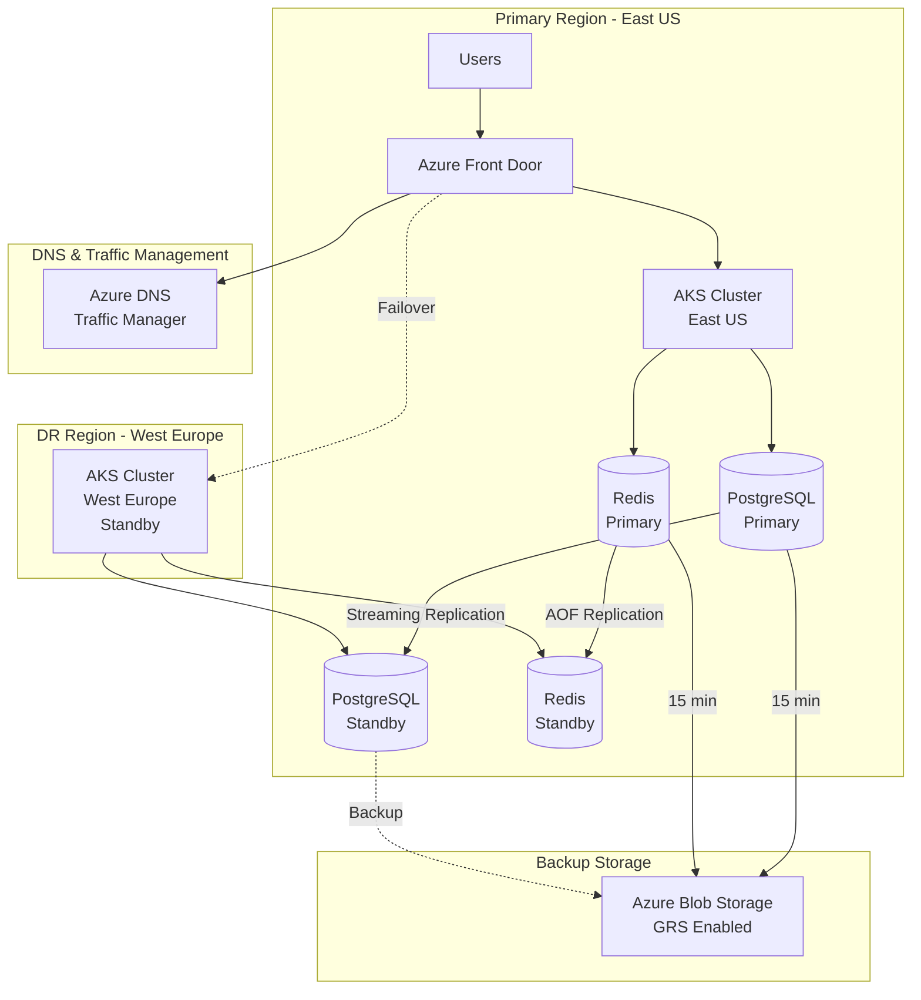
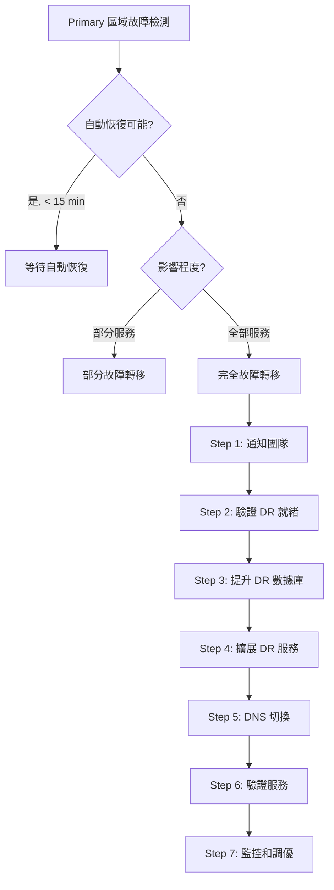

# 18. 災難恢復計劃 (Disaster Recovery Plan)

## 文檔資訊

| 項目 | 內容 |
|------|------|
| **文檔版本** | 1.0.0 |
| **創建日期** | 2025-01-15 |
| **最後更新** | 2025-01-15 |
| **狀態** | Draft |
| **作者** | AI Workflow Platform Team |
| **關聯文檔** | 11-DEPLOYMENT-ARCHITECTURE.md, 19-BACKUP-RESTORE.md |

---

## 目錄

- [18.1 災難恢復概述](#181-災難恢復概述)
- [18.2 RPO 和 RTO 目標](#182-rpo-和-rto-目標)
- [18.3 災難場景分類](#183-災難場景分類)
- [18.4 DR 架構設計](#184-dr-架構設計)
- [18.5 故障轉移流程](#185-故障轉移流程)
- [18.6 數據恢復策略](#186-數據恢復策略)
- [18.7 DR 演練計劃](#187-dr-演練計劃)
- [18.8 業務連續性](#188-業務連續性)

---

## 18.1 災難恢復概述

### 18.1.1 定義和目標

**災難恢復 (Disaster Recovery, DR):**
- 在災難性事件發生後，恢復 IT 系統和業務運營的過程和策略

**核心目標:**
1. **最小化停機時間**: 快速恢復服務
2. **最小化數據丟失**: 保護業務數據完整性
3. **確保業務連續性**: 維持關鍵業務運營
4. **符合合規要求**: 滿足法規和客戶要求

### 18.1.2 災難恢復層級

**Tier 0 - 無異地備份:**
- RPO: 24 hours
- RTO: > 7 days
- 成本: 最低
- 適用: 非關鍵系統

**Tier 1 - 冷備份:**
- RPO: 12-24 hours
- RTO: 1-7 days
- 成本: 低
- 適用: 低優先級系統

**Tier 2 - 熱備份:**
- RPO: 4-12 hours
- RTO: 12-24 hours
- 成本: 中
- 適用: 一般業務系統

**Tier 3 - 溫備份:**
- RPO: 1-4 hours
- RTO: 4-12 hours
- 成本: 中高
- 適用: 重要業務系統

**Tier 4 - 熱備份:**
- RPO: < 1 hour
- RTO: 2-4 hours
- 成本: 高
- 適用: 關鍵業務系統

**Tier 5 - 實時備份 (Hot Standby):**
- RPO: < 15 minutes
- RTO: < 1 hour
- 成本: 最高
- 適用: 任務關鍵型系統

**AI Workflow Platform 選擇: Tier 4 (熱備份)**

---

## 18.2 RPO 和 RTO 目標

### 18.2.1 服務級別目標

| 服務/組件 | 業務影響 | RPO | RTO | 優先級 | DR 策略 |
|----------|---------|-----|-----|--------|---------|
| **Auth Service** | 嚴重 - 無法登入 | < 15 min | < 30 min | P0 | 主動-主動 |
| **Agent Service** | 嚴重 - 核心功能 | < 15 min | < 1 hour | P0 | 主動-被動 |
| **Persona Service** | 高 - 重要功能 | < 30 min | < 1 hour | P1 | 主動-被動 |
| **Code Execution** | 高 - 核心功能 | < 30 min | < 1 hour | P1 | 主動-被動 |
| **Text-to-SQL** | 中 - 輔助功能 | < 1 hour | < 2 hours | P2 | 冷備份 |
| **Knowledge Base** | 中 - 輔助功能 | < 1 hour | < 2 hours | P2 | 冷備份 |
| **Workflow Service** | 高 - 重要功能 | < 30 min | < 1 hour | P1 | 主動-被動 |
| **PostgreSQL** | 嚴重 - 數據庫 | < 15 min | < 1 hour | P0 | 主動-被動 + PITR |
| **Redis** | 中 - 緩存 | < 15 min | < 30 min | P1 | AOF + RDB |
| **RabbitMQ** | 中 - 消息隊列 | < 30 min | < 1 hour | P1 | 鏡像隊列 |

### 18.2.2 計算邏輯

**RPO (Recovery Point Objective) - 數據丟失容忍度:**
```
RPO = 上次備份時間 - 災難發生時間

示例:
- 每 15 分鐘備份 → RPO = 15 minutes
- 每小時備份 → RPO = 1 hour
```

**RTO (Recovery Time Objective) - 停機時間容忍度:**
```
RTO = 檢測時間 + 決策時間 + 恢復時間 + 驗證時間

示例:
- 檢測: 5 分鐘 (自動監控)
- 決策: 10 分鐘 (自動故障轉移)
- 恢復: 30 分鐘 (數據恢復)
- 驗證: 15 分鐘 (健康檢查)
- Total RTO = 60 分鐘
```

### 18.2.3 SLA 承諾

**服務可用性 SLA:**
```yaml
availability_targets:
  monthly_sla: 99.9%
  allowed_downtime: 43.2 minutes/month

  calculation:
    total_minutes: 43200  # 30 days × 24 hours × 60 minutes
    uptime_minutes: 43156.8  # 99.9% of total
    downtime_minutes: 43.2  # 0.1% of total
```

**數據完整性 SLA:**
```yaml
data_integrity_targets:
  data_loss_tolerance: < 15 minutes of data
  backup_frequency: every 15 minutes
  backup_retention: 30 days
  geo_replication: enabled (East US ↔ West Europe)
```

---

## 18.3 災難場景分類

### 18.3.1 災難類型矩陣

| 災難類型 | 影響範圍 | 發生概率 | 影響程度 | 恢復策略 |
|---------|---------|---------|---------|---------|
| **應用程序故障** | 單服務 | 高 (月) | 低 | 自動重啟 + 日誌分析 |
| **數據庫故障** | 多服務 | 中 (季) | 高 | 主從切換 + 數據恢復 |
| **節點故障** | 部分 Pods | 中 (季) | 中 | Kubernetes 自動調度 |
| **AZ 故障** | 區域內 | 低 (年) | 高 | 多 AZ 部署 + 負載均衡 |
| **區域故障** | 整個區域 | 極低 (5年) | 嚴重 | 跨區域 DR + 故障轉移 |
| **數據損壞** | 特定數據 | 低 (年) | 中 | 時間點恢復 (PITR) |
| **網路分區** | 服務間通信 | 低 (年) | 中 | 重試機制 + 熔斷器 |
| **安全事件** | 全系統 | 低 (年) | 嚴重 | 隔離 + 取證 + 重建 |
| **人為錯誤** | 可變 | 中 (季) | 可變 | 審計 + 回滾 + 培訓 |

### 18.3.2 災難場景和應對

**場景 1: 單個 Pod 崩潰**

```yaml
scenario: Pod Crash
impact: 單個服務實例不可用
detection: Kubernetes liveness probe 失敗
automatic_response:
  - Kubernetes 自動重啟 Pod
  - 健康檢查失敗後從負載均衡器移除
  - 新 Pod 啟動並加入服務池
recovery_time: < 2 minutes
data_loss: None
manual_intervention: 僅在持續崩潰時需要
```

**場景 2: 數據庫主節點故障**

```yaml
scenario: PostgreSQL Primary Failure
impact: 所有寫入操作失敗，讀取操作可能延遲
detection:
  - PostgreSQL health check 失敗
  - 應用連接錯誤激增
automatic_response:
  - 檢測主節點故障 (< 30s)
  - 提升從節點為主節點 (< 2 min)
  - 更新連接字串指向新主節點
  - 重新配置複製
recovery_time: < 5 minutes
data_loss: < 30 seconds (基於複製延遲)
manual_intervention: 驗證數據一致性
```

**場景 3: 整個 AZ (Availability Zone) 故障**

```yaml
scenario: Azure Availability Zone Failure
impact: 該 AZ 中所有資源不可用
detection:
  - 多個 Node 同時不可達
  - Azure 服務健康通知
automatic_response:
  - Kubernetes 將 Pods 調度到其他 AZ
  - 負載均衡器將流量路由到健康 AZ
  - 數據庫故障轉移到其他 AZ 副本
recovery_time: < 15 minutes
data_loss: None (多 AZ 複製)
manual_intervention: 監控恢復進度
```

**場景 4: 整個 Azure 區域故障**

```yaml
scenario: Azure Region Failure (East US)
impact: 整個生產環境不可用
detection:
  - 所有服務健康檢查失敗
  - Azure 服務健康通知
  - 外部監控檢測到完全中斷
manual_response:
  1. 確認區域故障 (< 5 min)
  2. 啟動 DR 預案 (< 10 min)
  3. 切換 DNS 到 DR 區域 (West Europe)
  4. 啟動 DR 環境服務 (< 30 min)
  5. 恢復數據到最近備份點 (< 30 min)
  6. 驗證服務正常 (< 15 min)
recovery_time: < 90 minutes
data_loss: < 15 minutes (基於備份頻率)
manual_intervention: 完整 DR 流程執行
```

**場景 5: 數據損壞或誤刪除**

```yaml
scenario: Data Corruption or Accidental Deletion
impact: 部分數據不可用或損壞
detection:
  - 應用程序錯誤
  - 用戶報告
  - 數據完整性檢查失敗
manual_response:
  1. 識別損壞範圍和時間點 (< 15 min)
  2. 停止相關操作防止擴散 (< 5 min)
  3. 從備份恢復到指定時間點 (< 60 min)
  4. 驗證數據完整性 (< 30 min)
  5. 恢復服務 (< 15 min)
recovery_time: < 2 hours
data_loss: 取決於恢復時間點選擇
manual_intervention: 需要 DBA 介入
```

**場景 6: 安全事件 (勒索軟件/入侵)**

```yaml
scenario: Security Breach or Ransomware
impact: 系統完整性受損，可能數據洩露
detection:
  - 安全告警
  - 異常行為檢測
  - 文件加密/修改
immediate_response:
  1. 隔離受影響系統 (< 5 min)
  2. 切斷外部網路連接
  3. 保留取證證據
  4. 通知安全團隊和管理層
recovery_response:
  1. 從已知良好備份恢復 (< 4 hours)
  2. 部署到隔離環境
  3. 安全掃描和加固
  4. 逐步恢復服務
recovery_time: 4-24 hours
data_loss: 可能需要恢復到事件前時間點
manual_intervention: 安全團隊全程參與
```

---

## 18.4 DR 架構設計

### 18.4.1 多區域部署架構



### 18.4.2 DR 站點配置

**Primary Site (East US) - 生產環境:**

```yaml
primary_site:
  region: eastus
  purpose: Production

  aks_cluster:
    name: ai-workflow-aks-prod
    node_pools:
      system: 3 nodes (Standard_D4s_v5)
      application: 5-20 nodes (auto-scaling)
      code_execution: 3-15 nodes (auto-scaling)

  services:
    api_gateway: 3 replicas
    auth_service: 3 replicas
    agent_service: 5 replicas
    persona_service: 3 replicas
    code_execution: 5 replicas
    text_to_sql: 3 replicas
    knowledge_base: 3 replicas
    workflow_service: 5 replicas

  databases:
    postgresql:
      instance: Azure Database for PostgreSQL Flexible Server
      tier: GeneralPurpose
      vcores: 8
      storage: 1 TB
      high_availability: Enabled (Zone Redundant)
      backup: Automated daily + PITR (7 days)
      replication: Streaming replication to DR site

    redis:
      instance: Azure Cache for Redis
      tier: Premium
      size: P3 (26 GB)
      persistence: AOF + RDB
      replication: Geo-replication to DR site

  storage:
    blob_storage:
      tier: Hot
      redundancy: GRS (Geo-Redundant Storage)
      size: 10 TB
```

**DR Site (West Europe) - 災難恢復環境:**

```yaml
dr_site:
  region: westeurope
  purpose: Disaster Recovery (Hot Standby)

  aks_cluster:
    name: ai-workflow-aks-dr
    node_pools:
      system: 3 nodes (Standard_D4s_v5)
      application: 3 nodes (可快速擴展到 20)
      code_execution: 2 nodes (可快速擴展到 15)

    deployment_state: Deployed but scaled down

  services:
    # 所有服務已部署但最小副本數
    api_gateway: 1 replica (可擴展到 3)
    auth_service: 1 replica (可擴展到 3)
    agent_service: 2 replicas (可擴展到 5)
    persona_service: 1 replica (可擴展到 3)
    code_execution: 2 replicas (可擴展到 5)
    text_to_sql: 1 replica (可擴展到 3)
    knowledge_base: 1 replica (可擴展到 3)
    workflow_service: 2 replicas (可擴展到 5)

  databases:
    postgresql:
      instance: Azure Database for PostgreSQL Flexible Server
      tier: GeneralPurpose
      vcores: 8
      storage: 1 TB
      role: Read Replica (自動從 Primary 複製)
      promotion: 可提升為主節點 (< 2 min)

    redis:
      instance: Azure Cache for Redis
      tier: Premium
      size: P3 (26 GB)
      role: Geo-replica (自動從 Primary 複製)

  storage:
    blob_storage:
      tier: Hot
      redundancy: Replicated from Primary (GRS)
      access: Read-only (故障轉移後變為 Read-Write)
```

### 18.4.3 網路配置

**流量管理:**

```yaml
traffic_management:
  azure_front_door:
    backend_pools:
      primary:
        endpoint: ai-workflow-prod.eastus.cloudapp.azure.com
        priority: 1
        weight: 100
        health_probe: /health

      dr:
        endpoint: ai-workflow-dr.westeurope.cloudapp.azure.com
        priority: 2
        weight: 0  # 正常情況下不接收流量
        health_probe: /health

    routing_rules:
      failover_policy: priority_based
      health_check_interval: 30s
      unhealthy_threshold: 3
      automatic_failover: enabled

  dns_configuration:
    primary_record: api.aiworkflow.com → Primary Front Door
    ttl: 60 seconds  # 低 TTL 用於快速切換
    failover_type: Automatic (基於健康檢查)
```

---

## 18.5 故障轉移流程

### 18.5.1 自動故障轉移

**Kubernetes 級別 (Pod/Node 故障):**

```yaml
automatic_failover_k8s:
  detection:
    liveness_probe: 失敗 3 次 (每 10 秒檢查)
    readiness_probe: 失敗 3 次 (每 5 秒檢查)
    node_failure: Node NotReady 超過 5 分鐘

  response:
    pod_restart: 立即重啟失敗的 Pod
    pod_reschedule: 將 Pods 調度到健康 Node
    load_balancer_update: 從服務池移除不健康 Pods

  recovery_time: < 2 minutes
  no_manual_intervention: true
```

**數據庫級別 (主節點故障):**

```yaml
automatic_failover_database:
  detection:
    health_check: pg_isready 失敗 3 次
    replication_lag: 複製延遲 > 60 秒
    connection_timeout: 連接超時超過 30 秒

  response:
    # Azure Database for PostgreSQL 自動故障轉移
    promote_standby: 提升 Standby 為 Primary (< 2 min)
    update_endpoint: 自動更新連接端點
    notify_applications: 應用重新連接到新 Primary

  recovery_time: < 5 minutes
  manual_intervention: 僅驗證數據一致性
```

**應用級別 (服務故障):**

```yaml
automatic_failover_application:
  detection:
    http_health_check: /health 端點返回 5xx
    error_rate: 錯誤率 > 50% 持續 1 分鐘
    response_time: P95 響應時間 > 10 秒

  response:
    circuit_breaker: 開啟熔斷器，停止發送請求
    fallback: 返回緩存數據或降級響應
    scale_up: 自動擴展副本數 (HPA)
    restart: 重啟不健康的 Pods

  recovery_time: < 5 minutes
  manual_intervention: 調查根因
```

### 18.5.2 手動故障轉移 (區域級別)

**故障轉移決策樹:**



**完整故障轉移流程:**

```bash
#!/bin/bash
# failover-to-dr.sh - 區域故障轉移腳本

set -e

echo "=== AI Workflow Platform - DR Failover ==="
echo "Target: West Europe DR Site"
echo "Started at: $(date)"

# Step 1: 確認執行授權
echo ""
echo "Step 1: Authorization Check"
read -p "確認執行完整 DR 故障轉移? (yes/no): " confirmation
if [ "$confirmation" != "yes" ]; then
    echo "Failover cancelled"
    exit 1
fi

# Step 2: 通知團隊
echo ""
echo "Step 2: Notifying Team"
curl -X POST https://hooks.slack.com/services/YOUR/SLACK/WEBHOOK \
  -H 'Content-Type: application/json' \
  -d '{"text":"🚨 DR Failover initiated to West Europe. Primary region (East US) is down."}'

# Step 3: 切換到 DR Kubernetes 集群
echo ""
echo "Step 3: Switching to DR Cluster"
az aks get-credentials \
  --resource-group ai-workflow-dr-rg \
  --name ai-workflow-aks-dr \
  --overwrite-existing

# Step 4: 提升 DR 數據庫為主節點
echo ""
echo "Step 4: Promoting DR Database to Primary"
az postgres flexible-server replica promote \
  --resource-group ai-workflow-dr-rg \
  --name ai-workflow-db-dr

echo "Waiting for database promotion... (estimated 2 minutes)"
sleep 120

# Step 5: 驗證數據庫連接
echo ""
echo "Step 5: Verifying Database Connection"
kubectl exec -it postgresql-0 -n ai-workflow-prod -- \
  psql -U postgres -c "SELECT pg_is_in_recovery();"  # 應該返回 false

# Step 6: 擴展 DR 服務到生產規模
echo ""
echo "Step 6: Scaling DR Services to Production Scale"

kubectl scale deployment api-gateway --replicas=3 -n ai-workflow-prod
kubectl scale deployment auth-service --replicas=3 -n ai-workflow-prod
kubectl scale deployment agent-service --replicas=5 -n ai-workflow-prod
kubectl scale deployment persona-service --replicas=3 -n ai-workflow-prod
kubectl scale deployment code-execution-service --replicas=5 -n ai-workflow-prod
kubectl scale deployment text-to-sql-service --replicas=3 -n ai-workflow-prod
kubectl scale deployment knowledge-base-service --replicas=3 -n ai-workflow-prod
kubectl scale deployment workflow-service --replicas=5 -n ai-workflow-prod

echo "Waiting for all pods to be ready... (estimated 5 minutes)"
kubectl wait --for=condition=ready pod --all -n ai-workflow-prod --timeout=300s

# Step 7: 更新 Azure Front Door 後端池
echo ""
echo "Step 7: Updating Azure Front Door Backend Pool"
az network front-door backend-pool backend update \
  --resource-group ai-workflow-rg \
  --front-door-name ai-workflow-fd \
  --pool-name primary-pool \
  --address ai-workflow-dr.westeurope.cloudapp.azure.com \
  --backend-host-header ai-workflow-dr.westeurope.cloudapp.azure.com

# Step 8: 更新 DNS (如果使用 Azure DNS)
echo ""
echo "Step 8: Updating DNS Records"
az network dns record-set a update \
  --resource-group ai-workflow-rg \
  --zone-name aiworkflow.com \
  --name api \
  --set aRecords[0].ipv4Address=$(kubectl get svc api-gateway -n ai-workflow-prod -o jsonpath='{.status.loadBalancer.ingress[0].ip}')

echo "Waiting for DNS propagation... (60 seconds)"
sleep 60

# Step 9: 健康檢查
echo ""
echo "Step 9: Running Health Checks"

check_service() {
    local service=$1
    local url=$2
    echo "Checking $service..."
    response=$(curl -s -o /dev/null -w "%{http_code}" $url)
    if [ "$response" -eq 200 ]; then
        echo "✓ $service is healthy"
    else
        echo "✗ $service returned HTTP $response"
        return 1
    fi
}

check_service "API Gateway" "https://api.aiworkflow.com/health"
check_service "Auth Service" "https://api.aiworkflow.com/api/auth/health"
check_service "Agent Service" "https://api.aiworkflow.com/api/agents/health"

# Step 10: 啟用完整監控
echo ""
echo "Step 10: Enabling Full Monitoring"
kubectl apply -f k8s/monitoring/alerting-rules-dr.yaml

# Step 11: 發送完成通知
echo ""
echo "Step 11: Sending Completion Notification"
curl -X POST https://hooks.slack.com/services/YOUR/SLACK/WEBHOOK \
  -H 'Content-Type: application/json' \
  -d "{\"text\":\"✅ DR Failover completed successfully. Services are now running in West Europe.\n\nCompletion time: $(date)\nAll health checks passed.\"}"

echo ""
echo "=== Failover Completed ==="
echo "Services are now running in DR site (West Europe)"
echo "Completed at: $(date)"
echo ""
echo "Next Steps:"
echo "1. Monitor service metrics and logs"
echo "2. Notify customers (if applicable)"
echo "3. Investigate primary region failure"
echo "4. Plan failback when primary region is restored"
```

**故障轉移檢查清單:**

```yaml
failover_checklist:
  pre_failover:
    - [ ] 確認 Primary 區域完全不可用
    - [ ] 驗證 DR 站點健康狀態
    - [ ] 確認最新備份可用
    - [ ] 通知利益相關者
    - [ ] 獲得管理層批准

  during_failover:
    - [ ] 提升 DR 數據庫為主節點
    - [ ] 驗證數據完整性
    - [ ] 擴展 DR 服務副本數
    - [ ] 更新 DNS/負載均衡器
    - [ ] 執行健康檢查

  post_failover:
    - [ ] 驗證所有服務正常
    - [ ] 監控錯誤率和延遲
    - [ ] 通知用戶 (如需要)
    - [ ] 記錄事件詳情
    - [ ] 開始根因分析

  failback_preparation:
    - [ ] 確認 Primary 區域已恢復
    - [ ] 同步 DR 到 Primary 的數據變更
    - [ ] 計劃維護窗口
    - [ ] 準備 Failback 腳本
    - [ ] 通知團隊 Failback 時間
```

---

## 18.6 數據恢復策略

### 18.6.1 備份策略

**PostgreSQL 備份:**

```yaml
postgresql_backup:
  automated_backup:
    frequency: Daily
    time: 02:00 UTC
    retention: 30 days
    type: Full backup
    storage: Azure Blob Storage (GRS)

  pitr_backup:
    enabled: true
    wal_archiving: Continuous
    retention: 7 days
    recovery_point: Any point in time within 7 days

  manual_backup:
    trigger: Before major changes
    retention: 90 days
    verification: Mandatory restore test

  cross_region_replication:
    method: Streaming replication
    target: DR site (West Europe)
    lag: < 30 seconds
    automatic_failover: enabled
```

**Redis 備份:**

```yaml
redis_backup:
  rdb_snapshot:
    frequency: Every 15 minutes
    retention: 24 hours
    storage: Local disk + Azure Blob

  aof_persistence:
    enabled: true
    fsync: everysec
    rewrite: Automatic when AOF > 100MB

  geo_replication:
    target: DR site
    type: Active-passive
    promotion_time: < 1 minute
```

**Blob Storage 備份:**

```yaml
blob_storage_backup:
  geo_redundancy:
    type: GRS (Geo-Redundant Storage)
    secondary_region: Paired region
    replication: Automatic and continuous

  soft_delete:
    enabled: true
    retention: 14 days
    recovery: Instant

  versioning:
    enabled: true
    retention: 30 versions per blob
```

### 18.6.2 恢復流程

**場景: 恢復到特定時間點 (PITR):**

```bash
#!/bin/bash
# restore-pitr.sh - 時間點恢復

TARGET_TIME="2025-01-15 10:30:00 UTC"

echo "=== Point-in-Time Recovery ==="
echo "Target time: $TARGET_TIME"

# 1. 創建恢復服務器
az postgres flexible-server create \
  --resource-group ai-workflow-rg \
  --name ai-workflow-db-restored \
  --source-server ai-workflow-db-prod \
  --restore-time "$TARGET_TIME" \
  --location eastus

# 2. 等待恢復完成
echo "Waiting for restore to complete..."
az postgres flexible-server wait \
  --resource-group ai-workflow-rg \
  --name ai-workflow-db-restored \
  --created

# 3. 驗證數據
echo "Verifying restored data..."
psql -h ai-workflow-db-restored.postgres.database.azure.com \
     -U postgres \
     -d agent_db \
     -c "SELECT COUNT(*) FROM agents;"

# 4. 切換應用連接 (需要維護窗口)
echo "Ready to switch applications to restored database"
echo "Manual step: Update connection strings in Kubernetes secrets"
```

**場景: 從備份完全恢復:**

```bash
#!/bin/bash
# restore-from-backup.sh - 完全恢復

BACKUP_DATE="20250115"

echo "=== Full Database Restore ==="
echo "Backup date: $BACKUP_DATE"

# 1. 停止所有應用服務 (防止寫入)
kubectl scale deployment --all --replicas=0 -n ai-workflow-prod

# 2. 下載備份
az storage blob download \
  --account-name aiworkflowbackup \
  --container-name postgresql-backups \
  --name postgresql_backup_${BACKUP_DATE}.sql.gz \
  --file /tmp/backup.sql.gz

# 3. 解壓備份
gunzip /tmp/backup.sql.gz

# 4. 恢復數據庫
psql -h postgresql \
     -U postgres \
     -d postgres \
     < /tmp/backup.sql

# 5. 驗證數據完整性
echo "Verifying data integrity..."
psql -h postgresql -U postgres -d agent_db -c "
  SELECT
    COUNT(*) as total_agents,
    COUNT(CASE WHEN status = 'active' THEN 1 END) as active_agents
  FROM agents;
"

# 6. 重啟應用服務
kubectl scale deployment --all --replicas=3 -n ai-workflow-prod

echo "Restore completed"
```

---

## 18.7 DR 演練計劃

### 18.7.1 演練類型和頻率

| 演練類型 | 頻率 | 持續時間 | 參與者 | 目標 |
|---------|------|---------|--------|------|
| **桌面演練** | 季度 | 2 hours | 全團隊 | 熟悉流程 |
| **部分故障轉移** | 半年 | 4 hours | 運維 + DBA | 測試數據庫切換 |
| **完全故障轉移** | 年度 | 8 hours | 全團隊 | 完整 DR 測試 |
| **意外演練** | 年度 | 4 hours | On-call 團隊 | 測試應急響應 |

### 18.7.2 演練場景

**演練 1: 數據庫主節點故障 (Q1)**

```yaml
drill_scenario_1:
  name: "Database Primary Failure Drill"
  date: "2025-03-15"
  duration: 2 hours

  scenario:
    - 模擬 PostgreSQL Primary 節點故障
    - 測試自動故障轉移到 Standby
    - 驗證數據一致性
    - 測試應用自動重連

  success_criteria:
    - RTO < 5 minutes
    - RPO < 1 minute
    - 無數據丟失
    - 應用自動恢復

  participants:
    - DBA Team
    - DevOps Team
    - Application Team
```

**演練 2: 區域完全故障 (Q3)**

```yaml
drill_scenario_2:
  name: "Complete Region Failure Drill"
  date: "2025-09-15"
  duration: 8 hours

  scenario:
    - 模擬 East US 區域完全不可用
    - 執行完整 DR 故障轉移
    - 切換到 West Europe
    - 驗證所有服務正常
    - 模擬 Failback 到 East US

  success_criteria:
    - RTO < 90 minutes
    - RPO < 15 minutes
    - 所有服務正常運行
    - 數據完整性驗證通過
    - Failback 成功

  participants:
    - All Engineering Teams
    - Management
    - Customer Support
```

### 18.7.3 演練後評估

**評估模板:**

```markdown
# DR 演練報告

## 基本信息
- **演練日期**: 2025-03-15
- **演練類型**: 數據庫主節點故障
- **持續時間**: 2 hours 15 minutes
- **參與者**: 12 人

## 執行情況

### 時間線
| 時間 | 事件 | 負責人 | 狀態 |
|------|------|--------|------|
| 10:00 | 模擬故障開始 | DevOps | ✅ |
| 10:02 | 檢測到故障 | 監控系統 | ✅ |
| 10:04 | 自動故障轉移觸發 | Azure | ✅ |
| 10:07 | 應用重連成功 | 應用 | ✅ |
| 10:15 | 數據驗證完成 | DBA | ✅ |

### 指標達成

| 指標 | 目標 | 實際 | 狀態 |
|------|------|------|------|
| RTO | < 5 min | 7 min | ⚠️ 超時 |
| RPO | < 1 min | 45 sec | ✅ |
| 數據丟失 | 0 | 0 | ✅ |

## 發現問題

### 問題 1: 故障轉移時間超出預期
- **描述**: 實際 RTO 為 7 分鐘，超出 5 分鐘目標
- **根因**: DNS 更新延遲
- **影響**: 中等
- **優先級**: P1
- **行動項**: 降低 DNS TTL 從 300s 到 60s

### 問題 2: 監控告警延遲
- **描述**: 告警延遲 30 秒才觸發
- **根因**: Prometheus scrape interval 設置為 60s
- **影響**: 低
- **優先級**: P2
- **行動項**: 調整為 15s

## 改進建議

1. **自動化改進**
   - 實施自動 DNS 更新
   - 添加預熱腳本加速故障轉移

2. **文檔更新**
   - 更新故障轉移手冊
   - 添加故障排除指南

3. **培訓需求**
   - 為新團隊成員進行 DR 培訓
   - 定期復習故障轉移流程

## 後續行動

| 行動項 | 負責人 | 截止日期 | 狀態 |
|--------|--------|---------|------|
| 降低 DNS TTL | DevOps | 2025-03-20 | 🔄 進行中 |
| 調整監控間隔 | SRE | 2025-03-18 | ✅ 完成 |
| 更新文檔 | Tech Writer | 2025-03-25 | ⏳ 待開始 |

## 結論

演練整體成功，驗證了 DR 流程的有效性。發現的問題均為可優化項，不影響核心 DR 能力。建議按計劃進行改進並在 Q2 進行復測。

**簽名:**
- DevOps Lead: _______________
- DBA Lead: _______________
- CTO: _______________
```

---

## 18.8 業務連續性

### 18.8.1 關鍵人員和職責

**DR 響應團隊:**

| 角色 | 姓名 | 聯繫方式 | 職責 |
|------|------|---------|------|
| **DR 總指揮** | CTO | +1-xxx-xxx-xxxx | 最終決策和批准 |
| **技術負責人** | DevOps Lead | +1-xxx-xxx-xxxx | 技術執行和協調 |
| **數據庫專家** | DBA Lead | +1-xxx-xxx-xxxx | 數據庫恢復和驗證 |
| **網路專家** | Network Engineer | +1-xxx-xxx-xxxx | DNS 和負載均衡 |
| **應用負責人** | Dev Lead | +1-xxx-xxx-xxxx | 應用驗證和監控 |
| **客戶溝通** | Support Manager | +1-xxx-xxx-xxxx | 用戶通知和支持 |

**On-Call 輪值:**

```yaml
on_call_schedule:
  rotation: Weekly
  teams:
    primary: DevOps Team
    secondary: Development Team
    escalation: CTO

  coverage: 24/7/365

  response_time:
    P0 (Critical): 15 minutes
    P1 (High): 30 minutes
    P2 (Medium): 2 hours
    P3 (Low): Next business day
```

### 18.8.2 通信計劃

**內部通信:**

```yaml
internal_communication:
  incident_channel: "#incident-response" (Slack)

  escalation_path:
    L1: On-Call Engineer
    L2: Team Lead
    L3: Engineering Manager
    L4: CTO

  war_room:
    platform: Zoom
    permanent_link: https://zoom.us/j/xxx
    recording: Mandatory for post-mortem

  status_updates:
    frequency: Every 30 minutes
    channels: ["Slack", "Email"]
    recipients: ["Engineering", "Management", "Customer Support"]
```

**外部通信:**

```yaml
external_communication:
  status_page:
    url: status.aiworkflow.com
    provider: Statuspage.io
    updates: Real-time

  customer_notification:
    trigger: Service degradation > 15 minutes
    channels: ["Email", "In-app notification"]
    template: Pre-approved by Legal

  incident_report:
    timeline: Within 72 hours of resolution
    distribution: All affected customers
    content: ["Root cause", "Impact", "Resolution", "Prevention"]
```

### 18.8.3 供應商聯繫

**關鍵供應商:**

| 供應商 | 服務 | 支持級別 | 聯繫方式 | SLA |
|--------|------|---------|---------|-----|
| **Microsoft Azure** | Cloud Infrastructure | Premium | +1-800-xxx-xxxx | 1 hour response |
| **OpenAI** | API Services | Enterprise | support@openai.com | 4 hour response |
| **PagerDuty** | Incident Management | Business | support@pagerduty.com | 2 hour response |

---

## 總結

本文檔提供了 AI Workflow Platform 的完整災難恢復計劃，涵蓋:

1. **DR 概述**: 定義、目標、層級選擇 (Tier 4)
2. **RPO/RTO 目標**: 各服務 < 1 hour RTO, < 15 min RPO
3. **災難場景**: 9 種場景分類和應對策略
4. **DR 架構**: 多區域部署 (East US + West Europe)
5. **故障轉移**: 自動故障轉移 + 手動區域切換流程
6. **數據恢復**: 備份策略和 PITR 恢復
7. **DR 演練**: 季度/年度演練計劃
8. **業務連續性**: 團隊組織、通信計劃、供應商管理

**關鍵指標:**
- **整體 RTO**: < 90 minutes (區域故障)
- **整體 RPO**: < 15 minutes (數據丟失)
- **可用性**: 99.9% SLA
- **DR 站點**: Hot Standby (West Europe)

**相關文檔:**
- 19-BACKUP-RESTORE.md - 備份恢復詳細流程
- 11-DEPLOYMENT-ARCHITECTURE.md - 部署架構
- 20-COST-ESTIMATION.md - DR 成本估算

---

**版本歷史:**

| 版本 | 日期 | 作者 | 變更說明 |
|------|------|------|----------|
| 1.0.0 | 2025-01-15 | AI Workflow Team | 初始版本 |
