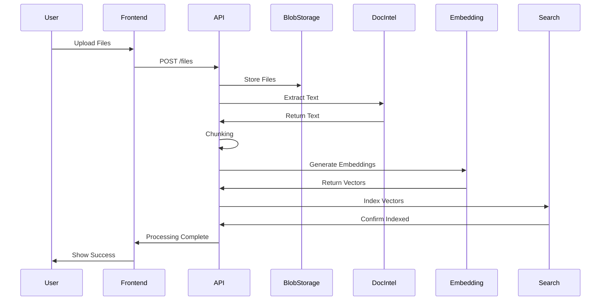

# Epic 5.1: Conversation Memory

**Semantic Kernel Agentic Framework - Epic Documentation**

**Epic**: 5.1 - Conversation Memory (對話記憶)
**Module**: 05 - Agent Memory
**Priority**: P0 (MVP 必須)
**Complexity**: Medium
**Story Points**: 8

[返回 Module 05](../modules/module-05-agent-memory.md) | [返回 Epic 索引](./README.md)

---

## Epic 描述

提供 Agent 的短期對話記憶能力,使 Agent 能夠記住當前會話的上下文,實現多輪對話的連貫性。

**業務價值**:
- 提升對話體驗和連貫性
- 支援複雜的多輪查詢
- 減少用戶重複輸入

**技術目標**:
- 對話上下文自動管理
- Token 使用優化
- 會話隔離和安全性

---

## User Stories

### US 5.1 - 知識庫文件上傳與處理

**作為** IT 開發者
**我想要** 批量上傳文件到 Agent 知識庫
**以便** 快速建立知識系統

**驗收標準**:

✅ 必須項（文件上傳）:
- [ ] 支援格式: PDF, DOCX, TXT, MD, HTML
- [ ] 批量上傳（拖拽多個文件）
- [ ] 單檔大小限制: 50MB
- [ ] 總大小限制（依訂閱計劃）
- [ ] 上傳進度顯示（百分比、速度）
- [ ] 斷點續傳（大文件上傳失敗可續傳）

✅ 必須項（文件處理）:
- [ ] 自動文字提取（PDF OCR、DOCX 解析）
- [ ] 自動分段處理（Chunking）
  - Chunk 大小可配置（500-2000 tokens）
  - Chunk 重疊可配置（0-200 tokens）
- [ ] 自動向量化（使用 text-embedding-ada-002 或類似）
- [ ] 索引到向量資料庫（Azure AI Search）
- [ ] 處理進度即時顯示
- [ ] 處理失敗自動重試（最多 3 次）

✅ 必須項（文件管理）:
- [ ] 上傳完成後可預覽內容（前 1000 字）
- [ ] 文件列表展示（名稱、大小、上傳時間、狀態）
- [ ] 文件搜尋和篩選
- [ ] 文件刪除（軟刪除，可恢復）
- [ ] 文件重新索引（更新 Embedding）

✅ 必須項（處理流程）:
```
1. 上傳文件 → Azure Blob Storage
2. 提取文字 → Azure Document Intelligence
3. 分段處理 → Chunking Engine
4. 向量化 → Azure OpenAI Embedding
5. 索引 → Azure AI Search
6. 完成 → 通知用戶
```

**技術要求**:
- Azure Blob Storage（文件存儲）
- Azure Document Intelligence（PDF 提取）
- Azure OpenAI Embedding API
- Azure AI Search（向量索引）

**📊 優先級**: P0 (MVP 必須)
**🎯 性能目標**: 100 頁 PDF <2 分鐘處理完成
**🔗 相關**: US 5.2 (檢索策略), US 5.4 (結構化數據)

---

### US 5.3 - 知識庫管理與更新

**作為** IT 開發者
**我想要** 管理和更新 Agent 的知識庫文件
**以便** 維護知識庫的準確性和時效性

**驗收標準**:

✅ 必須項（文件列表管理）:
- [ ] 顯示所有已上傳的知識庫文件
- [ ] 文件列表包含：名稱、大小、上傳時間、狀態、Chunk 數量
- [ ] 支援搜尋（按文件名、標籤）
- [ ] 支援篩選（按日期、狀態、標籤）
- [ ] 支援排序（按名稱、時間、大小）
- [ ] 分頁顯示（每頁 20 筆）

✅ 必須項（文件更新）:
- [ ] 可重新上傳同名文件（覆蓋舊版本）
- [ ] 版本歷史記錄（保留最近 5 個版本）
- [ ] 重新索引功能（重新 Embedding + 更新向量資料庫）
- [ ] 更新後自動通知使用該知識庫的 Agent
- [ ] 支援批量重新索引

✅ 必須項（文件刪除）:
- [ ] 軟刪除（標記為已刪除，實際保留 30 天）
- [ ] 刪除確認對話框（防止誤刪）
- [ ] 顯示刪除影響（哪些 Agent 正在使用）
- [ ] 刪除後從向量資料庫移除索引
- [ ] 支援批量刪除
- [ ] 回收站功能（30 天內可恢復）

✅ 必須項（文件元數據管理）:
- [ ] 可編輯文件標籤（Tag）
- [ ] 可編輯文件描述
- [ ] 可設定文件優先級（檢索時影響排序）
- [ ] 可設定文件過期時間（過期自動標記）

**BDD 驗收標準**:

```gherkin
Scenario 1: 查看知識庫文件列表
  Given 已上傳 50 個知識庫文件
  When 開發者訪問知識庫管理頁面
  Then 顯示文件列表（分頁）
  And 每個文件顯示名稱、大小、上傳時間、Chunk 數量
  And 可以搜尋和篩選文件

Scenario 2: 重新索引文件
  Given 已上傳的文件內容已修改
  When 開發者點擊「重新索引」按鈕
  Then 系統重新提取文字、Chunking、Embedding
  And 更新向量資料庫索引
  And <5 分鐘完成（100 頁文檔）
  And 通知使用該知識庫的 Agent

Scenario 3: 刪除文件（軟刪除）
  Given 選中一個知識庫文件
  When 開發者點擊刪除
  Then 顯示確認對話框（列出影響的 Agent）
  And 確認後文件標記為已刪除
  And 從向量資料庫移除索引
  And 文件移至回收站（30 天內可恢復）

Scenario 4: 批量管理文件
  Given 選中 10 個文件
  When 開發者執行批量操作（重新索引/刪除/標籤）
  Then 所有文件依次處理
  And 顯示處理進度
  And 處理完成後顯示結果摘要
```

**技術要求**:
- **Backend**: ASP.NET Core 8 Web API
- **Database**: PostgreSQL (文件元數據), Azure AI Search (向量索引)
- **Storage**: Azure Blob Storage (文件存儲)
- **API Endpoints**:
  - `GET /api/v1/knowledge-base/files` (列表，支援搜尋、篩選、排序、分頁)
  - `PUT /api/v1/knowledge-base/files/{id}` (更新元數據)
  - `DELETE /api/v1/knowledge-base/files/{id}` (軟刪除)
  - `POST /api/v1/knowledge-base/files/{id}/reindex` (重新索引)
  - `POST /api/v1/knowledge-base/files/batch` (批量操作)
  - `GET /api/v1/knowledge-base/files/trash` (回收站)
  - `POST /api/v1/knowledge-base/files/{id}/restore` (恢復)

**UI/UX**:
- 文件列表頁（Table with filters）
- 文件詳情側邊欄（Metadata editor）
- 批量操作工具欄
- 回收站頁面

**安全需求**:
- RBAC 權限檢查（僅 Admin、Developer 可刪除）
- 刪除操作審計日誌
- 敏感文件警告標記

**性能標準**:
- 文件列表加載 <500ms（1000 筆記錄）
- 重新索引 100 頁文檔 <5 分鐘
- 批量操作（10 檔案）<10 分鐘

**測試場景**:
- 文件列表 CRUD 完整測試
- 搜尋、篩選、排序功能測試
- 重新索引邏輯測試
- 軟刪除和恢復流程測試
- 批量操作併發測試
- 權限驗證測試

**📊 優先級**: P0 (MVP 必須)
**🎯 Story Points**: 5
**⏱️ 預估時間**: 1 週
**🔗 相關**: US 5.1 (文件上傳), US 5.2 (檢索策略)

---

## 技術實作

### 架構設計

```yaml
Components:
  Frontend:
    - File Upload UI (Drag & Drop)
    - File List Management
    - Progress Indicators

  Backend:
    - File Processing Service
    - Chunking Engine
    - Embedding Service
    - Index Management Service

  Storage:
    - Azure Blob Storage (Files)
    - PostgreSQL (Metadata)
    - Azure AI Search (Vector Index)
```

### 處理流程



---

## 驗收標準

### 功能驗收
- [ ] 可成功上傳所有支援格式
- [ ] 文件處理準確率 >95%
- [ ] 批量上傳穩定性
- [ ] 文件管理 CRUD 完整

### 性能驗收
- [ ] 100 頁 PDF <2 分鐘
- [ ] 文件列表 <500ms
- [ ] 重新索引 <5 分鐘

### 安全驗收
- [ ] 檔案大小限制生效
- [ ] 權限檢查完整
- [ ] 軟刪除機制正確

---

## 相關文檔

- [Module 05: Agent Memory](../modules/module-05-agent-memory.md)
- [Epic 5.2: Knowledge RAG](./epic-05.2-knowledge-rag.md)
- [Architecture: Knowledge Service](../../architecture/components/knowledge-service.md)
- [Database Schema](../../architecture/database-schema.md)

---

**版本**: 1.0.0
**最後更新**: 2025-11-02
**狀態**: ✅ Epic 定義完成
