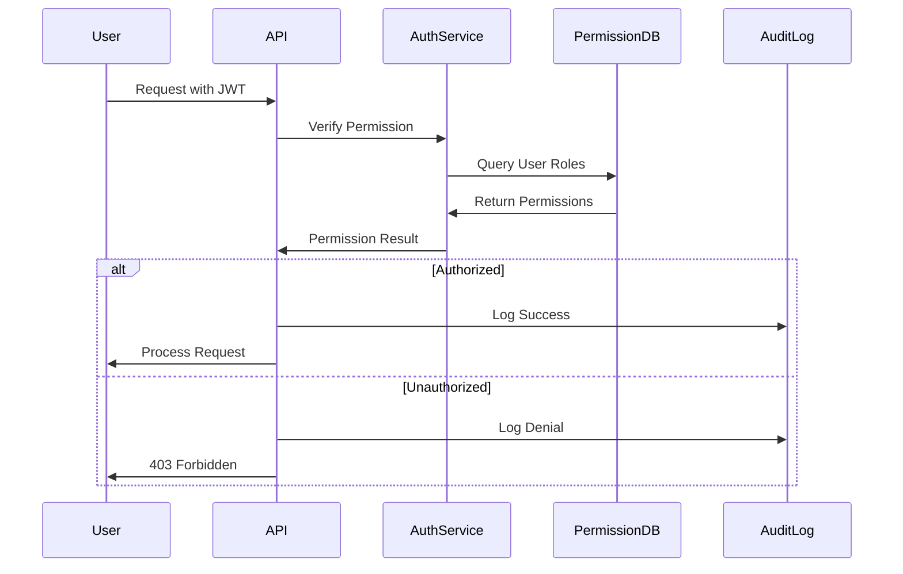

# Epic 9.1: Enterprise Authentication & Authorization

**Semantic Kernel Agentic Framework - Epic Documentation**

**Epic**: 9.1 - Authentication & Authorization (企業級認證與授權)
**Module**: 09 - Enterprise Features
**Priority**: P0 (MVP 必須)
**Complexity**: Medium
**Story Points**: 8

[返回 Module 09](../modules/module-09-enterprise-features.md) | [返回 Epic 索引](./README.md)

---

## Epic 描述

提供企業級的身份認證與細粒度權限控制,確保系統安全性和合規性。

**業務價值**:
- 符合企業 IT 安全標準
- 支援 SSO 單點登入
- 細粒度權限控制
- 審計追蹤完整性

**技術目標**:
- OAuth 2.0 / OpenID Connect
- RBAC 角色權限管理
- 零權限繞過漏洞

---

## User Stories

### US 9.1 - RBAC 角色權限管理

**作為** 系統管理員
**我想要** 細粒度的角色權限控制
**以便** 確保用戶僅能執行被授權的操作

**驗收標準**:

✅ 必須項（角色定義）:
- [ ] 預定義角色（超級管理員、租戶管理員、開發者、業務分析師、業務用戶、唯讀用戶）
- [ ] 自定義角色建立
- [ ] 角色繼承（例如：開發者繼承業務分析師的所有權限）
- [ ] 角色可停用/啟用

✅ 必須項（權限粒度）:
- [ ] Agent 級權限（建立、讀取、更新、刪除、執行）
- [ ] Plugin 級權限（安裝、配置、啟用/停用）
- [ ] Knowledge 級權限（上傳、查詢、刪除）
- [ ] Code Interpreter 權限（啟用/停用、執行權限）
- [ ] 系統設定權限（租戶設定、用戶管理、計費設定）

✅ 必須項（權限檢查）:
- [ ] API 層權限檢查（每個 API 呼叫都驗證權限）
- [ ] UI 層權限控制（未授權功能隱藏或禁用）
- [ ] 資源級權限（用戶僅能操作自己建立的 Agent）
- [ ] 權限拒絕時提供清楚的錯誤訊息

✅ 必須項（權限審計）:
- [ ] 記錄所有權限檢查事件
- [ ] 記錄權限變更歷史
- [ ] 異常權限使用告警
- [ ] 權限合規報告

**角色權限矩陣範例**:
```yaml
roles:
  super_admin:
    description: "超級管理員，擁有所有權限"
    permissions:
      - "*"  # 所有權限

  tenant_admin:
    description: "租戶管理員，管理租戶內所有資源"
    permissions:
      agent: ["create", "read", "update", "delete", "execute"]
      plugin: ["install", "configure", "enable", "disable"]
      knowledge: ["upload", "query", "delete"]
      code_interpreter: ["enable", "execute"]
      user: ["create", "read", "update", "delete", "assign_role"]
      tenant_settings: ["read", "update"]

  developer:
    description: "開發者，建立和配置 Agent"
    permissions:
      agent: ["create", "read", "update", "delete", "execute"]
      plugin: ["install", "configure", "enable", "disable"]
      knowledge: ["upload", "query"]
      code_interpreter: ["enable", "execute"]
    resource_scope: "own"  # 僅能操作自己建立的資源

  business_analyst:
    description: "業務分析師，配置 Agent 行為"
    permissions:
      agent: ["read", "update", "execute"]
      knowledge: ["upload", "query"]
    resource_scope: "team"  # 可以操作團隊共享資源

  business_user:
    description: "業務用戶，使用 Agent"
    permissions:
      agent: ["read", "execute"]
      knowledge: ["query"]
    resource_scope: "shared"  # 僅能使用公開共享的資源

  readonly_user:
    description: "唯讀用戶，僅能查看"
    permissions:
      agent: ["read"]
      knowledge: ["read"]
```

**權限檢查範例**:
```csharp
// API 層權限檢查
[Authorize(Permission = "agent.delete")]
public async Task<IActionResult> DeleteAgent(string agentId)
{
    // 驗證用戶是否有刪除權限
    if (!await _authService.HasPermission(User, "agent.delete"))
    {
        return Forbid("您沒有刪除 Agent 的權限");
    }

    // 驗證資源擁有者（Resource-level check）
    var agent = await _agentService.GetAgent(agentId);
    if (!await _authService.CanAccessResource(User, agent))
    {
        return Forbid("您只能刪除自己建立的 Agent");
    }

    // 執行刪除
    await _agentService.DeleteAgent(agentId);

    // 記錄審計日誌
    await _auditService.Log(new AuditEvent
    {
        UserId = User.Id,
        Action = "agent.delete",
        ResourceId = agentId,
        Timestamp = DateTime.UtcNow
    });

    return Ok();
}
```

**技術實現**:
- ASP.NET Core Authorization
- Policy-Based Authorization
- 權限資料庫（Role、Permission、RolePermission 表）
- 審計日誌系統

**📊 優先級**: P0 (MVP 必須) - 企業安全基礎
**🎯 安全目標**: 0 權限繞過漏洞
**🔗 相關**: US 8.3 (Row-Level Security), US 9.2 (Multi-Tenant)

---

## 技術實作

### 權限模型設計

```yaml
Database_Schema:
  Roles:
    - id (UUID)
    - name (String)
    - description (String)
    - is_system_role (Boolean)
    - created_at (DateTime)

  Permissions:
    - id (UUID)
    - resource (String)  # agent, plugin, knowledge
    - action (String)    # create, read, update, delete
    - scope (String)     # own, team, shared, all

  RolePermissions:
    - role_id (UUID)
    - permission_id (UUID)

  UserRoles:
    - user_id (UUID)
    - role_id (UUID)
    - tenant_id (UUID)
```

### 權限檢查流程



---

## 驗收標準

### 功能驗收
- [ ] 所有預定義角色建立完成
- [ ] 權限檢查覆蓋所有 API
- [ ] 資源級權限生效
- [ ] 審計日誌完整

### 安全驗收
- [ ] 權限繞過測試通過
- [ ] 未授權 API 訪問被阻擋
- [ ] 跨租戶資源訪問被阻擋
- [ ] 權限提升攻擊無效

### 性能驗收
- [ ] 權限檢查 <10ms
- [ ] 角色查詢有快取機制
- [ ] 審計日誌異步寫入

---

## 相關文檔

- [Module 09: Enterprise Features](../modules/module-09-enterprise-features.md)
- [Epic 9.2: RBAC](./epic-09.2-rbac.md)
- [Architecture: API Gateway](../../architecture/components/api-gateway.md)
- [Database Schema](../../architecture/database-schema.md)

---

**版本**: 1.0.0
**最後更新**: 2025-11-02
**狀態**: ✅ Epic 定義完成
