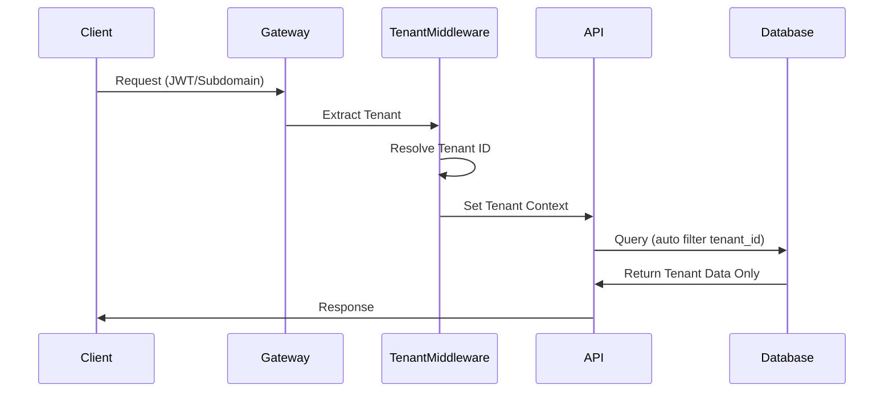

# Epic 9.2: Multi-Tenant Architecture

**Semantic Kernel Agentic Framework - Epic Documentation**

**Epic**: 9.2 - Multi-Tenant (多租戶架構)
**Module**: 09 - Enterprise Features
**Priority**: P0 (MVP 必須)
**Complexity**: High
**Story Points**: 13

[返回 Module 09](../modules/module-09-enterprise-features.md) | [返回 Epic 索引](./README.md)

---

## Epic 描述

實現完全隔離的多租戶 SaaS 架構,支援安全地服務多個企業客戶。

**業務價值**:
- 支援 SaaS 商業模式
- 資料完全隔離
- 靈活的訂閱計劃
- 租戶自訂品牌

**技術目標**:
- 100% 資料隔離
- 自動租戶識別
- 配額管理
- 零跨租戶資料洩漏

---

## User Stories

### US 9.2 - Multi-Tenant 多租戶架構

**作為** SaaS 平台營運者
**我想要** 完全隔離的多租戶架構
**以便** 安全地服務多個企業客戶

**驗收標準**:

✅ 必須項（租戶隔離）:
- [ ] 資料完全隔離（租戶 A 無法存取租戶 B 的任何資料）
- [ ] 每個 API 請求自動加入 `tenant_id` 過濾
- [ ] 資料庫查詢自動添加 `WHERE tenant_id = @current_tenant`
- [ ] 租戶間無法互相查看或操作資源

✅ 必須項（租戶管理）:
- [ ] 租戶建立和停用
- [ ] 租戶配額設定（Agent 數量、儲存空間、API 呼叫量）
- [ ] 租戶計費方案（免費版、專業版、企業版）
- [ ] 租戶自訂品牌（Logo、顏色、網域名稱）

✅ 必須項（資源配額）:
- [ ] 每個租戶的 Agent 數量限制
- [ ] 每個租戶的儲存空間限制
- [ ] 每個租戶的 API 呼叫量限制
- [ ] 超出配額時的友善提示和升級引導

✅ 必須項（租戶層級設定）:
- [ ] 獨立的 LLM 配置（模型選擇、API Key）
- [ ] 獨立的安全設定（密碼策略、SSO 整合）
- [ ] 獨立的 i18n 設定（預設語言、時區）
- [ ] 獨立的通知設定（Email、Webhook）

**租戶資料模型**:
```csharp
public class Tenant
{
    public Guid TenantId { get; set; }
    public string Name { get; set; }
    public string SubDomain { get; set; }  // acme.framework.com
    public TenantPlan Plan { get; set; }   // Free, Pro, Enterprise

    // 配額設定
    public TenantQuota Quota { get; set; }

    // 品牌設定
    public TenantBranding Branding { get; set; }

    // 狀態
    public TenantStatus Status { get; set; }  // Active, Suspended, Deleted
    public DateTime CreatedAt { get; set; }
}

public class TenantQuota
{
    public int MaxAgents { get; set; }           // 最多建立多少個 Agent
    public long MaxStorageBytes { get; set; }    // 最大儲存空間（Bytes）
    public int MaxApiCallsPerMonth { get; set; } // 每月 API 呼叫量
    public int MaxUsersPerTenant { get; set; }   // 最多用戶數

    // 當前使用量
    public int CurrentAgents { get; set; }
    public long CurrentStorageBytes { get; set; }
    public int CurrentApiCallsThisMonth { get; set; }
}

public class TenantBranding
{
    public string LogoUrl { get; set; }
    public string PrimaryColor { get; set; }    // #007bff
    public string CustomDomain { get; set; }    // agent.acme.com
}
```

**租戶隔離實現**:
```csharp
// 自動過濾租戶資料（EF Core Global Query Filter）
protected override void OnModelCreating(ModelBuilder modelBuilder)
{
    // 所有實體自動加入 TenantId 過濾
    modelBuilder.Entity<Agent>()
        .HasQueryFilter(a => a.TenantId == _currentTenant.Id);

    modelBuilder.Entity<Plugin>()
        .HasQueryFilter(p => p.TenantId == _currentTenant.Id);

    modelBuilder.Entity<Knowledge>()
        .HasQueryFilter(k => k.TenantId == _currentTenant.Id);
}

// Middleware 自動提取當前租戶
public class TenantResolutionMiddleware
{
    public async Task InvokeAsync(HttpContext context)
    {
        // 從 JWT Token 中提取 tenant_id
        var tenantId = context.User.FindFirst("tenant_id")?.Value;

        // 或從子網域提取 (acme.framework.com → acme)
        var subDomain = context.Request.Host.Host.Split('.').First();
        var tenant = await _tenantService.GetBySubDomain(subDomain);

        // 設定當前租戶上下文
        _currentTenant.SetTenant(tenant);

        await _next(context);
    }
}
```

**配額檢查範例**:
```csharp
public async Task<Result> CreateAgent(CreateAgentRequest request)
{
    // 檢查租戶配額
    var quota = await _tenantService.GetQuota(_currentTenant.Id);

    if (quota.CurrentAgents >= quota.MaxAgents)
    {
        return Result.Fail($"已達到 Agent 數量上限（{quota.MaxAgents}）。請升級方案以建立更多 Agent。");
    }

    // 建立 Agent
    var agent = new Agent
    {
        TenantId = _currentTenant.Id,  // 自動設定租戶 ID
        Name = request.Name,
        // ...
    };

    await _agentRepository.Add(agent);

    // 更新配額使用量
    await _tenantService.IncrementAgentCount(_currentTenant.Id);

    return Result.Ok(agent);
}
```

**技術實現**:
- EF Core Global Query Filters
- Tenant Resolution Middleware
- 多租戶資料模型設計
- 配額檢查和限流

**📊 優先級**: P0 (MVP 必須) - SaaS 基礎
**🎯 隔離目標**: 100% 資料隔離，0 跨租戶資料洩漏
**🔗 相關**: US 9.1 (RBAC), US 9.4 (API Metering)

---

## 技術實作

### 多租戶資料模型

```yaml
Multi_Tenant_Pattern: "Shared Database, Shared Schema with Tenant Discriminator"

Database_Design:
  All_Tables_Include:
    - tenant_id (UUID, NOT NULL)
    - INDEX on tenant_id

  Global_Query_Filter:
    - Auto inject WHERE tenant_id = @current_tenant
    - Applied to ALL queries automatically

  Tenant_Resolution:
    - JWT Token (tenant_id claim)
    - Subdomain (acme.app.com)
    - Custom Header (X-Tenant-ID)
```

### 租戶識別流程



---

## 驗收標準

### 功能驗收
- [ ] 租戶自動識別生效
- [ ] 所有查詢自動過濾租戶
- [ ] 配額檢查完整
- [ ] 租戶管理 CRUD 可用

### 安全驗收
- [ ] 跨租戶資料訪問測試 (100% 阻擋)
- [ ] 手動修改 tenant_id 無效
- [ ] SQL Injection 無法繞過
- [ ] 配額限制有效生效

### 性能驗收
- [ ] 租戶識別 <5ms
- [ ] Query Filter 無性能影響
- [ ] 配額檢查 <10ms

---

## 相關文檔

- [Module 09: Enterprise Features](../modules/module-09-enterprise-features.md)
- [Epic 9.1: Authentication](./epic-09.1-authentication.md)
- [Epic 9.3: API Metering](./epic-09.3-api-metering.md)
- [Architecture: Data Layer](../../architecture/components/data-layer.md)
- [Database Schema](../../architecture/database-schema.md)

---

**版本**: 1.0.0
**最後更新**: 2025-11-02
**狀態**: ✅ Epic 定義完成
